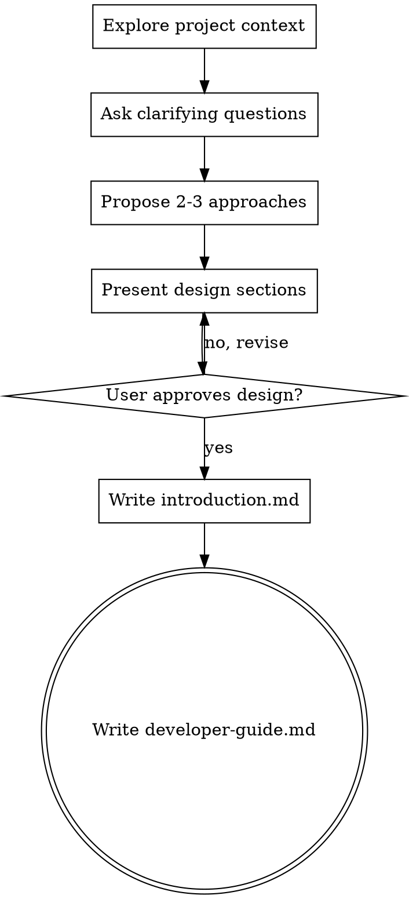

---
name: brainstorming
description: "You MUST use this before any creative work - creating features, building components, adding functionality, or modifying behavior. Explores user intent, requirements and design before implementation."
---

# Brainstorming Ideas Into Designs

Help turn ideas into a design through natural collaborative dialogue, producing two documents: a conceptual introduction and a developer guide.

Start by understanding the current project context, then ask questions one at a time to refine the idea. Once you understand what you're building, present the design and get user approval.

<HARD-GATE>
Do NOT invoke any implementation skill, write any real code, scaffold any project, or take any implementation action. This skill's only output is the two design documents described below. Implementation is explicitly out of scope and is handled elsewhere.
</HARD-GATE>

## Anti-Pattern: "This Is Too Simple To Need A Design"

Every project goes through this process. A todo list, a single-function utility, a config change — all of them. "Simple" projects are where unexamined assumptions cause the most wasted work. The design can be short (a few sentences per section for truly simple projects), but you MUST present it and get approval.

## Checklist

You MUST create a task for each of these items and complete them in order. The skill's scope ends at item 4 — do not go further.

1. **Explore project context** — check files, docs, recent commits. **Ask clarifying questions** — one at a time, understand purpose/constraints/success criteria
2. **Propose 2-3 approaches** — with trade-offs and your recommendation
3. **Present design** — in sections scaled to their complexity, get user approval after each section
4. **Write design docs** — save `introduction.md` and `developer-guide.md` to `docs/specs/{name_of_feature}/`

## Process Flow

**The terminal state is writing the two design documents.** Do NOT invoke writing-plans, frontend-design, mcp-builder, or any other implementation or planning skill. This skill stops once both documents are written.

## The Process

**Understanding the idea:**

- Check out the current project state first (files, docs, recent commits)
- Before asking detailed questions, assess scope: if the request describes multiple independent subsystems (e.g., "build a platform with chat, file storage, billing, and analytics"), flag this immediately. Don't spend questions refining details of a project that needs to be decomposed first.
- If the project is too large for a single design, help the user decompose into sub-projects: what are the independent pieces, how do they relate, what order should they be built? Then brainstorm the first sub-project through the normal design flow. Each sub-project gets its own pair of design documents.
- For appropriately-scoped projects, ask questions one at a time to refine the idea
- Prefer multiple choice questions when possible, but open-ended is fine too
- Only one question per message - if a topic needs more exploration, break it into multiple questions
- Focus on understanding: purpose, constraints, success criteria
- **Avoid loops** - if you find yourself going back and forth without progress, stop and explicitly ask the user for clarification instead of guessing again

**Exploring approaches:**

- Propose 2-3 different approaches with trade-offs
- Present options conversationally with your recommendation and reasoning
- Lead with your recommended option and explain why

**Presenting the design:**

- Once you believe you understand what you're building, present the design
- Scale each section to its complexity: a few sentences if straightforward, up to 200-300 words if nuanced
- Ask after each section whether it looks right so far
- Cover: architecture, components, data flow, error handling, testing
- Be ready to go back and clarify if something doesn't make sense

**Design for isolation and clarity:**

- Break the system into smaller units that each have one clear purpose, communicate through well-defined interfaces, and can be understood and tested independently
- For each unit, you should be able to answer: what does it do, how do you use it, and what does it depend on?
- Can someone understand what a unit does without reading its internals? Can you change the internals without breaking consumers? If not, the boundaries need work.
- Smaller, well-bounded units are also easier for you to work with - you reason better about designs you can hold in context at once, and your descriptions are more reliable when scoped narrowly. When a design grows too large, that's often a signal it needs decomposition.

**Working in existing codebases:**

- Explore the current structure before proposing changes. Follow existing patterns.
- Where existing code has problems that affect the work (e.g., a file that's grown too large, unclear boundaries, tangled responsibilities), note targeted improvements as part of the design - the way a good developer flags issues they encounter.
- Don't propose unrelated refactoring. Stay focused on what serves the current goal.

## The Design Documents

This skill produces exactly two documents per feature, saved to `docs/specs/{name_of_feature}/`. Both are guidance for a human, not a specification of finished code — the **big picture only**.

### File 1: `introduction.md` — conceptual foundation

Purely educational, no code and no pseudocode. It should read like a primer someone could learn from before touching any implementation. Cover:

- Conceptual overview - what problem does this solve?
- What the system/feature will achieve
- High-level benefits and outcomes
- All required terminology with clear definitions
- Key patterns, methodologies, and principles used (explained conceptually, not in code)
- Architecture philosophy and design approach

### File 2: `developer-guide.md` — implementation-focused guide

Simplified and developer-focused. Only what's needed to implement — no repetition of the conceptual material, no noise. Cover:

- Step-by-step implementation requirements with brief explanations of why each step matters
- Essential terminology/concepts glossary (short, implementation-relevant subset — not a repeat of `introduction.md`)
- Key architecture diagrams, written as Mermaid (flowcharts, sequence diagrams, architecture/component diagrams as appropriate)
- Pseudocode only when needed to clarify logic (e.g., `for each order: if price crosses threshold -> trigger signal`) — never real, compilable code

**What does NOT belong in either document:**

- Real, runnable code in any language
- Exact function signatures, class definitions, or file-by-file implementation details
- Content duplicated between the two files — `introduction.md` teaches concepts, `developer-guide.md` guides action

**Documentation:**

- Write `introduction.md` and `developer-guide.md` to `docs/specs/{name_of_feature}/`
  - (User preferences for design doc location override this default)
- Use elements-of-style:writing-clearly-and-concisely skill if available
- Keep language concise and precise in both documents

**Design Doc Self-Review:**
After writing both documents, look at them with fresh eyes:

1. **Placeholder scan:** Any "TBD", "TODO", incomplete sections, or vague requirements? Fix them.
2. **Internal consistency:** Do the two documents contradict each other? Does the developer-guide architecture match the introduction's philosophy?
3. **Scope check:** Is this focused enough for a single feature, or does it need decomposition?
4. **Ambiguity check:** Could any requirement be interpreted two different ways? If so, pick one and make it explicit.
5. **Separation check:** Does `introduction.md` stay purely conceptual (no code/pseudocode)? Does `developer-guide.md` avoid re-teaching concepts already covered in `introduction.md`?
6. **Implementation leakage check:** Did any real code, exact signatures, or step-by-step code-level implementation sneak in? Strip them back to big-picture guidance and pseudocode.

Fix any issues inline. No need to re-review — just fix and move on.

**User Review Gate:**
After the self-review loop passes, ask the user to review the written design docs:

> "Please review them and let me know if you want to make any changes."

Wait for the user's response. If they request changes, make them and re-run the self-review loop. Once the user approves, this skill's work is done — do not proceed to planning or implementation.

## Key Principles

- **One question at a time** - Don't overwhelm with multiple questions
- **Multiple choice preferred** - Easier to answer than open-ended when possible
- **YAGNI ruthlessly** - Remove unnecessary features from all designs
- **Explore alternatives** - Always propose 2-3 approaches before settling
- **Incremental validation** - Present design, get approval before moving on
- **Be flexible** - Go back and clarify when something doesn't make sense
- **Avoid loops** - If stuck or going in circles, explicitly ask the user for clarification rather than repeating attempts
- **Stay at the big picture** - No real code; pseudocode only to clarify logic in the developer guide
- **Separate concepts from execution** - `introduction.md` teaches, `developer-guide.md` guides action; never duplicate content between them