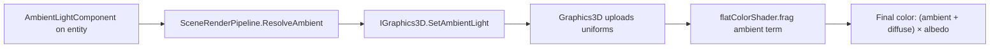
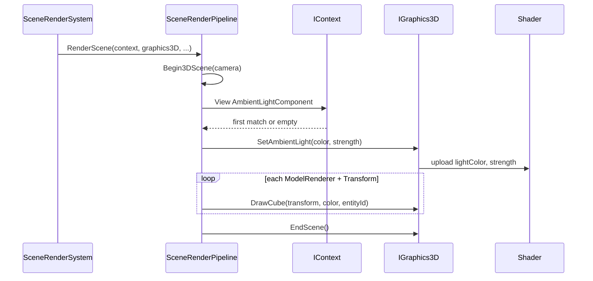

# Ambient Lighting — Developer Guide

Implementation guide for adding scene-wide ambient lighting to the 3D rendering path. Assumes familiarity with ECS components, `SceneRenderPipeline`, and the `IGraphics3D` abstraction.

## Implementation Overview



## Glossary (implementation subset)

| Term | Implementation meaning |
|------|------------------------|
| Resolve | Query ECS view, return first match or defaults |
| `lightColor` / `strength` | Shader uniform names for ambient color and scalar |
| SetAmbientLight | Graphics-layer method that binds ambient uniforms before draws |
| Default fallback | `(1, 1, 1)` color, `0.1` strength when no component exists |

## Step-by-Step Requirements

### 1. Create the ECS component

Add `AmbientLightComponent` in the scene components lighting namespace.

**Fields:**
- `Color` — `Vector3`, default white `(1, 1, 1)`
- `Strength` — `float`, default `0.1`

**Why:** Gives scenes a serializable, cloneable data holder. Defaults match the pipeline fallback so new components behave predictably before editor tuning.

**Also:** Implement `Clone()` for editor duplication and scene copy operations.

### 2. Register JSON serialization

Register the component with the standard JSON component serializer so scene files persist ambient settings.

**Why:** Without serialization, editor-authored values are lost on save/load. Follow the same registration pattern as other scene components (e.g. directional light).

### 3. Extend the 3D graphics interface

Add `SetAmbientLight(color, strength)` to `IGraphics3D` and implement it in `Graphics3D`.

**Behavior:**
- Store values on the graphics instance for the current frame
- When the flat-color shader is bound, upload to `lightColor` and `strength` uniforms

**Why:** Keeps ECS and scene code off the GPU. All uniform writes stay inside the renderer implementation behind the platform abstraction.

### 4. Update the fragment shader

In `flatColorShader.frag`, compute ambient before diffuse:

```
ambient = strength * lightColor
final   = (ambient + diffuse) * albedo
```

**Why:** Matches the additive prototype lighting model. Ambient is normal-independent; diffuse remains orientation-dependent via `dot(N, L)`.

**Constraint:** Do not add specular or texture sampling in this change — stay within prototype scope.

### 5. Resolve ambient in the render pipeline

In `SceneRenderPipeline`, before the 3D cube draw loop:

1. Call a private `ResolveAmbient(context)` helper
2. Iterate `context.View<AmbientLightComponent>()`
3. Return the first component's color and strength
4. If the view is empty, return `(Vector3.One, 0.1f)`
5. Pass the result to `graphics3D.SetAmbientLight(...)`

**Why:** Centralizes the "where does ambient come from?" question in one place, immediately adjacent to the 3D pass that consumes it. First-match semantics are explicit and easy to document.

**Pseudocode:**

```
function ResolveAmbient(context):
    for each (_, component) in context.View<AmbientLightComponent>:
        return (component.Color, component.Strength)
    return (white, 0.1)
```

### 6. Wire into the 3D draw pass

Inside `RenderCubes`, after `Begin3DScene` and before iterating `ModelRendererComponent` entities:

- Resolve ambient
- Call `SetAmbientLight`
- Continue with existing directional light setup and cube draws

**Why:** Uniforms must be set while the 3D shader is active and before any `DrawCube` calls that depend on them.

### 7. Add the editor component inspector

Create `AmbientLightComponentEditor` extending `ComponentEditor<AmbientLightComponent>`.

**UI fields:**
- Color — RGB color picker (`ColorEdit3`)
- Strength — float property field

Register the editor in the editor DI container as a singleton.

**Why:** Designers need live tuning without editing JSON or recompiling. Follow existing component editor patterns (`DrawContent`, `UIPropertyRenderer` for floats).

### 8. Verify with a sample scene

Add or update a 3D scene with:
- One entity carrying `AmbientLightComponent`
- One entity with `DirectionalLightComponent`
- One or more `ModelRendererComponent` cubes with `TransformComponent`
- A perspective camera

**Why:** End-to-end proof that ECS → pipeline → graphics → shader → editor round-trips correctly.

## Data Flow (per frame)



## Testing Checklist

| Check | Expected result |
|-------|-----------------|
| Scene with ambient entity | Shadowed cube faces visible, tinted by ambient color |
| Strength = 0 | Only directional contribution remains; ambient adds nothing |
| Strength increased | Shadowed areas brighten without moving the light |
| No ambient entity | Defaults apply; scene still renders (not black) |
| Save and reload scene | Color and strength persist |
| Editor color picker | Changes visible on next frame |
| Two ambient entities | First in iteration order wins; no crash |

## Common Pitfalls

**Uploading uniforms outside the 3D pass** — Ambient uniforms belong to the flat-color 3D shader. Setting them during the 2D sprite pass has no effect and may bind the wrong program.

**Forgetting the default fallback** — Without it, scenes missing an ambient entity may pass uninitialized values or skip the ambient term entirely.

**Hardcoding ambient in the shader** — A fixed `0.1` in the fragment shader defeats the purpose. The shader reads uniforms; defaults live in the pipeline resolver.

**Coupling the component to Graphics3D** — The component holds data only. Resolution and upload happen in pipeline and graphics layers respectively.

## Files Touched (reference map)

| Layer | Location |
|-------|----------|
| Component | `SceneComponents/Lighting/AmbientLightComponent.cs` |
| Serialization | DI registration alongside other scene components |
| Graphics API | `Engine/Renderer/IGraphics3D.cs`, `Engine/Renderer/Graphics3D.cs` |
| Pipeline | `Engine/Scene/SceneRenderPipeline.cs` |
| Shader | `Runtime/assets/shaders/OpenGL/flatColorShader.frag` (+ mirrored asset copies if required by project layout) |
| Editor | `Editor/ComponentEditors/AmbientLightComponentEditor.cs`, `Editor/DI/EditorIoCContainer.cs` |
| Sample scene | `Editor/assets/scenes/` (3D test scene) |

## Done When

- [ ] `AmbientLightComponent` exists with color, strength, and clone support
- [ ] Component serializes to/from scene JSON
- [ ] `SetAmbientLight` implemented on graphics layer
- [ ] Shader uses ambient uniforms in final color calculation
- [ ] Pipeline resolves first ambient component with documented fallback
- [ ] Editor exposes color and strength fields
- [ ] Sample 3D scene demonstrates tunable ambient fill alongside directional light
