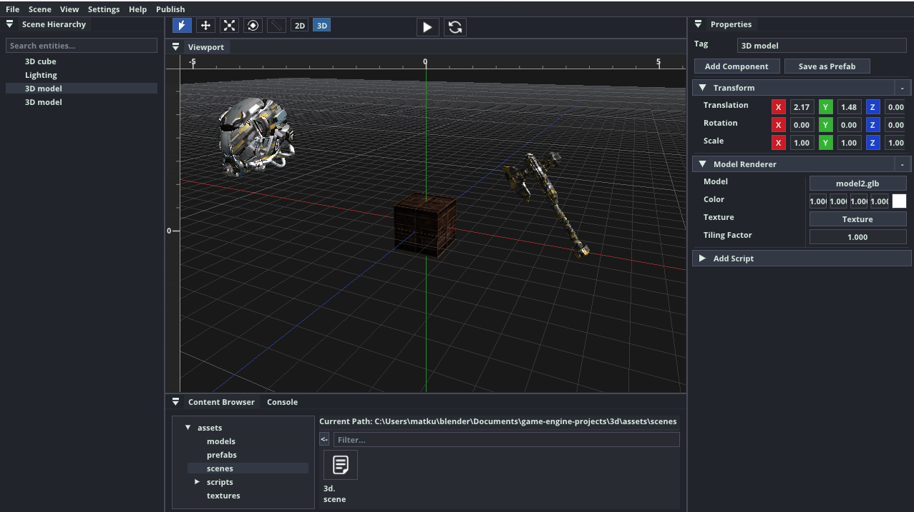
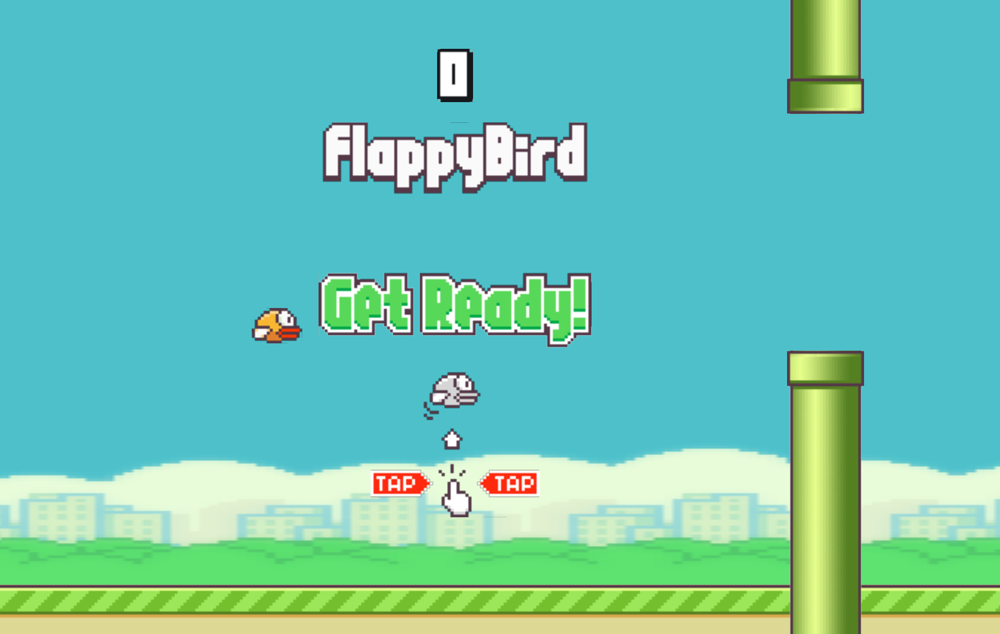
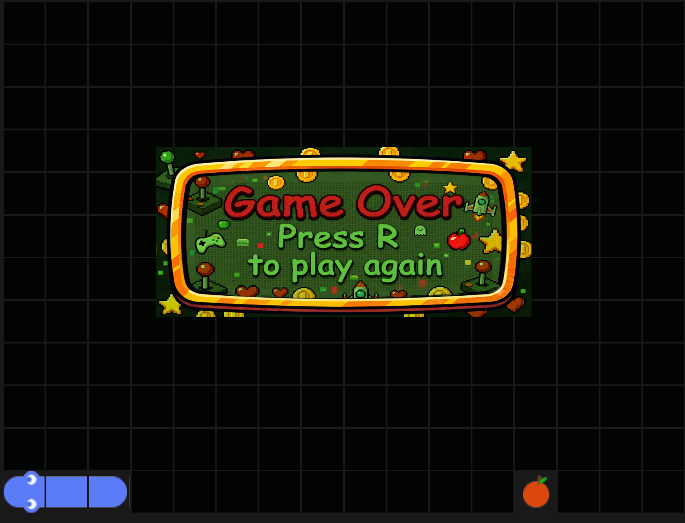
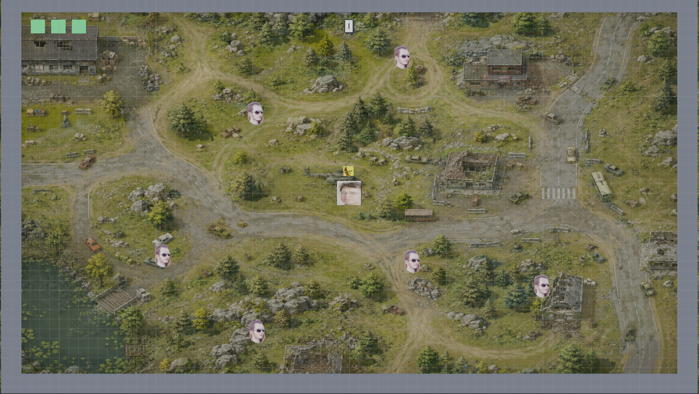

# Game Engine



A component-based game engine built with C# and .NET 10, featuring a visual editor, hot-reloadable C# scripting, 2D games, and basic 3D (static meshes).

## Features

### Core Engine
- **Entity Component System (ECS)** — data-driven architecture with ordered system execution
- **Entity Hierarchy** — parent/child transforms, cascade destroy, prefab subtrees, serialized relationships
- **2D Rendering** — OpenGL pipeline with batched sprites
- **3D Rendering** — static `.glb` / `.gltf` / `.fbx` meshes, unit cubes, perspective camera, ambient + directional light (Blinn-Phong). No skinning or animation yet.
- **Physics** — 2D rigid-body simulation with box/circle/edge colliders, raycast & overlap queries, and debug visualization
- **Hot-Reloadable Scripting** — write game logic in C# and reload without restarting the editor
- **Audio** — OpenAL spatial audio (WAV/Ogg), per-entity sources with optional EFX (reverb, echo, low-pass)
- **Cross-Platform** — Windows and macOS

### Editor
- **Visual Scene Editor** — hierarchy tree, viewport tools (select/move/scale/rotate/ruler), and properties panel
- **Undo/Redo** — reversible transform, component, and entity-delete operations (Ctrl+Z / Ctrl+Y)
- **Asset Browser** — browse and manage project assets; drag-drop textures, 3D models, audio, and prefabs into scenes
- **Live Console** — real-time logging while you work
- **Project Management** — create and open game projects
- **Game Publishing** — build standalone executables for Windows and macOS, with publish validation
- **Keyboard Shortcuts** — configurable shortcuts with an in-editor reference ([docs](docs/guide/editor/shortcuts.md))

## Getting Started

### Prerequisites
- [.NET 10 SDK](https://dotnet.microsoft.com/download/dotnet/10.0)
- OpenGL 3.3+ compatible graphics card

### Build & Run

```bash
git clone https://github.com/kateusz/GameEngine.git
cd GameEngine
dotnet build
cd Editor && dotnet run
```

### Quick Start

1. Launch the editor and create a new project
2. Create a scene (`Ctrl+N`), add entities, and attach components
3. Add scripts from the entity context menu — edits hot-reload in the editor

For a fuller walkthrough, see the [Developer Guide](docs/guide/index.md).

## Project Layout

```
├── Engine/          # Core runtime (2D/3D rendering, physics, audio, scripting, scenes)
├── ECS/             # Entity Component System framework
├── Editor/          # Visual editor
├── Runtime/         # Standalone game player
├── games/           # Sample games
├── tests/           # Automated tests
└── docs/            # Guides and architecture docs
```

## Demo Games

Open a demo in the editor via **Open Project** and select the game's folder under `games/`.

### Flappy Bird
Side-scroller — physics, scrolling pipes, scoring. [`games/FlappyBird/`](games/FlappyBird/)



### Snake
Grid arcade — movement, tick loop, sprites, audio. [`games/Snake/`](games/Snake/)



### Arena Shooter
Twin-stick arena — WASD move, mouse aim, hold LMB to shoot (hitscan raycast), chasing enemies, health and score HUD. [`games/ArenaShooter/`](games/ArenaShooter/)



Open `assets/scenes/arena.scene`, then press Play. **R** restarts after game over.

## Documentation

- [Developer Guide](docs/guide/index.md) — setup, editor, scripting, concepts
- [Cameras and Rendering](docs/guide/concepts/cameras-and-rendering.md) — 2D sprites, 3D models, lights, cameras
- [Architecture](docs/architecture/README.md) — how the engine is structured
- [Rendering Pipeline](docs/architecture/rendering-pipeline.md) — 2D batching and 3D mesh path
- [Roadmap](docs/guide/roadmap.md) — planned work

## Dependencies

Silk.NET (OpenGL, Assimp), ImGui, Box2D, OpenAL, DryIoc, Serilog
