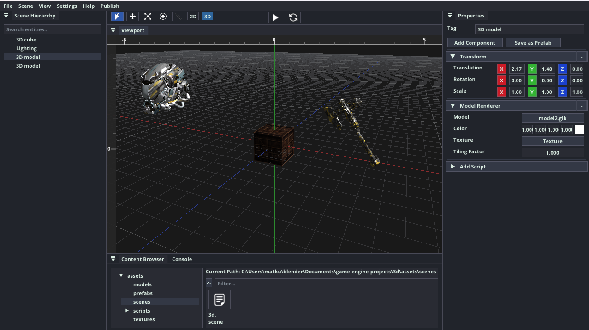
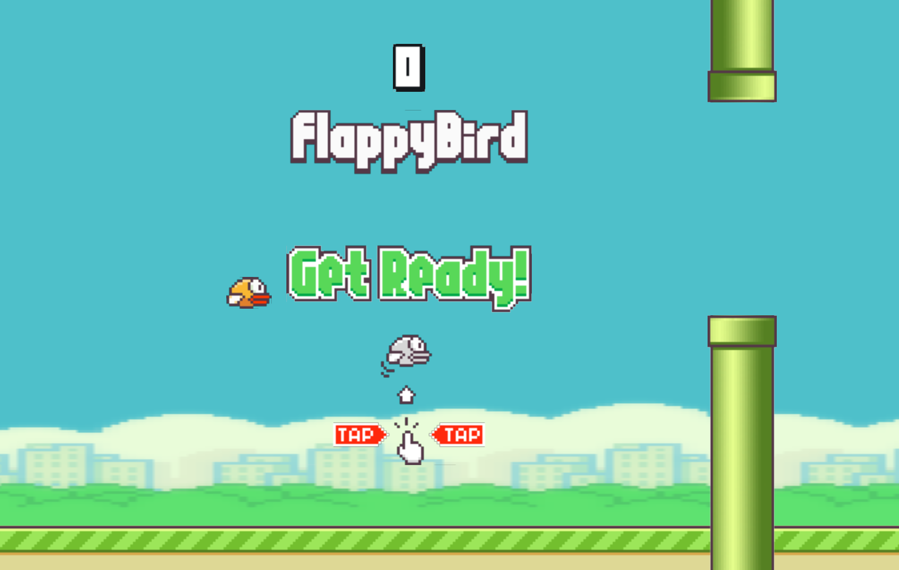
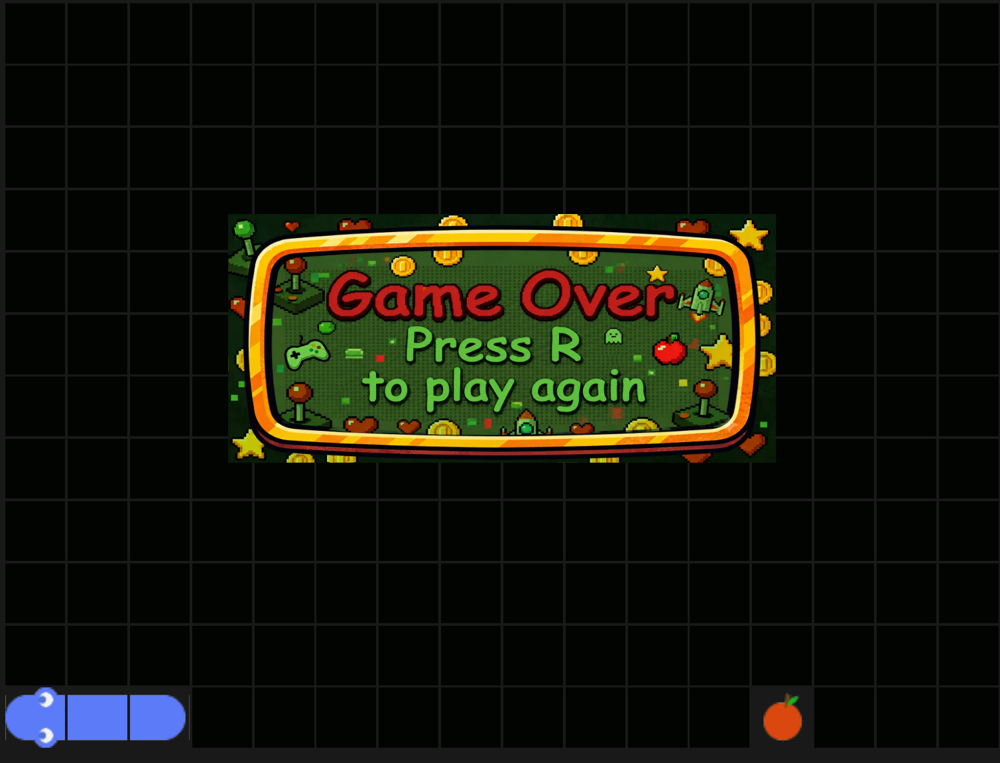
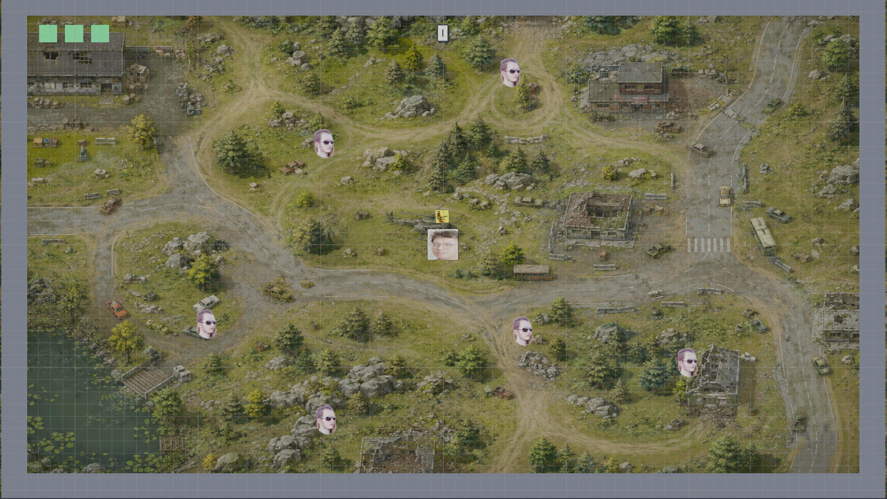

# Game Engine



A component-based game engine built with C# and .NET 10: visual editor, C# scripting (compile/reload without restarting the editor), 2D games, and a forward 3D path with PBR materials, direct lighting, and shadows.

## Features

### Core engine

Runtime lives in **Engine/** on top of the standalone **ECS/** library ([ECS overview](docs/guide/concepts/ecs-overview.md)). **Editor** and **Runtime** share the same application loop, scene graph, and systems; the editor adds ImGui, undo, and tooling ([game loop](docs/architecture/game-loop.md)).

#### ECS, scenes, and components

- **Entities + components** — compose gameplay from built-in types in `SceneComponents/` (transform, 2D/3D renderers, camera, lights, 2D physics, audio, tags) plus game-authored **`IGameComponent`** types
- **Systems** — `SystemManager` runs engine systems (transform hierarchy, physics, audio, rendering) and registered **`IGameSystem`** instances by **priority** each frame
- **Scenes** — JSON **`.scene`** files under `assets/scenes/` with **2D / 3D** dimension, background color, and serialized entity/component data ([scenes & prefabs](docs/guide/concepts/scenes-and-prefabs.md))
- **Edit vs Play** — in the editor, physics and scripts stay off until Play; Play uses the **Primary** camera and the project’s compiled game assembly

#### Hierarchy and prefabs

- **Parent/child tree** — `ParentComponent`, world matrices from roots, reparent/duplicate/destroy subtree APIs
- **Visibility** — per-entity `Visible` with cascaded **`EffectiveVisible`** for rendering
- **Prefabs** — **`.prefab`** JSON (v2 entity subtrees) under `assets/prefabs/`; save from the editor and drag onto an entity to apply the subtree

#### Physics (2D)

- **Box2D** — `RigidBody2DComponent` with **box, circle, and edge** colliders; static/kinematic/dynamic bodies
- **Queries & contacts** — raycast/overlap from systems; contact events exposed to **`IGameSystem`** code ([physics scripting](docs/guide/scripting/physics.md))
- **Debug draw** — optional collider outlines in the editor viewport

#### Scripting and input

- **Game logic in C#** — `assets/scripts/` compiled to **GameAssembly.dll** (Roslyn in the editor); **`ScriptEngine`** loads assemblies into the running app
- **Reload** — recompile/reload before **Play** and when creating script assets from the Content Browser (no IDE file watcher)
- **`IGameSystem`** — frame updates with DI services; **`IGameComponent`** — per-entity data with `[SerializableComponent]` for scene save/load
- **Input** — keyboard/mouse polling via **`IKeyboardInput`** / **`IMouseInput`** ([input guide](docs/guide/scripting/input.md))

#### Audio

- **OpenAL** — **`AudioSourceComponent`** + **`AudioListenerComponent`** on the primary camera path; **WAV** and **Ogg Vorbis**
- **EFX** (when supported) — per-source **reverb, echo, low-pass** via `AudioEffectData`

#### Projects and deployment

- **Project layout** — `assets/` (scenes, scripts, models, textures, audio, prefabs) and root **`game.config.json`** (startup scene, window, title, FPS, assembly path)
- **Standalone player** — **Runtime/** executable for published builds; same scene/system path as Play in the editor without editor UI
- **Publish** — editor **Project → Export…** builds a self-contained app for the chosen Windows/macOS RID (x64 or ARM64 on the host; API also accepts `win-x86`)

#### Platform and infrastructure

- **Graphics & windowing** — Silk.NET OpenGL **3.3+** behind **`IRendererAPI`** (platform backend stays out of core engine code)
- **DI & logging** — DryIoc composition root; Serilog (console/file) for engine and editor
- **OS support** — develop and run on **Windows** and **macOS**

### Rendering

OpenGL backend behind `IRendererAPI`. Play mode draws through the **Primary** `CameraComponent` ([cameras & rendering](docs/guide/concepts/cameras-and-rendering.md)). Pass order and draw rules: [scene rendering pipeline](docs/architecture/scene-rendering-pipeline.md).

#### 2D sprites

- **SpriteRendererComponent** — textured or solid-color quads; alpha 0 skips the draw
- **SubTextureRendererComponent** — atlas cells via coords and cell size
- **Batched indexed draws** — sprites flush in entity iteration order; depth test off (no Z sort; `SortingOrder` not implemented)
- Entities with `EffectiveVisible == false` are skipped

#### Cameras

- **Orthographic** (default, 2D) — `OrthographicSize`, near/far planes, optional fixed aspect
- **Perspective** (3D) — vertical FOV, near/far clip
- **Screen to world** — `ScreenToWorld2D` for pointer → Z=0 plane on the primary camera
- Viewport resize updates aspect unless `FixedAspectRatio` is set

#### 3D meshes and materials

- **ModelRendererComponent** — empty `ModelPath` draws a unit cube; optional albedo texture and tiling
- **Import** — `.glb`, `.gltf`, `.fbx` via Assimp; node transforms preserved (not baked into vertices); collision mesh names (`UCX_`, `UBX_`, …) skipped
- **Runtime mesh** — cooked `.mesh` sibling next to the source file for faster reload; concurrent import from source when the sibling is missing
- **Submeshes** — draw all submeshes at the entity transform, or a single submesh via `MeshIndex` (split hierarchies from drag-and-drop import)
- **PBR material inputs** — albedo (sRGB), normal, metallic, roughness, ambient occlusion; `Color` tints the result
- **Model import lights** — dragging/importing a model can spawn **point** and **directional** light entities from the file (spot lights are skipped); add `AmbientLightComponent` / lights manually otherwise
- **GPU mesh instancing** — repeated geometry batches into instanced draws
- **Background loading** — scenes, models, and textures can load off the main thread
- **Transparent cutouts** — GLB alpha channel; sRGB decode bleeds edge color into transparent texels to reduce filtering halos
- **Not supported yet** — skinning, animation clips, transparent mesh sort, spot lights

#### Lighting

Forward **Cook-Torrance** direct lighting, plus image-based fill when a sky capture exists. Screen-space ambient occlusion can darken that indirect term only (`SceneView.Ssao`, off by default). The frame uses the first ambient light, the first directional light, and up to **eight** point lights ([lighting architecture](docs/architecture/lighting.md)).

| Component | Role |
|-----------|------|
| **AmbientLightComponent** | Scene-wide ambient; `Color` and `Strength` (default strength 0.1 if none) |
| **DirectionalLightComponent** | Sun/moon; `Direction`, `Color`, `Intensity` |
| **PointLightComponent** | Local lamp at entity world position (+ optional offset); `Color`, `Intensity`, `Range`, `CastsShadow` |

2D sprites are not lit by these components. Metallic, roughness, and AO on `ModelRendererComponent` are clamped to 0–1; unpacked submeshes can inherit metallic/roughness from the imported material on first draw.

#### Shadows

Shadow maps render **before** the 3D color pass so lit surfaces can sample them ([shadows architecture](docs/architecture/shadows.md)).

- **Directional** — depth map for the resolved sun when color is non-black and the shadow frustum fits the camera view. Opaque cubes and models cast; casters beyond `DirectionalShadowCasterMaxDistance` are skipped (default 50; 0 disables the cut). Toggle per view with `SceneView.DirectionalShadows` (default on).
- **Point** — cubemap per lamp with `CastsShadow` enabled. Maps are built or reused for lights within **20** units of the camera; farther lamps still shade but cast no shadow that frame. `SceneView.PointShadows` defaults on.
- **Editor / benchmarks** — directional shadows can be turned off per view so a lit frame is not also a shadow measurement.

#### Culling and visibility

- **Frustum culling** — opaque 3D draws outside the camera frustum are skipped
- **Visibility zones** — `VisibilityZoneComponent` defines a local AABB volume; `ModelRendererComponent.VisibilityZoneEntityId` ties a mesh to a zone so it draws only while the camera is inside that volume

#### Editor viewport (not in standalone player)

- **Selection outline** — highlighted edges on selected entities (edit mode only; multiple selection supported)
- **FXAA** — optional post-pass anti-aliasing (**Editor → Settings**)
- **Entity-ID picking** — color attachment for click-select in the 3D viewport
- **Stats overlay** — **Stats** window with 2D or 3D draw metrics and optional FPS (**View → Show Debug**)

## Editor

Docked **ImGui** layout for 2D and 3D projects. Day-to-day workflow: [scene editor guide](docs/guide/editor/scene-editor.md).

### Application and menus

- **Project** — new, open, close; recent projects list and clear; **Settings** (default scene, game title, window size, fullscreen, target FPS); **Export…** (publish standalone build)
- **Scene** — new, open, save (`Ctrl+S`), close; **Settings** (scene **background color**)
- **View** — command palette, reset camera, toggle rulers, **Show Debug** (Stats panel)
- **Editor** — preferences: follow viewport selection in hierarchy, collider debug draw, FPS counter, FXAA, autosave interval
- **Help** — keyboard shortcuts reference dialog

### Scene hierarchy

- Parent/child **entity tree** with **search** pinned at the top, **component-type filter**, expand/collapse, drag-and-drop **reparenting** (including multi-entity)
- **Multi-select** (Shift/Ctrl), **multi-entity move** in the tree, **multi-entity property editing** (fields apply to all selected; script components show only when every selected entity has that type)
- **+** menu to create entities; **duplicate** (`Ctrl+D`); **delete** (`Del`); context menus on entities and empty space
- **Scroll to selected** in the hierarchy after a viewport pick (**Editor → Settings → Follow viewport selection…**) or **Command palette → jump to entity**
- Per-entity **Visible** flag (cascading hide in viewport and at runtime)

### Viewport and tools

- **2D/3D edit camera** — fly (RMB + WASD), orbit (Alt + LMB), pan (MMB), zoom (scroll / Alt + RMB); reset (`Ctrl+R` or **View → Reset Camera**); clicking an entity in the **hierarchy** moves the focal point to that entity’s world position
- **Toolbar tools** — Select, Move, Scale, Rotate (**ImGuizmo**), Ruler; shortcuts `Shift+Q` / `W` / `R` / `E` for Select / Move / Scale / Ruler (**Rotate** is toolbar-only); left-click **pick** in the viewport
- **Selection outline** on selected entities (disabled in Play mode)
- **2D grid** and **edge rulers**; **3D grid** in 3D projects; 2D/3D grid toggles on the **viewport toolbar**
- **Visibility zone** wireframe debug for assigned volumes
- Drag-and-drop **textures**, **audio**, **prefabs**, and **3D models** into the scene (models spawn an imported hierarchy)
- Viewport pick updates hierarchy selection; optional scroll-to-selected in the tree (see **Editor → Settings**)

### Panels and layout

- **Scene hierarchy** — entity tree (see above)
- **Viewport** — main scene view with toolbar and gizmo tools
- **Properties** — per-component inspectors (`IComponentEditor`), **field search** across the current selection, asset pickers on path fields
- **Godot-style bottom panel** — thin tab bar under the viewport (**Console**, **Content Browser**); click a tab to expand or collapse
- **Console** — `Console.WriteLine` and engine logs; level filters, search, auto-scroll
- **Content Browser** — folder tree and asset grid; drag assets to viewport or inspector; Windows **Show in Explorer** / **Edit** on right-click
- **Stats / performance** — draw calls, vertices, pipeline counters; optional FPS from editor settings
- **Command palette** — searchable commands and **jump to entity** (`Ctrl+Shift+P`)
- **Recent projects** — quick reopen from **Project → Recent Projects**
- **Popups** — new/open project and scene, project/scene/editor settings, publish/export, keyboard shortcuts

### Play mode and undo

- **Play / Stop / Restart** — recompile scripts before play; simulation uses game cameras and physics; **Stop** reloads the last **saved** scene from disk
- **Undo / redo** (`Ctrl+Z` / `Ctrl+Y`) — transforms, component add/remove, entity delete, model-import hierarchy

### Scripting in the editor

- Add **script components** from the entity context menu; edit C# under the project `assets/scripts/` tree
- **Recompile and reload** the GameAssembly before **Play** (and when creating script assets from the Content Browser) — no need to restart the editor
- Console output from scripts appears in the **Console** panel

### Publish

- **Project → Export…** — standalone executable for the host RID (Windows/macOS x64 or ARM64)
- Publish validation (`IGamePublisher`, build and asset checks)
- Published player reads **`game.config.json`** at the project root (startup scene, game assembly path, window title, size, fullscreen, target FPS)

### Assets and shortcuts

- **Configurable keyboard shortcuts** with in-editor reference ([docs](docs/guide/editor/shortcuts.md))
- **Component inspector** reference for every built-in component ([docs](docs/guide/editor/component-inspector.md))

## Getting Started

### Prerequisites

- [.NET 10 SDK](https://dotnet.microsoft.com/download/dotnet/10.0)
- OpenGL 3.3+ compatible graphics card

### Build & Run

```bash
git clone https://github.com/kateusz/GameEngine.git
cd GameEngine
dotnet build
cd Editor && dotnet run
```

### Quick Start

1. Launch the editor and create a new project
2. Create a scene (`Ctrl+N`), add entities, and attach components
3. Add scripts from the entity context menu — press **Play** to compile and run them in the editor

For a fuller walkthrough, see the [Developer Guide](docs/guide/index.md).

## Project Layout

```
├── Engine/          # Core runtime (2D/3D rendering, physics, audio, scripting, scenes)
├── ECS/             # Entity Component System framework
├── Editor/          # Visual editor
├── Runtime/         # Standalone game player
├── Benchmark/       # 2D/3D/lighting/shadow performance harness
├── games/           # Sample games
├── tests/           # Automated tests
└── docs/            # Guides and architecture docs
```

## Demo Games

Open a demo in the editor via **Open Project** and select the game's folder under `games/`.

### Flappy Bird

Side-scroller — physics, scrolling pipes, scoring. [`games/FlappyBird/`](games/FlappyBird/)



### Snake

Grid arcade — movement, tick loop, sprites, audio. [`games/Snake/`](games/Snake/)



### Arena Shooter

Twin-stick arena — WASD move, mouse aim, hold LMB to shoot (hitscan raycast), chasing enemies, health and score HUD. [`games/ArenaShooter/`](games/ArenaShooter/)



Open `assets/scenes/arena.scene`, then press Play. **R** restarts after game over.

### Lighting Showcase

3D room (20×16 m) with a grid of cubes (matte, metal, rough PBR). Demonstrates **ambient**, **directional** (sun shadows), and **eight point lights** with varied **range** and color (three with cubemap shadows — engine max is 8 point lights). No gameplay scripts — open the scene in the editor viewport or press Play. [`games/LightingShowcase/`](games/LightingShowcase/)

## Documentation

- [Changelog](CHANGELOG.md) — release notes (latest: **0.10.0**)
- [Developer Guide](docs/guide/index.md) — setup, editor, scripting, concepts
- [Cameras and Rendering](docs/guide/concepts/cameras-and-rendering.md) — 2D sprites, 3D models, lights, cameras
- [Architecture](docs/architecture/README.md) — how the engine is structured
- [Scene Rendering Pipeline](docs/architecture/scene-rendering-pipeline.md) — pass ordering, 2D batching, 3D meshes
- [Lighting](docs/architecture/lighting.md) — forward lighting and light resolution
- [Shadows](docs/architecture/shadows.md) — directional and point shadow passes

## Dependencies

Silk.NET (OpenGL, Assimp), ImGui, Box2D, OpenAL, DryIoc, Serilog
