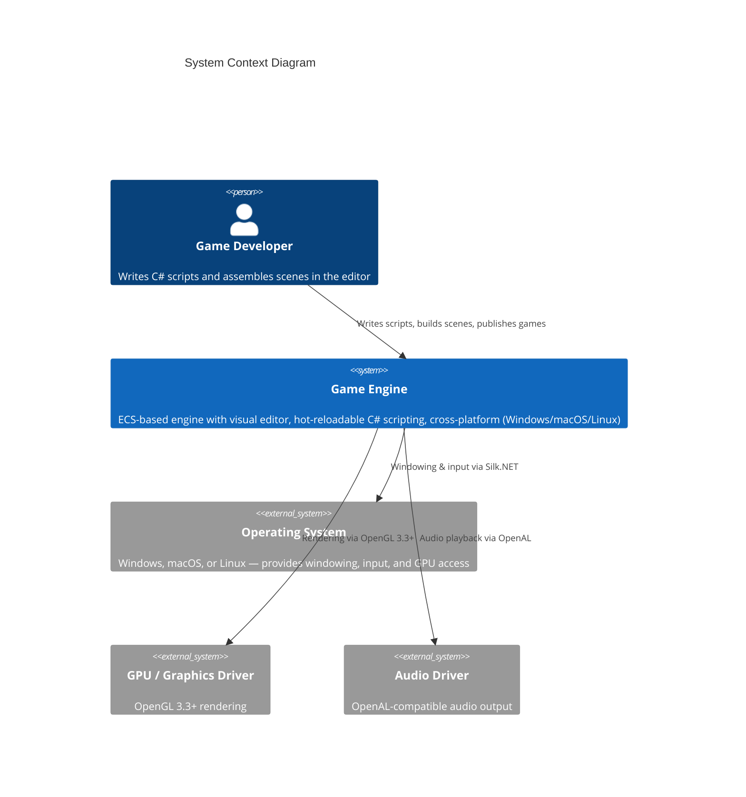
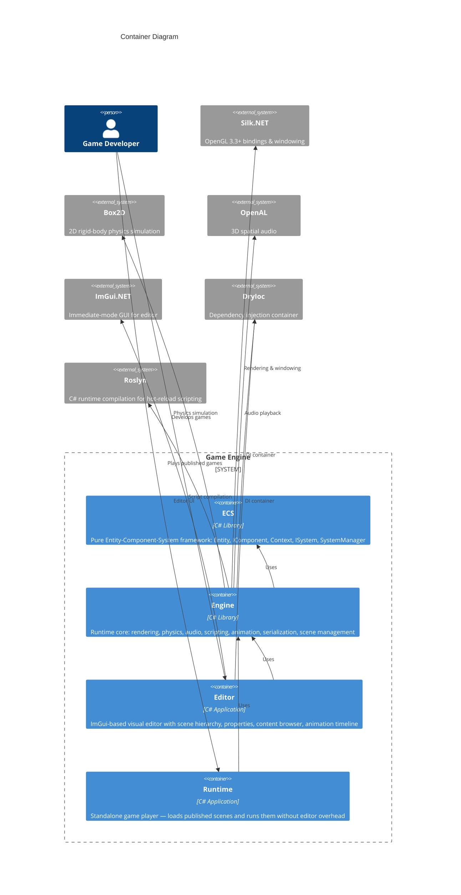

# Game Engine Architecture

Architectural documentation for the C# .NET 10.0 game engine. Covers runtime systems, data flow, and key design decisions using the [C4 model](https://c4model.com/) (Levels 1–3).

**Target audience**: Developers who need to understand the full architecture in ~30 minutes.

---

## C4 Level 1 — System Context

The engine is used by game developers to build 2D/3D games. It provides two deployment modes: a visual **Editor** for development and a standalone **Runtime** player for distribution.



---

## C4 Level 2 — Container Diagram

The solution is split into four projects that compose the engine:



---

## Solution Structure

```
GameEngine/
├── ECS/                 # Pure ECS framework (no engine dependencies)
│   ├── Entity.cs        # Entity with Dictionary<Type, IComponent> storage
│   ├── Context.cs       # Thread-safe entity registry + View<T>() queries
│   └── Systems/         # ISystem, SystemManager (priority-sorted execution)
├── Engine/              # Core runtime
│   ├── Core/            # Application, Layer stack, DI setup, Input, Window
│   ├── Renderer/        # Graphics2D/3D, IRendererAPI, batching, cameras
│   ├── Scene/           # Scene, Components (14 types), Systems (10 types)
│   ├── Scripting/       # IScriptEngine, Roslyn compilation, hot-reload
│   ├── Audio/           # IAudioEngine, OpenAL integration
│   └── Animation/       # AnimationAsset, clips, frame management
├── Editor/              # Visual editor (ImGui panels, component editors)
├── Runtime/             # Standalone game player
└── tests/               # Unit tests (ECS.Tests, Engine.Tests)
```

---

## Architecture Documents

| Document | Scope |
|----------|-------|
| [ECS Architecture](ecs-architecture.md) | Entity, Components, Context queries, Systems, priority execution |
| [Game Loop](game-loop.md) | Application lifecycle, frame tick, layer stack, Editor vs Runtime |
| [Rendering Pipeline](rendering-pipeline.md) | IRendererAPI, 2D batching, shaders, textures, cameras, framebuffers |
| [Scripting Lifecycle](scripting-lifecycle.md) | Roslyn compilation, hot-reload, ScriptableEntity, script–entity interaction |
| [Physics System](physics-system.md) | Box2D integration, fixed timestep, collision callbacks, body types |
| [Audio System](audio-system.md) | OpenAL engine, spatial audio, components |
| [Animation System](animation-system.md) | Animation assets, clips, frame progression |
| [Serialization](serialization.md) | Scene/prefab JSON, ComponentDeserializer, custom converters |
| [Dependency Injection](dependency-injection.md) | DryIoc setup, service lifetimes, factory pattern |

---

## Key Architectural Patterns

| Pattern | Usage |
|---------|-------|
| **ECS** | Entity (int ID) + Component (data-only) + System (logic, priority-ordered) |
| **Dependency Injection** | Primary constructor injection via DryIoc — no static singletons |
| **Factory + Caching** | TextureFactory, ShaderFactory with weak-reference caches |
| **Layer Stack** | Application processes layers in reverse order (overlays first) |
| **Fixed Timestep** | Physics uses accumulator pattern (60 Hz) while rendering uses variable delta |
| **Platform Abstraction** | IRendererAPI, IGameWindow isolate OpenGL/Silk.NET from engine core |
| **Singleton vs Per-Scene** | Rendering/scripting systems shared across scenes; physics is per-scene |
