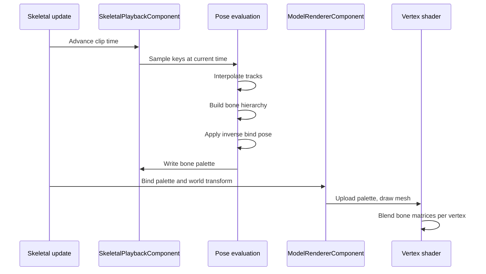

# Skeletal Animation System

Skinned characters use **linear blend skinning**: animation is sampled on the CPU each frame, and mesh deformation happens in the vertex shader. Skeleton data and clips are baked into `.mesh` assets at import; runtime playback is controlled through ECS components.

---

## Component Diagram

```mermaid
graph TB
    subgraph "Asset"
        Import["Editor import → .mesh"]
        Asset["Mesh asset<br/><i>geometry, bones, clips</i>"]
    end

    subgraph "ECS"
        SPC["SkeletalPlaybackComponent"]
        MRC["ModelRendererComponent"]
        TC["TransformComponent"]
    end

    subgraph "Runtime"
        Update["Skeletal update<br/><i>priority 135</i>"]
        Render["3D render pass"]
    end

    Import --> Asset
    Update --> SPC
    Update --> MRC
    Asset --> Update
    MRC --> Render
    TC --> MRC
```

---

## Overview

The pipeline has three stages:

| Stage | Where | What happens |
|---|---|---|
| Import | Editor | Skinned model imported from FBX/glTF; skeleton, vertex weights, and all clips from the source file are written into a version-3 `.mesh` asset |
| Update | Skeletal animation (priority 135) | Active clip is sampled; bone matrices are written to a per-entity palette |
| Draw | 3D render pass | Palette is sent to the GPU; vertex shader blends up to four bone influences per vertex |

Pose math runs on the **CPU**. There is no CPU skinning path — only the GPU deforms vertices.

Entity position and rotation come from `TransformComponent`. Animated root motion in a clip affects the mesh shape only; it does not move the entity.

---

## System Priority

Skeletal animation runs after the transform hierarchy (115) and before the scene render pass (150). World transforms must be current before a skinned mesh is bound and drawn.

In the editor **edit viewport**, animations also tick outside Play mode so clips can be previewed in the scene view.

---

## Data Model

### Skeleton (in `.mesh` asset)

Each bone has a name, a parent link (root has no parent), and an inverse bind matrix. The bind pose is derived from these matrices at runtime — it is not stored as separate rest position, rotation, or scale.

### Animation clips (in `.mesh` asset)

| Part | Contents |
|---|---|
| Clip | Name, duration in seconds, list of animated bones |
| Per-bone track | Position, rotation, and scale key sequences |
| Key | Time stamp plus value |

Clips are matched by name. If `ClipName` on the playback component is empty, the first clip in the file is used.

### Mesh skinning data

Each vertex carries up to **four bone indices and weights**, normalized at import. Older `.mesh` versions (1–2) have no skeleton or skinning attributes.

---

## ECS Components

### `SkeletalPlaybackComponent`

Drives clip playback on an entity:

| Property | Role |
|---|---|
| `MeshPath` | `.mesh` file with skeleton and clips |
| `ClipName` | Which clip to play |
| `Playing` | When false, mesh stays at bind pose |
| `Loop` | Whether time wraps at clip end |
| `Speed` | Playback rate multiplier |
| `Time` | Current position in the clip (seconds) |

Runtime bone matrices are computed each frame but are **not serialized** — only the playback settings above are saved in scene JSON.

### `ModelRendererComponent`

Draws a mesh and, when skinned, receives the bone palette from a matching playback component:

| Property | Role |
|---|---|
| `ModelPath` | `.mesh` to draw |
| `BonePalette` | Shared runtime palette (not serialized) |
| `SkinningWorld` | World transform used when drawing skinned geometry (not serialized) |

Typical rig: `SkeletalPlaybackComponent` on a parent entity, `ModelRendererComponent` on a child (or the same entity) with the same mesh path. The engine walks the parent chain to connect them.

---

## Per-Frame Update Flow



Ordered steps:

1. **Advance time** — respect speed, loop, and clip duration.
2. **Sample keyframes** — interpolate position and scale linearly; rotation with spherical interpolation.
3. **Build bone transforms** — local poses combined through the parent hierarchy.
4. **Apply inverse bind pose** — produce final skinning matrices for the palette.
5. **Bind to renderer** — matching `ModelRendererComponent` entities receive the palette and world transform from `TransformComponent`.
6. **Upload and draw** — bone matrices sent to the GPU as a uniform array for each skinned draw call.

If playback is stopped, the skeleton is missing, or the clip is unknown, the palette stays at identity (bind pose).

---

## Skinning

Deformation is **GPU-only**. Lit, wireframe, and shadow passes all skin in the vertex shader: each vertex blends up to four bone matrices by weight, then the entity model matrix is applied.

Bone data is uploaded as a **uniform array** (max 100 matrices). UBOs, SSBOs, and texture buffers are not used.

---

## Interpolation

| Track | Method |
|---|---|
| Position | Linear |
| Scale | Linear |
| Rotation | Spherical linear |

Values are held at the first or last key outside the clip range. Cubic or curve-based interpolation is not supported.

---

## Blending and State Machine

**Not implemented.**

One clip plays per `SkeletalPlaybackComponent`. There is no crossfade, additive blending, blend tree, or animation state machine. Changing animation means setting `ClipName` directly.

---

## Root Motion

**Not implemented.**

Clips deform the mesh in model space. Entity movement is entirely from `TransformComponent`.

---

## Limitations

| Area | Constraint |
|---|---|
| Bone count | Max 100 per skeleton |
| Influences | Max 4 per vertex |
| Blending | Single clip only |
| Root motion | Not applied to transforms |
| Retargeting | Clips tied to the baked skeleton |
| IK | Not supported |
| Clips | Baked into `.mesh` at import; not loaded separately at runtime |
| Performance | Full bone palette uploaded per skinned draw |

---

## Related Documentation

- [3D Model Loading Pipeline](model-loading-pipeline.md) — import path, `.mesh` format, skinned vs static meshes
- [Rendering Pipeline](rendering-pipeline.md) — 3D draw order and mesh rendering
- [ECS Architecture](ecs-architecture.md) — systems and component queries
- [Game Loop](game-loop.md) — frame tick order
