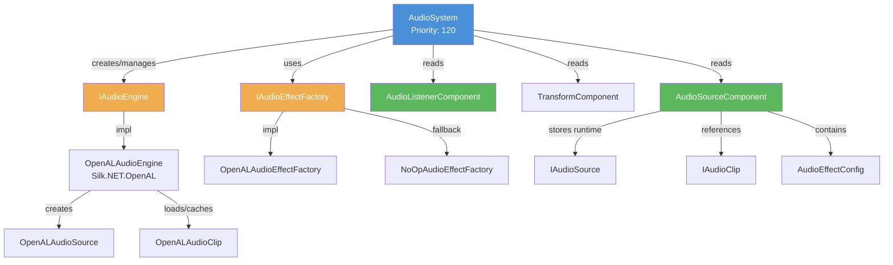

# Audio System

Audio playback via OpenAL (`IAudioEngine`). Supports 3D spatial audio with distance attenuation. `AudioSystem` runs at priority 120 (after scripts at 110).

## Component Diagram



## Components

### AudioSourceComponent

| Property | Type | Default | Serialized | Description |
|---|---|---|---|---|
| `AudioClip` | `IAudioClip?` | null | No | Runtime clip reference |
| `AudioClipPath` | `string?` | null | Yes | Path to audio file |
| `Volume` | `float` | 1.0 | Yes | 0.0 to 1.0 |
| `Pitch` | `float` | 1.0 | Yes | 0.5 to 2.0 typical |
| `Loop` | `bool` | false | Yes | Loop playback |
| `PlayOnAwake` | `bool` | false | Yes | Auto-play on scene start |
| `Is3D` | `bool` | true | Yes | Enable spatial audio |
| `MinDistance` | `float` | 1.0 | Yes | Full volume radius |
| `MaxDistance` | `float` | 100.0 | Yes | Max attenuation distance |
| `Effects` | `List<AudioEffectConfig>` | [] | Yes | Effect chain (type, enabled, amount) |
| `IsPlaying` | `bool` | false | No | Current playback state |
| `RuntimeAudioSource` | `IAudioSource?` | null | No | Internal OpenAL source handle |

### AudioListenerComponent

| Property | Type | Default | Description |
|---|---|---|---|
| `IsActive` | `bool` | true | Marks entity as the audio listener (typically camera). Only one active at a time. |

### AudioEffectConfig

| Property | Type | Default |
|---|---|---|
| `Type` | `AudioEffectType` | - |
| `Enabled` | `bool` | true |
| `Amount` | `float` | 0.5 |

## Audio Pipeline

```mermaid
sequenceDiagram
    participant Loop as Game Loop
    participant AS as AudioSystem
    participant Ctx as IContext
    participant AE as IAudioEngine
    participant EF as IAudioEffectFactory

    Loop->>AS: OnUpdate(deltaTime)

    Note over AS: Phase 1 - Update Listener
    AS->>Ctx: View<AudioListenerComponent>()
    Ctx-->>AS: (entity, listener) pairs
    AS->>AS: Find first active listener with TransformComponent
    AS->>AE: SetListenerPosition(transform.Translation)
    AS->>AS: Compute forward/up from euler rotation
    AS->>AE: SetListenerOrientation(forward, up)

    Note over AS: Phase 2 - Update Sources
    AS->>Ctx: View<AudioSourceComponent>()
    Ctx-->>AS: (entity, source) pairs
    alt RuntimeAudioSource == null
        AS->>AE: CreateAudioSource()
        AE-->>AS: IAudioSource
        AS->>AS: InitializeAudioSource (set clip, volume, pitch, spatial mode)
        opt PlayOnAwake && AudioClip != null
            AS->>AS: source.Play()
        end
    else Already initialized
        AS->>AS: Sync volume, pitch, loop, clip
        opt Is3D
            AS->>AS: Update position from TransformComponent
            AS->>AS: Update spatial mode (minDist, maxDist)
        end
        AS->>AS: Sync IsPlaying from RuntimeAudioSource
        AS->>EF: SyncEffects (add/remove/update via factory)
    end
```

### OnInit

Creates `RuntimeAudioSource` via `IAudioEngine.CreateAudioSource()` for all existing `AudioSourceComponent` entities. Sets initial properties (clip, volume, pitch, spatial mode, position). Triggers `Play()` if `PlayOnAwake` is true.

### OnShutdown

Disposes all `RuntimeAudioSource` instances and nulls the references.

### Static Control Methods

`AudioSystem.Play(entity)`, `Pause(entity)`, `Stop(entity)` -- static methods for direct playback control from scripts.

## Spatial Audio

- **Listener**: Position and orientation set from the active `AudioListenerComponent` entity's `TransformComponent`. Orientation derived from euler rotation via quaternion (forward = -Z, up = +Y).
- **Sources**: 3D position updated each frame from entity's `TransformComponent.Translation`.
- **Attenuation**: OpenAL handles distance-based attenuation between `MinDistance` (full volume) and `MaxDistance` (near-silent).
- **2D fallback**: Sources with `Is3D = false` play at constant volume regardless of position.

## Effect System

`AudioSystem.SyncEffects()` synchronizes the runtime effect chain with `AudioSourceComponent.Effects`:
1. Removes active effects not in the config (or disabled).
2. Adds new effects via `IAudioEffectFactory.CreateEffect(type)`.
3. Updates `Amount` parameter on existing effects.

## DI Registration

- `IAudioEngine` -> `OpenALAudioEngine` (singleton, registered in `EngineIoCContainer`)
- `IAudioEffectFactory` -> `OpenALAudioEffectFactory` (singleton)
- `AudioSystem` registered as `ISystem` in `SceneSystemRegistry`

## Key Files

| File | Purpose |
|---|---|
| `Engine/Scene/Systems/AudioSystem.cs` | ECS system (priority 120) |
| `Engine/Scene/Components/AudioSourceComponent.cs` | Source component |
| `Engine/Scene/Components/AudioListenerComponent.cs` | Listener component |
| `Engine/Audio/IAudioEngine.cs` | Audio engine interface |
| `Engine/Platform/OpenAL/OpenALAudioEngine.cs` | OpenAL implementation |
| `Engine/Audio/IAudioEffectFactory.cs` | Effect factory interface |
| `Engine/Audio/AudioEffectConfig.cs` | Serializable effect configuration |
