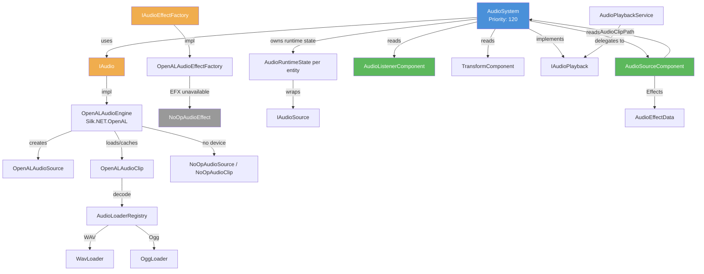

# Audio System

OpenAL-backed playback via `IAudio` (`OpenALAudioEngine`). Supports 3D spatial audio, WAV/Ogg loading, optional EFX (reverb, echo, low-pass), and one-shot playback. `AudioSystem` runs at priority 120 (after `ScriptUpdateSystem` at 110).

**File**: `Engine/Platform/OpenAL/OpenALAudioEngine.cs`, `Engine/Scene/Systems/AudioSystem.cs`

---

## System Priority

| Priority | System | Role |
|---:|---|---|
| 110 | `ScriptUpdateSystem` | Runs before audio so gameplay can trigger playback |
| 120 | `AudioSystem` | Listener pose, source sync, effect chains |

Constants: `Engine/Scene/Systems/SystemPriorities.cs`

---

## Component Diagram

```mermaid
graph TD
    AS[AudioSystem<br/>Priority: 120] -->|owns runtime state| RS[AudioRuntimeState per entity]
    AS -->|uses| IA[IAudio]
    AS -->|reads| ASC[AudioSourceComponent]
    AS -->|reads| ALC[AudioListenerComponent]
    AS -->|reads| TC[TransformComponent]
    AS -->|implements| IAP[IAudioPlayback]
    APS[AudioPlaybackService] -->|delegates to| IAP

    IA -->|impl| OALE[OpenALAudioEngine<br/>Silk.NET.OpenAL]
    IAEF[IAudioEffectFactory] -->|impl| OALEF[OpenALAudioEffectFactory]
    OALEF -->|EFX unavailable| NoOpFX[NoOpAudioEffect]

    OALE -->|creates| OALS[OpenALAudioSource]
    OALE -->|loads/caches| OALC[OpenALAudioClip]
    OALE -->|no device| NoOp[NoOpAudioSource / NoOpAudioClip]

    ALR[AudioLoaderRegistry] -->|WAV| Wav[WavLoader]
    ALR -->|Ogg| Ogg[OggLoader]
    OALC -->|decode| ALR

    RS -->|wraps| IAS[IAudioSource]
    ASC -->|AudioClipPath| AS
    ASC -->|Effects| AED[AudioEffectData]

    style AS fill:#4a90d9,color:#fff
    style ASC fill:#5cb85c,color:#fff
    style ALC fill:#5cb85c,color:#fff
    style IA fill:#f0ad4e,color:#fff
    style IAEF fill:#f0ad4e,color:#fff
    style NoOpFX fill:#999,color:#fff
```

---

## ECS Components

Components live in the `SceneComponents.Audio` namespace. `AudioSystem` reads the following properties each frame.

### AudioSourceComponent

| Property | Used by AudioSystem | Notes |
|---|---|---|
| `AudioClipPath` | Yes | Serialized path; clip loaded via `IAudio.LoadAudioClip` |
| `Volume` | Yes | Synced to `IAudioSource.Volume` |
| `Pitch` | Yes | Synced to `IAudioSource.Pitch` |
| `Loop` | Yes | Synced to `IAudioSource.Loop` |
| `PlayOnAwake` | Yes | Triggers `Play()` on init when clip loads |
| `Is3D` | Yes | Passed to `SetSpatialMode` |
| `MinDistance` | Yes | Reference distance for 3D attenuation |
| `MaxDistance` | Yes | Max attenuation distance |
| `Effects` | Yes | `List<AudioEffectData>` — effect chain sync |

Runtime OpenAL sources are **not** stored on the component. `AudioSystem` keeps an `AudioRuntimeState` dictionary keyed by entity ID (clip, loaded path, dirty-check caches, and `IsPlaying` mirrored from `IAudioSource.IsPlaying`). Property changes are synced via dirty-check fields (`LastVolume`, `LastPitch`, etc.) in `ApplyComponentToSource`.

### AudioListenerComponent

| Property | Used by AudioSystem | Notes |
|---|---|---|
| `IsActive` | Yes | First active listener with a `TransformComponent` wins |

### AudioEffectData

| Property | Used by AudioSystem | Notes |
|---|---|---|
| `Type` | Yes | `AudioEffectType` — Reverb, LowPass, Echo |
| `Enabled` | Yes | Disabled effects are removed from the runtime chain |
| `Amount` | Yes | Passed to `AddEffect` / `UpdateEffect` |

---

## Audio Pipeline

```mermaid
sequenceDiagram
    participant Loop as Game Loop
    participant AS as AudioSystem
    participant Ctx as IContext
    participant A as IAudio
    participant Src as IAudioSource

    Loop->>AS: OnUpdate(deltaTime)

    Note over AS: Phase 1 — Listener
    AS->>Ctx: View AudioListenerComponent + TransformComponent
    AS->>A: SetListenerPosition(translation)
    AS->>A: SetListenerOrientation(forward, up)

    Note over AS: Phase 2 — Sources
    AS->>Ctx: View AudioSourceComponent
    alt No runtime state yet
        AS->>A: CreateAudioSource()
        AS->>AS: ApplyComponentToSource(force)
        opt PlayOnAwake and clip loaded
            AS->>Src: Play()
        end
    else Existing runtime state
        AS->>AS: ApplyComponentToSource (dirty-check sync)
        opt Is3D
            AS->>Src: SetPosition(transform.Translation)
        end
        AS->>AS: SyncEffects from Effects list
    end
    AS->>AS: CleanupOrphanedRuntime
```

### OnInit

Iterates all `AudioSourceComponent` entities and calls `InitializeAudioSource` (creates runtime state, syncs properties, plays if `PlayOnAwake`).

### OnShutdown

Unbinds from `AudioPlaybackService`, disposes all runtime sources, clears the entity state dictionary, and calls `IAudio.ClearClipCache()`.

### Playback control

`AudioSystem` implements `IAudioPlayback` (`Play`, `Pause`, `Stop`) and calls `playbackService.Unbind(this)` on shutdown. Per-entity playback goes through the runtime source created in `EnsureRuntimeState`.

### Engine update loop

`OpenALAudioEngine.Update` disposes finished one-shot sources tracked in `_oneShots`. The application calls `IAudio.Update` each frame after layer updates (see [game loop](game-loop.md)).

---

## Spatial Audio

- **Listener**: Position and orientation from the first active `AudioListenerComponent` entity's `TransformComponent`. Orientation uses euler → quaternion (forward = −Z, up = +Y).
- **Sources**: 3D position updated each frame from `TransformComponent.Translation` when `Is3D` is true.
- **Attenuation**: OpenAL `ReferenceDistance` / `MaxDistance` / `RolloffFactor` set in `OpenALAudioSource.SetSpatialMode`.
- **2D fallback**: `Is3D = false` sets `SourceRelative` so volume is independent of world position.

---

## Clip Loading

| Step | Detail |
|---|---|
| Path resolution | `AudioClipPath` resolved via `PathBuilder.Build` in `AudioSystem.TrySyncClip`; `LoadAudioClip` normalizes again in `OpenALAudioEngine` |
| Load | `IAudio.LoadAudioClip(fullPath)` |
| Cache | Weak-reference dictionary keyed by normalized path (`OpenALAudioEngine`) |
| Unload | `UnloadAudioClip(path)` unloads and removes a cached clip; `ClearClipCache()` on `AudioSystem` shutdown |
| Decode | `AudioLoaderRegistry` dispatches to `WavLoader` (`.wav`) or `OggLoader` (`.ogg`, NVorbis); extensible via `RegisterLoader` |
| Upload | `OpenALAudioClip` uploads 16-bit PCM (mono/stereo) to an OpenAL buffer |

`OpenALAudioEngine.PlayOneShot(clipPath, volume)` creates a source, plays once, and auto-disposes when playback finishes.

---

## Effect System

`AudioSystem.SyncEffects` keeps the runtime chain aligned with `AudioSourceComponent.Effects`:

1. Remove active effects not in the enabled config.
2. Add missing effects via `IAudioSource.AddEffect(type, amount)`.
3. Update `Amount` on existing effects via `UpdateEffect`.

`OpenALAudioEffectFactory` probes `alGenEffects` at startup. When EFX is available it creates `OpenALReverbEffect`, `OpenALLowPassEffect`, or `OpenALEchoEffect`; otherwise (or on creation failure) it returns `NoOpAudioEffect`. Low-pass uses a direct filter (`AlDirectFilter`); reverb and echo use auxiliary send slots (`MaxAuxiliarySends = 4` in `OpenALAudioSource`).

---

## No-Op Fallback

When OpenAL device/context creation fails, `OpenALAudioEngine` sets `_isAvailable = false`. `CreateAudioSource` and clip creation return `NoOpAudioSource` / `NoOpAudioClip` so the engine continues without audio hardware.

---

## Key Files

| File | Purpose |
|---|---|
| `Engine/Scene/Systems/AudioSystem.cs` | ECS system (priority 120), runtime state, effect sync |
| `Engine/Platform/OpenAL/OpenALAudioEngine.cs` | `IAudio` implementation, clip cache, one-shots |
| `Engine/Platform/OpenAL/OpenALAudioSource.cs` | OpenAL source, spatial mode, EFX routing |
| `Engine/Platform/OpenAL/OpenALAudioClip.cs` | Buffer upload from decoded PCM |
| `Engine/Audio/AudioLoaderRegistry.cs` | Loader dispatch (WAV, Ogg) |
| `Engine/Platform/OpenAL/Loaders/WavLoader.cs` | RIFF/WAV decoder |
| `Engine/Platform/OpenAL/Loaders/OggLoader.cs` | Ogg Vorbis decoder (NVorbis) |
| `Engine/Audio/IAudioEffectFactory.cs` | Effect factory interface |
| `Engine/Platform/OpenAL/Effects/OpenALAudioEffectFactory.cs` | EFX-backed effect creation |
| `Engine/Audio/NoOpAudioEffect.cs` | No-op effect used when EFX is unavailable |
| `Engine/Platform/OpenAL/Effects/OpenALReverbEffect.cs` | EFX reverb |
| `Engine/Platform/OpenAL/Effects/OpenALLowPassEffect.cs` | EFX low-pass filter |
| `Engine/Platform/OpenAL/Effects/OpenALEchoEffect.cs` | EFX echo |
