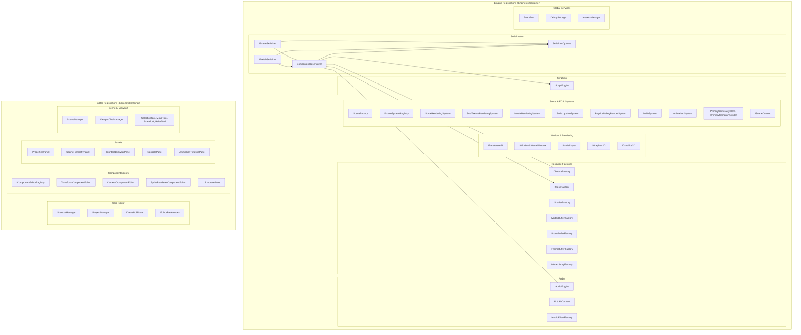
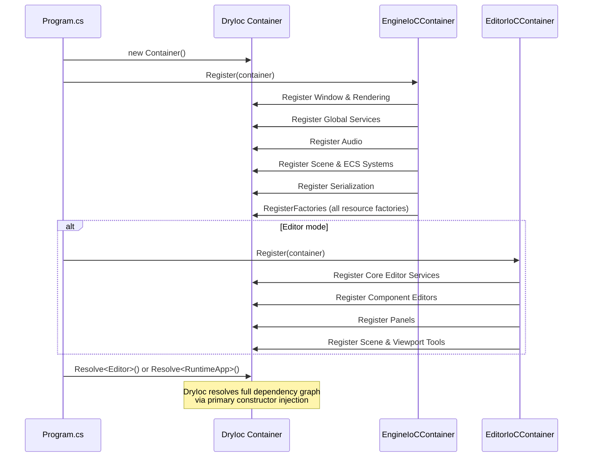

# Dependency Injection

DryIoc container with primary constructor injection. Two-stage registration: `EngineIoCContainer` registers core runtime services, `EditorIoCContainer` adds editor-only services on top. No static singletons -- `EngineIoCContainer` and `EditorIoCContainer` are the only static classes (registration entry points). Nearly all services are singletons.

## Component Diagram



## Engine Registrations

**File:** `Engine/Core/DI/EngineIoCContainer.cs`

### Window & Rendering

| Service | Implementation | Lifetime | Notes |
|---------|---------------|----------|-------|
| `IRendererApiConfig` | `RendererApiConfig(ApiType.SilkNet)` | Singleton | Hardcoded to Silk.NET |
| `IRendererAPI` | Via `IRendererApiFactory.Create()` | Singleton | Factory-resolved |
| `IWindow` | `Silk.NET.Windowing.Window.Create()` | Singleton | Silk.NET window |
| `IGameWindowFactory` | `GameWindowFactory` | Singleton | Creates IGameWindow |
| `IGameWindow` | Via `IGameWindowFactory.Create()` | Default | Factory-resolved |
| `IContentScaleProvider` | Delegate to `IGameWindow` | Default | For HiDPI support |
| `IImGuiLayer` | Via `IImGuiLayerFactory.Create()` | Default | Factory-resolved |
| `IGraphics2D` | `Graphics2D` | Singleton | 2D rendering API |
| `IGraphics3D` | `Graphics3D` | Singleton | 3D rendering API |

### Global Services

| Service | Implementation | Lifetime | Notes |
|---------|---------------|----------|-------|
| `EventBus` | `EventBus` | Singleton | Global pub-sub messaging |
| `IScriptEngine` | `ScriptEngine` | Singleton | Roslyn compilation + hot-reload |
| `DebugSettings` | `DebugSettings` | Singleton | Runtime debug toggles |
| `IAssetsManager` | `AssetsManager` | Singleton | Asset path tracking |
| `IInputSystemFactory` | `InputSystemFactory` | Singleton | Creates input systems |

### Audio

| Service | Implementation | Lifetime | Notes |
|---------|---------------|----------|-------|
| `AL` | `AL.GetApi(true)` | Singleton | OpenAL function delegates |
| `ALContext` | `ALContext.GetApi(true)` | Singleton | OpenAL context delegates |
| `IAudioEngine` | `OpenALAudioEngine` | Singleton | Audio playback engine |
| `IAudioEffectFactory` | `OpenALAudioEffectFactory` | Singleton | Audio effect creation |

### Scene & ECS Systems

| Service | Implementation | Lifetime | Notes |
|---------|---------------|----------|-------|
| `SceneFactory` | `SceneFactory` | Singleton | Creates Scene instances |
| `ISceneSystemRegistry` | `SceneSystemRegistry` | Singleton | Registers systems for scenes |
| `SpriteRenderingSystem` | - | Singleton | 2D sprite batching |
| `SubTextureRenderingSystem` | - | Singleton | Atlas sub-texture rendering |
| `ModelRenderingSystem` | - | Singleton | 3D model rendering |
| `ScriptUpdateSystem` | - | Singleton | Calls script OnUpdate |
| `PhysicsDebugRenderSystem` | - | Singleton | Physics wireframe overlay |
| `AudioSystem` | - | Singleton | Audio source management |
| `AnimationSystem` | - | Singleton | Sprite animation playback |
| `PrimaryCameraSystem` | - | Singleton | Also mapped as `IPrimaryCameraProvider` |
| `IAnimationAssetManager` | `AnimationAssetManager` | Singleton | Animation asset loading |
| `ISceneContext` | `SceneContext` | Singleton | Active scene reference |

### Serialization

| Service | Implementation | Lifetime | Notes |
|---------|---------------|----------|-------|
| `SerializerOptions` | `SerializerOptions` | Singleton | Custom Vector/Rectangle/Enum converters |
| `ComponentDeserializer` | `ComponentDeserializer` | Singleton | Polymorphic component dispatch |
| `IPrefabSerializer` | `PrefabSerializer` | Singleton | Prefab save/load |
| `ISceneSerializer` | `SceneSerializer` | Singleton | Scene save/load |

### Resource Factories

All registered as Singletons. Manage caching and GPU resource lifecycles.

| Service | Implementation |
|---------|---------------|
| `IRendererApiFactory` | `RendererApiFactory` |
| `ITextureFactory` | `TextureFactory` |
| `IShaderFactory` | `ShaderFactory` |
| `IMeshFactory` | `MeshFactory` |
| `IVertexBufferFactory` | `VertexBufferFactory` |
| `IIndexBufferFactory` | `IndexBufferFactory` |
| `IFrameBufferFactory` | `FrameBufferFactory` |
| `IVertexArrayFactory` | `VertexArrayFactory` |

## Editor Registrations

**File:** `Editor/DI/EditorIoCContainer.cs`

Only loaded by the Editor project, not by Runtime.

### Core Editor Services

| Service | Implementation | Lifetime | Notes |
|---------|---------------|----------|-------|
| `ShortcutManager` | - | Singleton | Keyboard shortcut handling |
| `IProjectManager` | `ProjectManager` | Singleton | Project open/create/save |
| `IGamePublisher` | `GamePublisher` | Singleton | Build & publish games |
| `PublishSettingsUI` | - | Singleton | Publish settings panel |
| `IEditorPreferences` | `EditorPreferences` | Singleton | Factory init via `EditorPreferences.Load()` |
| `EditorSettingsUI` | - | Singleton | Settings panel |
| `PerformanceMonitorPanel` | - | Singleton | FPS / frame time stats |

### Component Editors

All Singletons. Each component type has a dedicated editor registered in `IComponentEditorRegistry`:

- `TransformComponentEditor`, `CameraComponentEditor`, `SpriteRendererComponentEditor`
- `MeshComponentEditor`, `ModelRendererComponentEditor`, `SubTextureRendererComponentEditor`
- `RigidBody2DComponentEditor`, `BoxCollider2DComponentEditor`
- `AudioSourceComponentEditor`, `AudioListenerComponentEditor`
- `AnimationComponentEditor`, `ScriptComponentEditor`

### Panels

| Service | Implementation | Lifetime |
|---------|---------------|----------|
| `IPropertiesPanel` | `PropertiesPanel` | Singleton |
| `ISceneHierarchyPanel` | `SceneHierarchyPanel` | Singleton |
| `IContentBrowserPanel` | `ContentBrowserPanel` | Singleton |
| `IConsolePanel` | `ConsolePanel` | Singleton |
| `IAnimationTimelinePanel` | `AnimationTimelinePanel` | Singleton |
| `RendererStatsPanel` | - | Singleton |
| `KeyboardShortcutsPanel` | - | Singleton |
| `RecentProjectsPanel` | - | Singleton |

### Scene & Viewport

| Service | Implementation | Lifetime | Notes |
|---------|---------------|----------|-------|
| `SceneManager` | `RegisterMany` | Singleton | Implements multiple interfaces |
| `IViewportScaleHelper` | `ViewportScaleHelper` | Singleton | HiDPI coordinate mapping |
| `ViewportRuler` | - | Singleton | Ruler overlay |
| `ViewportGrid` | - | Singleton | Grid overlay |
| `ViewportToolManager` | - | Singleton | Active tool management |
| `SelectionTool` | - | Singleton | Entity picking |
| `MoveTool` | - | Singleton | Translate gizmo |
| `ScaleTool` | - | Singleton | Scale gizmo |
| `RulerTool` | - | Singleton | Measurement tool |

### Other

| Service | Implementation | Lifetime |
|---------|---------------|----------|
| `EntityContextMenu` | - | Singleton |
| `PrefabDropTarget` | - | Singleton |
| `AudioDropTarget` | - | Singleton |
| `IPrefabManager` | `PrefabManager` | Singleton |
| `NewProjectPopup` | - | Singleton |
| `SceneSettingsPopup` | - | Singleton |
| `SceneToolbar` | - | Singleton |
| `ECS.IContext` | `ECS.Context` | Singleton |
| `ILayer` | `EditorLayer` | Singleton |
| `Editor` | - | Singleton |

## Service Lifetimes

| Lifetime | Usage | Examples |
|----------|-------|----------|
| Singleton | Most services -- shared across entire application lifetime | EventBus, IScriptEngine, all factories, all systems, all editors |
| Default (Transient) | Factory-created services where DryIoc resolves once at startup | IGameWindow, IImGuiLayer, IContentScaleProvider |
| Per-Scene | Services tied to a specific scene's lifetime (NOT DI-managed) | PhysicsSimulationSystem |

**PhysicsSimulationSystem** is not registered in DI. It is created manually in `Scene.Initialize()` because each scene needs its own Box2D World instance. This is the only system that breaks the DI pattern.

## Registration Flow



## Factory Pattern

Resource creation is always mediated by DI-managed factories:

```mermaid
graph LR
    Component["SpriteRendererComponent<br/>(stores TexturePath string)"]
    System["SpriteRenderingSystem"]
    Factory["ITextureFactory<br/>(Singleton, caches textures)"]
    GPU["GPU Resource<br/>(Texture2D)"]

    System -->|reads TexturePath from| Component
    System -->|calls Create(path)| Factory
    Factory -->|cache hit: returns existing| GPU
    Factory -->|cache miss: creates new| GPU
```

- Components store **paths** (strings), not resource instances
- Systems resolve resources at runtime via factories
- Factories cache resources and manage their disposal
- Components remain data-only, serializable, and free of GPU dependencies

## Primary Constructor Pattern

All DI-consuming classes use C# 12 primary constructors. No traditional constructors, no null checks.

```csharp
internal sealed class SpriteRenderingSystem(
    IGraphics2D graphics2D,
    IPrimaryCameraProvider cameraProvider,
    IContext context) : ISystem
{
    public void OnUpdate(TimeSpan deltaTime)
    {
        // graphics2D, cameraProvider, context available as constructor parameters
    }
}
```

DryIoc resolves the full dependency graph at `Resolve<>()` time. If a dependency is missing, DryIoc throws at startup -- fail-fast behavior eliminates the need for runtime null checks.

## Key Files

| File | Purpose |
|------|---------|
| `Engine/Core/DI/EngineIoCContainer.cs` | Core runtime DI registrations |
| `Editor/DI/EditorIoCContainer.cs` | Editor-only DI registrations |
| `Editor/Program.cs` | Container creation + both registrations |
| `Runtime/Program.cs` | Container creation + engine registrations only |
