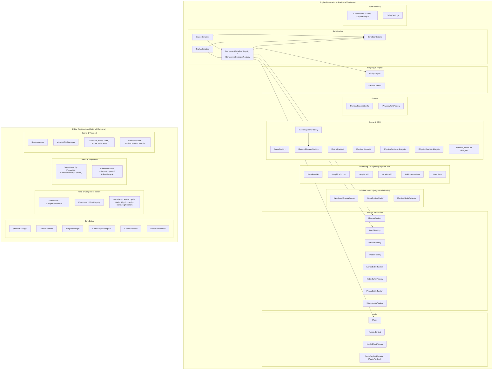
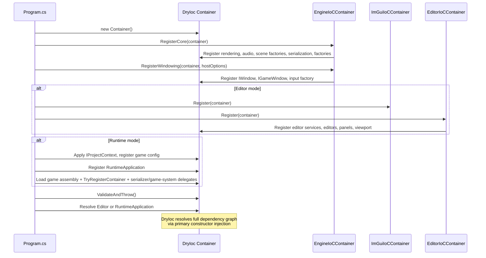

# Dependency Injection

DryIoc container with primary constructor injection. Engine services register in two stages (`RegisterCore`, then `RegisterWindowing`); the editor adds a third layer on top. `EngineIoCContainer` and `EditorIoCContainer` are the only static registration entry points in their respective projects. Nearly all services are singletons.

## Component Diagram


```mermaid
graph TD
    subgraph "Engine Registrations (EngineIoCContainer)"
        subgraph "Window & Input (RegisterWindowing)"
            WIN[IWindow / IGameWindow]
            ISF[IInputSystemFactory]
            CSP[IContentScaleProvider]
        end

        subgraph "Rendering & Graphics (RegisterCore)"
            RAPI[IRendererAPI]
            GCTX[IGraphicsContext]
            G2D[IGraphics2D]
            G3D[IGraphics3D]
            HDR[HdrTonemapPass]
            BLOOM[BloomPass]
        end

        subgraph "Audio"
            AL[AL / ALContext]
            AE[IAudio]
            AEF[IAudioEffectFactory]
            APS[AudioPlaybackService / IAudioPlayback]
        end

        subgraph "Scene & ECS"
            SF[SceneFactory]
            SSF[ISceneSystemsFactory]
            SMF[ISystemManagerFactory]
            SC[ISceneContext]
            CTX[IContext delegate]
            PC[IPhysicsContacts delegate]
            PQ[IPhysicsQueries delegate]
            PQ3[IPhysicsQueries3D delegate]
        end

        subgraph "Physics"
            PBC[IPhysicsBackendConfig]
            PWF[IPhysicsWorldFactory]
        end

        subgraph "Scripting & Project"
            SE[IScriptEngine]
            PCtx[IProjectContext]
        end

        subgraph "Serialization"
            SO[SerializerOptions]
            CSR[ComponentSerializerRegistry / IComponentSerializerRegistry]
            PSR[IPrefabSerializer]
            SSE[ISceneSerializer]
        end

        subgraph "Resource Factories"
            TF[ITextureFactory]
            SHF[IShaderFactory]
            MSF[IMeshFactory]
            MDF[IModelFactory]
            VBF[IVertexBufferFactory]
            IBF[IIndexBufferFactory]
            FBF[IFrameBufferFactory]
            VAF[IVertexArrayFactory]
        end

        subgraph "Input & Debug"
            KIS[KeyboardInputState / IKeyboardInput]
            DS[DebugSettings]
        end
    end

    subgraph "Editor Registrations (EditorIoCContainer)"
        subgraph "Core Editor"
            SM[ShortcutManager]
            ES[IEditorSelection]
            PM[IProjectManager]
            GSW[GameScriptWorkspace]
            GP[IGamePublisher]
            EP[IEditorPreferences]
        end

        subgraph "Field & Component Editors"
            FE[Field editors + UIPropertyRenderer]
            CER[IComponentEditorRegistry]
            CE["Transform, Camera, Sprite, Model, Physics, Audio, Script, Light editors"]
        end

        subgraph "Panels & Application"
            PAN[SceneHierarchy, Properties, ContentBrowser, Console, ...]
            EMB[EditorMenuBar / EditorDockspace / EditorLifecycle]
        end

        subgraph "Scene & Viewport"
            SMG[SceneManager]
            VTM[ViewportToolManager]
            VT["Selection, Move, Scale, Rotate, Ruler tools"]
            EV[IEditorViewport / IEditorCameraController]
        end
    end

    SSE --> CSR
    PSR --> CSR
    CSR --> SE
    CSR --> TF
    CSR --> MSF
    CSR --> AE
    SSE --> SO
    PSR --> SO
    CSR --> SO
    SSF --> SMF
```

## Engine Registrations

**File:** `Engine/Core/DI/EngineIoCContainer.cs`

Registration splits into `RegisterCore(Container)` (runtime services) and `RegisterWindowing(Container, EngineHostOptions)` (window title/size and input). Window options come from `EngineHostOptions` (`Engine/Core/DI/EngineHostOptions.cs`); the editor uses `EngineHostOptions.EditorDefaults`.

### Window & Input (`RegisterWindowing`)

| Service | Implementation | Lifetime | Notes |
|---------|---------------|----------|-------|
| `IWindow` | `Silk.NET.Windowing.Window.Create(windowOptions)` | Singleton | `preventDisposal: true`; size/title from `EngineHostOptions` |
| `IGameWindowFactory` | `GameWindowFactory` | Singleton | Creates `IGameWindow` |
| `IGameWindow` | Via `IGameWindowFactory.Create()` | Default | Factory-resolved |
| `IContentScaleProvider` | Delegate to `IGameWindow` | Default | HiDPI support |
| `IInputSystemFactory` | `InputSystemFactory` | Singleton | Creates input systems |

### Rendering & Graphics (`RegisterCore`)

| Service | Implementation | Lifetime | Notes |
|---------|---------------|----------|-------|
| `IRendererApiConfig` | `RendererApiConfig(ApiType.SilkNet)` | Singleton | Hardcoded to Silk.NET |
| `IRendererAPI` | Via `IRendererApiFactory.Create()` | Singleton | Factory-resolved |
| `IGraphicsContext` | `SilkNetGraphicsContext` | Singleton | OpenGL context wrapper |
| `IGraphics2D` | `Graphics2D` | Singleton | 2D rendering API |
| `IGraphics3D` | `Graphics3D` | Singleton | 3D rendering API |
| `HdrTonemapPass` | `HdrTonemapPass` | Singleton | HDR → LDR tonemapping pass |
| `BloomPass` | `BloomPass` | Singleton | Bright extract + Gaussian blur |
| `FxaaPass` | `FxaaPass` | Singleton | Fast approximate AA after tonemap |

### Global Services (`RegisterCore`)

| Service | Implementation | Lifetime | Notes |
|---------|---------------|----------|-------|
| `IScriptEngine` | `ScriptEngine` | Singleton | Load/unload game assembly ALC, type index, script instance factory |
| `IProjectContext` | `ProjectContext` | Singleton | Initializer wires `PathBuilder.UseProjectContext` |
| `KeyboardInputState` | `KeyboardInputState` | Singleton | Also mapped as `IKeyboardInput` |
| `DebugSettings` | `DebugSettings` | Singleton | Runtime debug toggles |

### Audio (`RegisterCore`)

| Service | Implementation | Lifetime | Notes |
|---------|---------------|----------|-------|
| `AL` | `AL.GetApi(true)` | Singleton | OpenAL function delegates |
| `ALContext` | `ALContext.GetApi(true)` | Singleton | OpenAL context delegates |
| `IAudio` | `OpenALAudioEngine` | Singleton | Audio playback engine |
| `IAudioEffectFactory` | `OpenALAudioEffectFactory` | Singleton | Audio effect creation |
| `AudioPlaybackService` | `AudioPlaybackService` | Singleton | Also mapped as `IAudioPlayback` |

### Scene & ECS (`RegisterCore`)

ECS systems are **not** registered individually in DI. `ISceneSystemsFactory` builds the per-scene system set; `ISystemManagerFactory` wraps it for `SystemManager` creation.

| Service | Implementation | Lifetime | Notes |
|---------|---------------|----------|-------|
| `SceneFactory` | `SceneFactory` | Singleton | Creates `Scene` instances |
| `ISceneSystemsFactory` | `SceneSystemsFactory` | Singleton | Factory for scene-bound systems |
| `ISystemManagerFactory` | `SystemManagerFactory` | Singleton | Creates `SystemManager` from scene systems |
| `ISceneContext` | `SceneContext` | Singleton | Active scene reference |
| `IContext` | Delegate from `ISceneContext.ActiveScene.Context` | Default | Throws if no active scene |
| `IPhysicsContacts` | Delegate from active scene, else `NullPhysicsContacts` | Default | Per-scene contact queue access |
| `IPhysicsQueries` | Delegate from active scene, else `NullPhysicsQueries` | Default | Per-scene physics ray/overlap queries |
| `IPhysicsQueries3D` | Delegate from active scene, else `NullPhysicsQueries3D` | Default | Per-scene 3D ray/overlap queries |

### Physics (`RegisterCore`)

| Service | Implementation | Lifetime | Notes |
|---------|---------------|----------|-------|
| `IPhysicsBackendConfig` | `PhysicsBackendConfig(Box2D, Bepu)` | Singleton | 2D + 3D backend selection (`Type`, `Type3D`) |
| `IPhysicsWorldFactory` | `PhysicsWorldFactory` | Singleton | Creates per-scene 2D (`Create`) and 3D (`Create3D`) worlds |

### Serialization (`RegisterCore`)

| Service | Implementation | Lifetime | Notes |
|---------|---------------|----------|-------|
| `SerializerOptions` | `SerializerOptions` | Singleton | Custom Vector/Rectangle/Enum converters |
| `IComponentSerializerRegistry` | `ComponentSerializerRegistry` | Singleton | Polymorphic component dispatch |
| `IPrefabSerializer` | `PrefabSerializer` | Singleton | Prefab save/load |
| `ISceneSerializer` | `SceneSerializer` | Singleton | Scene save/load |

### Resource Factories (`RegisterCore`)

All registered as singletons. Manage caching and GPU resource lifecycles.

| Service | Implementation |
|---------|---------------|
| `IRendererApiFactory` | `RendererApiFactory` |
| `ITextureFactory` | `TextureFactory` |
| `IShaderFactory` | `ShaderFactory` |
| `IMeshFactory` | `MeshFactory` |
| `IModelFactory` | `ModelFactory` |
| `IVertexBufferFactory` | `VertexBufferFactory` |
| `IIndexBufferFactory` | `IndexBufferFactory` |
| `IFrameBufferFactory` | `FrameBufferFactory` |
| `IVertexArrayFactory` | `VertexArrayFactory` |

## Editor Registrations

**File:** `Editor/DI/EditorIoCContainer.cs`

Only loaded by the Editor project, not by Runtime. Calls `EngineIoCContainer.RegisterCore` and `RegisterWindowing` first (see `Editor/Program.cs`).

### Core Editor Services

| Service | Implementation | Lifetime | Notes |
|---------|---------------|----------|-------|
| `ShortcutManager` | `ShortcutManager` | Singleton | Keyboard shortcut handling |
| `IEditorSelection` | `EditorSelection` | Singleton | Selected entity tracking |
| `IProjectManager` | `ProjectManager` | Singleton | Project open/create/save |
| `GameScriptWorkspace` | `GameScriptWorkspace` | Singleton | Script compile orchestration, file CRUD, serializer/DI apply |
| `IGameProjectScriptBootstrapper` | `GameProjectScriptBootstrapper` | Singleton | Game project script setup |
| `IGamePublisher` | `GamePublisher` | Singleton | Build & publish games |
| `PublishSettingsUI` | `PublishSettingsUI` | Singleton | Publish settings panel |
| `IEditorPreferences` | `EditorPreferences` | Singleton | Factory init via `EditorPreferences.Load()` |
| `EditorSettingsUI` | `EditorSettingsUI` | Singleton | Settings panel |
| `AudioDropTarget` | `AudioDropTarget` | Singleton | Drag-drop audio into scene |
| `PerformanceMonitorPanel` | `PerformanceMonitorPanel` | Singleton | FPS / frame time stats |

### Field Editors

All singletons via `RegisterMany`. Used by the script inspector for reflected field editing:

`IntFieldEditor`, `FloatFieldEditor`, `DoubleFieldEditor`, `BoolFieldEditor`, `StringFieldEditor`, `Vector2FieldEditor`, `Vector3FieldEditor`, `Vector4FieldEditor`, plus `UIPropertyRenderer`.

### Component Editors

All singletons via `RegisterMany`. Registration order matches properties panel draw order:

- `TransformComponentEditor`, `CameraComponentEditor`, `SpriteRendererComponentEditor`
- `ModelRendererComponentEditor`, `RigidBody2DComponentEditor`, `BoxCollider2DComponentEditor`, `CircleCollider2DComponentEditor`, `EdgeCollider2DComponentEditor`
- `SubTextureRendererComponentEditor`, `AudioSourceComponentEditor`, `AudioListenerComponentEditor`
- `GameComponentEditor`, `ScriptComponentEditor`
- `AmbientLightComponentEditor`, `DirectionalLightComponentEditor`

Resolved through `IComponentEditorRegistry` → `ComponentEditorRegistry`.

### Panels

Panel draw order (via `RegisterMany` on concrete panel types):

| Registration | Lifetime | Notes |
|--------------|----------|-------|
| `SceneHierarchyPanel` | Singleton | |
| `PropertiesPanel` | Singleton | |
| `ContentBrowserPanel` | Singleton | |
| `ContentBrowserActions` | Singleton | Separate from panel |
| `ConsolePanel` | Singleton | |
| `RecentProjectsPanel` | Singleton | |
| `KeyboardShortcutsPanel` | Singleton | |
| `RendererStatsPanel` | Singleton | |

Application types: `EditorMenuBar`, `EditorDockspace`, `EditorInputHandler`, `EditorShortcutRegistrar`, `EditorLifecycle`, `EditorPanels`.

### Scene & Viewport

| Service | Implementation | Lifetime | Notes |
|---------|---------------|----------|-------|
| `SceneManager` | `RegisterMany` | Singleton | Implements multiple scene/editor interfaces |
| `IViewportScaleHelper` | `ViewportScaleHelper` | Singleton | HiDPI coordinate mapping |
| `ViewportRuler` | `ViewportRuler` | Singleton | Ruler overlay |
| `ViewportGrid` | `ViewportGrid` | Singleton | 2D grid overlay |
| `ViewportGrid3D` | `ViewportGrid3D` | Singleton | 3D grid overlay |
| `ViewportToolManager` | `ViewportToolManager` | Singleton | Active tool management |
| `SelectionTool` | `SelectionTool` | Singleton | Entity picking |
| `MoveTool` | `MoveTool` | Singleton | Translate gizmo |
| `ScaleTool` | `ScaleTool` | Singleton | Scale gizmo |
| `RotateTool` | `RotateTool` | Singleton | Rotate gizmo |
| `RulerTool` | `RulerTool` | Singleton | Measurement tool |
| `IEditorCameraController` | `EditorCameraController` | Singleton | Editor fly camera |
| `IEditorViewport` | `EditorViewport` | Singleton | Main scene viewport |
| `ViewportComponents` | `ViewportComponents` | Singleton | Viewport UI composition |

### Other

| Service | Implementation | Lifetime | Notes |
|---------|---------------|----------|-------|
| `IEntityContextMenu` | `EntityContextMenu` | Singleton | |
| `PrefabDropTarget` | `PrefabDropTarget` | Singleton | |
| `IPrefabManager` | `PrefabManager` | Singleton | |
| `IGameComponentFactory` | `GameComponentFactory` | Singleton | |
| `Features.Components.GameComponentEditor` | `Features.Components.GameComponentEditor` | Singleton | Game-component authoring UI (distinct from `ComponentEditors.GameComponentEditor`) |
| `NewProjectPopup` | `NewProjectPopup` | Singleton | |
| `SceneSettingsPopup` | `SceneSettingsPopup` | Singleton | |
| `SceneToolbar` | `SceneToolbar` | Singleton | |
| `ILayer` | `EditorLayer` | Singleton | |
| `Editor` | `Editor` | Singleton | |

### Game Assembly DI Extension

The editor registers delegates for hot-reloadable game assembly types:

| Delegate | Purpose |
|----------|---------|
| `Func<Assembly, bool>` | `GameAssemblyContainerRegistration.TryRegisterContainer` — registers `[Register]` types from game DLL |
| `Action<Assembly>` | `GameAssemblyContainerRegistration.UnregisterRegistrationsFromGameAssembly` — cleanup on unload |
| `Func<IEnumerable<IGameSystem>>` | Resolves all `IGameSystem` instances from the container |

Runtime performs a one-shot game assembly registration in `Runtime/Program.cs` after loading the published game DLL. That path also calls `IComponentSerializerRegistry.RegisterFromAssembly`, registers `Func<IEnumerable<IGameSystem>>`, and falls back to `ILayer` → `GameLayer` when the assembly does not supply one.

## Service Lifetimes

| Lifetime | Usage | Examples |
|----------|-------|----------|
| Singleton | Most services — shared across entire application lifetime | `IScriptEngine`, all factories, `ISceneSystemsFactory`, all editors |
| Default (Transient) | Factory-created services where DryIoc resolves once at startup | `IGameWindow`, `IContentScaleProvider` |
| Scene delegate | Resolved from `ISceneContext.ActiveScene` at resolve time | `IContext`, `IPhysicsContacts`, `IPhysicsQueries`, `IPhysicsQueries3D` |
| Per-scene (not DI singletons) | Created by `ISceneSystemsFactory` per scene | Individual `ISystem` implementations (e.g. physics simulation) |

## Registration Flow


```mermaid
sequenceDiagram
    participant Main as Program.cs
    participant C as DryIoc Container
    participant EIC as EngineIoCContainer
    participant IMG as ImGuiIoCContainer
    participant EDIC as EditorIoCContainer

    Main->>C: new Container()
    Main->>EIC: RegisterCore(container)
    EIC->>C: Register rendering, audio, scene factories, serialization, factories
    Main->>EIC: RegisterWindowing(container, hostOptions)
    EIC->>C: Register IWindow, IGameWindow, input factory

    alt Editor mode
        Main->>IMG: Register(container)
        Main->>EDIC: Register(container)
        EDIC->>C: Register editor services, editors, panels, viewport
    end

    alt Runtime mode
        Main->>C: Apply IProjectContext, register game config
        Main->>C: Register RuntimeApplication
        Main->>C: Load game assembly + TryRegisterContainer + serializer/game-system delegates
    end

    Main->>C: ValidateAndThrow()
    Main->>C: Resolve Editor or RuntimeApplication
    Note over C: DryIoc resolves full dependency graph<br/>via primary constructor injection
```

## Factory Pattern

Resource creation is always mediated by DI-managed factories:

```mermaid
graph LR
    Component["SpriteRendererComponent<br/>(stores TexturePath string)"]
    System["SpriteRenderingSystem"]
    Factory["ITextureFactory<br/>(Singleton, caches textures)"]
    GPU["GPU Resource<br/>(Texture2D)"]

    System -->|reads TexturePath from| Component
    System -->|calls Create(path)| Factory
    Factory -->|cache hit: returns existing| GPU
    Factory -->|cache miss: creates new| GPU
```

- Components store **paths** (strings), not resource instances
- Systems resolve resources at runtime via factories
- Factories cache resources and manage their disposal
- Components remain data-only, serializable, and free of GPU dependencies

## Primary Constructor Pattern

All DI-consuming classes use C# 12 primary constructors. No traditional constructors, no null checks.

```csharp
internal sealed class SpriteRenderingSystem(
    IGraphics2D graphics2D,
    IPrimaryCameraProvider cameraProvider,
    IContext context) : ISystem
{
    public void OnUpdate(TimeSpan deltaTime)
    {
        // graphics2D, cameraProvider, context available as constructor parameters
    }
}
```

DryIoc resolves the full dependency graph at `Resolve<>()` time. If a dependency is missing, DryIoc throws at startup — fail-fast behavior eliminates the need for runtime null checks.

## Key Files

| File | Purpose |
|------|---------|
| `Engine/Core/DI/EngineIoCContainer.cs` | Core runtime DI registrations (`RegisterCore`, `RegisterWindowing`) |
| `Engine/Core/DI/EngineHostOptions.cs` | Window title/size defaults for `RegisterWindowing` |
| `Editor/DI/EditorIoCContainer.cs` | Editor-only DI registrations |
| `Editor/Program.cs` | Container creation, engine + ImGui + editor registration, `ValidateAndThrow` |
| `Runtime/Program.cs` | Container creation, engine registration, game assembly DI extension |
