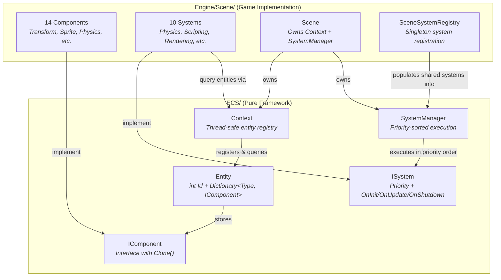
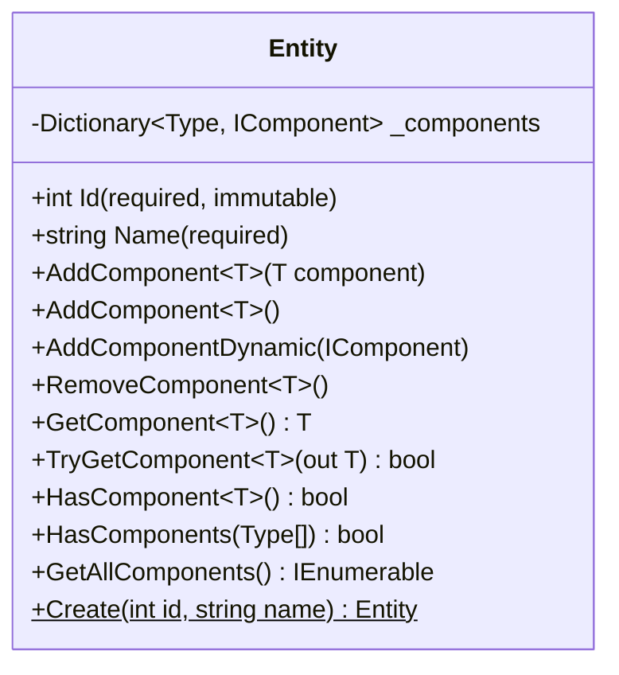
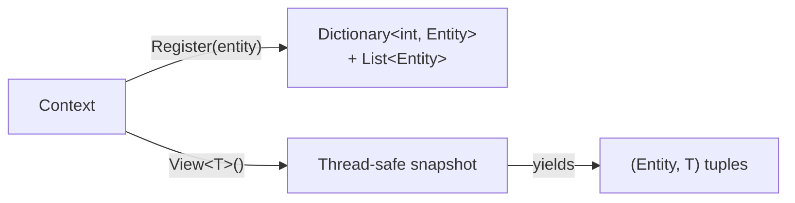
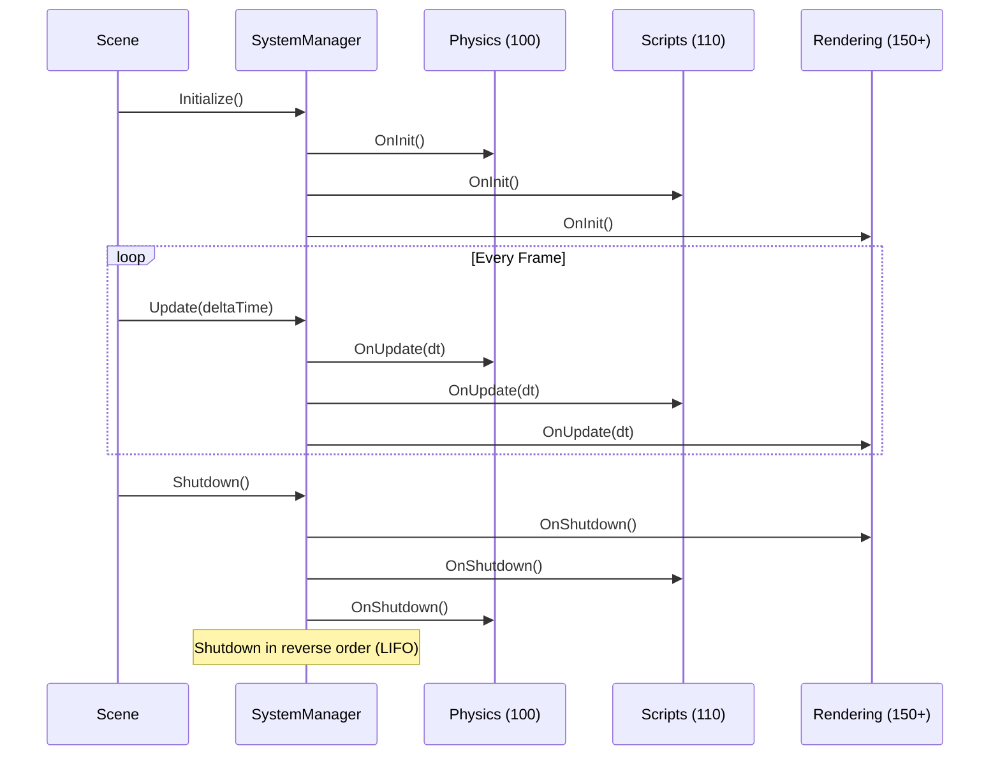

# ECS Architecture

The engine uses a custom Entity-Component-System framework. The `ECS/` project provides the pure framework (no engine dependencies), while `Engine/Scene/` implements game-specific components and systems.

---

## C4 Level 3 — Component Diagram



---

## Entity

**File**: `ECS/Entity.cs`

An entity is a lightweight identifier with a component dictionary. Entities are created via a static factory method and compared by ID only.



- **Storage**: `Dictionary<Type, IComponent>` — one component per type per entity
- **Equality**: Based solely on `Id` — stable in collections regardless of name changes
- **Validation**: `AddComponent` throws if a component of that type already exists
- **Cloning**: `DuplicateEntity()` in Scene walks the hierarchy and calls `Clone()` on every component in the duplicated subtree

---

## Components

All components implement `IComponent` (defined in `ECS/Component.cs`), which requires a `Clone()` method for entity duplication.

**Design rule**: Components are data-only. Matrix calculations (e.g., `TransformComponent.GetTransform()` with dirty-flag caching) are allowed, but game logic belongs in Systems.

### Component Types

| Component | File | Purpose |
|-----------|------|---------|
| **TransformComponent** | `Engine/Scene/Components/` | Local position, rotation, scale; cached local matrix; optional parent id; cached world matrix |
| **SpriteRendererComponent** | | Color, texture path, tiling factor for 2D sprite rendering |
| **SubTextureRendererComponent** | | Sprite atlas region: coords, cell size, UV coordinates |
| **CameraComponent** | | Wraps SceneCamera (orthographic/perspective), `Primary` flag |
| **RigidBody2DComponent** | | Box2D body type (Static/Dynamic/Kinematic), `RuntimeBody` (runtime-only) |
| **BoxCollider2DComponent** | | Collision shape: size, offset, density, friction, restitution, trigger flag |
| **AnimationComponent** | | Animation state: asset path, current clip, frame tracking, playback speed |
| **AudioSourceComponent** | | Audio clip path, volume, pitch, loop, 3D spatial settings |
| **AudioListenerComponent** | | Marks entity as the audio listener (typically on camera entity) |
| **MeshComponent** | | 3D mesh reference by path |
| **ModelRendererComponent** | | 3D rendering settings: color, override texture, shadow flags |
| **NativeScriptComponent** | | Script type name (persisted) + `ScriptableEntity` instance (runtime-only) |
| **TagComponent** | | String tag for entity identification |
| **IdComponent** | | Unique long ID for serialization cross-references |

Components with runtime-only fields use `[JsonIgnore]` to exclude them from serialization (e.g., `RigidBody2DComponent.RuntimeBody`, `NativeScriptComponent.ScriptableEntity`, `AnimationComponent.IsPlaying`).

### Entity hierarchy

Entities with a `TransformComponent` may form a parent/child hierarchy.

- `TransformComponent.ParentId` stores the parent's entity id, or `null` for a root. `ChildIds` is derived after load from all entities' `ParentId` values and is not written to scene JSON (`[JsonIgnore]` on the property).
- Use `IScene.SetParent(child, parent)` with `parent` null to unparent. This updates both the child's `ParentId` and the parent's `ChildIds`, rejects cycles, and marks world transforms dirty on the affected subtree.
- Child TRS values are **local to the parent**. For world-space matrices (rendering, initial Box2D body pose at `OnRuntimeStart`), use `entity.GetWorldTransform(context)` from `Engine/Scene/SceneHierarchyExtensions.cs`. Local space remains available via `TransformComponent.GetTransform()`.
- `DestroyEntity` removes the entity and all descendants. `DuplicateEntity` clones the entire subtree under the duplicated root with new ids and rewired hierarchy.
- **Known limitation (V1):** after runtime starts, Box2D owns body transforms; reparenting an entity with a rigid body does not update the physics world until you restart play mode. Prefer keeping simulated bodies at the scene root when possible.

---

## Context (Entity Registry)

**File**: `ECS/Context.cs`

The Context is a thread-safe entity registry that stores entities and provides single-component-type queries.



### Storage

- `Dictionary<int, Entity>` — O(1) lookup by ID
- `List<Entity>` — efficient iteration
- `Lock` object — thread-safe access for all operations

### View Queries

```csharp
public IEnumerable<(Entity Entity, TComponent Component)> View<TComponent>()
    where TComponent : IComponent
```

- **Single-component filtering** — no archetype/signature queries
- **Snapshot isolation** — takes a thread-safe copy of the entity list before iterating
- **Lazy evaluation** — returns `IEnumerable` for deferred execution
- **Returns references** — modifications to yielded components affect the originals

Systems that need multiple component types issue separate `View<T>()` calls and cross-reference entities:

```csharp
// SpriteRenderingSystem needs both Transform and SpriteRenderer
foreach (var (entity, sprite) in context.View<SpriteRendererComponent>())
{
    if (entity.TryGetComponent<TransformComponent>(out var transform))
    {
        renderer.DrawSprite(transform, sprite);
    }
}
```

---

## Systems

### ISystem Interface

**File**: `ECS/Systems/ISystem.cs`

```csharp
public interface ISystem
{
    int Priority { get; }                    // Execution order (ascending)
    void OnInit();                           // Called once on scene start
    void OnUpdate(TimeSpan deltaTime);       // Called every frame
    void OnShutdown();                       // Called on scene stop
}
```

### SystemManager

**File**: `ECS/Systems/SystemManager.cs`

The SystemManager maintains a priority-sorted list of systems and executes them sequentially each frame.



- **Registration**: `RegisterSystem(system, isShared)` adds to list and re-sorts by Priority
- **Update**: Iterates all systems in ascending priority order
- **Shutdown**: Calls `OnShutdown()` in reverse order, skipping shared systems
- **Dispose**: Only disposes `IDisposable` per-scene systems

### Shared vs Per-Scene Systems

| Lifetime | Systems | Managed By |
|----------|---------|------------|
| **Shared (singleton)** | ScriptUpdate, PrimaryCamera, SpriteRendering, SubTextureRendering, ModelRendering, PhysicsDebugRender, Audio, Animation | `SceneSystemRegistry` — registered with `isShared: true`, survive scene changes |
| **Per-scene** | PhysicsSimulation | Created fresh per scene with its own Box2D `World`, disposed on scene unload |

`SceneSystemRegistry` (`Engine/Scene/SceneSystemRegistry.cs`) populates the SystemManager with all shared singleton systems when a new scene initializes.

### System Execution Order

| Priority | System | Responsibility |
|----------|--------|---------------|
| 100 | PhysicsSimulationSystem | Fixed-timestep Box2D stepping, syncs physics bodies → TransformComponent |
| 110 | ScriptUpdateSystem | Hot-reload detection, script OnUpdate calls |
| 120 | AudioSystem | Audio listener position, source playback |
| 130 | *(TileMapRenderSystem)* | *(Reserved, not yet implemented)* |
| 140 | AnimationSystem | Advances animation frames, updates SubTexture UV coords |
| 145 | PrimaryCameraSystem | Finds entity with `CameraComponent { Primary = true }`, caches for renderers |
| 150 | SpriteRenderingSystem | Renders all SpriteRendererComponent entities |
| 160 | SubTextureRenderingSystem | Renders all SubTextureRendererComponent entities |
| 170 | ModelRenderingSystem | Renders all MeshComponent + ModelRendererComponent entities |
| 180 | PhysicsDebugRenderSystem | Wireframe collider visualization (color-coded by body type) |

The ordering ensures: **physics runs first** → **scripts see updated positions** → **animation updates visuals** → **camera is resolved** → **rendering reads final state**.

---

## Data Flow Between Systems

```mermaid
graph LR
    Physics["PhysicsSimulation<br/>(100)"]
    Scripts["ScriptUpdate<br/>(110)"]
    Audio["Audio<br/>(120)"]
    Animation["Animation<br/>(140)"]
    Camera["PrimaryCamera<br/>(145)"]
    Render["Sprite/SubTexture/Model<br/>Rendering (150-170)"]
    Debug["PhysicsDebug<br/>(180)"]

    Physics -->|"updates TransformComponent"| Scripts
    Scripts -->|"may modify any component"| Audio
    Audio --> Animation
    Animation -->|"updates SubTexture UVs"| Camera
    Camera -->|"provides camera + transform"| Render
    Render --> Debug
```



Each system reads/writes components on entities via the shared `Context`. Systems communicate through three mechanisms:

1. **Shared component state** (primary) — systems write components that downstream systems read in the same frame, ordered by priority
2. **EventBus** — global pub/sub for decoupled notifications (e.g., `AnimationCompleteEvent`, `AnimationFrameEvent`)
3. **Shared service interfaces** — DI-injected services like `IPrimaryCameraProvider` allow systems to expose computed state without direct coupling
