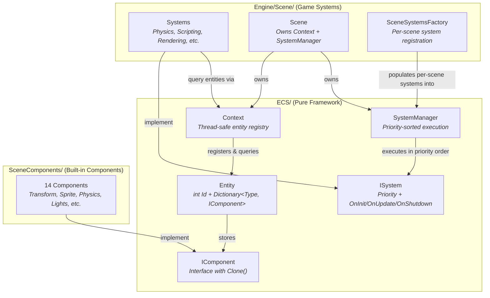
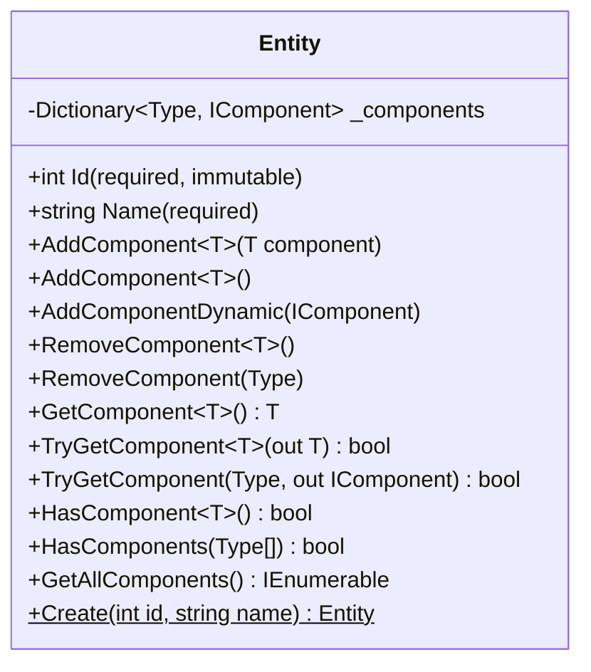
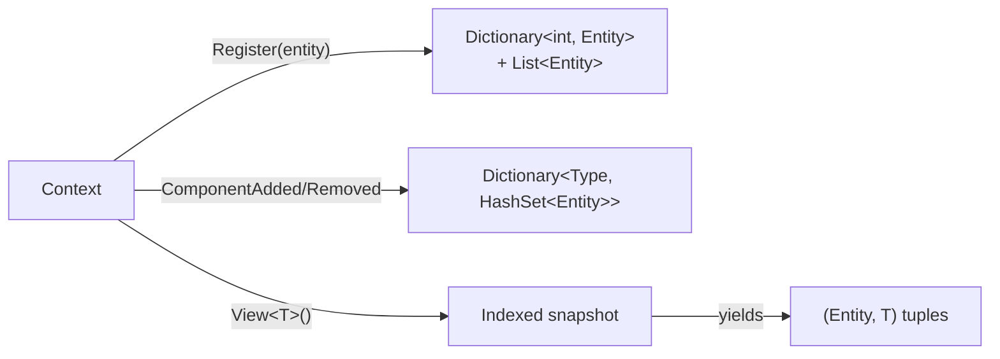
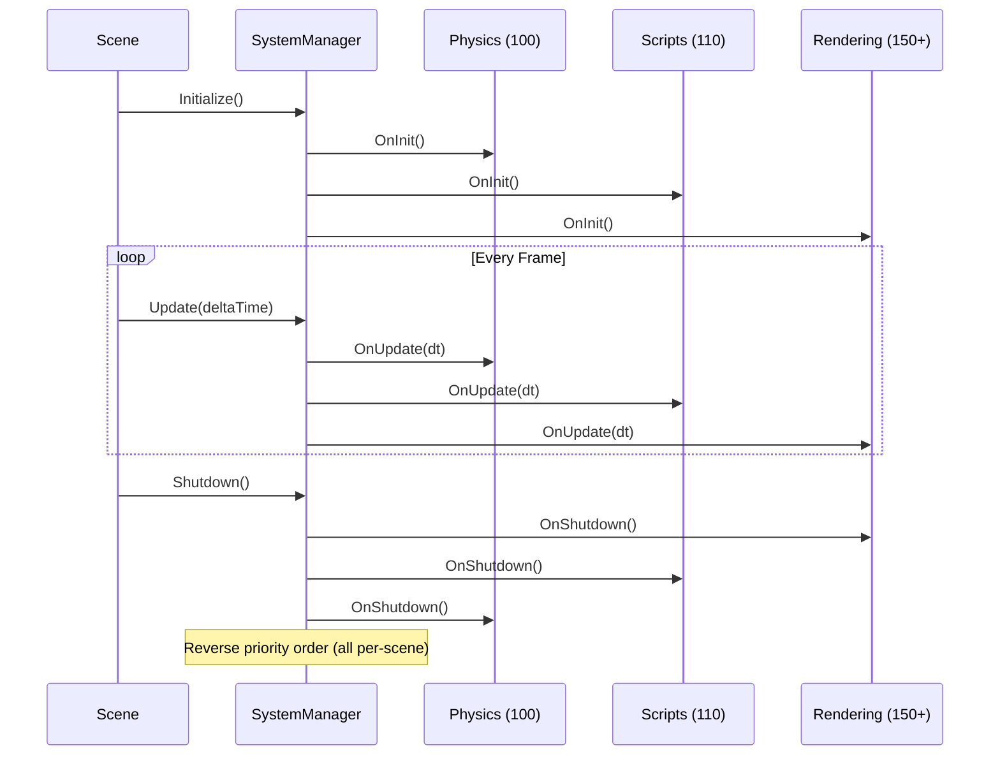
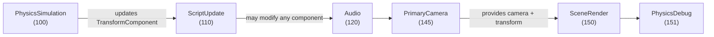

# ECS Architecture

The engine uses a custom Entity-Component-System framework. The `ECS/` project provides the pure framework (no engine dependencies). Built-in game components live in the `SceneComponents/` project; system implementations that query them live in `Engine/Scene/Systems/`.

---

## C4 Level 3 — Component Diagram


```mermaid
graph TB
    subgraph "ECS/ (Pure Framework)"
        Entity["Entity<br/><i>int Id + Dictionary&lt;Type, IComponent&gt;</i>"]
        IComponent["IComponent<br/><i>Interface with Clone()</i>"]
        Context["Context<br/><i>Thread-safe entity registry</i>"]
        ISystem["ISystem<br/><i>Priority + OnInit/OnUpdate/OnShutdown</i>"]
        SystemManager["SystemManager<br/><i>Priority-sorted execution</i>"]
    end

    subgraph "SceneComponents/ (Built-in Components)"
        Components["14 Components<br/><i>Transform, Sprite, Physics, Lights, etc.</i>"]
    end

    subgraph "Engine/Scene/ (Game Systems)"
        Systems["Systems<br/><i>Physics, Scripting, Rendering, etc.</i>"]
        Scene["Scene<br/><i>Owns Context + SystemManager</i>"]
        SceneSystemsFactory["SceneSystemsFactory<br/><i>Per-scene system registration</i>"]
    end

    Entity -->|stores| IComponent
    Context -->|registers & queries| Entity
    SystemManager -->|executes in priority order| ISystem
    Scene -->|owns| Context
    Scene -->|owns| SystemManager
    SceneSystemsFactory -->|populates per-scene systems into| SystemManager
    Components -->|implement| IComponent
    Systems -->|implement| ISystem
    Systems -->|query entities via| Context
```

---

## Entity

**File**: `ECS/Entity.cs`

An entity is a lightweight identifier with a component dictionary. Entities are created via a static factory method and compared by ID only.


```mermaid
classDiagram
    class Entity {
        +int Id (required, immutable)
        +string Name (required)
        -Dictionary~Type, IComponent~ _components
        +AddComponent~T~(T component)
        +AddComponent~T~()
        +AddComponentDynamic(IComponent)
        +RemoveComponent~T~()
        +RemoveComponent(Type)
        +GetComponent~T~() T
        +TryGetComponent~T~(out T) bool
        +TryGetComponent(Type, out IComponent) bool
        +HasComponent~T~() bool
        +HasComponents(Type[]) bool
        +GetAllComponents() IEnumerable
        +Create(int id, string name)$ Entity
    }
```

- **Storage**: `Dictionary<Type, IComponent>` — one component per type per entity
- **Equality**: Based solely on `Id` — stable in collections regardless of name changes
- **Validation**: `AddComponent` throws if a component of that type already exists
- **Hooks**: Internal `ComponentAdded` / `ComponentRemoved` callbacks wire entities into `Context` component indexing on register
- **Cloning**: `DuplicateEntity()` in Scene calls `Clone()` on every component

---

## Components

All components implement `IComponent` (defined in `ECS/Component.cs`), which requires a `Clone()` method for entity duplication. Custom script components may implement `IGameComponent` (`ECS/IGameComponent.cs`), a marker interface extending `IComponent`.

**Design rule**: Components are data-only. Matrix calculations (e.g., `TransformComponent.GetTransform()` with dirty-flag caching) are allowed, but game logic belongs in Systems.

Serialization uses `[SerializableComponentAttribute]` (`ECS/SerializableComponentAttribute.cs`) to control persisted component type names.

### Component Types

| Component | File | Purpose |
|-----------|------|---------|
| **IdComponent** | `SceneComponents/IDComponent.cs` | Unique long ID for serialization cross-references |
| **TagComponent** | `SceneComponents/TagComponent.cs` | String tag for entity identification |
| **TransformComponent** | `SceneComponents/TransformComponent.cs` | Position, rotation, scale with cached transform matrix (dirty flag) |
| **SpriteRendererComponent** | `SceneComponents/Rendering/SpriteRendererComponent.cs` | Color, texture path, tiling factor for 2D sprite rendering |
| **SubTextureRendererComponent** | `SceneComponents/Rendering/SubTextureRendererComponent.cs` | Sprite atlas region: texture path, coords, cell/sprite size, optional precomputed UVs |
| **ModelRendererComponent** | `SceneComponents/Rendering/ModelRendererComponent.cs` | `ModelPath` for imported meshes; `Color` tint; optional `MetallicOverride` / `RoughnessOverride` (unit-cube fallback when path is empty) |
| **CameraComponent** | `SceneComponents/Camera/CameraComponent.cs` | Orthographic/perspective projection settings, `Primary` and `FixedAspectRatio` flags |
| **AmbientLightComponent** | `SceneComponents/Lighting/AmbientLightComponent.cs` | Scene-wide ambient light color and strength |
| **DirectionalLightComponent** | `SceneComponents/Lighting/DirectionalLightComponent.cs` | Directional light direction and color |
| **RigidBody2DComponent** | `SceneComponents/Physics/RigidBody2DComponent.cs` | Body type (Static/Dynamic/Kinematic), velocity, gravity scale, `FixedRotation` |
| **BoxCollider2DComponent** | `SceneComponents/Physics/BoxCollider2DComponent.cs` | Collision shape: size, offset, density, friction, restitution, trigger flag |
| **NativeScriptComponent** | `SceneComponents/NativeScriptComponent.cs` | Persisted script type name (`ScriptTypeName`) for runtime instantiation |
| **AudioSourceComponent** | `SceneComponents/Audio/AudioSourceComponent.cs` | Audio clip path, volume, pitch, loop, 3D spatial settings, effects |
| **AudioListenerComponent** | `SceneComponents/Audio/AudioListenerComponent.cs` | Active flag marking the scene audio listener |

Components with runtime-only fields use `[JsonIgnore]` to exclude them from serialization (e.g., `CameraComponent.CameraViewTransform`, `BoxCollider2DComponent.IsDirty`).

### ComponentAccessor

**File**: `ECS/IComponentAccessor.cs`

`IComponentAccessor` / `ComponentAccessor` provide a thin proxy for reading and mutating components on a bound `Entity`. Used where code needs component access without holding the entity directly (e.g., script glue).

---

## Context (Entity Registry)

**File**: `ECS/Context.cs`

The Context is a thread-safe entity registry with a per-component-type index for efficient queries.


```mermaid
graph LR
    Context -->|"Register(entity)"| Storage["Dictionary&lt;int, Entity&gt;<br/>+ List&lt;Entity&gt;"]
    Context -->|"ComponentAdded/Removed"| Index["Dictionary&lt;Type, HashSet&lt;Entity&gt;&gt;"]
    Context -->|"View&lt;T&gt;()"| Snapshot["Indexed snapshot"]
    Snapshot -->|yields| Tuples["(Entity, T) tuples"]
```

### Storage and Lookup

- `Dictionary<int, Entity>` — O(1) lookup by ID
- `List<Entity>` — efficient iteration in insertion order
- `Dictionary<Type, HashSet<Entity>>` — component-type index maintained via entity hooks
- `Lock _lock` — thread-safe access for all operations
- `Register`, `Remove`, `Clear`, `Contains`, `GetById`, `GetByName`, `Entities`

### View Queries

```csharp
public IEnumerable<(Entity Entity, TComponent Component)> View<TComponent>()
    where TComponent : IComponent

public IEnumerable<(Entity Entity, T1 Component1, T2 Component2)> View<T1, T2>()
    where T1 : IComponent where T2 : IComponent
```

- **Indexed filtering** — `View<T>()` iterates only entities with `T` (O(matches), not O(all entities))
- **Two-component queries** — `View<T1, T2>()` iterates the smaller of the two component indices
- **Snapshot isolation** — copies the matching entity set under lock before yielding
- **Lazy evaluation** — returns `IEnumerable` for deferred execution
- **Returns references** — modifications to yielded components affect the originals

Systems can use either multi-component views or separate `View<T>()` calls with `TryGetComponent`:

```csharp
// Option A: indexed two-component view
foreach (var (entity, transform, sprite) in context.View<TransformComponent, SpriteRendererComponent>())
{
    renderer.DrawSprite(transform, sprite);
}

// Option B: single view + TryGetComponent
foreach (var (entity, sprite) in context.View<SpriteRendererComponent>())
{
    if (entity.TryGetComponent<TransformComponent>(out var transform))
        renderer.DrawSprite(transform, sprite);
}
```

---

## Systems

### ISystem Interface

**File**: `ECS/Systems/ISystem.cs`

```csharp
public interface ISystem
{
    int Priority { get; }                    // Execution order (ascending)
    void OnInit();                           // Called once on scene start
    void OnUpdate(TimeSpan deltaTime);       // Called every frame
    void OnShutdown();                       // Called on scene stop
}
```

`IGameSystem` (`ECS/Systems/IGameSystem.cs`) is a marker interface extending `ISystem` for custom script-defined systems registered via `[Register]`.

### SystemManager

**File**: `ECS/Systems/SystemManager.cs`, `ECS/Systems/ISystemManager.cs`

`SystemManager` implements `ISystemManager` and maintains a priority-sorted list of systems, executing them sequentially each frame.


```mermaid
sequenceDiagram
    participant Scene
    participant SM as SystemManager
    participant S1 as Physics (100)
    participant S2 as Scripts (110)
    participant S3 as Rendering (150+)

    Scene->>SM: Initialize()
    SM->>S1: OnInit()
    SM->>S2: OnInit()
    SM->>S3: OnInit()

    loop Every Frame
        Scene->>SM: Update(deltaTime)
        SM->>S1: OnUpdate(dt)
        SM->>S2: OnUpdate(dt)
        SM->>S3: OnUpdate(dt)
    end

    Scene->>SM: Shutdown()
    SM->>S3: OnShutdown()
    SM->>S2: OnShutdown()
    SM->>S1: OnShutdown()
    Note over SM: Reverse priority order (all per-scene)
```

- **Registration**: `RegisterSystem(system, isShared)` adds to list and re-sorts by Priority; `isShared` marks systems that survive `Shutdown()` (unused by current scene wiring — all engine systems are per-scene)
- **Initialize**: Calls `OnInit()` on all systems in ascending priority order (once per play session via `Scene.OnRuntimeStart`)
- **Update**: Iterates all systems in ascending priority order each frame
- **Shutdown**: Calls `OnShutdown()` in reverse priority order on per-scene systems (`Scene.OnRuntimeStop`); shared systems are skipped
- **ShutdownAll** (concrete class): Calls `OnShutdown()` on every system in reverse order, then clears the list
- **Dispose**: Shuts down any remaining per-scene systems, disposes `IDisposable` per-scene systems, then clears all registrations

### Per-Scene Systems

**File**: `Engine/Scene/SceneSystemsFactory.cs`, `Engine/Scene/SystemManagerFactory.cs`

Each scene gets a fresh `Context`, `SystemManager`, and physics world via `SceneFactory` → `SystemManagerFactory.Create`. `SceneSystemsFactory.PopulateSystemManager` registers all built-in systems as per-scene (no `isShared: true`). Scene unload calls `SystemManager.Dispose()`, which shuts down and disposes every system.

Custom runtime systems can be added with `Scene.RegisterRuntimeSystem(ISystem)`.

### System Execution Order

**File**: `Engine/Scene/Systems/SystemPriorities.cs`

| Priority | System | Responsibility |
|----------|--------|---------------|
| 100 | PhysicsSimulationSystem | Fixed-timestep Box2D stepping, syncs physics bodies → TransformComponent |
| 110 | ScriptUpdateSystem | `View<NativeScriptComponent>()`, script OnCreate/OnUpdate via `NativeScriptIteration` |
| 120 | AudioSystem | Audio listener position, source playback |
| 145 | PrimaryCameraSystem | Finds entity with `CameraComponent { Primary = true }`, caches for renderers |
| 150 | SceneRenderSystem | Renders sprites, sub-textures, and models via `SceneRenderPipeline` |
| 151 | PhysicsDebugRenderSystem | Wireframe collider visualization (color-coded by body type) |

The ordering ensures: **physics runs first** → **scripts see updated positions** → **camera is resolved** → **rendering reads final state**.

---

## Data Flow Between Systems


```mermaid
graph LR
    Physics["PhysicsSimulation<br/>(100)"]
    Scripts["ScriptUpdate<br/>(110)"]
    Audio["Audio<br/>(120)"]
    Camera["PrimaryCamera<br/>(145)"]
    Render["SceneRender<br/>(150)"]
    Debug["PhysicsDebug<br/>(151)"]

    Physics -->|"updates TransformComponent"| Scripts
    Scripts -->|"may modify any component"| Audio
    Audio --> Camera
    Camera -->|"provides camera + transform"| Render
    Render --> Debug
```

Each system reads/writes components on entities via the shared `Context`. Systems communicate through three mechanisms:

1. **Shared component state** (primary) — systems write components that downstream systems read in the same frame, ordered by priority
2. **EventBus** — global pub/sub for decoupled notifications across engine subsystems
3. **Shared service interfaces** — DI-injected services like `IPrimaryCameraProvider` allow systems to expose computed state without direct coupling
