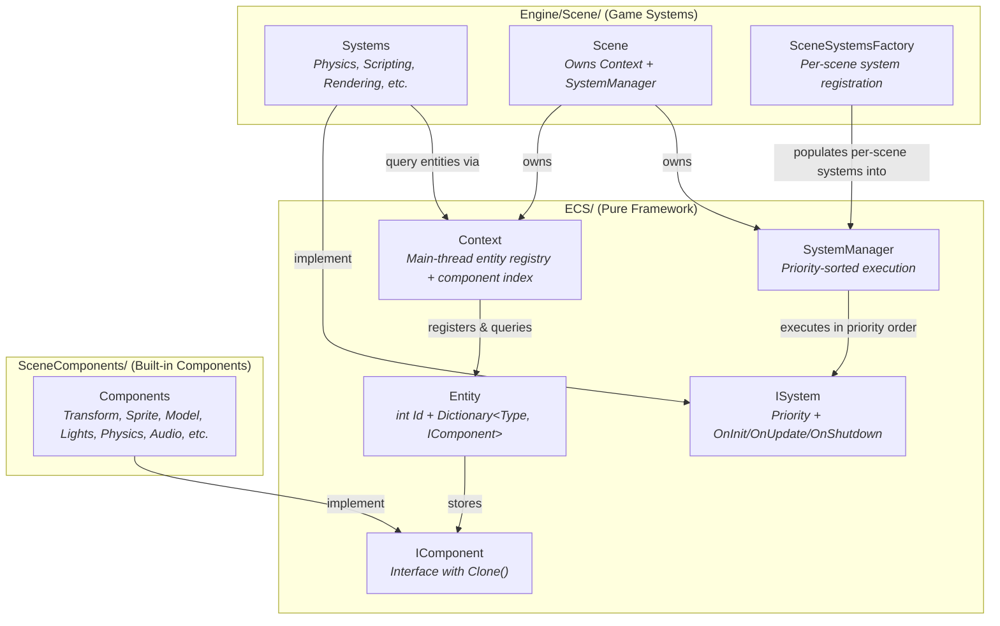
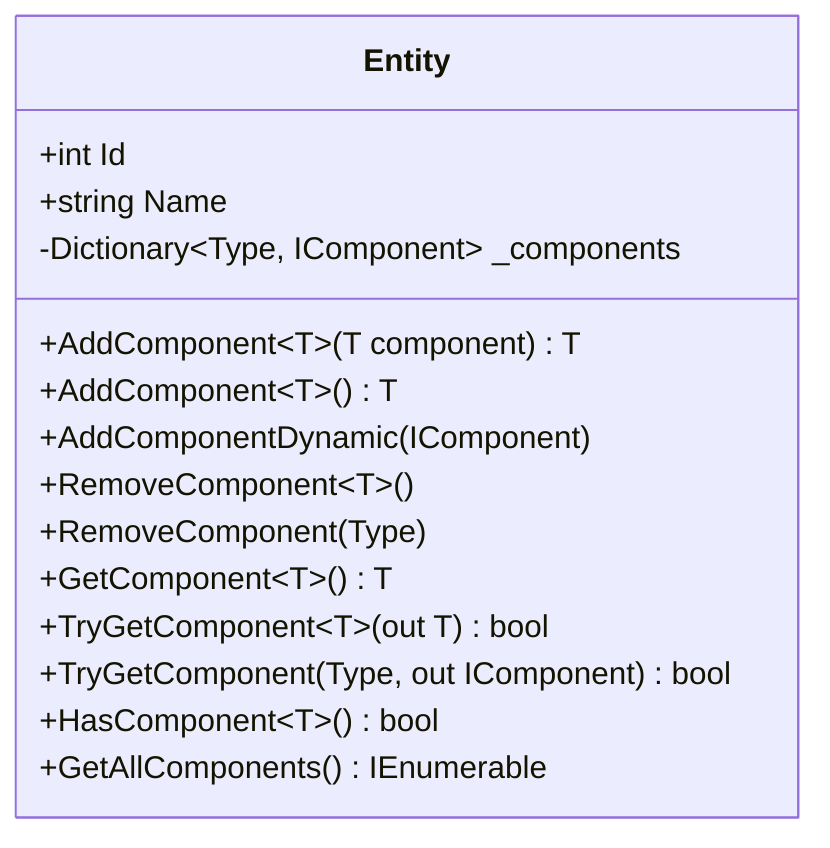
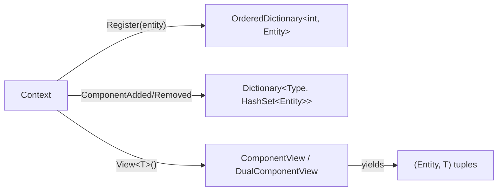
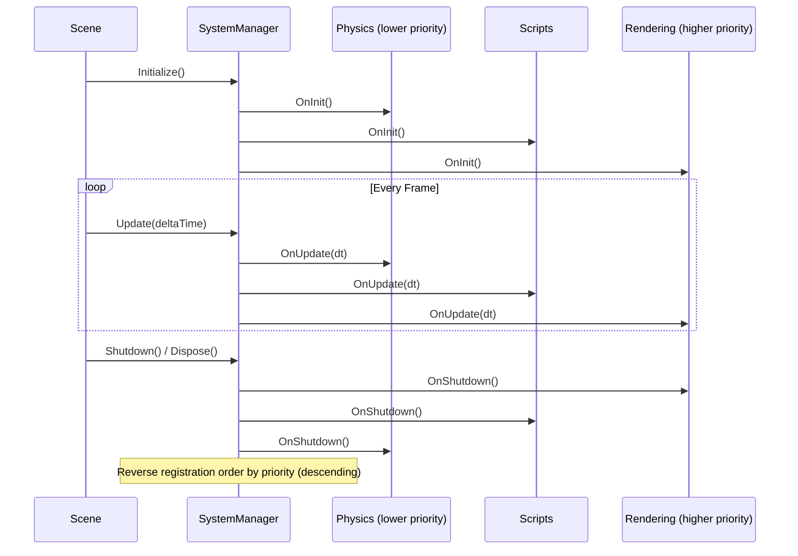

# ECS Architecture

The engine uses a custom Entity-Component-System framework. The `ECS/` project provides the pure framework (no engine dependencies). Built-in game components live in the `SceneComponents/` project; system implementations that query them live in `Engine/Scene/Systems/`.

---

## C4 Level 3 — Component Diagram


```mermaid
graph TB
    subgraph "ECS/ (Pure Framework)"
        Entity["Entity<br/><i>int Id + Dictionary&lt;Type, IComponent&gt;</i>"]
        IComponent["IComponent<br/><i>Interface with Clone()</i>"]
        Context["Context<br/><i>Main-thread entity registry + component index</i>"]
        ISystem["ISystem<br/><i>Priority + OnInit/OnUpdate/OnShutdown</i>"]
        SystemManager["SystemManager<br/><i>Priority-sorted execution</i>"]
    end

    subgraph "SceneComponents/ (Built-in Components)"
        Components["Components<br/><i>Transform, Sprite, Model, Lights, Physics, Audio, etc.</i>"]
    end

    subgraph "Engine/Scene/ (Game Systems)"
        Systems["Systems<br/><i>Physics, Scripting, Rendering, etc.</i>"]
        Scene["Scene<br/><i>Owns Context + SystemManager</i>"]
        SceneSystemsFactory["SceneSystemsFactory<br/><i>Per-scene system registration</i>"]
    end

    Entity -->|stores| IComponent
    Context -->|registers & queries| Entity
    SystemManager -->|executes in priority order| ISystem
    Scene -->|owns| Context
    Scene -->|owns| SystemManager
    SceneSystemsFactory -->|populates per-scene systems into| SystemManager
    Components -->|implement| IComponent
    Systems -->|implement| ISystem
    Systems -->|query entities via| Context
```

---

## Entity

**File**: `ECS/Entity.cs`

An entity is a lightweight identifier with a component dictionary. Construct with `new Entity(id, name)`. `Id` is immutable; `Name` is mutable.


```mermaid
classDiagram
    class Entity {
        +int Id
        +string Name
        -Dictionary~Type, IComponent~ _components
        +AddComponent~T~(T component) T
        +AddComponent~T~() T
        +AddComponentDynamic(IComponent)
        +RemoveComponent~T~()
        +RemoveComponent(Type)
        +GetComponent~T~() T
        +TryGetComponent~T~(out T) bool
        +TryGetComponent(Type, out IComponent) bool
        +HasComponent~T~() bool
        +GetAllComponents() IEnumerable
    }
```

- **Storage**: `Dictionary<Type, IComponent>` — one component per type per entity
- **Validation**: `AddComponent` throws if a component of that type already exists
- **Hooks**: Internal `ComponentAdded` / `ComponentRemoved` callbacks wire entities into `Context` component indexing on register
- **Cloning**: Entity duplication (in Scene) calls `Clone()` on every component

---

## Components

All components implement `IComponent` (defined in `ECS/Component.cs`), which requires a `Clone()` method for entity duplication. Custom script components may implement `IGameComponent` (`ECS/IGameComponent.cs`), a marker interface extending `IComponent`.

**Design rule**: Components are data-only. Matrix calculations (e.g., `TransformComponent.GetTransform()` with dirty-flag caching) are allowed, but game logic belongs in Systems.

Serialization uses `[SerializableComponentAttribute]` (`ECS/SerializableComponentAttribute.cs`) to control persisted type names for custom game components.

### Built-in Component Types (`SceneComponents/`)

| Component | File | Purpose |
|-----------|------|---------|
| **IdComponent** | `SceneComponents/IDComponent.cs` | Unique long ID for serialization cross-references |
| **TagComponent** | `SceneComponents/TagComponent.cs` | String tag for entity identification |
| **TransformComponent** | `SceneComponents/TransformComponent.cs` | Position, rotation, scale with cached transform matrix (dirty flag) |
| **ParentComponent** | `SceneComponents/ParentComponent.cs` | Parent entity id for hierarchy |
| **SpriteRendererComponent** | `SceneComponents/Rendering/SpriteRendererComponent.cs` | Color, texture path, tiling factor for 2D sprite rendering |
| **SubTextureRendererComponent** | `SceneComponents/Rendering/SubTextureRendererComponent.cs` | Sprite atlas region: texture path, coords, cell/sprite size, optional precomputed UVs |
| **ModelRendererComponent** | `SceneComponents/Rendering/ModelRendererComponent.cs` | Static mesh path (`.glb`/`.gltf`/`.fbx`), PBR factors, optional mesh index / pivot / suppress-draw |
| **VisibilityZoneComponent** | `SceneComponents/Rendering/VisibilityZoneComponent.cs` | Local AABB (`Min`/`Max`) for visibility culling |
| **CameraComponent** | `SceneComponents/Camera/CameraComponent.cs` | Orthographic or perspective projection, `Primary` and `FixedAspectRatio` flags |
| **AmbientLightComponent** | `SceneComponents/Lighting/AmbientLightComponent.cs` | Scene ambient color and strength |
| **DirectionalLightComponent** | `SceneComponents/Lighting/DirectionalLightComponent.cs` | Direction, color, intensity |
| **PointLightComponent** | `SceneComponents/Lighting/PointLightComponent.cs` | Color, intensity, range, optional shadow / offset |
| **RigidBody2DComponent** | `SceneComponents/Physics/RigidBody2DComponent.cs` | Body type (Static/Dynamic/Kinematic), velocity, gravity scale, `FixedRotation` |
| **BoxCollider2DComponent** | `SceneComponents/Physics/BoxCollider2DComponent.cs` | Collision shape: size, offset, density, friction, restitution, trigger flag |
| **CircleCollider2DComponent** | `SceneComponents/Physics/CircleCollider2DComponent.cs` | Collision shape: radius, offset, material, trigger flag |
| **EdgeCollider2DComponent** | `SceneComponents/Physics/EdgeCollider2DComponent.cs` | Open polyline collider: points, material, trigger flag |
| **AudioSourceComponent** | `SceneComponents/Audio/AudioSourceComponent.cs` | Audio clip path, volume, pitch, loop, spatial settings, effects |
| **AudioListenerComponent** | `SceneComponents/Audio/AudioListenerComponent.cs` | Active flag marking the scene audio listener |

There are **18** built-in `IComponent` types under `SceneComponents/`. Supporting data types (`CameraProjectionTypeData`, `AudioEffectData`, `PhysicsBodyRevision`) are not components.

Components with runtime-only fields use `[JsonIgnore]` to exclude them from serialization (e.g., `CameraComponent.CameraViewTransform`).

---

## Context (Entity Registry)

**File**: `ECS/Context.cs`

The Context is a main-thread entity registry with a per-component-type index for efficient queries. Source comment: snapshot/lock if ECS is touched off the game loop — there is no built-in lock.


```mermaid
graph LR
    Context -->|"Register(entity)"| Storage["OrderedDictionary&lt;int, Entity&gt;"]
    Context -->|"ComponentAdded/Removed"| Index["Dictionary&lt;Type, HashSet&lt;Entity&gt;&gt;"]
    Context -->|"View&lt;T&gt;()"| Snapshot["ComponentView / DualComponentView"]
    Snapshot -->|yields| Tuples["(Entity, T) tuples"]
```

### Storage and Lookup

- `OrderedDictionary<int, Entity>` — O(1) lookup by ID, insertion-order iteration via `Entities`
- `Dictionary<Type, HashSet<Entity>>` — component-type index maintained via entity hooks
- `Register`, `Remove`, `Clear`, `Contains`, `GetById`, `GetByName`, `Entities`
- Static `Context.ComponentIndexed` event fires when any registered entity adds/removes a component type

### View Queries

**Files**: `ECS/Context.cs`, `ECS/ComponentView.cs`

```csharp
public ComponentView<TComponent> View<TComponent>()
    where TComponent : IComponent

public DualComponentView<T1, T2> View<T1, T2>()
    where T1 : IComponent where T2 : IComponent
```

- **Indexed filtering** — `View<T>()` iterates only entities indexed for `T`
- **Two-component queries** — `View<T1, T2>()` iterates the smaller of the two component indices, then requires both components
- **Struct enumerators** — `ComponentView` / `DualComponentView` avoid allocating an intermediate list; they walk the live `HashSet` (main-thread use)
- **Returns references** — modifications to yielded components affect the originals

```csharp
// Option A: indexed two-component view
foreach (var (entity, transform, sprite) in context.View<TransformComponent, SpriteRendererComponent>())
{
    renderer.DrawSprite(transform, sprite);
}

// Option B: single view + TryGetComponent
foreach (var (entity, sprite) in context.View<SpriteRendererComponent>())
{
    if (entity.TryGetComponent<TransformComponent>(out var transform))
        renderer.DrawSprite(transform, sprite);
}
```

---

## Systems

### ISystem Interface

**File**: `ECS/Systems/ISystem.cs`

```csharp
public interface ISystem
{
    int Priority { get; }                    // Execution order (ascending)
    void OnInit();                           // Default empty; called once on Initialize()
    void OnUpdate(TimeSpan deltaTime);       // Called every frame
    void OnShutdown();                       // Default empty; called on Shutdown()
}
```

`IGameSystem` (`ECS/Systems/IGameSystem.cs`) is a marker interface extending `ISystem` for custom script-defined systems registered via `[Register]`.

### SystemManager

**File**: `ECS/Systems/SystemManager.cs`

`SystemManager` maintains a priority-sorted list of systems and executes them sequentially each frame. It implements `IDisposable`.


```mermaid
sequenceDiagram
    participant Scene
    participant SM as SystemManager
    participant S1 as Physics (lower priority)
    participant S2 as Scripts
    participant S3 as Rendering (higher priority)

    Scene->>SM: Initialize()
    SM->>S1: OnInit()
    SM->>S2: OnInit()
    SM->>S3: OnInit()

    loop Every Frame
        Scene->>SM: Update(deltaTime)
        SM->>S1: OnUpdate(dt)
        SM->>S2: OnUpdate(dt)
        SM->>S3: OnUpdate(dt)
    end

    Scene->>SM: Shutdown() / Dispose()
    SM->>S3: OnShutdown()
    SM->>S2: OnShutdown()
    SM->>S1: OnShutdown()
    Note over SM: Reverse registration order by priority (descending)
```

- **Registration**: `RegisterSystem(system)` adds to the list (no-op if already present) and re-sorts by `Priority`
- **Initialize**: Calls `OnInit()` on all systems in ascending priority order; throws if already initialized
- **Update**: Iterates all systems in ascending priority order; throws if not initialized
- **Shutdown**: Calls `OnShutdown()` in reverse priority order, then clears the initialized flag
- **RemoveSystems**: Removes systems matching a predicate (does not call `OnShutdown`)
- **Dispose**: Calls `Shutdown()`, then clears the system list

### Engine Integration (outside `ECS/`)

Concrete engine systems, per-scene wiring (`SceneFactory` / `SceneSystemsFactory`), and numeric priorities live under `Engine/Scene/`. Typical order is physics → hierarchy/scripts → audio → rendering → debug draw. See `Engine/Scene/Systems/SystemPriorities.cs` for current values.

### Data Flow Between Systems


```mermaid
graph LR
    Physics["Physics"]
    Scripts["Scripts"]
    Audio["Audio"]
    Render["Rendering"]
    Debug["PhysicsDebug"]

    Physics -->|"updates TransformComponent"| Scripts
    Scripts -->|"may modify any component"| Audio
    Audio --> Render
    Render --> Debug
```

Each system reads/writes components on entities via the shared `Context`. Systems communicate through:

1. **Shared component state** (primary) — systems write components that downstream systems read in the same frame, ordered by priority
2. **EventBus** — global pub/sub for decoupled notifications across engine subsystems
