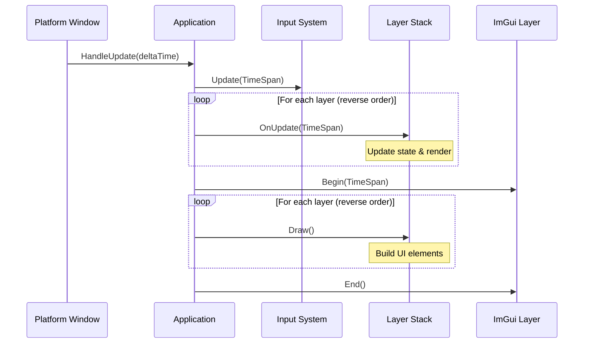
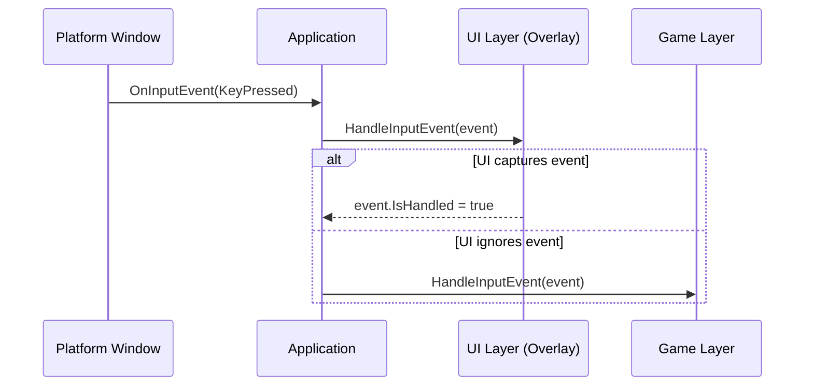
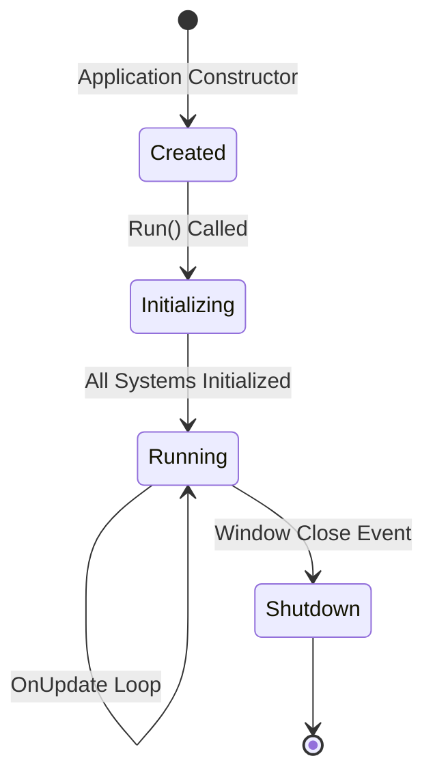

# Game Loop

## Core Concepts

### Three-Tier Architecture

1. **Platform Layer** - Windowing system abstraction that handles OS-specific windowing and provides the raw update loop
2. **Application Layer** - Core orchestrator that manages subsystems and distributes execution flow
3. **Layer Stack** - User-defined game logic and systems organized in prioritized execution order

### Layer Stack Pattern

The layer stack is a collection of game logic modules executing in a specific order each frame:

- **Regular Layers**: Game logic layers that execute last during iteration
- **Overlay Layers**: UI and debug tools that execute first during iteration

Since the stack iterates in **reverse order**, overlays process first and can intercept events before game layers. This enables UI to capture input and render on top of game content.

### Event-Driven Input

Rather than polling, the game loop uses event-driven input:
- Platform events are converted to engine-agnostic event objects
- Events flow through the layer stack in reverse order (overlays first)
- Any layer can mark an event as "handled" to prevent further propagation

### Delta Time

Each frame receives a `TimeSpan` representing elapsed time since the previous frame, enabling frame-rate independent motion, animations, and game logic.

**Delta Time Clamping**: Delta time is clamped to 250ms maximum to protect against system sleep, debugger pauses, or extreme lag spikes.

## Architecture Flow

### Initialization Sequence

1. **Application Creation** - Platform window created, event handlers registered, layer stack initialized
2. **Window Load** - Graphics context initialized, subsystems started, audio engine initialized, input system configured
3. **Layer Attachment** - Each layer receives initialization callback and loads required resources

### Main Loop Execution

### Event Processing Flow

Events flow through the layer stack in reverse order (overlays first), allowing UI layers to intercept events before game logic processes them.

### State Transitions

## Frame Execution

### Update Phase

Each layer receives delta time and can:
- Update entity positions and states
- Process game logic and AI
- Handle physics simulation
- Update camera transforms
- Issue rendering commands

Layers execute in reverse stack order (overlays first, then game layers).

### Render Phase

1. **Scene Setup** - Camera matrices uploaded to GPU
2. **Geometry Submission** - Layers call draw commands
3. **Batch Management** - Batches automatically flush when limits are reached
4. **Scene Finalization** - Remaining batched data flushed

### ImGui Phase

1. **Begin** - Prepares immediate-mode UI system
2. **Layer UI Rendering** - Each layer's `Draw()` method builds UI elements
3. **End** - Renders UI to screen on top of game content

## Performance Considerations

### Variable Delta Time

The engine uses variable delta time rather than fixed timestep:
- Simpler implementation with no temporal aliasing
- Automatically adapts to system performance
- Game logic must use delta time for frame-independent behavior
- Physics may need substeps for stability

### Layer Execution Order

- **UI/Overlays First**: Can consume input events before game logic
- **Game Logic Last**: Processes unconsumed events
- **Rendering During Update**: Each layer controls its own rendering

### Batch Optimization

The renderer accumulates geometry in CPU-side buffers, automatically flushing when limits are reached. This enables thousands of sprites in a single draw call.

## Integration Points

| Module | Integration |
|--------|-------------|
| **Camera System** | Provides view-projection matrices at scene start |
| **Input System** | Receives delta time first each frame for buffered event processing |
| **Renderer** | Stateless per frame - BeginScene to EndScene cycle |
| **Scene Management** | Scenes are layers in the stack receiving update/render callbacks |
| **Audio Engine** | Initialized during window load, runs independently |

## Common Patterns

### Custom Game Logic

Implement the `ILayer` interface:
- Initialize in `OnAttach` with input system reference
- Update state and render in `OnUpdate` using delta time
- Build ImGui UI in `Draw`
- Handle events in `HandleInputEvent` and `HandleWindowEvent`

### Scene Transitions

Use the layer stack for scene management:
- Push new layer for new scene
- Remove layer to return to previous
- Multiple layers can be active simultaneously (e.g., game + pause menu)

### Input Priority

Overlay layers receive input first - add UI layers as overlays and mark events as handled to prevent propagation to game layers.

## Summary

The Game Loop orchestrates all subsystems in a coherent, predictable execution flow. The event-driven architecture combined with the layered execution model provides flexibility while maintaining performance. Each frame follows an identical path, making behavior predictable and debuggable.
