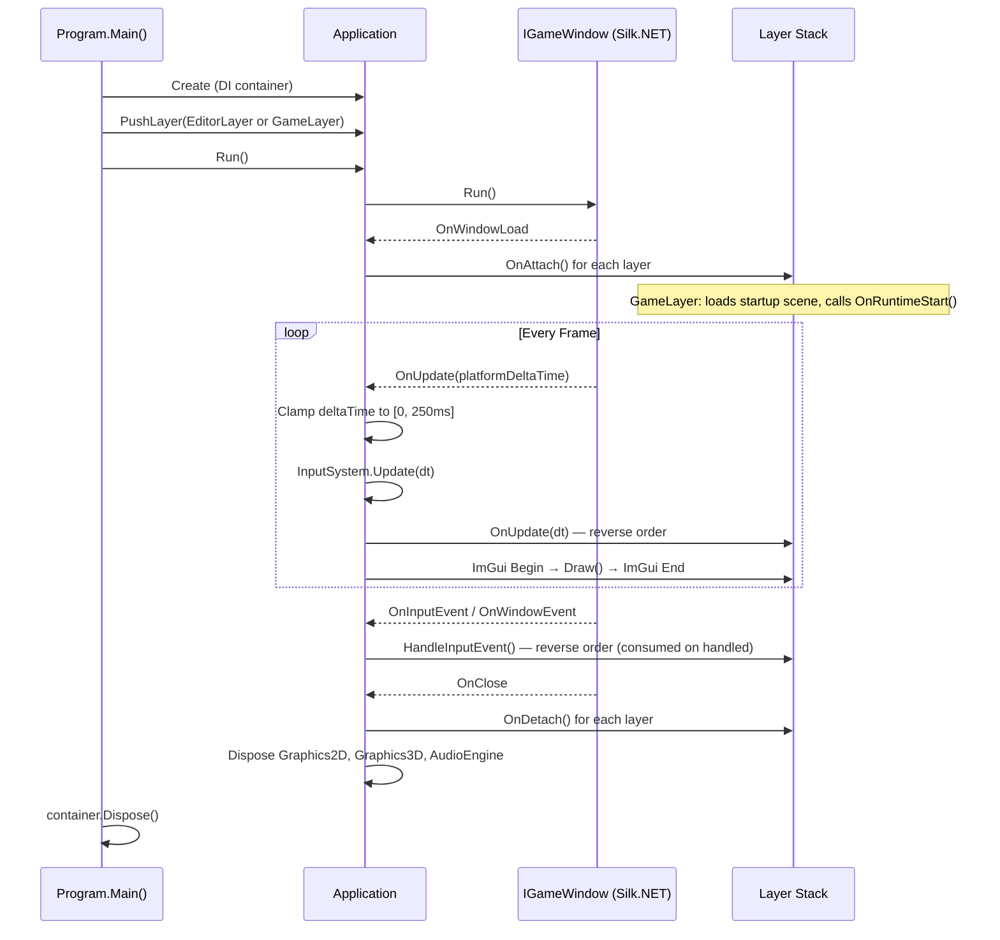
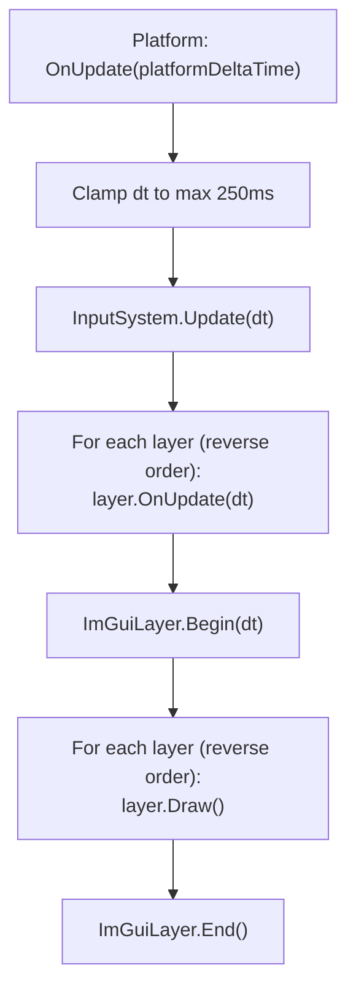
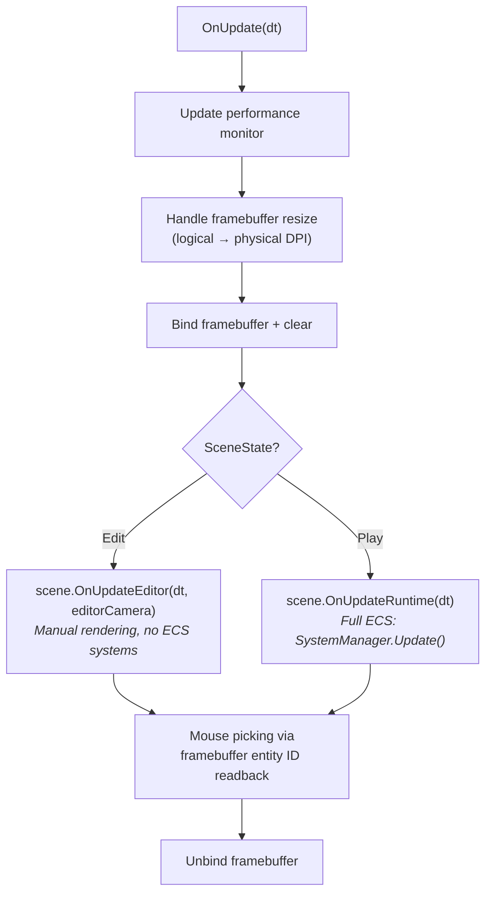
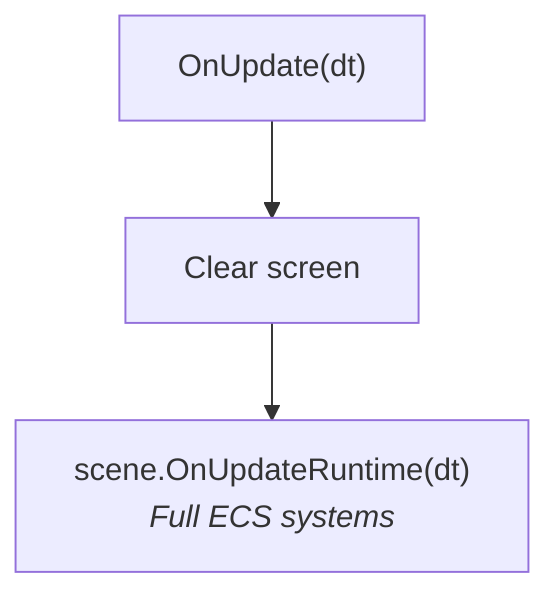
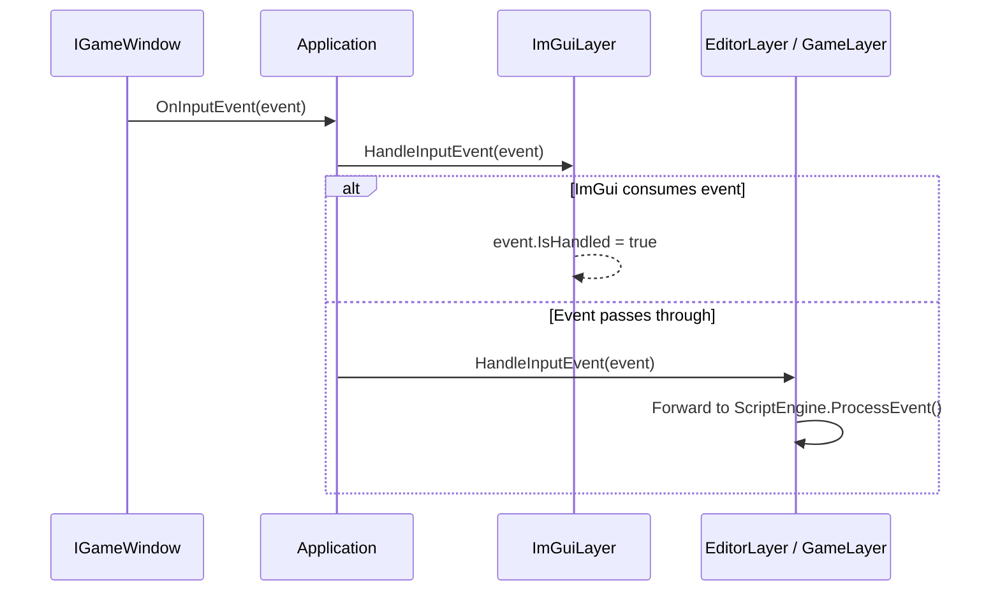

# Game Loop

The engine has two entry points — **Editor** and **Runtime** — that share a common `Application` base class. The platform loop is driven by Silk.NET's windowing system.

---

## C4 Level 3 — Component Diagram

```mermaid
graph TB
    subgraph "Entry Points"
        EditorProgram["Editor/Program.cs<br/><i>DI setup + EditorLayer</i>"]
        RuntimeProgram["Runtime/Program.cs<br/><i>DI setup + GameLayer</i>"]
    end

    subgraph "Application Layer"
        App["Application (abstract)<br/><i>Layer stack, Graphics2D/3D, AudioEngine</i>"]
        LayerStack["Layer Stack<br/><i>Processed in reverse order</i>"]
        EditorLayer["EditorLayer<br/><i>Framebuffer, scene states, mouse picking</i>"]
        GameLayer["GameLayer<br/><i>Direct rendering, always Play mode</i>"]
    end

    subgraph "Platform"
        GameWindow["IGameWindow (Silk.NET)<br/><i>OnLoad, OnUpdate, OnInput, OnClose</i>"]
    end

    subgraph "Scene"
        Scene["Scene<br/><i>OnUpdateRuntime / OnUpdateEditor</i>"]
        SM["SystemManager<br/><i>Priority-sorted ECS systems</i>"]
    end

    EditorProgram --> App
    RuntimeProgram --> App
    App -->|owns| LayerStack
    LayerStack -->|contains| EditorLayer
    LayerStack -->|contains| GameLayer
    App -->|delegates to| GameWindow
    GameWindow -->|"OnUpdate(dt)"| App
    EditorLayer -->|"Play mode"| Scene
    GameLayer --> Scene
    Scene --> SM
```

---

## Application Lifecycle


```mermaid
sequenceDiagram
    participant Main as Program.Main()
    participant App as Application
    participant Win as IGameWindow (Silk.NET)
    participant Layers as Layer Stack

    Main->>App: Create (DI container)
    Main->>App: PushLayer(EditorLayer or GameLayer)
    Main->>App: Run()
    App->>Win: Run()

    Win-->>App: OnWindowLoad
    App->>Layers: OnAttach() for each layer
    Note over Layers: GameLayer: loads startup scene, calls OnRuntimeStart()

    loop Every Frame
        Win-->>App: OnUpdate(platformDeltaTime)
        App->>App: Clamp deltaTime to [0, 250ms]
        App->>App: InputSystem.Update(dt)
        App->>Layers: OnUpdate(dt) — reverse order
        App->>Layers: ImGui Begin → Draw() → ImGui End
    end

    Win-->>App: OnInputEvent / OnWindowEvent
    App->>Layers: HandleInputEvent() — reverse order (consumed on handled)

    Win-->>App: OnClose
    App->>Layers: OnDetach() for each layer
    App->>App: Dispose Graphics2D, Graphics3D, AudioEngine
    Main->>Main: container.Dispose()
```

---

## Entry Points

### Editor

**File**: `Editor/Program.cs`

1. Creates DryIoc container with `EngineIoCContainer.Register()` + `EditorIoCContainer.Register()`
2. Validates container with `ValidateAndThrow()`
3. Sets up Serilog logging (console + file + ConsolePanel sink)
4. Enables script debugging in DEBUG builds
5. Resolves `Editor` (extends `Application`), pushes `EditorLayer`
6. Calls `editor.Run()`

### Runtime

**File**: `Runtime/Program.cs`

1. Loads `GameConfiguration` from `game.config.json` (window title, size, startup scene)
2. Creates DryIoc container with `EngineIoCContainer.Register()` only (no editor features)
3. Registers `RuntimeApplication`, `GameLayer`, `IContext`
4. Calls `app.Run()`

---

## Application Base Class

**File**: `Engine/Core/Application.cs`

The abstract `Application` class manages the core frame loop:

- **Owns**: `IGraphics2D`, `IGraphics3D`, `IAudioEngine` (initialized in constructor)
- **Manages**: Layer stack — layers pushed in order, processed in **reverse** (overlays first)
- **Delegates**: Platform loop to `IGameWindow.Run()` (Silk.NET)

### Delta Time Clamping

```csharp
var elapsed = TimeSpan.FromSeconds(Math.Min(deltaTime, 0.25));
```

Caps frame delta at 250ms. This prevents physics explosions and large position jumps when the application resumes from a debugger breakpoint or system sleep.

### Layer Processing Order

Layers are stored as a list where index 0 is the base layer (game/editor) and index N-1 is the topmost overlay (ImGui). All processing iterates in **reverse** — highest index first:

```
Index 0: EditorLayer / GameLayer  ← processed last
Index 1: ImGuiLayer               ← processed first
```

This ensures:
- **Input**: UI captures clicks before game logic; events stop propagating once `IsHandled = true`
- **Update**: Overlays update before game state
- **Draw**: ImGui renders on top of the scene

---

## Frame Tick


```mermaid
graph TD
    A["Platform: OnUpdate(platformDeltaTime)"] --> B["Clamp dt to max 250ms"]
    B --> C["InputSystem.Update(dt)"]
    C --> D["For each layer (reverse order):<br/>layer.OnUpdate(dt)"]
    D --> E["ImGuiLayer.Begin(dt)"]
    E --> F["For each layer (reverse order):<br/>layer.Draw()"]
    F --> G["ImGuiLayer.End()"]
```

### EditorLayer Frame Tick

**File**: `Editor/EditorLayer.cs`


```mermaid
graph TD
    A["OnUpdate(dt)"] --> B["Update performance monitor"]
    B --> C["Handle framebuffer resize<br/>(logical → physical DPI)"]
    C --> D["Bind framebuffer + clear"]
    D --> E{SceneState?}
    E -->|Edit| F["scene.OnUpdateEditor(dt, editorCamera)<br/><i>Manual rendering, no ECS systems</i>"]
    E -->|Play| G["scene.OnUpdateRuntime(dt)<br/><i>Full ECS: SystemManager.Update()</i>"]
    F --> H["Mouse picking via<br/>framebuffer entity ID readback"]
    G --> H
    H --> I["Unbind framebuffer"]
```

- **Edit mode**: Scene renders manually — iterates entities directly, draws sprites/models without running physics or scripts
- **Play mode**: Delegates to `SystemManager.Update()` — all ECS systems execute in priority order
- **Mouse picking**: Framebuffer has a `RED_INTEGER` attachment storing entity IDs per pixel; `ReadPixel()` identifies the clicked entity

### GameLayer Frame Tick

**File**: `Runtime/GameLayer.cs`


```mermaid
graph TD
    A["OnUpdate(dt)"] --> B["Clear screen"]
    B --> C["scene.OnUpdateRuntime(dt)<br/><i>Full ECS systems</i>"]
```

Simpler than the editor — no framebuffer indirection, no scene state branching, always runs full ECS.

---

## Scene Update Modes

**File**: `Engine/Scene/Scene.cs`

### OnUpdateRuntime

Delegates entirely to the SystemManager:

```csharp
public void OnUpdateRuntime(TimeSpan ts)
{
    _init.SystemManager.Update(ts);
}
```

Systems execute in priority order (100→180), covering physics, scripting, audio, animation, and rendering.

### OnUpdateEditor

Manual rendering without ECS systems:

1. `Graphics3D.BeginScene(editorCamera)` → draw all ModelRendererComponent entities → `EndScene()`
2. `Graphics2D.BeginScene(editorCamera)` → draw all sprites and subtextures → `EndScene()`
3. If `DebugSettings.ShowColliderBounds`: draw collider outlines
4. No physics stepping, no script execution

This allows the editor to preview the scene visually while keeping entities in their authored positions.

---

## Event Flow


```mermaid
sequenceDiagram
    participant Platform as IGameWindow
    participant App as Application
    participant ImGui as ImGuiLayer
    participant Layer as EditorLayer / GameLayer

    Platform->>App: OnInputEvent(event)
    App->>ImGui: HandleInputEvent(event)
    alt ImGui consumes event
        ImGui-->>ImGui: event.IsHandled = true
    else Event passes through
        App->>Layer: HandleInputEvent(event)
        Layer->>Layer: Forward to ScriptEngine.ProcessEvent()
    end
```

- Input events propagate from overlays down to base layers
- Any layer can consume an event by setting `IsHandled = true`
- Window events (resize, close) follow the same reverse-order propagation

---

## Initialization & Shutdown

### Runtime Startup Sequence

1. `GameLayer.OnAttach()` — sets scripts directory from config
2. Loads startup scene via `SceneSerializer.Deserialize()`
3. `scene.OnRuntimeStart()`:
   - `SystemManager.Initialize()` → calls `OnInit()` on all systems
   - Creates Box2D physics bodies for all `RigidBody2DComponent` entities
   - Attaches colliders (`BoxCollider2DComponent`)

### Shutdown Sequence

1. `layer.OnDetach()` called for each layer
2. `scene.Dispose()`:
   - `SystemManager.Shutdown()` — per-scene systems `OnShutdown()` in reverse order
   - `SystemManager.Dispose()` — disposes `IDisposable` per-scene systems
   - Clears entity context
3. Application disposes Graphics2D, Graphics3D, AudioEngine
4. DI container disposes all remaining singletons
