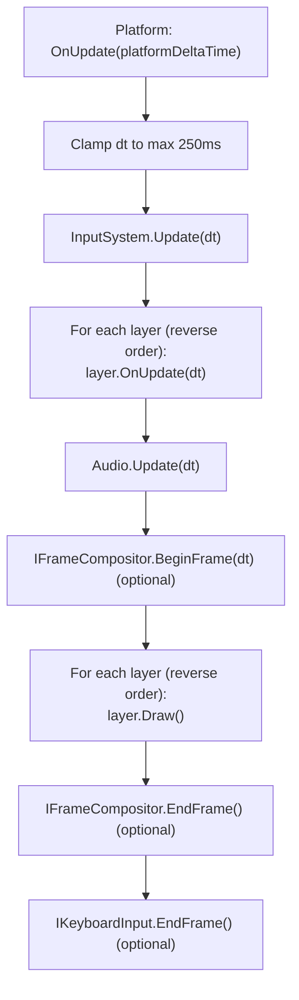
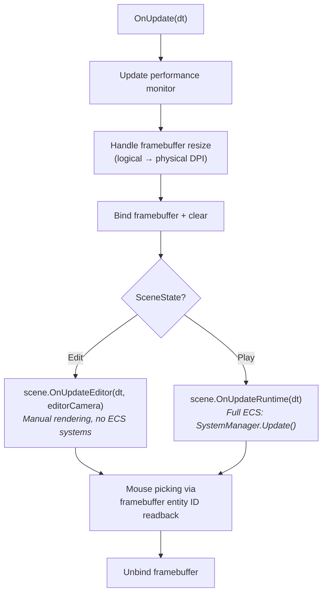
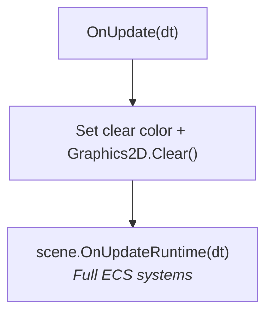
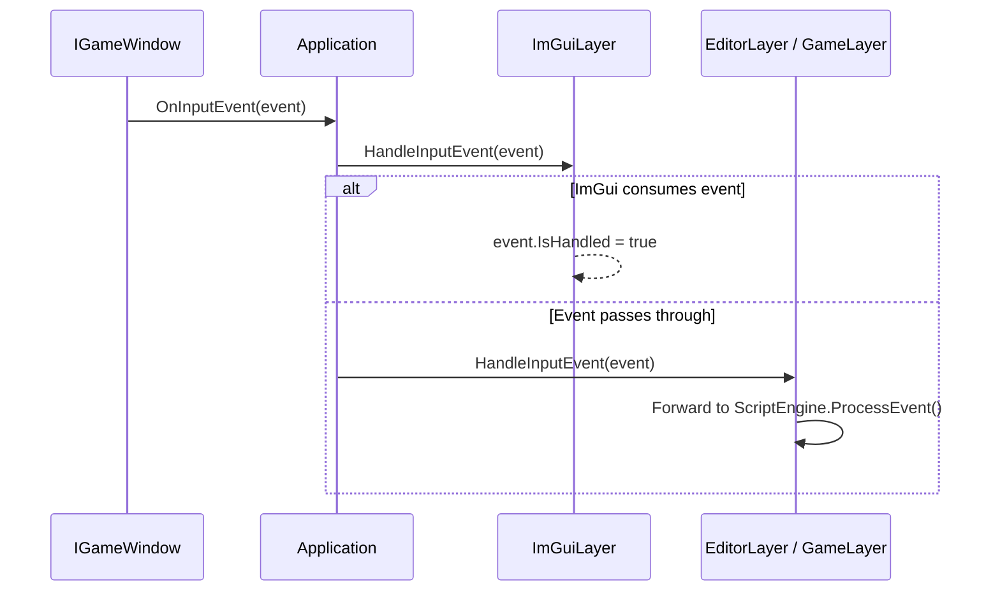

# Game Loop

The engine has two entry points — **Editor** and **Runtime** — that share a common `Application` base class. The platform loop is driven by Silk.NET's windowing system.

---

## C4 Level 3 — Component Diagram

```mermaid
graph TB
    subgraph "Entry Points"
        EditorProgram["Editor/Program.cs<br/><i>DI setup + EditorLayer</i>"]
        RuntimeProgram["Runtime/Program.cs<br/><i>DI setup + GameLayer</i>"]
    end

    subgraph "Application Layer"
        App["Application (abstract)<br/><i>Layer stack, IRendererAPI, Graphics2D/3D, IAudio</i>"]
        Compositor["IFrameCompositor (optional)<br/><i>Wraps Draw phase (e.g. ImGui)</i>"]
        LayerStack["Layer Stack<br/><i>Processed in reverse order</i>"]
        EditorLayer["EditorLayer<br/><i>Framebuffer, scene states, mouse picking</i>"]
        GameLayer["GameLayer<br/><i>Direct rendering, always Play mode</i>"]
    end

    subgraph "Platform"
        GameWindow["IGameWindow (Silk.NET)<br/><i>OnLoad, OnUpdate, OnInput, OnClose</i>"]
    end

    subgraph "Scene"
        Scene["Scene<br/><i>OnUpdateRuntime / OnUpdateEditor</i>"]
        SM["SystemManager<br/><i>Priority-sorted ECS systems</i>"]
    end

    EditorProgram --> App
    RuntimeProgram --> App
    App -->|owns| LayerStack
    App -.->|optional| Compositor
    LayerStack -->|contains| EditorLayer
    LayerStack -->|contains| GameLayer
    App -->|delegates to| GameWindow
    GameWindow -->|"OnUpdate(dt)"| App
    EditorLayer -->|"Play mode"| Scene
    GameLayer --> Scene
    Scene --> SM
```

---

## Application Lifecycle

```mermaid
sequenceDiagram
    participant Main as Program.Main()
    participant App as Application
    participant Win as IGameWindow (Silk.NET)
    participant Layers as Layer Stack

    Main->>App: Create (DI container)
    Main->>App: PushLayer(EditorLayer or GameLayer)
    Main->>App: Run()
    App->>Win: Run()

    Win-->>App: OnWindowLoad(inputSystem)
    App->>App: RendererAPI.Init(), Graphics2D/3D Init(), Audio.Initialize()
    App->>Layers: OnAttach(inputSystem) for each layer
    Note over Layers: GameLayer OnAttach: deserialize startup scene, RuntimeSceneStarter.Start()

    loop Every Frame
        Win-->>App: OnUpdate(platformDeltaTime)
        App->>App: Clamp deltaTime to [0, 250ms]
        App->>App: InputSystem.Update(dt)
        App->>Layers: OnUpdate(dt) — reverse order
        App->>App: Audio.Update(dt)
        App->>App: IFrameCompositor.BeginFrame(dt) (if set)
        App->>Layers: Draw() — reverse order
        App->>App: IFrameCompositor.EndFrame() (if set)
        App->>App: KeyboardInput.EndFrame() (if set)
    end

    Win-->>App: OnInputEvent / OnWindowEvent
    App->>Layers: HandleInputEvent() — reverse order (consumed on handled)

    Win-->>App: OnClose
    App->>Layers: OnDetach() for each layer (reverse order)
    App->>App: Dispose Graphics2D, Graphics3D, Audio; MeshFactory.Clear()
    Main->>Main: Log.CloseAndFlush(); container.Dispose()
```

---

## Entry Points

### Editor

**File**: `Editor/Program.cs`

1. Creates DryIoc container with `EngineIoCContainer.Register()` + `EditorIoCContainer.Register()`
2. Validates container with `ValidateAndThrow()`
3. Sets up Serilog logging (console + file + ConsolePanel sink)
4. Enables script debugging in DEBUG builds
5. Resolves `Editor` (extends `Application`), pushes `EditorLayer`
6. Calls `editor.Run()`

### Runtime

**File**: `Runtime/Program.cs`

1. Configures Serilog (console + rolling file under `logs/runtime-.log`)
2. Loads `GameConfiguration` from `game.config.json` beside the executable (title, window size, startup scene, game assembly path); falls back to defaults if missing or invalid
3. Creates DryIoc container: `EngineIoCContainer.RegisterCore()` + `IProjectContext.Apply(AppContext.BaseDirectory)` + `RegisterWindowing()` with host options from config
4. Registers `GameConfiguration` instance, `RuntimeApplication`, and a `Func<IEnumerable<IGameSystem>>` delegate for per-scene game systems
5. Loads the published game assembly (`GameAssembly.dll` by default) via `IScriptEngine`; registers `[Register]` types via `GameAssemblyContainerRegistration.TryRegisterContainer` (warns if none) and component serializers from that assembly
6. Registers `ILayer` → `GameLayer` only if the game assembly did not register one; `ValidateAndThrow()`
7. Resolves `RuntimeApplication`, resolves `ILayer`, `PushLayer`, then `Run()`; returns exit code `1` on fatal errors
8. `Log.CloseAndFlush()` and `container.Dispose()` in `finally`

---

## Application Base Class

**File**: `Engine/Core/Application.cs`  
**Interface**: `Engine/Core/IApplication.cs` — `Run()`, `PushLayer()`, `PushOverlay()`

The abstract `Application` class manages the core frame loop:

- **Owns**: `IGameWindow`, `IRendererAPI`, `IGraphics2D`, `IGraphics3D`, `IAudio`, `IMeshFactory`; optional `IFrameCompositor` and `IKeyboardInput`
- **Initializes on window load**: `RendererAPI.Init()`, `Graphics2D.Init()`, `Graphics3D.Init()`, `Audio.Initialize()` — before any `layer.OnAttach()`
- **Manages**: Layer stack — `PushLayer` inserts at index 0, `PushOverlay` appends; `PopLayer` / `PopOverlay` detach and remove; all tick/event processing iterates in **reverse** (overlays first)
- **Delegates**: Platform loop to `IGameWindow.Run()` (Silk.NET)
- **Constructor**: Optionally `PushOverlay(inputOverlay)` for the input/UI overlay (editor passes `ImGuiLayer`)

**File**: `Engine/Core/IFrameCompositor.cs` — `BeginFrame(TimeSpan)` / `EndFrame()` bracket the layer `Draw()` pass (editor registers an ImGui implementation; runtime omits it).

### Delta Time Clamping

```csharp
var deltaTime = Math.Clamp(platformDeltaTime, 0.0, MaxDeltaTime); // MaxDeltaTime = 0.25
var elapsed = TimeSpan.FromSeconds(deltaTime);
```

Caps frame delta at 250ms and logs a warning on spikes. This prevents physics explosions and large position jumps when the application resumes from a debugger breakpoint or system sleep.

### Layer Processing Order

`PushLayer` inserts at index 0; `PushOverlay` appends. A typical editor stack:

```
Index 0: EditorLayer / GameLayer  ← processed last
Index 1: ImGuiLayer (overlay)     ← processed first
```

All `OnUpdate`, `Draw`, and event handlers iterate in **reverse** — highest index first.

This ensures:
- **Input**: UI captures clicks before game logic; propagation stops once `IsHandled = true`
- **Update**: Overlays update before game state; `Audio.Update()` runs after all layer updates
- **Draw**: Compositor + overlay layers render on top of scene content

---

## Frame Tick


```mermaid
graph TD
    A["Platform: OnUpdate(platformDeltaTime)"] --> B["Clamp dt to max 250ms"]
    B --> C["InputSystem.Update(dt)"]
    C --> D["For each layer (reverse order):<br/>layer.OnUpdate(dt)"]
    D --> E["Audio.Update(dt)"]
    E --> F["IFrameCompositor.BeginFrame(dt) (optional)"]
    F --> G["For each layer (reverse order):<br/>layer.Draw()"]
    G --> H["IFrameCompositor.EndFrame() (optional)"]
    H --> I["IKeyboardInput.EndFrame() (optional)"]
```

### EditorLayer Frame Tick

**File**: `Editor/EditorLayer.cs`


```mermaid
graph TD
    A["OnUpdate(dt)"] --> B["Update performance monitor"]
    B --> C["Handle framebuffer resize<br/>(logical → physical DPI)"]
    C --> D["Bind framebuffer + clear"]
    D --> E{SceneState?}
    E -->|Edit| F["scene.OnUpdateEditor(dt, editorCamera)<br/><i>Manual rendering, no ECS systems</i>"]
    E -->|Play| G["scene.OnUpdateRuntime(dt)<br/><i>Full ECS: SystemManager.Update()</i>"]
    F --> H["Mouse picking via<br/>framebuffer entity ID readback"]
    G --> H
    H --> I["Unbind framebuffer"]
```

- **Edit mode**: Scene renders manually — iterates entities directly, draws sprites/models without running physics or scripts
- **Play mode**: Delegates to `SystemManager.Update()` — all ECS systems execute in priority order
- **Mouse picking**: Framebuffer has a `RED_INTEGER` attachment storing entity IDs per pixel; `ReadPixel()` identifies the clicked entity

### GameLayer Frame Tick

**File**: `Runtime/GameLayer.cs`  
**Application**: `Runtime/RuntimeApplication.cs` — extends `Application` with `keyboardInput` only (no compositor overlay)


```mermaid
graph TD
    A["OnUpdate(dt)"] --> B["Set clear color + Graphics2D.Clear()"]
    B --> C["scene.OnUpdateRuntime(dt)<br/><i>Full ECS systems</i>"]
```

Simpler than the editor — no framebuffer indirection, no scene state branching, always runs full ECS. `Draw()` is a no-op; rendering is driven by ECS systems during `OnUpdateRuntime`. Input events update `KeyboardInputState` and forward to `IScriptEngine.ProcessEvent`; window resize calls `scene.OnViewportResize`.

---

## Scene Update Modes

**File**: `Engine/Scene/Scene.cs`

### OnUpdateRuntime

Delegates entirely to the SystemManager:

```csharp
public void OnUpdateRuntime(TimeSpan ts)
{
    _init.SystemManager.Update(ts);
}
```

Systems execute in priority order (100→151), covering physics, scripting, audio, and rendering.

### OnUpdateEditor

Manual rendering without ECS systems:

1. `Graphics3D.BeginScene(editorCamera)` → draw all ModelRendererComponent entities → `EndScene()`
2. `Graphics2D.BeginScene(editorCamera)` → draw all sprites and subtextures → `EndScene()`
3. If `DebugSettings.ShowColliderBounds`: draw collider outlines
4. No physics stepping, no script execution

This allows the editor to preview the scene visually while keeping entities in their authored positions.

---

## Event Flow


```mermaid
sequenceDiagram
    participant Platform as IGameWindow
    participant App as Application
    participant ImGui as ImGuiLayer
    participant Layer as EditorLayer / GameLayer

    Platform->>App: OnInputEvent(event)
    App->>ImGui: HandleInputEvent(event)
    alt ImGui consumes event
        ImGui-->>ImGui: event.IsHandled = true
    else Event passes through
        App->>Layer: HandleInputEvent(event)
        Layer->>Layer: Forward to ScriptEngine.ProcessEvent()
    end
```

- Input events propagate from overlays down to base layers
- Any layer can consume an event by setting `IsHandled = true`
- `GameLayer` updates `KeyboardInputState` and forwards to `IScriptEngine.ProcessEvent` when `ActiveScriptRuntimeStore` is available
- Window events (resize, close) follow the same reverse-order propagation

---

## Initialization & Shutdown

### Runtime Startup Sequence

**File**: `Runtime/GameLayer.cs`

1. `GameLayer.OnAttach()` subscribes to `ISceneContext.SceneChanged`
2. Resolves startup scene path from `GameConfiguration.StartupScenePath` (relative to `AppContext.BaseDirectory`)
3. `SceneFactory.Create()` + `SceneSerializer.Deserialize()`
4. `sceneContext.SetScene(scene)` then `RuntimeSceneStarter.Start(scene, sceneContext, gameSystems)` — registers `[Register]` `IGameSystem` instances and calls `scene.OnRuntimeStart()`

### Shutdown Sequence

1. `Application.HandleGameWindowClose` — `OnDetach()` on each layer (reverse order, errors logged via `SafeDetachLayer`), then clears the layer stack
2. `GameLayer.OnDetach()` — unsubscribes `SceneChanged`, `scene.OnRuntimeStop()`, then `scene.Dispose()`
3. Application disposes `Graphics2D`, `Graphics3D`, `Audio`; `IMeshFactory.Clear()` (`IRendererAPI` is not disposed here)
4. Runtime `Program.Main` `finally`: `Log.CloseAndFlush()`, then `container.Dispose()`
