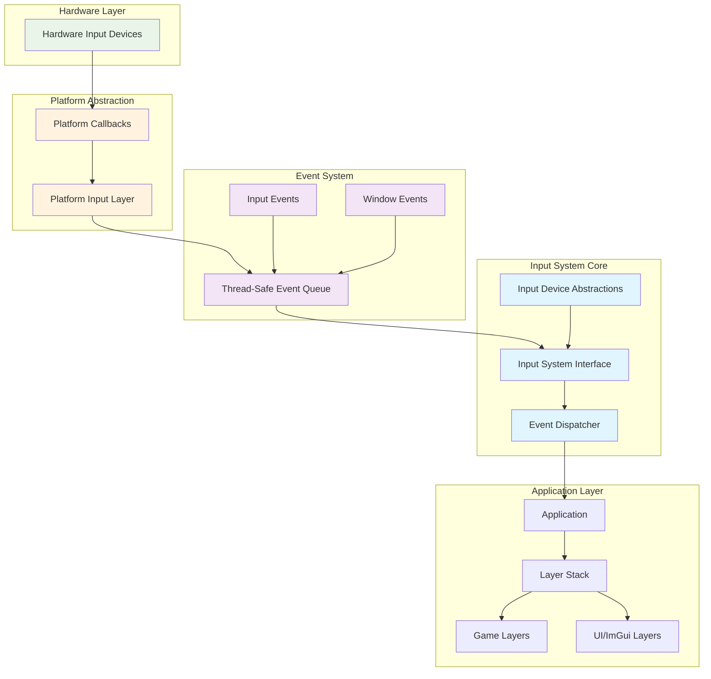
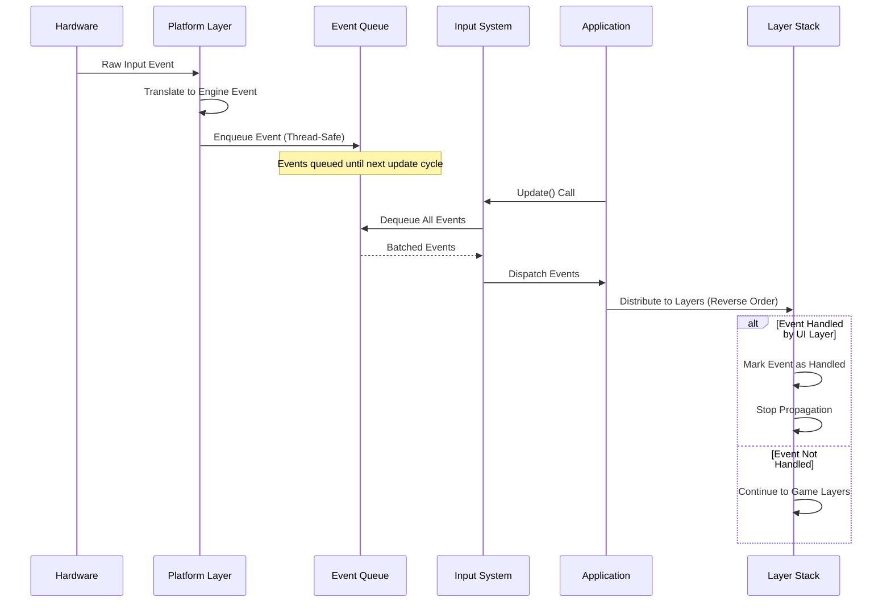
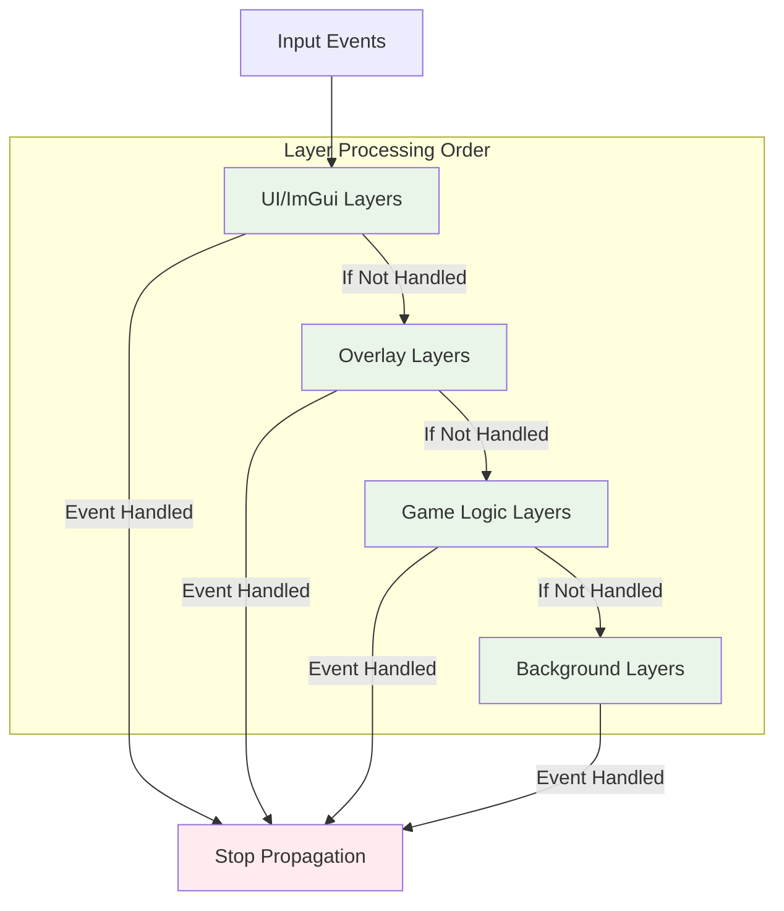

# Input System Architecture

## Overview

The Input System provides platform-independent input handling through a layered architecture. It supports keyboard and mouse input with an event-driven system that ensures thread-safe operation and proper event distribution throughout the application.

**Key Technologies:**
- **Platform Abstraction**: Silk.NET for cross-platform windowing and input
- **Event System**: C# records with immutable event data
- **Thread Safety**: `ConcurrentQueue<T>` for lock-free event queuing
- **DI Integration**: All components registered via DryIoc dependency injection

## Architecture Overview

The Input System follows a layered architecture that separates concerns and provides platform independence through well-defined interfaces.



## Core Components

### Input System Interface

The central coordinator (`IInputSystem`) manages all input operations and provides the primary interface between the platform layer and the application.

**Responsibilities:**
- Manages the input context from the underlying platform (Silk.NET `IInputContext`)
- Provides periodic updates to process queued input events
- Exposes an event for input notifications
- Handles resource cleanup and lifecycle management via `IDisposable`

### Platform Implementation

The Silk.NET implementation (`SilkNetInputSystem`) bridges platform-specific input to the engine's event system:

- Uses thread-safe queuing for event buffering
- Subscribes to Silk.NET keyboard events (KeyDown, KeyUp)
- Subscribes to Silk.NET mouse events (MouseDown, MouseUp, Scroll)
- Translates platform key codes to engine `KeyCodes` enum
- Properly disposes the input context on cleanup

### Event Hierarchy

All input events inherit from a common base using C# records for immutability:

```
Event (abstract record)
├── InputEvent (abstract)
│   ├── KeyEvent (abstract)
│   │   ├── KeyPressedEvent
│   │   └── KeyReleasedEvent
│   └── MouseEvent (abstract)
│       ├── MouseMovedEvent
│       ├── MouseScrolledEvent
│       └── MouseButtonEvent (abstract)
│           ├── MouseButtonPressedEvent
│           └── MouseButtonReleasedEvent
```

**Event Properties:**
- `IsHandled`: Mutable flag to stop event propagation
- `EventType`: Identifies the specific event type
- `EventCategory`: Flags for event filtering (Keyboard, Mouse, Input)

## Event Flow

The event processing follows a clear pipeline that ensures thread safety and proper distribution:



### Processing Principles

1. **Hardware Input Capture**: Raw input events are captured by the platform layer
2. **Event Translation**: Platform events are converted to engine-specific event objects
3. **Thread-Safe Queuing**: Events are queued using thread-safe mechanisms
4. **Batch Processing**: All queued events are processed during the application update cycle
5. **Layer Distribution**: Events are distributed to application layers in priority order
6. **Event Handling**: Layers can mark events as handled to prevent further propagation

## Layer System

### Layer Interface

All application layers implement `ILayer` to receive input and window events:

**Lifecycle Methods:**
- `OnAttach`: Initialize resources when layer is added (graphics initialized at this point)
- `OnDetach`: Clean up resources when layer is removed
- `OnUpdate`: Called every frame for game logic
- `Draw`: Called during ImGui rendering phase

**Event Methods:**
- `HandleInputEvent`: Receives keyboard and mouse input events
- `HandleWindowEvent`: Receives window events (resize, focus, close)

### Event Distribution

The `Application` class orchestrates layer management and event distribution:

- **PushLayer**: Adds game layers to the front of the stack
- **PushOverlay**: Adds UI layers to the back (processed first)
- Events propagate in **reverse order** (overlays first, game layers last)
- If an event is marked as handled, propagation stops immediately



## Thread Safety and Performance

### Design Principles

**Thread Safety:**
- Lock-free enqueue/dequeue operations via `ConcurrentQueue<T>`
- Immutable event data through C# records (only `IsHandled` is mutable)
- Volatile disposed flag prevents event processing after disposal
- Proper `IDisposable` pattern ensures input context cleanup

**Performance Optimizations:**
- Minimal memory allocations through record types
- Batch processing of all events each frame
- Early termination when events are marked as handled
- No per-event allocations in hot paths

## Extensibility

The architecture provides several extension points:

1. **Input Device Expansion**: Interface-based design allows additional input devices
2. **Platform Support**: New platforms can implement the platform abstraction layer
3. **Event Type Extensions**: Hierarchical event system supports new event types
4. **Processing Pipeline**: Layered approach allows custom processing stages

### Potential Enhancements

- Controller support through existing interface patterns
- Touch input for mobile platforms
- Higher-level input mapping systems
- Custom input device support

## Key Files

| Component | Location |
|-----------|----------|
| IInputSystem Interface | `Engine/Core/Input/IInputSystem.cs` |
| SilkNet Implementation | `Engine/Platform/SilkNet/Input/SilkNetInputSystem.cs` |
| KeyCodes Enum | `Engine/Core/Input/KeyCodes.cs` |
| Base Event Class | `Engine/Events/Event.cs` |
| Input Events | `Engine/Events/Input/` |
| ILayer Interface | `Engine/Core/ILayer.cs` |
| Application Class | `Engine/Core/Application.cs` |
| Editor Shortcuts | `Editor/Input/ShortcutManager.cs` |
