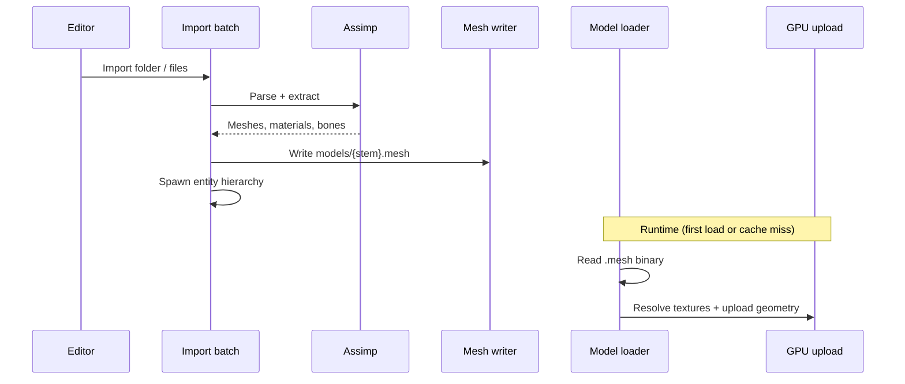

# 3D Model Loading Pipeline

Editor import converts interchange files (FBX, glTF, GLB) via Assimp into versioned `.mesh` binaries. Runtime loads only `.mesh` and draws via `ModelRendererComponent`.

---

## Overview

| Stage | Library / format |
|-------|------------------|
| **Editor import** | Silk.NET.Assimp |
| **Supported interchange** | `.fbx`, `.glb`, `.gltf` only |
| **Intermediate / runtime** | Custom little-endian binary `KULA` / `VERSION=3` (`.mesh`) |
| **Runtime load** | **`.mesh` only** — raw interchange rejected |

Assimp is **not** linked at runtime. Authors must import through **File → Import 3D Model…** before assigning a path on `ModelRendererComponent`.

Other Assimp-capable formats (OBJ, DAE, etc.) are **not** accepted by the editor batch importer.

---

## Import Flow

### Editor: interchange → `.mesh`

1. **Source discovery** — Single supported file or folder; filter to `.fbx` / `.glb` / `.gltf`.
2. **Batch validation** — Duplicate destination stems, overwrite prompt for existing `.mesh`, project assets root required.
3. **Assimp parse** — Split import (default) or single packed file:
   - Tries skinned import first (skeleton + skin weights + animation clips).
   - On failure, falls back to node-hierarchy walk (no baked transforms).
   - Single-file import bakes the node hierarchy into one space (pre-transform vertices post-process).
4. **Post-process flags**:

   | Path | Flags |
   |------|-------|
   | Single packed | Triangulate, generate normals, calculate tangent space, pre-transform vertices |
   | Multi-part | Triangulate, generate normals, calculate tangent space |
   | Skinned | Above + limit bone weights, join identical vertices |

   UV flip is **not** applied — glTF UVs are already OpenGL-style.
5. **Mesh extraction** — Positions, normals, tangents, bitangents, UV channel 0, triangle indices. Skinned path adds top-4 bone indices + normalized weights.
6. **Material extraction** — Albedo, ORM, normal, emissive textures and scalar factors from glTF and legacy Phong material keys.
7. **ORM packing** — Separate AO / roughness / metallic maps packed into one glTF-style ORM image when needed.
8. **Texture relocation** — Resolved texture files copied into `assets/models/textures/`; material paths rewritten to asset-relative strings.
9. **Binary write** — Serialize model (submeshes + optional bones + clips) to `assets/models/{stem}.mesh`.
10. **Scene spawn** (batch) — Parent entity + one child per mesh part, each with `ModelRendererComponent` pointing at the shared `.mesh` and a submesh range.

### Runtime: `.mesh` → GPU draw

1. **Path resolve** — Asset-relative path resolved against project assets root.
2. **Cache check** — Path-keyed cache (case-insensitive); invalidated when file modification time changes.
3. **Extension gate** — Non-`.mesh` paths rejected with a one-time warning.
4. **Binary read** — Validate magic, version (1/2/3), size caps, index bounds.
5. **GPU upload** — Per submesh: resolve material textures, then upload VAO/VBO/IBO (CPU vertex/index data released after init).
6. **Draw** — Scene render pipeline loads model per component, enumerates submesh range, draws with optional bone palette for skinned meshes.

---

## Vertex Layout

Each vertex is **88 bytes** (22 floats): position, normal, UV, tangent, bitangent, four bone indices (stored as floats for macOS compatibility), four bone weights. Indices are `uint32` triangle lists.

| Attribute | Notes |
|-----------|-------|
| Position | World/import space at write time |
| Normal | Generated by Assimp if missing |
| TexCoord | UV channel 0 only |
| Tangent / bitangent | From tangent-space calculation |
| Bone indices / weights | Top 4 influences, normalized; zero when rigid |

**Binary versions:**

| Version | Vertex payload | Skeleton / clips |
|---------|----------------|------------------|
| 1 | 14 floats (no bones) | none |
| 2 | 14 floats | none; adds base color factor, emissive, alpha mode |
| 3 | 14 floats + bones | Bones + animation clips after submeshes |

Vertex layout in the GPU upload must match the binary layout exactly — a stride mismatch causes visual corruption at draw time.

---

## Material and Texture Resolution

### Import-time

| Slot | Sources (first hit wins) | Notes |
|------|--------------------------|-------|
| Albedo | Base color, then diffuse | Path + color factor |
| Metallic-roughness | glTF MR map, or packed from metalness + roughness + AO | ORM layout: R=AO, G=roughness, B=metallic |
| Normal | Normals, then height | |
| Emissive | Emissive map | Path + emissive factor |

**Path resolution order:**

1. Embedded ref (`*0`, `*1`, …) → extract compressed blob to temp cache (content-hash dedup).
2. External path → absolute if exists, else relative to model dir, else filename search under model dir.
3. Missing / failed → null path; warning logged.

After all submeshes are built, textures are relocated to `assets/models/textures/` and asset-relative paths are stored in the `.mesh` binary.

**Legacy Phong heuristics** — diffuse color → base color factor; shininess → roughness when no MR map; metallic default clamped to dielectric when no MR map.

### Runtime

| Step | Behavior |
|------|----------|
| Path resolve | Asset-relative string from binary → full path under assets root |
| Security | Paths outside assets root rejected |
| Color space | Albedo/emissive decoded as sRGB; metallic-roughness and normal as linear |
| Missing map | Null texture — draw binds white or flat-normal fallbacks |
| Cache | Texture path cache (separate from model cache) |

---

## `.mesh` Binary Format (KULA)

| Field | Value |
|-------|-------|
| Magic | `"KULA"` (4 ASCII bytes) |
| Version | `3` (writer); reader accepts `1`, `2`, `3` |
| Submesh count | `uint32` |
| Per submesh | Name, vertices, indices, material scalars + path strings + PBR fields |
| Skeleton (v3) | Bone count, per bone: name, parent index, inverse bind matrix |
| Clips (v3) | Clip count, per clip: name, duration, keyed position/rotation/scale channels |

**Reader hard caps** (malformed files): max 65 536 submeshes, 5 M vertices/submesh, 15 M indices/submesh, 4 096-byte strings, 100 bones.

Output path: `assets/models/{stem}.mesh`. Split import packs all parts into **one** `.mesh` with ordered submeshes; child entities reference ranges via `SubmeshStart` / `SubmeshCount`.

---

## Import-Time Optimization

| Technique | Present? |
|-----------|----------|
| Triangulation | Yes |
| Normal generation | Yes |
| Tangent space | Yes |
| Vertex dedup | Skinned import only |
| Bone weight limit | Yes (skinned) |
| Vertex cache reorder | **No** |
| LOD generation | **No** |
| Mesh simplification | **No** |

---

## Error Handling

| Failure | Behavior |
|---------|----------|
| Assimp incomplete / null scene | Empty result; error logged |
| No meshes after import | Import fails with message |
| Skeleton > 100 bones | Import fails |
| ORM pack exception | Warning; falls back to source ORM path |
| Texture missing on disk | Warning; null path stored |
| Embedded uncompressed texture | Warning; extraction skipped |
| `.mesh` magic / version invalid | Read throws |
| Index out of vertex range | Read throws |
| Non-`.mesh` at runtime | Null model, one-time warning |
| Model file missing | Null, one-time warning |
| Single submesh GPU init fails | Warning; submesh skipped; others still load |
| All submeshes fail init | Null model |
| Load failure at draw time | Unit-cube fallback |

Editor batch import surfaces per-file errors; partial batch success is allowed.

---

## Runtime Component Usage

`ModelRendererComponent` fields:

| Field | Purpose |
|-------|---------|
| `ModelPath` | Asset-relative `.mesh` path |
| `Color` | Tint multiplied with material base color |
| `MetallicOverride` / `RoughnessOverride` | Optional per-entity PBR overrides |
| `SubmeshStart` / `SubmeshCount` | Draw slice into shared `.mesh` (`SubmeshCount = -1` → all) |
| `BonePalette` / `SkinningWorld` | Runtime skinning (set by skeletal playback; not serialized) |

**Draw fallbacks**: empty path or load failure → unit cube; `builtin:sphere` → procedural sphere.

---

## Current Limitations

| Limitation | Detail |
|------------|--------|
| Editor accepts only `.fbx`, `.glb`, `.gltf` | Extension filter on batch importer |
| Runtime cannot load interchange formats | `.mesh` only |
| No LOD or mesh simplification | Not implemented |
| No vertex cache optimization | Not implemented |
| Uncompressed embedded textures unsupported | Extraction skipped with warning |
| Max 100 bones per skeleton | Hard cap |
| At most 4 bone influences per vertex | Top 4 kept |
| Single UV channel (index 0) | No secondary UVs |
| ORM sidecar images written beside source during import | Before relocation to assets |
| Single-file import bakes hierarchy away | Pre-transform vertices post-process |
| CPU mesh data inaccessible after GPU upload | By design |
| Texture paths outside project assets rejected | At runtime load |

---

## Related Documentation

- [Rendering Pipeline](rendering-pipeline.md) — model draw path, PBR material fields
- [Material System](material-system.md) — material data model and binding
- [3D Rendering](../guide/concepts/3d-rendering.md) — user-facing setup for lights, materials, and model assignment
