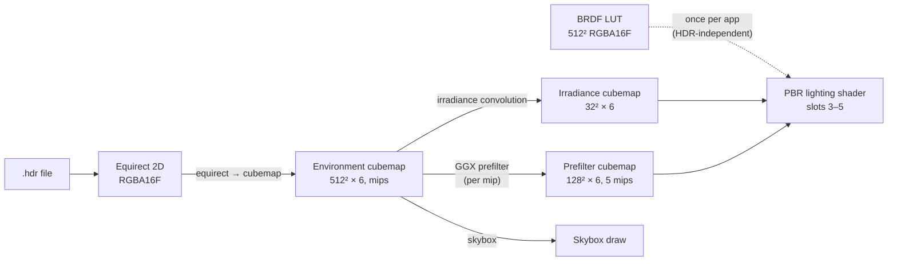

# PBR / IBL System

Image-based lighting (IBL) supplies diffuse and specular ambient for metallic-roughness PBR meshes. A scene `SkyLightComponent` points at an HDR equirectangular environment; the engine precomputes cubemaps and a split-sum BRDF LUT on the GPU, then samples them during mesh shading.

---

## Overview

Analytic lights handle direct illumination well, but they do not model the full hemisphere of incoming radiance that real surfaces receive. IBL fills that gap with prefiltered environment data:

| Need | IBL resource | Runtime sampling |
|------|--------------|------------------|
| Diffuse ambient (indirect) | **Irradiance cubemap** — cosine-weighted convolution of the environment | Normal direction → irradiance |
| Specular reflections (indirect) | **Prefiltered environment cubemap** — GGX importance-sampled mips per roughness | Reflection vector + roughness → prefiltered color |
| Fresnel + geometry split-sum | **BRDF integration LUT** (2D, shared across environments) | N·V and roughness → scale factors |

The **environment cubemap** (full HDR sky) is used only for the visible skybox background, not for per-pixel PBR sampling.

**Where it sits in the 3D frame:**

1. Resolve `SkyLightComponent` → activate environment (may trigger GPU precompute on first use of that HDR path)
2. Directional shadow pass → point-light cubemap shadow pass
3. Skybox draw — samples the environment cubemap
4. Opaque PBR draws → transparent PBR draws — irradiance, prefilter, and BRDF LUT sampled when IBL is active

Without a sky light (or on generation failure), meshes fall back to scaled ambient color; metals get a small residual so they are not pure black.

**Entry point**: The scene render pass resolves the first `SkyLightComponent` each frame and activates its HDR environment for 3D drawing.

---

## Pipeline Stages

All IBL GPU work runs on the OpenGL backend. There is **no disk cache** — maps are built on the GPU and kept in an in-memory path cache for the process lifetime.

**Ordered stages** (per HDR path, first load):

| Step | Input → output |
|------|----------------|
| 1. Decode HDR | `.hdr` → CPU float RGB (vertical flip on load) |
| 2. Upload equirect | CPU → transient `RGBA16F` 2D texture |
| 3. Equirect → cubemap | Equirect → environment cubemap (6 faces, mip 0) |
| 4. Environment mips | Full mip chain for importance sampling in prefilter |
| 5. Irradiance | Environment cubemap → 32² irradiance cubemap |
| 6. Prefilter | Environment cubemap → 128² prefilter cubemap, 5 roughness mips |
| 7. BRDF LUT | Fullscreen pass → 512² LUT (**once per app**, not per HDR) |

**When relative to scene load**: Nothing is precomputed at engine init. The first frame that activates a new HDR path runs steps 1–6 synchronously on the render thread. The BRDF LUT is created on first need (before mesh draws, so LUT generation does not interrupt an active draw).

---

## Texture Formats, Resolutions, and Mips

| Stage | Resolution | Format | Mip levels | Filter |
|-------|------------|--------|------------|--------|
| Equirect (transient) | Source HDR width × height | `RGBA16F` 2D | 0 only | Linear, clamp |
| Environment cubemap | **512** × 512 × 6 faces | `RGBA16F` cubemap | Full chain | `LinearMipmapLinear` |
| Irradiance cubemap | **32** × 32 × 6 | `RGBA16F` cubemap | 0 only | Linear |
| Prefilter cubemap | **128** down to **8** × 6 | `RGBA16F` cubemap | **5** mips | `LinearMipmapLinear` |
| BRDF LUT | **512** × **512** | `RGBA16F` 2D (`.rg` used) | 0 only | Linear, clamp |

**Prefilter mip → roughness mapping:**

| Mip | Face size | Roughness |
|-----|-----------|-----------|
| 0 | 128 | 0.0 |
| 1 | 64 | 0.25 |
| 2 | 32 | 0.5 |
| 3 | 16 | 0.75 |
| 4 | 8 | 1.0 |

`MAX_REFLECTION_LOD` = **4.0** (one less than mip count), matching `roughness × MAX_REFLECTION_LOD` in the fragment shader.

**Fallback cubemap**: 1×1 × 6 faces, `RGBA8`, bound when IBL is off so samplers stay valid.

---

## Runtime Binding

The PBR lighting shader uses a fixed texture-unit layout shared with shadows and material maps:

| Slot | Content | When IBL off |
|------|---------|--------------|
| 0–2 | Albedo, metallic-roughness, normal | Material or white/flat fallbacks |
| **3** | **Irradiance cubemap** | Black cubemap |
| **4** | **Prefilter cubemap** | Black cubemap |
| **5** | **BRDF LUT** | White texture |
| 6–7 | Directional + point shadow maps | Shadow or black cubemap |
| 8 | Emissive | Material or black |

Sampler unit indices are set once at init. Each PBR draw binds irradiance and prefilter from the active environment (or black cubemap), sets an IBL enable flag and intensity, and binds the shared BRDF LUT when IBL is active.

**Split-sum ambient** (conceptual): sample irradiance along the surface normal for diffuse; sample the prefiltered cubemap along the reflection vector at a mip level derived from roughness; combine with Fresnel and the BRDF LUT for specular. A simple specular occlusion term scales specular by ambient occlusion and roughness.

The skybox samples only the environment cubemap (not irradiance/prefilter), with intensity applied at draw time.

---

## Known Limitations

| Topic | Detail |
|-------|--------|
| **OpenGL only** | IBL generation is not implemented on other renderer backends |
| **HDR format** | Equirectangular radiance `.hdr` only |
| **No disk precompute** | Full GPU pipeline on first use per path |
| **First-frame hitch** | Generation runs synchronously when a new environment is activated |
| **Failed load sticky** | Missing/invalid HDR cached as failure; errors logged once |
| **Single sky light** | First `SkyLightComponent` wins; no blending |
| **HDR vertical orientation** | Vertical flip on load is the calibration knob if skies appear upside down |
| **Irradiance HDR sun** | Bright texels are not clamped during irradiance convolution so a sunny HDR sun can dominate (clamping would bias toward cyan sky) |
| **No IBL fallback** | Metals without IBL use reduced ambient scale |
| **Transient equirect** | Upload texture deleted after environment cubemap build |

---

## Related Documentation

- [Rendering Pipeline](rendering-pipeline.md) — full 3D frame order, texture unit summary, sky light hook
- [3D Rendering](../guide/concepts/3d-rendering.md) — user-facing sky light setup
