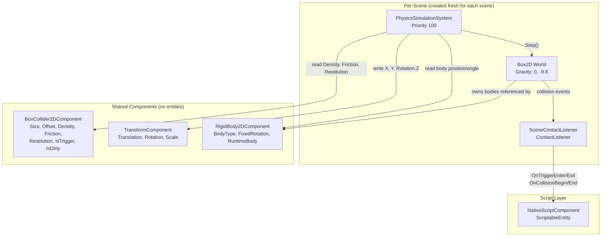
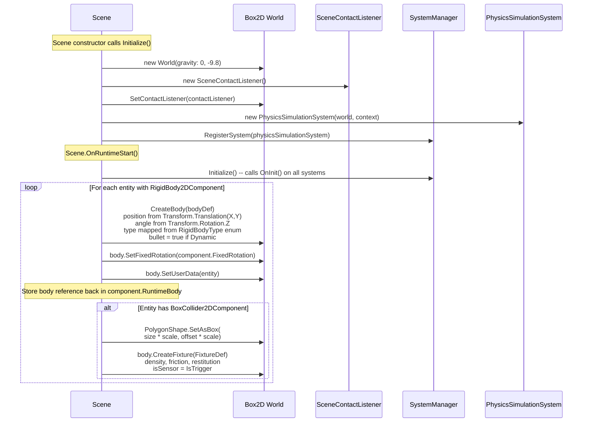
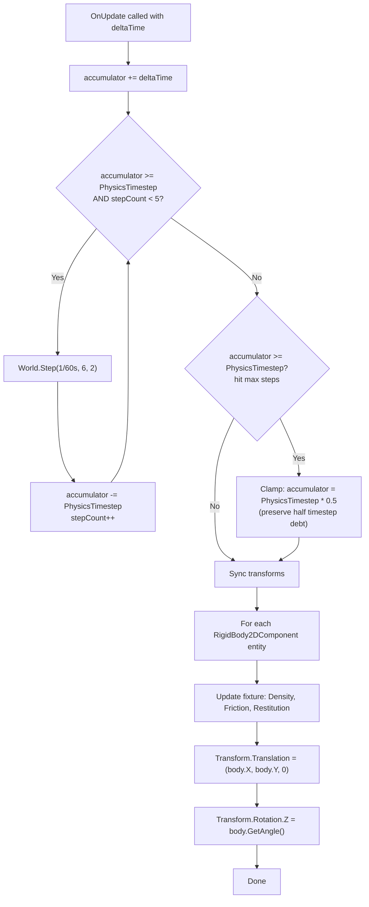
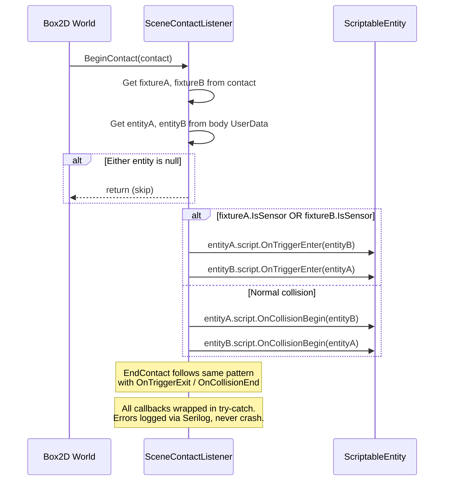

# Physics System

2D physics via Box2D (Box2D.NetStandard). Each scene owns its own Box2D `World` with a fixed timestep accumulator. Runs at priority 100 (first system to execute), ensuring scripts (110) and rendering (150+) see updated positions.

## C4 Level 3 -- Component Diagram

## Components

### RigidBody2DComponent

**File**: `Engine/Scene/Components/RigidBody2DComponent.cs`

| Property | Type | Notes |
|---|---|---|
| `BodyType` | `RigidBodyType` enum | Static, Dynamic, Kinematic |
| `FixedRotation` | `bool` | Prevents angular rotation |
| `RuntimeBody` | `Body` | Box2D body instance. `[JsonIgnore]` -- created at runtime during `OnRuntimeStart` |

`Clone()` copies `BodyType` and `FixedRotation` only. `RuntimeBody` is set to `null` (owned by the physics world, not the component).

### BoxCollider2DComponent

**File**: `Engine/Scene/Components/BoxCollider2DComponent.cs`

| Property | Type | Default | Notes |
|---|---|---|---|
| `Size` | `Vector2` | `(0.5, 0.5)` | Half-extents for `SetAsBox` |
| `Offset` | `Vector2` | `(0, 0)` | Center offset from body origin |
| `Density` | `float` | `1.0` | Sets `IsDirty` on change |
| `Friction` | `float` | `0.5` | Sets `IsDirty` on change |
| `Restitution` | `float` | `0.7` | Sets `IsDirty` on change |
| `RestitutionThreshold` | `float` | `0.5` | |
| `IsTrigger` | `bool` | `false` | Marks fixture as sensor |
| `IsDirty` | `bool` | `true` | `[JsonIgnore]`, initially dirty for first-time setup |

`Density`, `Friction`, and `Restitution` use backing fields with dirty-tracking setters. `ClearDirtyFlag()` resets after sync.

## Physics World Initialization

Key detail: collider size and offset are multiplied by `TransformComponent.Scale` at creation time. This means scale changes after runtime start are not reflected in the collider shape.

## Fixed Timestep Simulation

**File**: `Engine/Scene/Systems/PhysicsSimulationSystem.cs`

| Constant | Value | Source |
|---|---|---|
| `PhysicsTimestep` | `1/60s` (16.67ms) | `CameraConfig.PhysicsTimestep` |
| `MaxPhysicsStepsPerFrame` | `5` | Caps catch-up at ~83ms |
| Velocity iterations | `6` | Hardcoded in `OnUpdate` |
| Position iterations | `2` | Hardcoded in `OnUpdate` |

The spiral-of-death prevention clamps to half a timestep rather than zero, preserving partial time debt for smoother recovery.

## Transform Synchronization

After all physics steps complete, `PhysicsSimulationSystem.OnUpdate` iterates every entity with `RigidBody2DComponent`:

1. Reads fixture properties from `BoxCollider2DComponent` and writes them to the Box2D fixture (runtime property sync for Density, Friction, Restitution).
2. Reads Box2D body position and writes to `TransformComponent.Translation` -- **X and Y only**. Z is set to `0` (not preserved from the original transform).
3. Reads Box2D body angle and writes to `TransformComponent.Rotation.Z` only (via `with` expression, preserving X and Y rotation).

Because this runs at priority 100, all downstream systems see the physics-updated positions:
- ScriptUpdateSystem (110) -- scripts read correct positions
- AudioSystem (120) -- spatial audio uses correct positions
- AnimationSystem (140) -- animations layer on top
- SpriteRenderSystem (150) / SubTextureRenderSystem (160) -- render at correct positions
- PhysicsDebugRenderSystem (180) -- debug overlay matches

## Collision Callbacks

**File**: `Engine/Scene/SceneContactListener.cs`

Extends Box2D `ContactListener`. Called by the Box2D world during `World.Step()`.

Callback details:
- Both entities are notified (bidirectional). Entity A is told about B, and B is told about A.
- Only entities with `NativeScriptComponent` and a non-null `ScriptableEntity` receive callbacks.
- `PreSolve` and `PostSolve` are implemented as no-ops (overridden but empty).
- Trigger detection checks if **either** fixture is a sensor, not both.

## Per-Scene Lifecycle

`PhysicsSimulationSystem` is the **only** per-scene system. All other systems (rendering, scripting, audio, animation) are shared singletons registered via `ISceneSystemRegistry`.

| Event | What happens |
|---|---|
| Scene constructor | `Initialize()` creates Box2D `World(0, -9.8)`, `SceneContactListener`, `PhysicsSimulationSystem`. Registers system in `SystemManager`. |
| `OnRuntimeStart()` | `SystemManager.Initialize()` calls `OnInit()`. Then iterates entities to create Box2D bodies and fixtures. |
| `OnUpdateRuntime(ts)` | `SystemManager.Update(ts)` runs all systems in priority order. Physics steps first (100). |
| `OnRuntimeStop()` | `SystemManager.Shutdown()` calls `OnShutdown()`. Physics system destroys all Box2D bodies, clears `RuntimeBody` references, clears body UserData. |
| Scene disposal | `SystemManager.Dispose()` calls `Dispose()` on `PhysicsSimulationSystem`. Box2D World is garbage collected (no `IDisposable`). |

Each scene can have different gravity (currently hardcoded to `(0, -9.8)` in `Scene.Initialize()`). Shared singleton systems survive scene changes.
