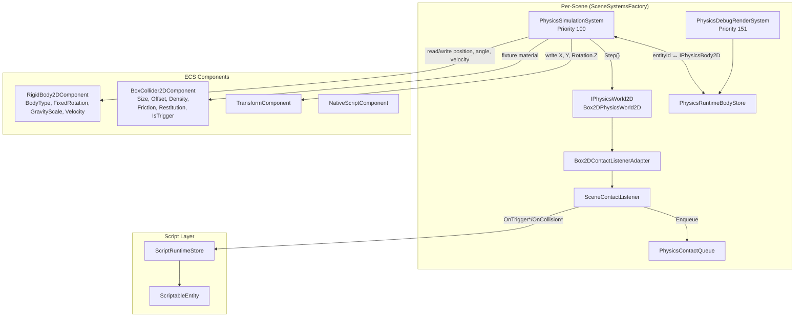
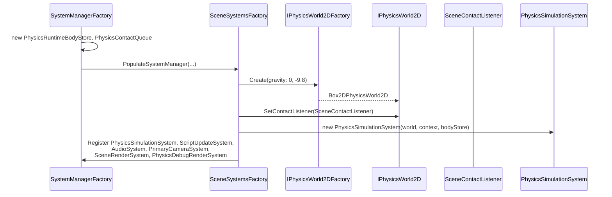
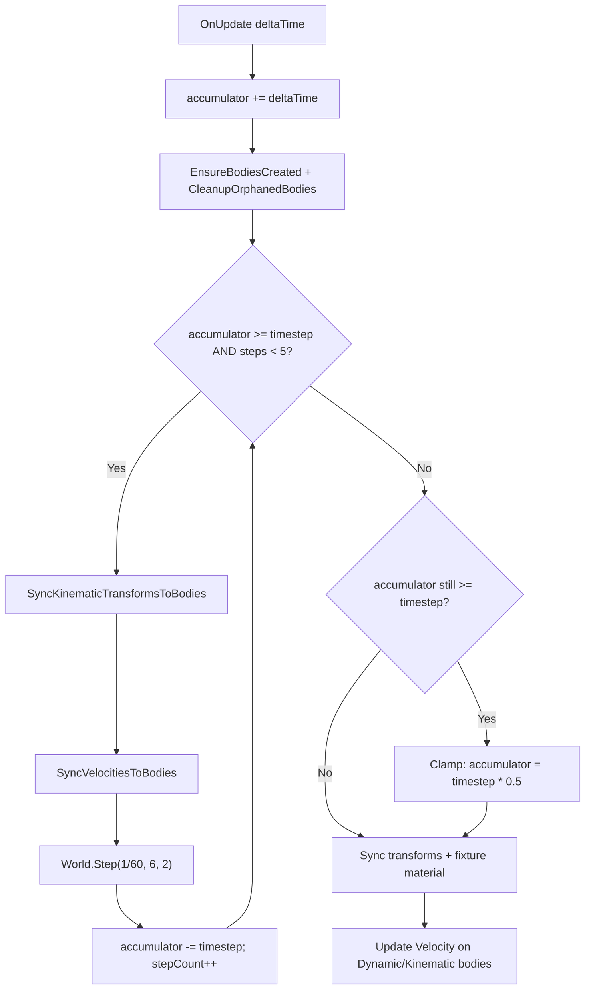
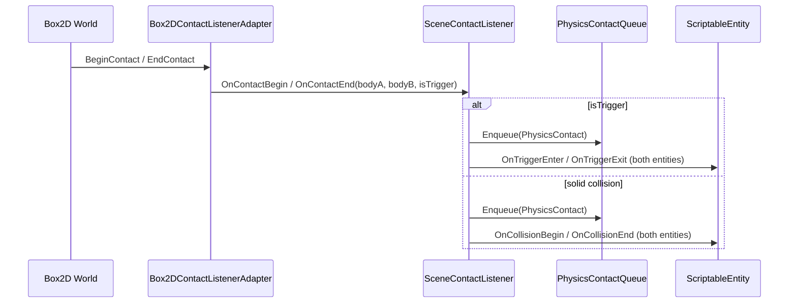

# Physics System

2D physics via a platform-abstracted `IPhysicsWorld2D` API (Box2D backend in `Engine/Platform/Box2D/`). Each scene owns its own physics world, body store, and contact queue. `PhysicsSimulationSystem` runs at priority 100 so scripts (110) and rendering (150+) see updated transforms.

---

## C4 Level 3 — Component Diagram


```mermaid
graph TB
    subgraph "Per-Scene (SceneSystemsFactory)"
        PSS[PhysicsSimulationSystem<br/>Priority 100]
        PDR[PhysicsDebugRenderSystem<br/>Priority 151]
        PW[IPhysicsWorld2D<br/>Box2DPhysicsWorld2D]
        BS[PhysicsRuntimeBodyStore]
        CQ[PhysicsContactQueue]
        SCL[SceneContactListener]
        CLA[Box2DContactListenerAdapter]
    end

    subgraph "ECS Components"
        RB[RigidBody2DComponent<br/>BodyType, FixedRotation,<br/>GravityScale, Velocity]
        BC[BoxCollider2DComponent<br/>Size, Offset, Density,<br/>Friction, Restitution, IsTrigger]
        TC[TransformComponent]
        NSC[NativeScriptComponent]
    end

    subgraph "Script Layer"
        SRS[ScriptRuntimeStore]
        SE[ScriptableEntity]
    end

    PSS -->|"Step()"| PW
    PW --> CLA
    CLA --> SCL
    SCL -->|"Enqueue"| CQ
    SCL -->|"OnTrigger*/OnCollision*"| SRS
    SRS --> SE
    PSS <-->|"entityId ↔ IPhysicsBody2D"| BS
    PSS -->|"read/write position, angle, velocity"| RB
    PSS -->|"write X, Y, Rotation.Z"| TC
    PSS -->|"fixture material"| BC
    PDR --> BS
```

---

## Platform Abstraction

The engine core depends on interfaces in `Engine/Physics/`; Box2D types stay in `Engine/Platform/Box2D/`.

| Type | File | Role |
|---|---|---|
| `IPhysicsWorld2D` | `Engine/Physics/IPhysicsWorld2D.cs` | Extends `IPhysicsQueries`; `Step`, `CreateBody`, `DestroyBody`, `SetContactListener`, `IDisposable` |
| `IPhysicsBody2D` | `Engine/Physics/IPhysicsBody2D.cs` | `Entity`, position, angle, velocity, `MotionType`, fixture create/material update, `IsAwake` / `IsEnabled` |
| `IPhysicsContactListener` | `Engine/Physics/IPhysicsContactListener.cs` | `OnContactBegin` / `OnContactEnd` with `isTrigger` flag |
| `IPhysicsQueries` | `Scripting/IPhysicsQueries.cs` | `Raycast`, `OverlapCircle` (optional `ignoreEntity`, `includeTriggers`) |
| `RaycastHit2D` | `Scripting/RaycastHit2D.cs` | `Entity`, `Point`, `Normal`, `Distance`, `IsTrigger` |
| `IPhysicsWorld2DFactory` | `Engine/Physics/IPhysicsWorld2DFactory.cs` | Creates backend world for a gravity vector |
| `PhysicsWorld2DFactory` | `Engine/Physics/PhysicsWorld2DFactory.cs` | Selects backend from `IPhysicsBackendConfig` |
| `IPhysicsBackendConfig` | `Engine/Physics/IPhysicsBackendConfig.cs` | Exposes `PhysicsBackendType` |
| `PhysicsBackendConfig` | `Engine/Physics/PhysicsBackendConfig.cs` | Default DI registration (`Box2D`) |
| `PhysicsBackendType` | `Engine/Physics/PhysicsBackendType.cs` | `None`, `Box2D` |
| `Box2DPhysicsWorld2D` | `Engine/Platform/Box2D/Box2DPhysicsWorld2D.cs` | Wraps Box2D `World`; implements queries via `World.RayCast` / `QueryAABB` |
| `Box2DPhysicsBody2D` | `Engine/Platform/Box2D/Box2DPhysicsBody2D.cs` | Wraps Box2D `Body`; stores `Entity` on wrapper |
| `Box2DContactListenerAdapter` | `Engine/Platform/Box2D/Box2DContactListenerAdapter.cs` | Bridges Box2D `ContactListener` to `IPhysicsContactListener` |

Body and fixture creation use value-type defs:

| Struct | File | Fields |
|---|---|---|
| `PhysicsBodyDef` | `Engine/Physics/PhysicsBodyDef.cs` | `Position`, `Angle`, `MotionType`, `FixedRotation`, `GravityScale` |
| `PhysicsBoxFixtureDef` | `Engine/Physics/PhysicsBoxFixtureDef.cs` | `HalfWidth`, `HalfHeight`, `CenterOffset`, `Density`, `Friction`, `Restitution`, `IsSensor` |
| `PhysicsBodyMotionType` | `Engine/Physics/PhysicsBodyMotionType.cs` | `Static`, `Dynamic`, `Kinematic` |

Dynamic bodies are created with `bullet = true` in the Box2D backend to reduce tunneling.

---

## ECS Components

Physics systems read `RigidBody2DComponent`, `BoxCollider2DComponent`, and `TransformComponent`. Component types live under `SceneComponents/Physics/`.

Properties referenced by `PhysicsSimulationSystem`:

### RigidBody2DComponent

| Property | Used for |
|---|---|
| `BodyType` | Maps to `PhysicsBodyMotionType` at body creation |
| `FixedRotation` | Passed to `PhysicsBodyDef` |
| `GravityScale` | Passed to `PhysicsBodyDef` |
| `Velocity` | Written to body before each step (Dynamic/Kinematic); read back after sync |

### BoxCollider2DComponent

| Property | Used for |
|---|---|
| `Size` | Half-extents; multiplied by transform scale at fixture creation |
| `Offset` | Center offset; multiplied by transform scale at fixture creation |
| `Density`, `Friction`, `Restitution` | Initial fixture + per-frame `UpdateFixtureMaterial` |
| `IsTrigger` | Fixture sensor flag (`PhysicsBoxFixtureDef.IsSensor`) |
| `RestitutionThreshold` | Serialized on component; not read by `PhysicsSimulationSystem` or the Box2D backend |

Collider size and offset are multiplied by `TransformComponent.Scale` when the body is first created. Scale changes after that are not reflected in the collider shape.

Bodies are **not** stored on the component. Runtime mapping is `PhysicsRuntimeBodyStore` keyed by entity ID.

`BoxCollider2DComponent` is required for post-step transform and velocity sync — `PhysicsSimulationSystem` skips entities that have `RigidBody2DComponent` but no collider in its sync loop, even though a body may have been created for them.

---

## Scene Wiring

**File**: `Engine/Scene/SceneSystemsFactory.cs`


```mermaid
sequenceDiagram
    participant SMF as SystemManagerFactory
    participant SSF as SceneSystemsFactory
    participant F as IPhysicsWorld2DFactory
    participant W as IPhysicsWorld2D
    participant CL as SceneContactListener
    participant PSS as PhysicsSimulationSystem

    SMF->>SMF: new PhysicsRuntimeBodyStore, PhysicsContactQueue
    SMF->>SSF: PopulateSystemManager(...)
    SSF->>F: Create(gravity: 0, -9.8)
    F-->>W: Box2DPhysicsWorld2D
    SSF->>W: SetContactListener(SceneContactListener)
    SSF->>PSS: new PhysicsSimulationSystem(world, context, bodyStore)
    SSF->>SMF: Register PhysicsSimulationSystem, ScriptUpdateSystem,<br/>AudioSystem, PrimaryCameraSystem,<br/>SceneRenderSystem, PhysicsDebugRenderSystem
```

Default gravity is `(0, -9.8)` in `SceneSystemsFactory.DefaultGravity`.

`Scene.PhysicsContacts` exposes the per-scene `PhysicsContactQueue` as `IPhysicsContacts` for tier-2 `IGameSystem` scripts. `Scene.PhysicsQueries` exposes the same scene's `IPhysicsWorld2D` as `IPhysicsQueries`.

When no scene is active, DI resolves `NullPhysicsContacts.Instance` and `NullPhysicsQueries.Instance` (both return empty/null results).

---

## Body Lifecycle

**File**: `Engine/Scene/Systems/PhysicsSimulationSystem.cs`

Bodies are created lazily in `EnsureBodiesCreated()` — called from `OnInit` and every `OnUpdate`. An entity with `RigidBody2DComponent` + `TransformComponent` gets a body when it enters the store's view; if it also has `BoxCollider2DComponent`, a box fixture is added immediately.

`CleanupOrphanedBodies()` destroys bodies whose entity no longer has `RigidBody2DComponent`.

| Event | What happens |
|---|---|
| `OnInit` | Reset accumulator; `EnsureBodiesCreated()` |
| `OnUpdate` | Fixed timestep steps; sync transforms and velocities; `CleanupOrphanedBodies()` |
| `OnShutdown` | `DestroyBody` for every entry in `PhysicsRuntimeBodyStore`; `Clear()` |
| `Dispose` | `physicsWorld.Dispose()` |

---

## Fixed Timestep Simulation

**File**: `Engine/Scene/Systems/PhysicsSimulationSystem.cs`

| Constant | Value | Source |
|---|---|---|
| `PhysicsTimestep` | `1/60` s | `PhysicsConstants.PhysicsTimestep` |
| `MaxPhysicsStepsPerFrame` | `5` | `PhysicsSimulationSystem` |
| Velocity iterations | `6` | Hardcoded in `OnUpdate` |
| Position iterations | `2` | Hardcoded in `OnUpdate` |


```mermaid
flowchart TD
    A[OnUpdate deltaTime] --> B[accumulator += deltaTime]
    B --> C[EnsureBodiesCreated + CleanupOrphanedBodies]
    C --> D{accumulator >= timestep AND steps < 5?}
    D -->|Yes| E[SyncKinematicTransformsToBodies]
    E --> F[SyncVelocitiesToBodies]
    F --> G["World.Step(1/60, 6, 2)"]
    G --> H[accumulator -= timestep; stepCount++]
    H --> D
    D -->|No| I{accumulator still >= timestep?}
    I -->|Yes| J["Clamp: accumulator = timestep * 0.5"]
    I -->|No| K[Sync transforms + fixture material]
    J --> K
    K --> L[Update Velocity on Dynamic/Kinematic bodies]
```

Before each physics step, kinematic bodies copy transform position/angle into the body. Dynamic and kinematic bodies copy `RigidBody2DComponent.Velocity` into the body.

After all steps, for each entity with rigidbody, collider, and a stored body:

1. `UpdateFixtureMaterial` for density, friction, restitution (no-op inside backend when unchanged).
2. `Transform.Translation` ← body position (X, Y; Z set to `0`).
3. `Transform.Rotation.Z` ← body angle (X/Y rotation preserved via `with`).
4. `RigidBody2DComponent.Velocity` ← body linear velocity (Dynamic/Kinematic only).

---

## System Priorities

**File**: `Engine/Scene/Systems/SystemPriorities.cs`

| Priority | System |
|---|---|
| 100 | `PhysicsSimulationSystem` |
| 110 | `ScriptUpdateSystem` |
| 120 | `AudioSystem` |
| 145 | `PrimaryCameraSystem` |
| 150 | `SceneRenderSystem` |
| 151 | `PhysicsDebugRenderSystem` |

---

## Collision Callbacks

**Files**: `Engine/Scene/SceneContactListener.cs`, `Engine/Platform/Box2D/Box2DContactListenerAdapter.cs`

Box2D fires during `World.Step()`. The adapter resolves `IPhysicsBody2D` wrappers and whether **either** fixture is a sensor.

`SceneContactListener` then:

1. Enqueues a `PhysicsContact` record on `PhysicsContactQueue` (for `IPhysicsContacts.DrainContacts()`).
2. Notifies `ScriptableEntity` via `ScriptRuntimeStore` when the entity has `NativeScriptComponent`.


```mermaid
sequenceDiagram
    participant W as Box2D World
    participant A as Box2DContactListenerAdapter
    participant CL as SceneContactListener
    participant Q as PhysicsContactQueue
    participant SE as ScriptableEntity

    W->>A: BeginContact / EndContact
    A->>CL: OnContactBegin / OnContactEnd(bodyA, bodyB, isTrigger)

    alt isTrigger
        CL->>Q: Enqueue(PhysicsContact)
        CL->>SE: OnTriggerEnter / OnTriggerExit (both entities)
    else solid collision
        CL->>Q: Enqueue(PhysicsContact)
        CL->>SE: OnCollisionBegin / OnCollisionEnd (both entities)
    end
```

Callbacks are bidirectional (A notified about B and B about A). Errors are logged via Serilog and do not propagate. `PreSolve` and `PostSolve` in the adapter are no-ops.

**File**: `Scripting/IPhysicsContacts.cs`

```csharp
public readonly record struct PhysicsContact(Entity Self, Entity Other, bool IsTrigger, bool IsBegin);
```

---

## World Queries

**Files**: `Scripting/IPhysicsQueries.cs`, `Engine/Platform/Box2D/Box2DPhysicsWorld2D.cs`, `Scripting/ScriptableEntity.cs`

`IPhysicsWorld2D` extends `IPhysicsQueries`. Queries are synchronous reads during the current frame — they do not enqueue contacts or fire script callbacks.

| Method | Behavior |
|---|---|
| `Raycast(origin, direction, maxDistance, ignoreEntity?, includeTriggers?)` | Closest hit along the ray; ignores triggers unless `includeTriggers` is true |
| `OverlapCircle(center, radius, ignoreEntity?, includeTriggers?)` | First overlapping fixture in the AABB query (order unspecified when several overlap) |

`Box2DPhysicsWorld2D` resolves fixtures through body `UserData` (`Box2DPhysicsBody2D.Entity`). Invalid rays/circles (non-finite values, zero length/radius) return null.

Access paths:

- **Tier 2** — inject `IPhysicsQueries` from DI (`Scene.PhysicsQueries` when a scene is active).
- **Scripts** — `ScriptableEntity` protected `Raycast` / `OverlapCircle` forward to DI with `ignoreEntity` set to the script's entity.

---

## Debug Visualization

**File**: `Engine/Scene/Systems/PhysicsDebugRenderSystem.cs`

When `DebugSettings.ShowColliderBounds` is true, draws collider rectangles via `PhysicsDebugDrawer` (`Engine/Physics/PhysicsDebugDrawer.cs`) using live body positions from `PhysicsRuntimeBodyStore`. Colors reflect body type and awake state.

---

## Per-Scene Lifecycle Summary

| Event | What happens |
|---|---|
| Scene construction | `SystemManagerFactory` creates body store, contact queue, script store; `SceneSystemsFactory` registers per-scene systems including physics world |
| `OnRuntimeStart()` | `SystemManager.Initialize()` → `PhysicsSimulationSystem.OnInit()` creates initial bodies |
| `OnUpdateRuntime(ts)` | `SystemManager.Update(ts)` — physics steps first (100) |
| `OnRuntimeStop()` | `SystemManager.Shutdown()` destroys all bodies |
| Scene `Dispose()` | `SystemManager.Dispose()` disposes `PhysicsSimulationSystem` and the physics world |
