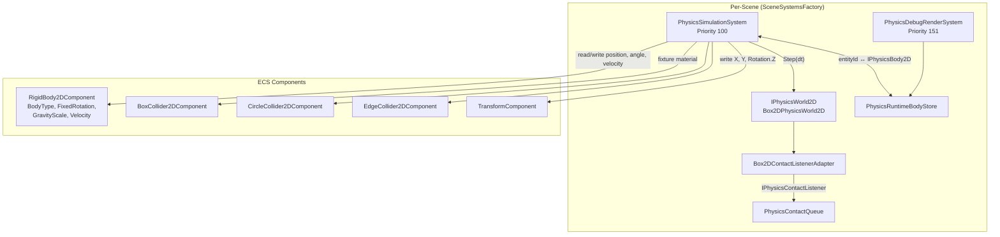
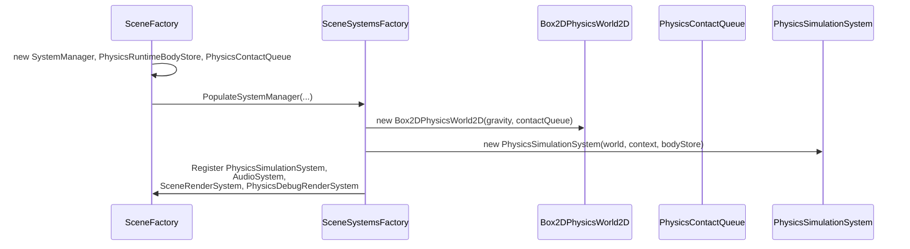
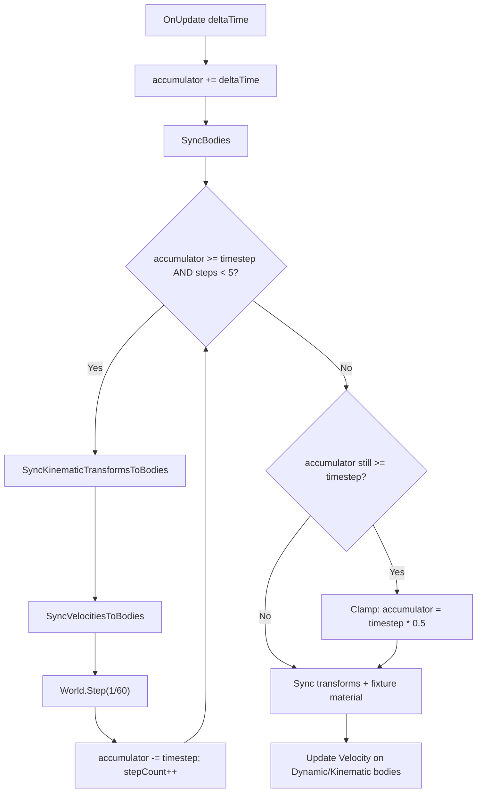
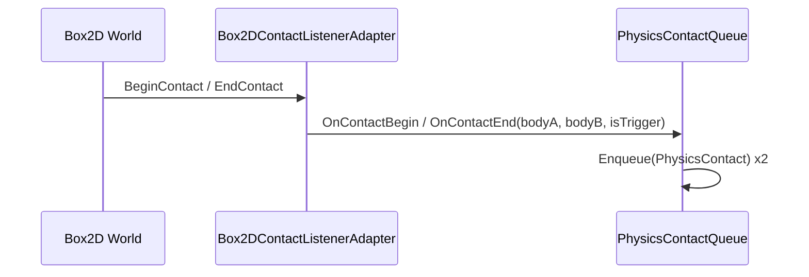

# Physics System

2D physics via a platform-abstracted `IPhysicsWorld2D` API (Box2D backend in `Engine/Platform/Box2D/`). Each scene owns its own physics world, body store, and contact queue. `PhysicsSimulationSystem` runs at priority 100 so rendering (150+) sees updated transforms.

---

## C4 Level 3 — Component Diagram


```mermaid
graph TB
    subgraph "Per-Scene (SceneSystemsFactory)"
        PSS[PhysicsSimulationSystem<br/>Priority 100]
        PDR[PhysicsDebugRenderSystem<br/>Priority 151]
        PW[IPhysicsWorld2D<br/>Box2DPhysicsWorld2D]
        BS[PhysicsRuntimeBodyStore]
        CQ[PhysicsContactQueue]
        CLA[Box2DContactListenerAdapter]
    end

    subgraph "ECS Components"
        RB[RigidBody2DComponent<br/>BodyType, FixedRotation,<br/>GravityScale, Velocity]
        BC[BoxCollider2DComponent]
        CC[CircleCollider2DComponent]
        EC[EdgeCollider2DComponent]
        TC[TransformComponent]
    end

    PSS -->|"Step(dt)"| PW
    PW --> CLA
    CLA -->|"IPhysicsContactListener"| CQ
    PSS <-->|"entityId ↔ IPhysicsBody2D"| BS
    PSS -->|"read/write position, angle, velocity"| RB
    PSS -->|"write X, Y, Rotation.Z"| TC
    PSS -->|"fixture material"| BC
    PSS --> CC
    PSS --> EC
    PDR --> BS
```

---

## Platform Abstraction

The engine core depends on interfaces in `Engine/Physics/`; Box2D types stay in `Engine/Platform/Box2D/`. There is one backend: `SceneSystemsFactory` constructs `Box2DPhysicsWorld2D` directly.

| Type | File | Role |
|---|---|---|
| `IPhysicsWorld2D` | `Engine/Physics/IPhysicsWorld2D.cs` | Extends `IPhysicsQueries`; `Step(dt)`, `CreateBody`, `DestroyBody`, `IDisposable` |
| `IPhysicsBody2D` | `Engine/Physics/IPhysicsBody2D.cs` | `Entity`, position, angle, velocity, `MotionType` (`RigidBodyType`), fixture create/material update, `IsAwake` / `IsEnabled` |
| `IPhysicsContactListener` | `Engine/Physics/IPhysicsContactListener.cs` | `OnContactBegin` / `OnContactEnd` with `isTrigger` flag |
| `IPhysicsQueries` | `Scripting/IPhysicsQueries.cs` | `Raycast`, `OverlapCircle` (optional `ignoreEntity`, `includeTriggers`) |
| `RaycastHit2D` | `Scripting/RaycastHit2D.cs` | `Entity`, `Point`, `Normal`, `Distance`, `IsTrigger` (raycasts only) |
| `Box2DPhysicsWorld2D` | `Engine/Platform/Box2D/Box2DPhysicsWorld2D.cs` | Wraps Box2D `World`; listener passed in the ctor; `Step` uses 6 velocity / 2 position iterations |
| `Box2DPhysicsBody2D` | `Engine/Platform/Box2D/Box2DPhysicsBody2D.cs` | Wraps Box2D `Body`; stores `Entity` on wrapper |
| `Box2DContactListenerAdapter` | `Engine/Platform/Box2D/Box2DContactListenerAdapter.cs` | Bridges Box2D `ContactListener` to `IPhysicsContactListener` |

Body and fixture creation use value-type defs:

| Struct | File | Fields |
|---|---|---|
| `PhysicsBodyDef` | `Engine/Physics/PhysicsBodyDef.cs` | `Position`, `Angle`, `MotionType` (`RigidBodyType`), `FixedRotation`, `GravityScale`, `IsBullet` |
| `PhysicsBoxFixtureDef` | `Engine/Physics/PhysicsBoxFixtureDef.cs` | `HalfWidth`, `HalfHeight`, `CenterOffset`, `Density`, `Friction`, `Restitution`, `IsSensor` |
| `PhysicsCircleFixtureDef` | `Engine/Physics/PhysicsCircleFixtureDef.cs` | `Radius`, `CenterOffset`, `Density`, `Friction`, `Restitution`, `IsSensor` |
| `PhysicsEdgeFixtureDef` | `Engine/Physics/PhysicsEdgeFixtureDef.cs` | `Points`, `Density`, `Friction`, `Restitution`, `IsSensor` |

`IsBullet` on `PhysicsBodyDef` maps to Box2D `bullet`.

---

## ECS Components

Physics systems read `RigidBody2DComponent`, any one 2D collider (`Box` / `Circle` / `Edge`), and `TransformComponent`. Component types live under `SceneComponents/Physics/`. Fixture create priority if multiple colliders exist: Box → Circle → Edge (one fixture per body).

Properties referenced by `PhysicsSimulationSystem`:

### RigidBody2DComponent

| Property | Used for |
|---|---|
| `BodyType` | Passed to `PhysicsBodyDef.MotionType` |
| `FixedRotation` | Passed to `PhysicsBodyDef` |
| `GravityScale` | Passed to `PhysicsBodyDef` |
| `IsBullet` | Passed to `PhysicsBodyDef` |
| `Velocity` | Written to body before each step (Dynamic/Kinematic); read back after sync |

### Collider components

| Component | Shape fields | Shared material |
|---|---|---|
| `BoxCollider2DComponent` | `Size` (half-extents), `Offset` | `Density`, `Friction`, `Restitution`, `IsTrigger` |
| `CircleCollider2DComponent` | `Radius`, `Offset` | same |
| `EdgeCollider2DComponent` | `Points` (≥2, open chain) | same |

Collider geometry is multiplied by `TransformComponent.Scale` when the body is created. Circle radius uses the average of `|Scale.X|` and `|Scale.Y|`. If authored identity changes after that (including scale), the runtime body is destroyed and remade.

Bodies are **not** stored on the component. Runtime mapping is `PhysicsRuntimeBodyStore` keyed by entity ID.

Any of the three collider components enables post-step transform and velocity sync — `PhysicsSimulationSystem` skips entities that have `RigidBody2DComponent` but no collider in its sync loop, even though a body may have been created for them.

---

## Scene Wiring

**File**: `Engine/Scene/SceneSystemsFactory.cs`


```mermaid
sequenceDiagram
    participant SF as SceneFactory
    participant SSF as SceneSystemsFactory
    participant W as Box2DPhysicsWorld2D
    participant Q as PhysicsContactQueue
    participant PSS as PhysicsSimulationSystem

    SF->>SF: new SystemManager, PhysicsRuntimeBodyStore, PhysicsContactQueue
    SF->>SSF: PopulateSystemManager(...)
    SSF->>W: new Box2DPhysicsWorld2D(gravity, contactQueue)
    SSF->>PSS: new PhysicsSimulationSystem(world, context, bodyStore)
    SSF->>SF: Register PhysicsSimulationSystem,<br/>AudioSystem,<br/>SceneRenderSystem, PhysicsDebugRenderSystem
```

Default gravity is `(0, -9.8)` (`SceneSystemsFactory.DefaultGravity2D`).

`Scene.PhysicsContacts` exposes the per-scene `PhysicsContactQueue` as `IPhysicsContacts` for `IGameSystem`. `Scene.PhysicsQueries` exposes the same scene's `IPhysicsWorld2D` as `IPhysicsQueries`. Runtime body maps live on `Scene.PhysicsBodies`.

When no scene is active, DI resolves `NullPhysicsContacts.Instance` and `NullPhysicsQueries.Instance` (all return empty/null results).

---

## Body Lifecycle

**File**: `Engine/Scene/Systems/PhysicsSimulationSystem.cs`

`SyncBodies()` runs from `OnInit` and every `OnUpdate`. One pass: create/recreate bodies whose authored identity changed, then drop store keys whose entity no longer has a rigidbody.

An entity with `RigidBody2DComponent` + `TransformComponent` gets a body; if it also has a collider, a fixture is added immediately.

If authored identity differs from what was baked at create (`BodyType`, collider kind/size/offset, scale, `GravityScale`, `FixedRotation`, density, `IsTrigger`, `IsBullet`, edge points), the stored body is destroyed and remade. Friction and restitution still update in place each frame via `UpdateFixtureMaterial`. Linear velocity survives on the rigidbody component; native angular velocity does not.

| Event | What happens |
|---|---|
| `OnInit` | Reset accumulator; `SyncBodies()` |
| `OnUpdate` | `SyncBodies()`; fixed timestep steps; sync transforms and velocities |
| `OnShutdown` | `DestroyBody` for every entry in `PhysicsRuntimeBodyStore` |
| `Dispose` | `physicsWorld.Dispose()` |

---

## Fixed Timestep Simulation

**File**: `Engine/Scene/Systems/PhysicsSimulationSystem.cs`

| Constant | Value | Source |
|---|---|---|
| `Timestep` | `1/60` s | `PhysicsSimulationSystem` |
| `MaxPhysicsStepsPerFrame` | `5` | `PhysicsSimulationSystem` |
| Velocity iterations | `6` | `Box2DPhysicsWorld2D.Step` |
| Position iterations | `2` | `Box2DPhysicsWorld2D.Step` |


```mermaid
flowchart TD
    A[OnUpdate deltaTime] --> B[accumulator += deltaTime]
    B --> C[SyncBodies]
    C --> D{accumulator >= timestep AND steps < 5?}
    D -->|Yes| E[SyncKinematicTransformsToBodies]
    E --> F[SyncVelocitiesToBodies]
    F --> G["World.Step(1/60)"]
    G --> H[accumulator -= timestep; stepCount++]
    H --> D
    D -->|No| I{accumulator still >= timestep?}
    I -->|Yes| J["Clamp: accumulator = timestep * 0.5"]
    I -->|No| K[Sync transforms + fixture material]
    J --> K
    K --> L[Update Velocity on Dynamic/Kinematic bodies]
```

Before each physics step, kinematic bodies copy transform position/angle into the body. Dynamic and kinematic bodies copy `RigidBody2DComponent.Velocity` into the body.

After all steps, for each entity with rigidbody, collider, and a stored body:

1. `UpdateFixtureMaterial` for friction and restitution (density is part of authored identity and remakes the body).
2. `Transform.Translation` ← body position (X, Y; Z set to `0`).
3. `Transform.Rotation.Z` ← body angle (X/Y rotation preserved via `with`).
4. `RigidBody2DComponent.Velocity` ← body linear velocity (Dynamic/Kinematic only).

---

## System Priorities

**File**: `Engine/Scene/Systems/SystemPriorities.cs`

| Priority | System |
|---|---|
| 100 | `PhysicsSimulationSystem` |
| 115 | `TransformHierarchySystem` |
| 120 | `AudioSystem` |
| 150 | `SceneRenderSystem` |
| 151 | `PhysicsDebugRenderSystem` |

---

## Collision Callbacks

**Files**: `Engine/Scene/Systems/PhysicsContactQueue.cs`, `Engine/Platform/Box2D/Box2DContactListenerAdapter.cs`

Box2D fires during `World.Step()`. The adapter resolves `IPhysicsBody2D` wrappers and whether **either** fixture is a sensor.

`PhysicsContactQueue` implements `IPhysicsContactListener` and enqueues a `PhysicsContact` for `IPhysicsContacts.DrainContacts()` (both entity orders).


```mermaid
sequenceDiagram
    participant W as Box2D World
    participant A as Box2DContactListenerAdapter
    participant Q as PhysicsContactQueue

    W->>A: BeginContact / EndContact
    A->>Q: OnContactBegin / OnContactEnd(bodyA, bodyB, isTrigger)
    Q->>Q: Enqueue(PhysicsContact) x2
```

`PreSolve` and `PostSolve` in the adapter are no-ops.

**File**: `Scripting/IPhysicsContacts.cs`

```csharp
public readonly record struct PhysicsContact(Entity Self, Entity Other, bool IsTrigger, bool IsBegin);
```

---

## World Queries

**Files**: `Scripting/IPhysicsQueries.cs`, `Engine/Platform/Box2D/Box2DPhysicsWorld2D.cs`

`IPhysicsWorld2D` extends `IPhysicsQueries`. Queries are synchronous reads during the current frame — they do not enqueue contacts.

| Method | Behavior |
|---|---|
| `Raycast(origin, direction, maxDistance, ignoreEntity?, includeTriggers?)` | Closest hit along the ray; ignores triggers unless `includeTriggers` is true. Returns `RaycastHit2D?`. |
| `OverlapCircle(center, radius, ignoreEntity?, includeTriggers?)` | First fixture whose shape overlaps the circle (AABB broadphase, then circle vs shape). Order unspecified when several overlap. Returns `(Entity Entity, bool IsTrigger)?`. |

`Box2DPhysicsWorld2D` resolves fixtures through body `UserData` (`Box2DPhysicsBody2D.Entity`). Invalid rays/circles (non-finite values, zero length/radius) return null.

Access paths: inject `IPhysicsQueries` from DI (`Scene.PhysicsQueries` when a scene is active).

---

## Debug Visualization

**File**: `Engine/Scene/Systems/PhysicsDebugRenderSystem.cs`

When `DebugSettings.ShowColliderBounds` is true, the runtime system begins a 2D scene and `PhysicsDebugDrawer.DrawColliders` (`Engine/Physics/PhysicsDebugDrawer.cs`) draws outlines using live body positions from `PhysicsRuntimeBodyStore`. The editor viewport draws into an already-open scene with transform fallback when no body exists. Colors reflect body type and awake state.

---

## Per-Scene Lifecycle Summary

| Event | What happens |
|---|---|
| Scene construction | `SceneFactory` creates body store and contact queue; `SceneSystemsFactory` registers per-scene systems including physics world |
| `OnRuntimeStart()` | `SystemManager.Initialize()` → `PhysicsSimulationSystem.OnInit()` creates initial bodies |
| `OnUpdateRuntime(ts)` | `SystemManager.Update(ts)` — physics steps first (100) |
| `OnRuntimeStop()` | `SystemManager.Shutdown()` destroys all bodies |
| Scene `Dispose()` | `SystemManager.Dispose()` disposes `PhysicsSimulationSystem` and the physics world |
