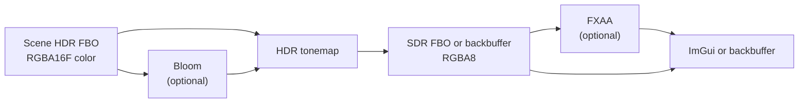

# Post-Processing Pipeline

HDR scene color is converted to display-ready SDR through a fixed pass chain — bloom extract/blur, ACES tonemap with gamma, and optional FXAA — before ImGui or the window backbuffer.

---

## Overview

[Rendering Pipeline](rendering-pipeline.md) covers ECS systems, scene draw order, batching, cameras, and framebuffer layout for scene rendering. Post-processing runs **after** the scene is drawn into the HDR framebuffer and is shared across editor, runtime, and sandbox hosts.

---

## Host Integration

| Host | Scene FBO | Tonemap target | FXAA | Display |
|------|-----------|----------------|------|---------|
| **Editor viewport** | Owned HDR framebuffer | Owned SDR framebuffer (RGBA8) | Editor preference (default on) | ImGui texture |
| **Runtime** | Owned HDR framebuffer | Window backbuffer directly | Off | Swap chain |
| **Sandbox3D** | Owned HDR framebuffer | Owned SDR framebuffer | On | FXAA blit to backbuffer |

Editor resize scales logical viewport by content scale before resizing scene and SDR buffers. Runtime and sandbox resize on window resize events.

---

## Ordered Pass List

All fullscreen draws use a procedural triangle (no VBO), depth test disabled for the pass, then re-enabled.

### Pass 0 — Scene render (input)

| | |
|---|---|
| **Write** | Scene HDR FBO color attachment 0 |
| **Format** | RGBA16F color + RED_INTEGER entity ID + DEPTH24STENCIL8 |
| **Owner** | Host (editor viewport, runtime layer, sandbox) |

### Pass 1 — Bloom (conditional)

| | |
|---|---|
| **Condition** | Bloom enabled **and** bloom intensity > 0 |
| **Read** | Scene HDR color |
| **Write** | Owned ping-pong RGBA16F buffers |

| Step | Effect |
|------|--------|
| Bright extract | Rec.709 luma; pixels above threshold pass through, others write black |
| Gaussian blur | 10 iterations of separable 5-tap blur, alternating horizontal/vertical |

Bloom internal buffers are RGBA16F, linear filter, clamp-to-edge.

### Pass 2 — HDR tonemap

| | |
|---|---|
| **Read** | Scene HDR color; bloom blur when bloom ran (otherwise bloom contribution forced to zero) |
| **Write** | SDR target when provided; otherwise currently bound framebuffer (backbuffer) |
| **Clears** | Target color to black before draw |

**Uniforms**: exposure from scene settings; bloom intensity from scene settings when bloom texture is valid.

### Pass 3 — FXAA (conditional)

| | |
|---|---|
| **Condition** | SDR intermediate target exists **and** FXAA enabled |
| **Read** | Tonemapped SDR color |
| **Write** | Owned RGBA8 output, or backbuffer when blitting directly |
| **Return** | FXAA output texture id; `0` when writing to backbuffer or FXAA skipped |

When FXAA is disabled, the post-process stage returns the tonemap target's color attachment id for ImGui.

---

## Tonemap Operator

Operator: **ACES fitted** (Stephen Hill's compact fitted curve — not Reinhard). Coefficients `a=2.51`, `b=0.03`, `c=2.43`, `d=0.59`, `e=0.14`. Output clamped to `[0,1]`.

Processing order per pixel:

1. Sample HDR RGB
2. Add blurred bloom scaled by bloom intensity
3. Apply exposure multiplier
4. ACES tonemap
5. Gamma encode — `pow(linear, 1/2.2)` (simple 2.2 gamma, not full sRGB piecewise)

---

## FXAA

NVIDIA FXAA 3.11 quality preset (Timothy Lottes). Runs on **tonemapped SDR** only — after the HDR→SDR conversion.

Edge detection uses luma at center and four diagonal neighbors. A direction vector drives two candidate blends along the edge; the result picks the blend that best preserves contrast. Inverse width/height uniforms set texel size for sampling offsets.

---

## Framebuffer Formats and Precision

| Buffer | Format | Notes |
|--------|--------|-------|
| Scene HDR color | **RGBA16F** | Half-float HDR; values can exceed 1.0 before tonemap. **RGBA32F is not used.** |
| Scene entity ID | RED_INTEGER (R32i) | Picking; unchanged by post |
| Scene depth | DEPTH24STENCIL8 | Scene depth only |
| Bloom extract / ping-pong | RGBA16F | Keeps bloom energy in float through blur |
| Tonemap / display SDR | RGBA8 | LDR after ACES + gamma |
| FXAA output | RGBA8 | Spatial anti-aliasing only |

**Tradeoffs:**

- RGBA16F scene buffer: sufficient for bloom thresholds and exposure without doubling bandwidth of RGBA32F.
- Tonemap to RGBA8: display and ImGui use 8-bit; HDR headroom is discarded after tonemap (expected).
- Runtime skips intermediate SDR/FXAA buffers by tonemapping directly to the backbuffer.

---

## Related Documentation

- [Rendering Pipeline](rendering-pipeline.md) — scene draw path, HDR FBO attachments, entity picking
- [Cameras and Rendering](../guide/concepts/cameras-and-rendering.md) — user-facing camera setup
