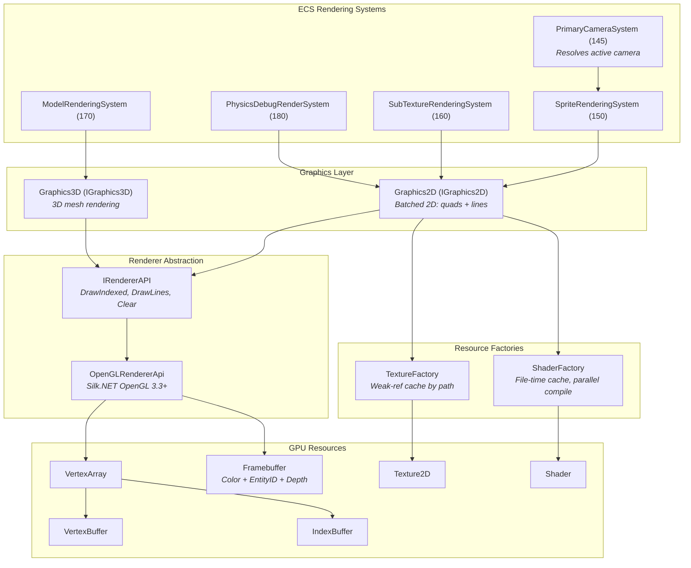
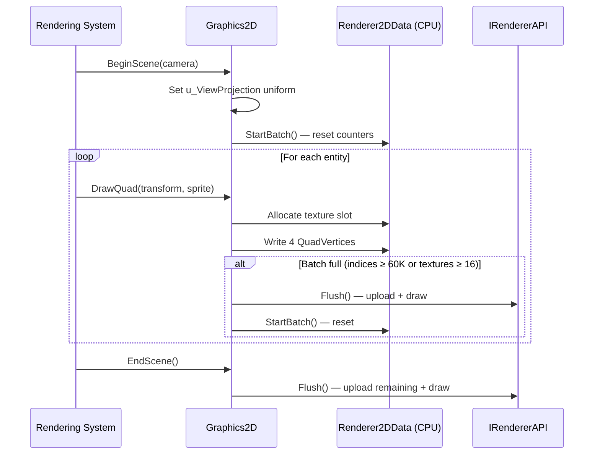
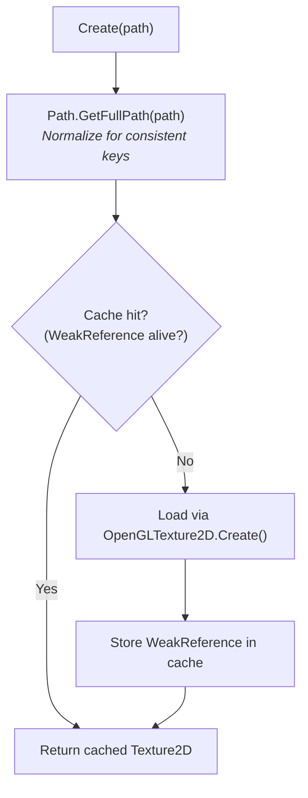
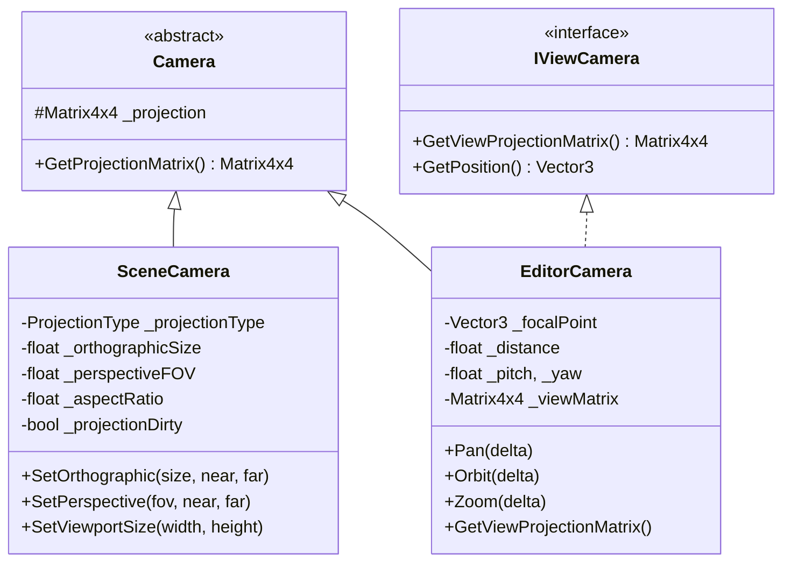
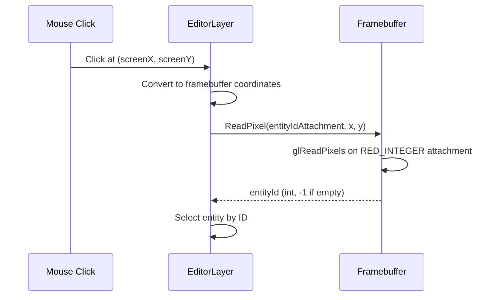

# Rendering Pipeline

The rendering pipeline flows from ECS rendering systems through a batched 2D/3D graphics layer, abstracted behind `IRendererAPI` to isolate OpenGL from engine core.

---

## C4 Level 3 — Component Diagram

---

## IRendererAPI

**File**: `Engine/Renderer/IRendererAPI.cs`

Platform-agnostic rendering interface. All OpenGL calls are isolated behind this abstraction — engine code never calls `gl.*` directly.

| Method | Purpose |
|--------|---------|
| `Init()` | Enable blending (SRC_ALPHA, ONE_MINUS_SRC_ALPHA), depth test (LEQUAL) |
| `SetClearColor(Vector4)` | Set framebuffer clear color |
| `Clear()` | Clear color + depth buffers |
| `DrawIndexed(IVertexArray, uint count)` | Draw triangles via `glDrawElements` |
| `DrawLines(IVertexArray, uint count)` | Draw lines via `glDrawArrays` |
| `SetLineWidth(float)` | Set line width (clamped to 1.0 on modern OpenGL) |

**OpenGL implementation**: `Engine/Platform/OpenGL/OpenGLRendererApi.cs` — all calls wrapped with `OpenGLDebug.CheckError()` in DEBUG builds.

---

## 2D Batching System

### Vertex Formats

| Struct | Size | Fields |
|--------|------|--------|
| **QuadVertex** | 44 bytes | Position (Vec3), Color (Vec4), TexCoord (Vec2), TexIndex (float), TilingFactor (float), EntityId (int) |
| **LineVertex** | 32 bytes | Position (Vec3), Color (Vec4), EntityId (int) |

**Files**: `Engine/Renderer/QuadVertex.cs`, `Engine/Renderer/LineVertex.cs`

### Batch Limits

Defined in `Engine/Renderer/RenderingConstants.cs` and `Renderer2DData.cs`:

| Constant | Value | Purpose |
|----------|-------|---------|
| MaxQuads | 10,000 | Quads per batch |
| MaxVertices | 40,000 | 10K quads × 4 vertices |
| MaxIndices | 60,000 | 10K quads × 6 indices (2 triangles) |
| MaxTextureSlots | 16 | OpenGL minimum guaranteed texture units |
| MaxFramebufferSize | 8,192 | Max framebuffer dimension (px) |

### Batch Lifecycle

**File**: `Engine/Renderer/Graphics2D.cs`

### Batch Operations

**StartBatch()**: Resets CPU-side ring buffer index, quad index count, texture slot index (slot 0 reserved for white texture), and clears texture slot cache.

**DrawQuad()**: The core batching logic:
1. Check capacity — if indices ≥ MaxIndices, trigger `NextBatch()`
2. Resolve texture slot:
   - Check `TextureSlotCache` dictionary (O(1) lookup by renderer ID)
   - If not cached and slots full (≥16), trigger `NextBatch()`
   - Assign slot: `TextureSlots[slotIndex] = texture`, cache the mapping
3. Transform 4 corner positions: `Vector3.Transform(cornerPos, transformMatrix)`
4. Write 4 `QuadVertex` structs into the ring buffer
5. Increment index count by 6

**Flush()**: Uploads to GPU and draws:
1. Bind shader and vertex array
2. Upload only the used portion of the vertex buffer via `SetData()` (span slice)
3. Bind all active textures to their sampler slots
4. Issue `rendererApi.DrawIndexed()` or `DrawLines()`
5. Increment draw call statistics

**NextBatch()**: Calls `Flush()` then `StartBatch()` — seamless batch boundary.

---

## Texture Management

### TextureFactory

**File**: `Engine/Renderer/Textures/TextureFactory.cs`

- **Weak reference cache**: `Dictionary<string, WeakReference<Texture2D>>` — textures GC'd if no other references
- **Path normalization**: `Path.GetFullPath()` + `StringComparer.OrdinalIgnoreCase` for cross-platform consistency
- **White texture singleton**: 1×1 pixel `0xFFFFFFFF`, created on first access (double-check locking), permanently occupies texture slot 0
- **Thread-safe**: All cache operations protected by `Lock`
- **Implements IDisposable**: Clears cache and disposes white texture on shutdown

### Texture Slot Caching (Per-Batch)

Within a single batch, `Graphics2D` maintains a `Dictionary<uint, int>` mapping texture renderer IDs to slot indices. This avoids re-allocating slots for the same texture across multiple quads in one batch. The cache is cleared on every `StartBatch()`.

---

## Shader Management

### ShaderFactory

**File**: `Engine/Renderer/Shaders/ShaderFactory.cs`

- **Cache key**: `(vertexPath, fragmentPath, vertModTime, fragModTime)` — includes `File.GetLastWriteTimeUtc()` for both files
- **Auto-invalidation**: Modified shader files automatically miss the cache → recompiled on next access
- **Double-checked locking**: Check cache → compile outside lock → re-check cache → store (handles race conditions by disposing duplicate compilations)
- **Weak references**: Shaders GC'd when no scene references remain; dead entries cleaned on cache miss
- **Parallel compilation**: Lock released during compilation so multiple threads can compile different shaders concurrently

---

## Camera System

### SceneCamera (Runtime)

**File**: `Engine/Scene/SceneCamera.cs`

- Supports **orthographic** (2D, default) and **perspective** (3D) projection
- **Lazy evaluation**: Projection matrix only recomputed when dirty flag set (property changes, viewport resize)
- Wrapped in `CameraComponent` on an entity; `Primary` flag designates the active camera
- `PrimaryCameraSystem` (priority 145) resolves the primary camera each frame and caches it for rendering systems

### EditorCamera

**File**: `Engine/Renderer/Cameras/EditorCamera.cs`

- Always perspective — orbits around a focal point
- Controls: **Pan** (lateral), **Orbit** (yaw/pitch around focal point), **Zoom** (distance from focal point)
- Implements `IViewCamera` — owns its view matrix (computed from focal point, distance, orientation)
- Configuration in `CameraConfig.cs`: rotation speed 0.8, zoom sensitivity 0.1, distance range [0.5, 500]

### BeginScene Integration

`Graphics2D.BeginScene()` has two overloads:

| Overload | Usage | View Matrix Source |
|----------|-------|--------------------|
| `BeginScene(Camera camera, Matrix4x4 transform)` | Runtime rendering | Inverts entity's TransformComponent |
| `BeginScene(IViewCamera camera)` | Editor rendering | Camera provides precomputed view-projection |

Both set the `u_ViewProjection` uniform on quad and line shaders, then call `StartBatch()`.

---

## Framebuffers

**File**: `Engine/Renderer/Buffers/FrameBuffer/`

### Attachment Configuration

The editor framebuffer uses three attachments:

| Attachment | Format | Purpose |
|------------|--------|---------|
| Color | RGBA8 | Scene rendering — displayed in ImGui viewport |
| Entity ID | RED_INTEGER | 32-bit int per pixel — stores entity ID for mouse picking |
| Depth | DEPTH24STENCIL8 | Depth testing for correct draw order |

### Entity Picking

- `ReadPixel()` binds the framebuffer as `GL_READ_FRAMEBUFFER`, reads a single pixel from the entity ID attachment
- Entity ID written per-vertex in `QuadVertex.EntityId` — the fragment shader outputs it to the second color attachment
- `ClearAttachment()` resets the entity ID buffer to -1 before each frame

### Resize

Framebuffers resize to match the viewport, clamped to `MaxFramebufferSize` (8192×8192). The editor handles logical-to-physical DPI scaling before resizing.

---

## Rendering Statistics

`Graphics2D` tracks per-frame statistics via `Renderer2DData.Statistics`:

- **DrawCalls**: Number of `Flush()` invocations (batch submissions)
- **QuadCount**: Total quads drawn across all batches

These are exposed for the editor's stats panel and performance monitoring.
