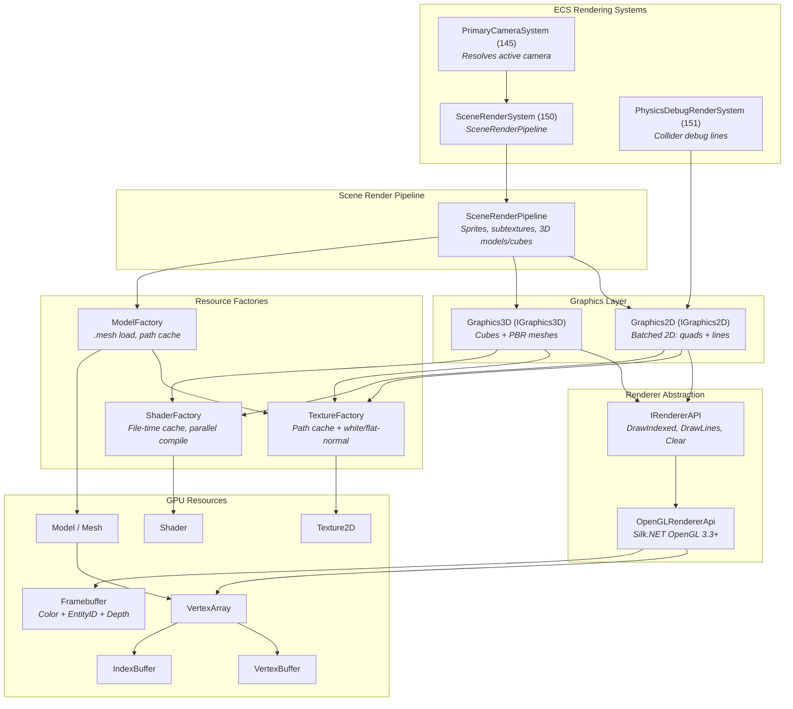
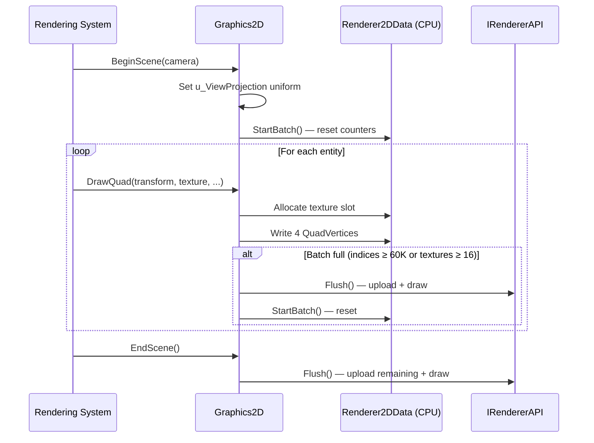
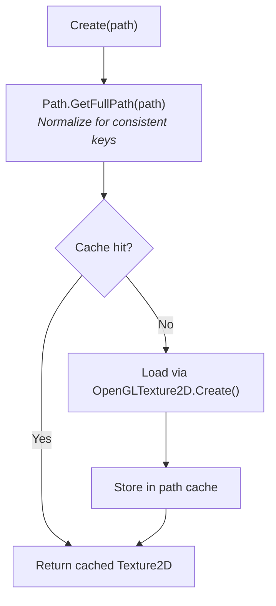
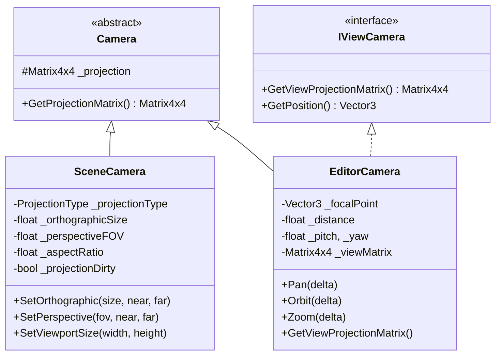
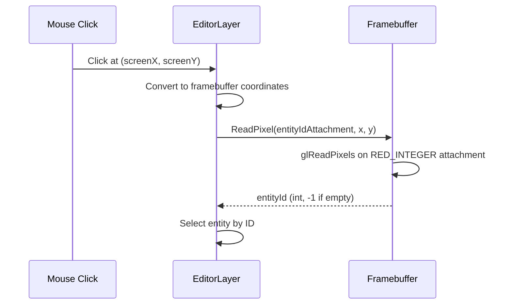

# Rendering Pipeline

The rendering pipeline flows from ECS rendering systems through a batched 2D/3D graphics layer, abstracted behind `IRendererAPI` to isolate OpenGL from engine core.

---

## C4 Level 3 — Component Diagram

```mermaid
graph TB
    subgraph "ECS Rendering Systems"
        PCS["PrimaryCameraSystem (145)<br/><i>Resolves active camera</i>"]
        SRS["SceneRenderSystem (150)<br/><i>SceneRenderPipeline</i>"]
        PDRS["PhysicsDebugRenderSystem (151)<br/><i>Collider debug lines</i>"]
    end

    subgraph "Scene Render Pipeline"
        SRP["SceneRenderPipeline<br/><i>Sprites, subtextures, 3D models/cubes</i>"]
    end

    subgraph "Graphics Layer"
        G2D["Graphics2D (IGraphics2D)<br/><i>Batched 2D: quads + lines</i>"]
        G3D["Graphics3D (IGraphics3D)<br/><i>Cubes + PBR meshes</i>"]
    end

    subgraph "Resource Factories"
        TF["TextureFactory<br/><i>Path cache + white/flat-normal</i>"]
        SF["ShaderFactory<br/><i>File-time cache, parallel compile</i>"]
        MF["ModelFactory<br/><i>.mesh load, path cache</i>"]
    end

    subgraph "Renderer Abstraction"
        API["IRendererAPI<br/><i>DrawIndexed, DrawLines, Clear</i>"]
        OAPI["OpenGLRendererApi<br/><i>Silk.NET OpenGL 3.3+</i>"]
    end

    subgraph "GPU Resources"
        VAO["VertexArray"]
        VBO["VertexBuffer"]
        IBO["IndexBuffer"]
        FB["Framebuffer<br/><i>Color + EntityID + Depth</i>"]
        Tex["Texture2D"]
        Shader["Shader"]
        Model["Model / Mesh"]
    end

    PCS --> SRS
    SRS --> SRP
    SRP --> G2D
    SRP --> G3D
    SRP --> MF
    PDRS --> G2D
    G2D --> API
    G3D --> API
    G2D --> TF
    G2D --> SF
    G3D --> TF
    G3D --> SF
    MF --> TF
    MF --> Model
    API --> OAPI
    OAPI --> VAO
    OAPI --> FB
    TF --> Tex
    SF --> Shader
    Model --> VAO
    VAO --> VBO
    VAO --> IBO
```

---

## SceneRenderPipeline

**File**: `Engine/Scene/SceneRenderPipeline.cs`

`SceneRenderSystem` (priority 150) calls `SceneRenderPipeline.RenderScene`, which draws all drawable entities in one pass:

| Pass | Components queried | Graphics API |
|------|-------------------|--------------|
| 2D sprites | `SpriteRendererComponent` + `TransformComponent` | `IGraphics2D.DrawQuad` |
| 2D subtextures | `SubTextureRendererComponent` + `TransformComponent` | `IGraphics2D.DrawQuad` with atlas coords |
| 3D models / cubes | `ModelRendererComponent` + `TransformComponent` | `DrawMesh` per submesh, or `DrawCube` fallback |

`PhysicsDebugRenderSystem` (priority 151) draws collider outlines via `PhysicsDebugDrawer` when `DebugSettings.ShowColliderBounds` is enabled. In the editor edit viewport, `EditorViewport` calls the same drawer after `RenderScene` when collider debug is on.

**Render order within a frame**: 2D sprites and subtextures first, then 3D models. Both passes share the same `CameraBinding` from `PrimaryCameraSystem` (runtime) or `EditorCamera` (editor).

### Scene lighting (3D)

Before drawing models, `SceneRenderPipeline` resolves lights from ECS components (first match wins):

| Component | File | Resolved into |
|-----------|------|---------------|
| `AmbientLightComponent` | `SceneComponents/Lighting/AmbientLightComponent.cs` | `IGraphics3D.SetAmbientLight(color, strength)` |
| `DirectionalLightComponent` | `SceneComponents/Lighting/DirectionalLightComponent.cs` | `IGraphics3D.SetDirectionalLight(...)` then a depth-only 2D shadow pass |
| `PointLightComponent` | `SceneComponents/Lighting/PointLightComponent.cs` | `IGraphics3D.SetPointLight(...)` then a cubemap depth pass (`BeginPointShadowPass`) |
| `SkyLightComponent` | `SceneComponents/Lighting/SkyLightComponent.cs` | `IGraphics3D.SetEnvironment(hdrPath, intensity)` |

Defaults when no component exists: ambient `(Vector3.One, 0.1f)`; directional direction `(0, -1, 0)` with **zero** color (no sun contribution).

User-facing setup: [3D Rendering](../guide/concepts/3d-rendering.md).

---

## 3D Model Rendering

**Files**: `Engine/Renderer/Graphics3D.cs`, `Engine/Renderer/IGraphics3D.cs`, `Engine/Renderer/ModelFactory.cs`, `Engine/Renderer/MeshReader.cs`, `Engine/Renderer/MeshFactory.cs`

`SceneRenderPipeline` resolves each `ModelRendererComponent` path through `IModelFactory`. On success it draws every submesh with PBR materials under ambient + directional lights. Empty or failed paths (including rejected non-`.mesh` / legacy raw paths) fall back to the shared unit cube.

### Draw path

| Condition | Call | Shader |
|-----------|------|--------|
| `ModelPath` empty or `modelFactory.Create` returns null | `DrawCube` | `flatColorShader` (ambient + diffuse tint) |
| Model loaded | `DrawMesh` per submesh | `lightingShader` (metal/rough PBR) |

Metallic/roughness for each draw: component override if set, else imported `MeshMaterial` scalars. Tint (`Color`) always multiplies albedo.

### IGraphics3D API

| Method | Purpose |
|--------|---------|
| `Init()` | Load `flatColorShader` + `lightingShader`; create shared cube via `MeshFactory.CreateCube()` |
| `BeginScene(Camera, Matrix4x4)` / `BeginScene(IViewCamera)` | Upload `u_ViewProjection` and view position |
| `DrawCube(Matrix4x4 transform, Vector4 color, int entityId)` | Indexed draw of shared cube mesh |
| `DrawMesh(transform, mesh, material, tint, metallic, roughness, entityId)` | PBR textured submesh draw |
| `SetAmbientLight(Vector3 color, float strength)` | Scene ambient (`lightColor`, `strength` uniforms) |
| `SetDirectionalLight(Vector3 direction, Vector3 color)` | Directional light (`u_LightDirection`, `u_LightColor`) |
| `EndScene()` | No-op (unbind happens per draw) |

No 3D batching — one `DrawIndexed` per cube or per submesh. `GetStats()` tracks `DrawCalls` per frame.

### Model factory and import

**Runtime files**: `Engine/Renderer/IModelFactory.cs`, `Engine/Renderer/ModelFactory.cs`, `Engine/Renderer/MeshReader.cs`

- Path-keyed cache (`OrdinalIgnoreCase` full paths); miss → `MeshReader` → GPU upload → cache
- **`.mesh` only** — non-`.mesh` paths are rejected with a warning (no Assimp fallback); authors must **File → Import 3D Model…** and re-assign
- Whole file → ordered `ModelSubmesh` list (mesh + `MeshMaterial`); no animation / hierarchy explosion
- Texture paths in the binary are asset-relative; resolve via `PathBuilder.Resolve` then `TextureFactory`

**Import-time files** (editor-only — not in the runtime assembly): `Editor/Features/Import/MeshCreator.cs`, `AssimpModelImporter.cs`, `TextureRelocator.cs`; format codec `Engine/Renderer/MeshWriter.cs`

- Assimp used only at import: triangulate, generate normals/tangents; split import skips PreTransformVertices and walks nodes
- Output layout: `assets/models/<stem>_<part>.mesh` + relocated textures under models/textures/; editor spawns parent+children
- Formats at import: FBX, glTF, GLB (and other Assimp-supported types as enumerated by Import)
- Legacy Phong materials convert heuristically at import (diffuse→albedo, shininess→roughness, dielectric metallic)

### MeshMaterial (PBR)

**File**: `Engine/Renderer/MeshMaterial.cs`

| Field | Role |
|-------|------|
| Albedo / metallic-roughness / normal maps | Optional textures (slots 0–2) |
| `Metallic`, `Roughness` | Scalar fallbacks when maps absent (roughness default `0.5`) |

Missing maps bind white (or flat normal for normals). Import-time Assimp conversion may map legacy specular textures into the metallic-roughness slot heuristically; the runtime material type exposes only albedo, MR, and normal.

### Mesh

**File**: `Engine/Renderer/Mesh.cs`

`Mesh.Vertex` holds position, normal, tex coords, tangents, and bitangents (56 bytes). Entity IDs for picking are **not** stored in mesh vertices — 3D draws pass `entityId` via the `u_EntityID` shader uniform in `Graphics3D.BindCommon`. `IMeshFactory.CreateCube()` builds the shared fallback cube.

More detail: [3D Rendering](../guide/concepts/3d-rendering.md).

---

## IRendererAPI

**File**: `Engine/Renderer/IRendererAPI.cs`

Platform-agnostic rendering interface. All OpenGL calls are isolated behind this abstraction — engine code never calls `gl.*` directly.

| Method | Purpose |
|--------|---------|
| `Init()` | Enable blending (SRC_ALPHA, ONE_MINUS_SRC_ALPHA), depth test (LEQUAL) |
| `SetClearColor(Vector4)` | Set framebuffer clear color |
| `Clear()` | Clear color + depth buffers |
| `BindTexture2D(uint textureId, int slot)` | Bind a 2D texture to a sampler slot |
| `DrawIndexed(IVertexArray, uint count)` | Draw triangles via `glDrawElements` |
| `DrawArrays(IVertexArray, uint vertexCount)` | Draw without index buffer via `glDrawArrays` (HDR tonemap fullscreen triangle) |
| `DrawLines(IVertexArray, uint vertexCount)` | Draw lines via `glDrawArrays` with `GL_LINES` |
| `SetLineWidth(float)` | Set line width (clamped to 1.0 on modern OpenGL) |
| `SetDepthTest(bool enabled)` | Enable or disable depth testing |
| `GetError()` | Return OpenGL error code (0 = no error) |

**OpenGL implementation**: `Engine/Platform/OpenGL/OpenGLRendererApi.cs` — all calls wrapped with `OpenGLDebug.CheckError()` in DEBUG builds.

---

## 2D Batching System

### Vertex Formats

| Struct | Size | Fields |
|--------|------|--------|
| **QuadVertex** | 48 bytes | Position (Vec3), Color (Vec4), TexCoord (Vec2), TexIndex (float), TilingFactor (float), EntityId (int) |
| **LineVertex** | 32 bytes | Position (Vec3), Color (Vec4), EntityId (int) |

**Files**: `Engine/Renderer/Primitives/QuadVertex.cs`, `Engine/Renderer/Primitives/LineVertex.cs`

### Batch Limits

Defined in `Engine/Renderer/RenderingConstants.cs` and `Renderer2DData.cs`:

| Constant | Value | Purpose |
|----------|-------|---------|
| DefaultMaxQuads | 10,000 | Quads per batch |
| MaxVertices | 40,000 | 10K quads × 4 vertices |
| MaxIndices | 60,000 | 10K quads × 6 indices (2 triangles) |
| MaxTextureSlots | 16 | OpenGL minimum guaranteed texture units |
| DefaultLineWidth | 1.0f | Line width for debug/wireframe drawing |
| MaxFramebufferSize | 8,192 | Max framebuffer dimension (px) |

### Batch Lifecycle

**File**: `Engine/Renderer/Graphics2D.cs`

```mermaid
sequenceDiagram
    participant System as Rendering System
    participant G2D as Graphics2D
    participant Batch as Renderer2DData (CPU)
    participant GPU as IRendererAPI

    System->>G2D: BeginScene(camera)
    G2D->>G2D: Set u_ViewProjection uniform
    G2D->>Batch: StartBatch() — reset counters

    loop For each entity
        System->>G2D: DrawQuad(transform, texture, ...)
        G2D->>Batch: Allocate texture slot
        G2D->>Batch: Write 4 QuadVertices

        alt Batch full (indices ≥ 60K or textures ≥ 16)
            G2D->>GPU: Flush() — upload + draw
            G2D->>Batch: StartBatch() — reset
        end
    end

    System->>G2D: EndScene()
    G2D->>GPU: Flush() — upload remaining + draw
```

### Batch Operations

**StartBatch()**: Resets CPU-side ring buffer index, quad index count, texture slot index (slot 0 reserved for white texture), and clears texture slot cache.

**DrawQuad()**: The core batching logic:
1. Check capacity — if indices ≥ MaxIndices, trigger `NextBatch()`
2. Resolve texture slot:
   - Check `TextureSlotCache` dictionary (O(1) lookup by renderer ID)
   - If not cached and slots full (≥16), trigger `NextBatch()`
   - Assign slot: `TextureSlots[slotIndex] = texture`, cache the mapping
3. Transform 4 corner positions: `Vector3.Transform(cornerPos, transformMatrix)`
4. Write 4 `QuadVertex` structs into the ring buffer
5. Increment index count by 6

**Flush()**: Uploads to GPU and draws:
1. Bind quad shader and vertex array
2. Upload only the used portion of the vertex buffer via `SetData()` (span slice)
3. Bind all active textures to their sampler slots (`TextureSlots[0..TextureSlotIndex)`)
4. Disable depth test, issue `rendererApi.DrawIndexed()`, re-enable depth test
5. If line vertices exist: bind line shader, upload line buffer, issue `DrawLines()` (depth test on)
6. Increment draw call statistics per batch submitted

**Shaders** (loaded via `ShaderFactory` in `Graphics2D.Init()`):
- Quads: `assets/shaders/OpenGL/textureShader.vert` + `textureShader.frag` — `u_Textures[16]` sampler array, entity ID to attachment 1
- Lines: `assets/shaders/OpenGL/lineShader.vert` + `lineShader.frag` — solid color, entity ID to attachment 1

**NextBatch()**: Calls `Flush()` then `StartBatch()` — seamless batch boundary.

---

## Texture Management

### TextureFactory

**File**: `Engine/Renderer/Textures/TextureFactory.cs`

```mermaid
graph TD
    Request["Create(path)"] --> Normalize["Path.GetFullPath(path)<br/><i>Normalize for consistent keys</i>"]
    Normalize --> CacheCheck{"Cache hit?"}
    CacheCheck -->|Yes| Return["Return cached Texture2D"]
    CacheCheck -->|No| Load["Load via OpenGLTexture2D.Create()"]
    Load --> Cache["Store in path cache"]
    Cache --> Return
```

- **Strong path cache**: `Dictionary<string, Texture2D>` — cleared/disposed via `ClearCache()` / `Dispose()`
- **Path normalization**: `Path.GetFullPath()` + `StringComparer.OrdinalIgnoreCase`
- **Singletons**: white (`0xFFFFFFFF`), black, flat normal (`0xFFFF8080`) for missing PBR maps
- **HDR**: `.hdr` paths decode via `HdrEquirectDecoder` to float RGBA (`OpenGLTexture2D.CreateFromHdr`)
- **Thread-safe**: cache and singleton creation protected by `Lock`
- **Implements IDisposable**: disposes singletons and clears the path cache on shutdown

### Texture Slot Caching (Per-Batch)

Within a single batch, `Graphics2D` maintains a `Dictionary<uint, int>` mapping texture renderer IDs to slot indices. This avoids re-allocating slots for the same texture across multiple quads in one batch. The cache is cleared on every `StartBatch()`.

---

## Shader Management

GLSL sources live in `Engine/assets/shaders/OpenGL`. Editor, Runtime, Sandbox, Benchmark, and graphics tests import `Engine/Engine.Shaders.props` so the same files copy to `assets/shaders/OpenGL/` next to the host exe. Edit them once; do not copy shaders into application projects.

### ShaderFactory

**File**: `Engine/Renderer/Shaders/ShaderFactory.cs`

- **Cache key**: `(vertexPath, fragmentPath, vertModTime, fragModTime)` — includes `File.GetLastWriteTimeUtc()` for both files
- **Auto-invalidation**: Modified shader files automatically miss the cache → recompiled on next access
- **Double-checked locking**: Check cache → compile outside lock → re-check cache → store (handles race conditions by disposing duplicate compilations)
- **Weak references**: Shaders GC'd when no scene references remain; dead entries cleaned on cache miss
- **Parallel compilation**: Lock released during compilation so multiple threads can compile different shaders concurrently

---

## Camera System

```mermaid
classDiagram
    class Camera {
        <<abstract>>
        #Matrix4x4 _projection
        +GetProjectionMatrix() Matrix4x4
    }

    class SceneCamera {
        -ProjectionType _projectionType
        -float _orthographicSize
        -float _perspectiveFOV
        -float _aspectRatio
        -bool _projectionDirty
        +SetOrthographic(size, near, far)
        +SetPerspective(fov, near, far)
        +SetViewportSize(width, height)
    }

    class EditorCamera {
        -Vector3 _focalPoint
        -float _distance
        -float _pitch, _yaw
        -Matrix4x4 _viewMatrix
        +Pan(delta)
        +Orbit(delta)
        +Zoom(delta)
        +GetViewProjectionMatrix()
    }

    class IViewCamera {
        <<interface>>
        +GetViewProjectionMatrix() Matrix4x4
        +GetPosition() Vector3
    }

    Camera <|-- SceneCamera
    Camera <|-- EditorCamera
    IViewCamera <|.. EditorCamera
```

**Base class**: `Engine/Scene/Cameras/Camera.cs`

### SceneCamera (Runtime)

**File**: `Engine/Scene/SceneCamera.cs`

- Supports **orthographic** (2D, default) and **perspective** (3D) projection
- **Lazy evaluation**: Projection matrix only recomputed when dirty flag set (property changes, viewport resize)
- Wrapped in `CameraComponent` on an entity; `Primary` flag designates the active camera
- `PrimaryCameraSystem` (priority 145) resolves the primary camera each frame and caches it for rendering systems

### EditorCamera

**File**: `Engine/Scene/Cameras/EditorCamera.cs`

- Always perspective — orbits around a focal point
- Controls: **Pan** (lateral), **Orbit** (yaw/pitch around focal point), **Zoom** (distance from focal point)
- Implements `IViewCamera` — owns its view matrix (computed from focal point, distance, orientation)
- Configuration in `CameraConfig.cs`: rotation speed 0.8, zoom sensitivity 0.1, distance range [0.5, 500]

### BeginScene Integration

`Graphics2D.BeginScene()` has two overloads:

| Overload | Usage | View Matrix Source |
|----------|-------|--------------------|
| `BeginScene(Camera camera, Matrix4x4 transform)` | Runtime rendering | Inverts entity's TransformComponent |
| `BeginScene(IViewCamera camera)` | Editor rendering | Camera provides precomputed view-projection |

Both set the `u_ViewProjection` uniform on quad and line shaders, then call `StartBatch()`.

---

## Framebuffers

**File**: `Engine/Renderer/Buffers/FrameBuffer/`

### Attachment Configuration

The editor framebuffer uses three attachments:

| Attachment | Format | Purpose |
|------------|--------|---------|
| Color | RGBA16F | HDR scene rendering (tonemapped before ImGui display) |
| Entity ID | RED_INTEGER | 32-bit int per pixel — stores entity ID for mouse picking |
| Depth | DEPTH24STENCIL8 | Depth testing for correct draw order |

Default size: `DisplayConfig.DefaultEditorViewportWidth` x `DisplayConfig.DefaultEditorViewportHeight` (1280x720). Factory: `Engine/Renderer/Buffers/FrameBuffer/FrameBufferFactory.cs`; OpenGL implementation: `Engine/Platform/OpenGL/Buffers/OpenGLFrameBuffer.cs`.

### HDR tonemap (editor viewport)

**Files**: `Engine/Renderer/HdrTonemapPass.cs`, `Editor/Features/Viewport/EditorViewport.cs`

The editor keeps two framebuffers:

| Buffer | Color format | Purpose |
|--------|--------------|---------|
| Scene (`_frameBuffer`) | RGBA16F HDR | Scene draw + entity ID + depth |
| Bloom extract + ping-pong | RGBA16F | Bright-pass extract and Gaussian blur (owned by `BloomPass`) |
| Display (`_sdrFrameBuffer`) | RGBA8 | Tonemapped image (FXAA input) |
| FXAA (owned by `FxaaPass`) | RGBA8 | Anti-aliased image shown in ImGui when enabled |

After `SceneRenderPipeline` renders into the HDR buffer, bloom (optional) extracts pixels brighter than a luminance threshold, blurs them with a separable 5-tap Gaussian (10 ping-pong passes), then `HdrTonemapPass.Apply(...)` additively blends the bloom into the HDR color **before** ACES + gamma. Optional `FxaaPass` then anti-aliases the SDR result (NVIDIA FXAA 3.11). Exposure, bloom, and FXAA come from `IEditorPreferences`.

### Entity Picking

```mermaid
sequenceDiagram
    participant Mouse as Mouse Click
    participant Editor as EditorLayer
    participant FB as Framebuffer

    Mouse->>Editor: Click at (screenX, screenY)
    Editor->>Editor: Convert to framebuffer coordinates
    Editor->>FB: ReadPixel(entityIdAttachment, x, y)
    FB->>FB: glReadPixels on RED_INTEGER attachment
    FB-->>Editor: entityId (int, -1 if empty)
    Editor->>Editor: Select entity by ID
```

- `ReadPixel()` binds the framebuffer as `GL_READ_FRAMEBUFFER`, reads a single pixel from the entity ID attachment
- Entity ID written per-vertex in `QuadVertex.EntityId` — the fragment shader outputs it to the second color attachment
- `ClearAttachment()` resets the entity ID buffer to -1 before each frame

### Resize

Framebuffers resize to match the viewport, clamped to `MaxFramebufferSize` (8192×8192). The editor handles logical-to-physical DPI scaling before resizing.

---

## Rendering Statistics

`Graphics2D` tracks per-frame 2D statistics via `Renderer2DData.Statistics` (`Engine/Renderer/Statistics.cs`). `Graphics3D` uses the same `Statistics` type for 3D **DrawCalls** only (one per cube or submesh draw).

| Field | Scope | Meaning |
|-------|-------|---------|
| **DrawCalls** | 2D + 3D | 2D: `Flush()` invocations (quad and line batches count separately). 3D: indexed draws in `DrawCube` / `DrawMesh`. |
| **QuadCount** | 2D only | Total quads drawn across all batches |

`GetTotalVertexCount()` and `GetTotalIndexCount()` derive totals from `QuadCount`. Reset via `ResetStats()` before each frame (editor viewport resets 2D stats at frame start). Exposed for the editor stats panel.
