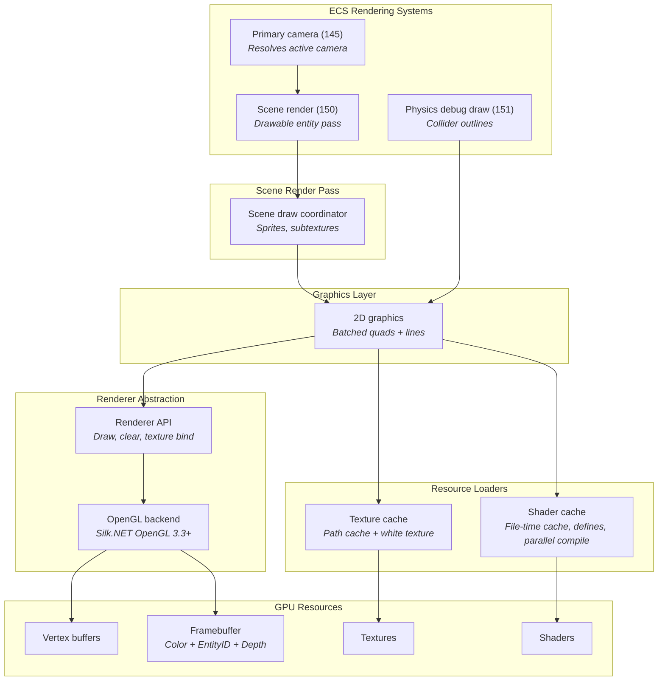
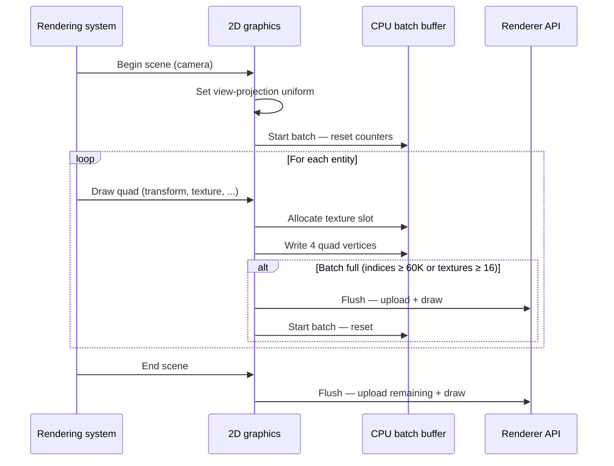
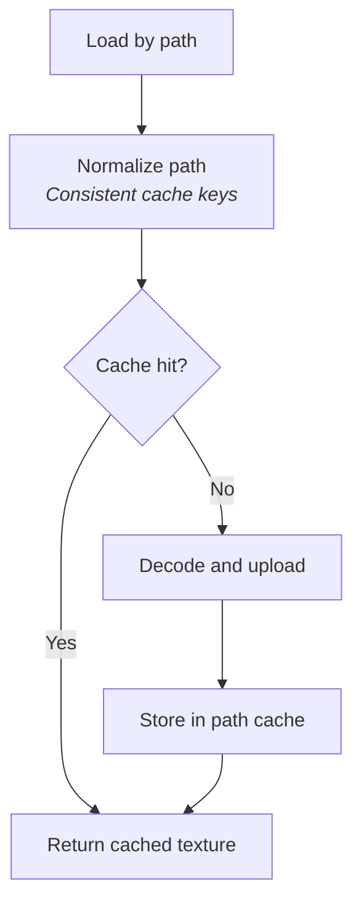
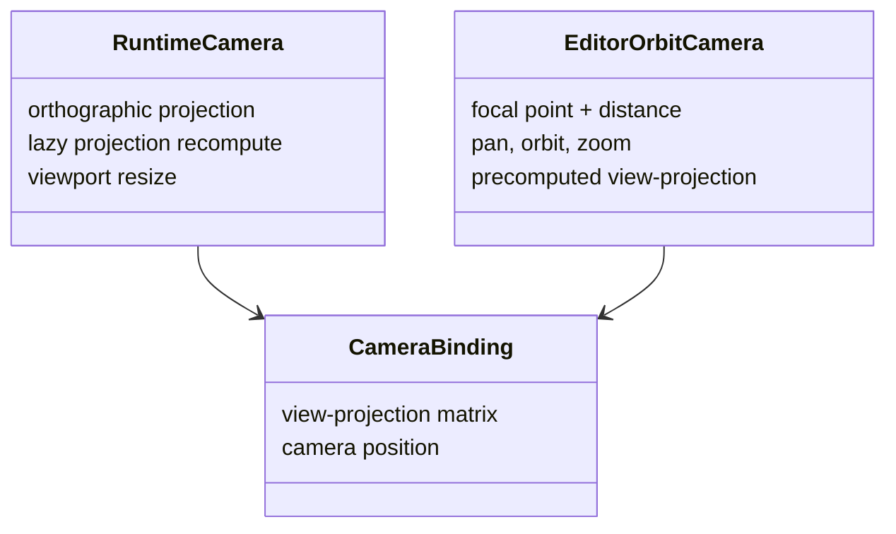
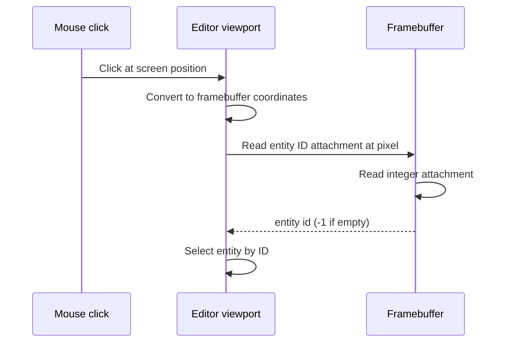

# Rendering Pipeline

The rendering pipeline flows from ECS rendering systems through a batched 2D graphics layer, abstracted behind a platform-agnostic renderer API that isolates OpenGL from engine core.

---

## C4 Level 3 — Component Diagram

```mermaid
graph TB
    subgraph "ECS Rendering Systems"
        PCS["Primary camera (145)<br/><i>Resolves active camera</i>"]
        SRS["Scene render (150)<br/><i>Drawable entity pass</i>"]
        PDRS["Physics debug draw (151)<br/><i>Collider outlines</i>"]
    end

    subgraph "Scene Render Pass"
        SRP["Scene draw coordinator<br/><i>Sprites, subtextures</i>"]
    end

    subgraph "Graphics Layer"
        G2D["2D graphics<br/><i>Batched quads + lines</i>"]
    end

    subgraph "Resource Loaders"
        TF["Texture cache<br/><i>Path cache + white texture</i>"]
        SF["Shader cache<br/><i>File-time cache, defines, parallel compile</i>"]
    end

    subgraph "Renderer Abstraction"
        API["Renderer API<br/><i>Draw, clear, texture bind</i>"]
        OAPI["OpenGL backend<br/><i>Silk.NET OpenGL 3.3+</i>"]
    end

    subgraph "GPU Resources"
        VAO["Vertex buffers"]
        FB["Framebuffer<br/><i>Color + EntityID + Depth</i>"]
        Tex["Textures"]
        Shader["Shaders"]
    end

    PCS --> SRS
    SRS --> SRP
    SRP --> G2D
    PDRS --> G2D
    G2D --> API
    G2D --> TF
    G2D --> SF
    API --> OAPI
    OAPI --> VAO
    OAPI --> FB
    TF --> Tex
    SF --> Shader
```

---

## Scene Render Pass

The scene render system (priority 150) draws all drawable entities in one pass:

| Pass | Components queried | Graphics path |
|------|-------------------|---------------|
| 2D sprites | `SpriteRendererComponent` + `TransformComponent` | Batched textured quads (skips fully transparent tint; failed texture load → solid-color quad) |
| 2D subtextures | `SubTextureRendererComponent` + `TransformComponent` | Batched quads with atlas coordinates |

Physics debug draw (priority 151) renders collider outlines when collider debug is enabled. In the editor edit viewport, the same outlines are drawn after the scene pass when that option is on.

**Render order within a frame**: sprites and subtextures share the same camera binding from the primary camera (runtime) or the editor camera (editor).

User-facing setup: [Cameras and Rendering](../guide/concepts/cameras-and-rendering.md).

---

## Renderer Abstraction

Platform-agnostic rendering interface. All OpenGL calls are isolated behind this abstraction — engine core never invokes GL entry points directly.

| Capability | Purpose |
|--------|---------|
| Init | Enable alpha blending and depth test (LEQUAL) |
| Clear color / clear | Set framebuffer clear color; clear color and depth buffers |
| Bind texture | Bind 2D textures to sampler slots |
| Draw indexed | Draw triangles via indexed geometry |
| Draw arrays | Draw without index buffer |
| Draw lines | Draw line primitives for debug overlays |
| Line width | Set line width (clamped to 1.0 on modern OpenGL) |
| Depth test / depth write | Toggle depth testing and depth buffer writes |
| Face culling | Toggle back-face culling |
| Polygon mode | Fill vs line polygon mode |
| Error query | Return OpenGL error code (0 = no error) |

The OpenGL backend implements this interface; debug builds wrap calls with error checking.

---

## 2D Batching System

### Vertex Formats

| Layout | Size | Fields |
|--------|------|--------|
| **Quad** | 48 bytes | Position (Vec3), Color (Vec4), TexCoord (Vec2), TexIndex (float), TilingFactor (float), EntityId (int) |
| **Line** | 32 bytes | Position (Vec3), Color (Vec4), EntityId (int) |

### Batch Limits

| Constant | Value | Purpose |
|----------|-------|---------|
| DefaultMaxQuads | 10,000 | Quads per batch |
| MaxVertices | 40,000 | 10K quads × 4 vertices |
| MaxIndices | 60,000 | 10K quads × 6 indices (2 triangles) |
| MaxTextureSlots | 16 | OpenGL minimum guaranteed texture units |
| DefaultLineWidth | 1.0f | Line width for debug drawing |
| MaxFramebufferSize | 8,192 | Max framebuffer dimension (px) |

### Batch Lifecycle

```mermaid
sequenceDiagram
    participant System as Rendering system
    participant G2D as 2D graphics
    participant Batch as CPU batch buffer
    participant GPU as Renderer API

    System->>G2D: Begin scene (camera)
    G2D->>G2D: Set view-projection uniform
    G2D->>Batch: Start batch — reset counters

    loop For each entity
        System->>G2D: Draw quad (transform, texture, ...)
        G2D->>Batch: Allocate texture slot
        G2D->>Batch: Write 4 quad vertices

        alt Batch full (indices ≥ 60K or textures ≥ 16)
            G2D->>GPU: Flush — upload + draw
            G2D->>Batch: Start batch — reset
        end
    end

    System->>G2D: End scene
    G2D->>GPU: Flush — upload remaining + draw
```

### Batch Operations

**Start batch**: Resets CPU-side ring buffer index, quad index count, texture slot index (slot 0 reserved for white texture), and clears the per-batch texture slot cache.

**Draw quad** — core batching logic:

1. Check capacity — if indices ≥ max indices, start a new batch (flush first)
2. Resolve texture slot:
   - Check per-batch texture slot cache (O(1) lookup by texture id)
   - If not cached and slots full (≥16), start a new batch
   - Assign slot and cache the mapping
3. Transform 4 corner positions by the entity transform matrix
4. Write 4 quad vertices into the ring buffer
5. Increment index count by 6

**Flush**: Uploads to GPU and draws:

1. Bind quad shader and vertex array
2. Upload only the used portion of the vertex buffer
3. Bind all active textures to their sampler slots
4. Disable depth test, issue indexed draw, re-enable depth test
5. If line vertices exist: bind line shader, upload line buffer, draw lines (depth test on)
6. Increment draw-call statistics per batch submitted

**Shaders** (loaded at 2D graphics init):

- Quads: textured sprite shader with a 16-texture sampler array; entity ID written to attachment 1
- Lines: solid-color line shader; entity ID written to attachment 1

**Next batch**: Flush then start batch — seamless batch boundary.

---

## Texture Management

```mermaid
graph TD
    Request["Load by path"] --> Normalize["Normalize path<br/><i>Consistent cache keys</i>"]
    Normalize --> CacheCheck{"Cache hit?"}
    CacheCheck -->|Yes| Return["Return cached texture"]
    CacheCheck -->|No| Load["Decode and upload"]
    Load --> Cache["Store in path cache"]
    Cache --> Return
```

- **Strong path cache** — cleared on shutdown
- **Path normalization** — full path, case-insensitive comparison
- **Singleton fallback**: white texture for untextured quads
- **Thread-safe** cache and singleton creation

### Texture Slot Caching (Per-Batch)

Within a single batch, the 2D graphics layer maps texture ids to slot indices. This avoids re-allocating slots for the same texture across multiple quads in one batch. The cache is cleared on every batch start.

---

## Shader Management

GLSL sources ship with the engine and copy next to the host executable at build time (`assets/shaders/OpenGL/`). Edit them once in the engine project; do not duplicate into application projects.

Shader loading:

- **Cache key**: vertex path, fragment path, optional geometry path, file modification times, and optional preprocessor defines
- **Auto-invalidation**: modified shader files miss the cache and recompile on next access
- **Concurrency**: compilation can run outside the cache lock; duplicate compilations from races are discarded
- **Weak references**: shaders may be collected when no scene references remain; dead entries cleaned on cache miss
- **Parallel compilation**: multiple shaders can compile concurrently

---

## Camera System

```mermaid
classDiagram
    class RuntimeCamera {
        orthographic projection
        lazy projection recompute
        viewport resize
    }

    class EditorOrbitCamera {
        focal point + distance
        pan, orbit, zoom
        precomputed view-projection
    }

    class CameraBinding {
        view-projection matrix
        camera position
    }

    RuntimeCamera --> CameraBinding
    EditorOrbitCamera --> CameraBinding
```

### Runtime scene camera

- Supports **orthographic** projection
- **Lazy evaluation**: projection matrix only recomputed when dirty (property changes, viewport resize)
- Wrapped in `CameraComponent` on an entity; primary flag designates the active camera
- Primary camera system (priority 145) resolves the primary camera each frame and caches it for rendering systems

### Editor orbit camera

- Orbits around a focal point
- Controls: **Pan** (lateral), **Orbit** (yaw/pitch around focal point), **Zoom** (distance from focal point)
- Provides precomputed view-projection for editor viewport drawing
- Default tuning: rotation speed 0.8, zoom sensitivity 0.1, distance range [0.5, 500]

### Begin-scene integration

2D drawing accepts two camera modes:

| Mode | Usage | View matrix source |
|------|-------|-------------------|
| Runtime entity camera | Runtime rendering | Inverts entity's `TransformComponent` |
| Editor orbit camera | Editor rendering | Camera provides precomputed view-projection |

Both set the view-projection uniform on quad and line shaders, then start a new batch.

---

## Framebuffers

### Attachment Configuration

The editor framebuffer uses three attachments:

| Attachment | Format | Purpose |
|------------|--------|---------|
| Color | RGBA8 | Scene color for ImGui display |
| Entity ID | RED_INTEGER | 32-bit int per pixel — stores entity ID for mouse picking |
| Depth | DEPTH24STENCIL8 | Depth testing for correct draw order |

Default size: 1280×720. Framebuffers are created through the shared framebuffer allocation path; OpenGL owns the concrete attachment storage.

### Entity Picking

```mermaid
sequenceDiagram
    participant Mouse as Mouse click
    participant Editor as Editor viewport
    participant FB as Framebuffer

    Mouse->>Editor: Click at screen position
    Editor->>Editor: Convert to framebuffer coordinates
    Editor->>FB: Read entity ID attachment at pixel
    FB->>FB: Read integer attachment
    FB-->>Editor: entity id (-1 if empty)
    Editor->>Editor: Select entity by ID
```

- Picking reads a single pixel from the entity ID attachment while the framebuffer is bound for read
- Entity ID is written per-vertex in quad vertices — the fragment shader outputs it to the second color attachment
- Entity ID attachment is cleared to -1 before each frame

### Resize

Framebuffers resize to match the viewport, clamped to max framebuffer size (8192×8192). The editor handles logical-to-physical DPI scaling before resizing.

---

## Rendering Statistics

2D graphics tracks per-frame statistics in a shared stats structure.

| Field | Scope | Meaning |
|-------|-------|---------|
| **DrawCalls** | 2D | Flush invocations (quad and line batches count separately) |
| **QuadCount** | 2D | Total quads drawn across all batches |

Total vertex and index counts derive from quad count. Stats reset before each frame (editor viewport resets 2D stats at frame start). Exposed for the editor stats panel.
