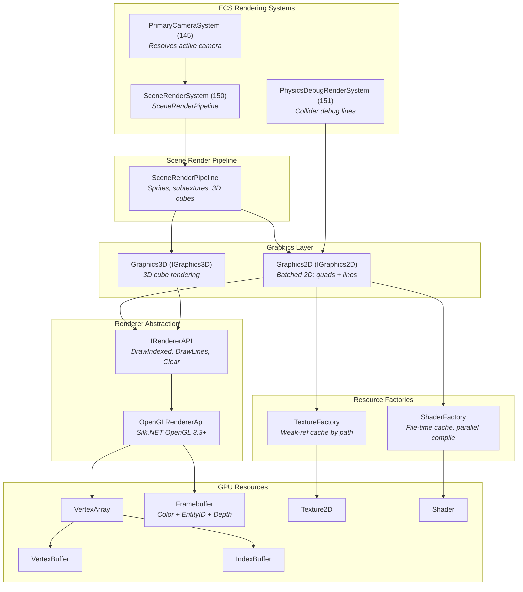
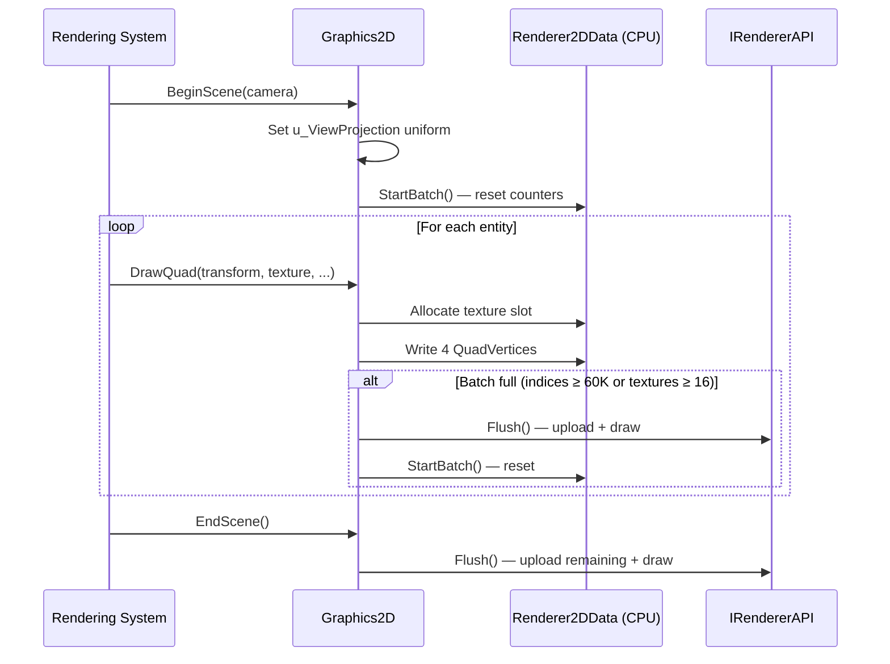
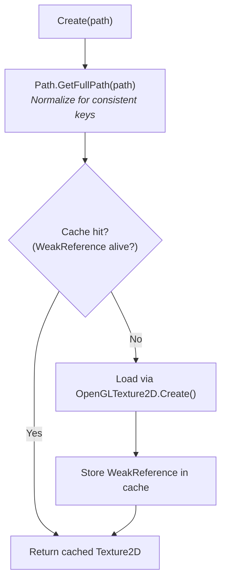
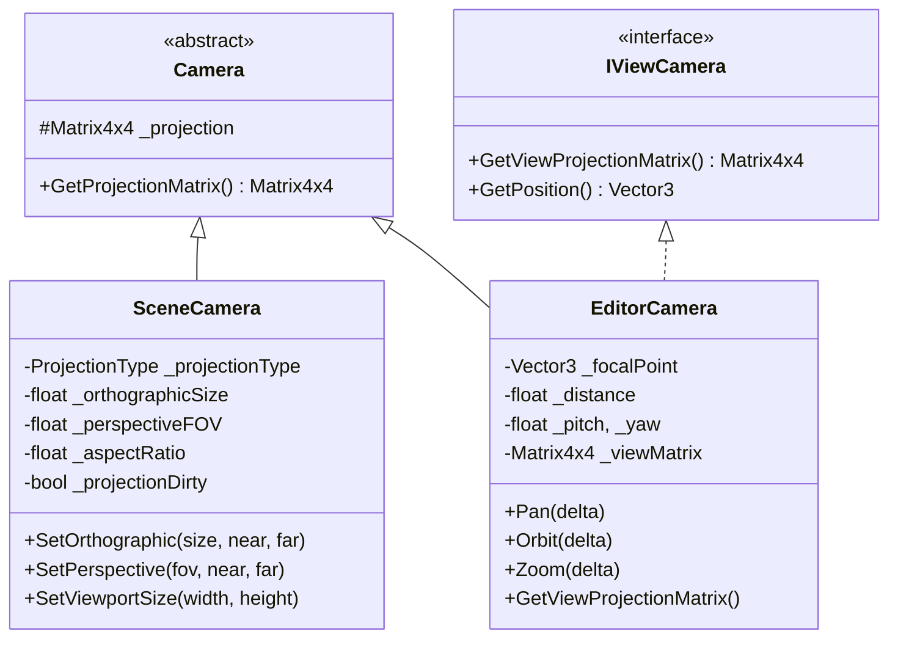
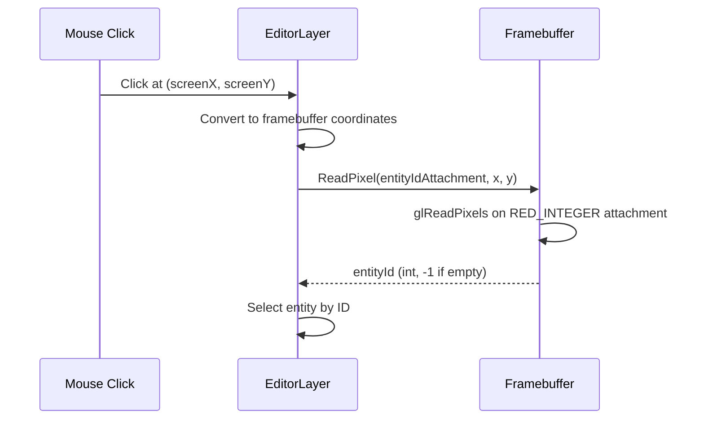

# Rendering Pipeline

The rendering pipeline flows from ECS rendering systems through a batched 2D/3D graphics layer, abstracted behind `IRendererAPI` to isolate OpenGL from engine core.

---

## C4 Level 3 — Component Diagram

```mermaid
graph TB
    subgraph "ECS Rendering Systems"
        PCS["PrimaryCameraSystem (145)<br/><i>Resolves active camera</i>"]
        SRS["SceneRenderSystem (150)<br/><i>SceneRenderPipeline</i>"]
        PDRS["PhysicsDebugRenderSystem (151)<br/><i>Collider debug lines</i>"]
    end

    subgraph "Scene Render Pipeline"
        SRP["SceneRenderPipeline<br/><i>Sprites, subtextures, 3D cubes</i>"]
    end

    subgraph "Graphics Layer"
        G2D["Graphics2D (IGraphics2D)<br/><i>Batched 2D: quads + lines</i>"]
        G3D["Graphics3D (IGraphics3D)<br/><i>3D cube rendering</i>"]
    end

    subgraph "Resource Factories"
        TF["TextureFactory<br/><i>Weak-ref cache by path</i>"]
        SF["ShaderFactory<br/><i>File-time cache, parallel compile</i>"]
    end

    subgraph "Renderer Abstraction"
        API["IRendererAPI<br/><i>DrawIndexed, DrawLines, Clear</i>"]
        OAPI["OpenGLRendererApi<br/><i>Silk.NET OpenGL 3.3+</i>"]
    end

    subgraph "GPU Resources"
        VAO["VertexArray"]
        VBO["VertexBuffer"]
        IBO["IndexBuffer"]
        FB["Framebuffer<br/><i>Color + EntityID + Depth</i>"]
        Tex["Texture2D"]
        Shader["Shader"]
    end

    PCS --> SRS
    SRS --> SRP
    SRP --> G2D
    SRP --> G3D
    PDRS --> G2D
    G2D --> API
    G3D --> API
    G2D --> TF
    G2D --> SF
    API --> OAPI
    OAPI --> VAO
    OAPI --> FB
    TF --> Tex
    SF --> Shader
    VAO --> VBO
    VAO --> IBO
```

---

## SceneRenderPipeline

**File**: `Engine/Scene/SceneRenderPipeline.cs`

`SceneRenderSystem` (priority 150) calls `SceneRenderPipeline.RenderScene`, which batches all drawable entities in one pass:

| Pass | Components queried | Graphics API |
|------|-------------------|--------------|
| 2D sprites | `SpriteRendererComponent` + `TransformComponent` | `IGraphics2D.DrawQuad` |
| 2D subtextures | `SubTextureRendererComponent` + `TransformComponent` | `IGraphics2D.DrawQuad` with atlas coords |
| 3D cubes | `ModelRendererComponent` + `TransformComponent` | `IGraphics3D.DrawCube` with ambient/directional light |

`PhysicsDebugRenderSystem` (priority 151) draws collider outlines via `PhysicsDebugDrawer` when `DebugSettings.ShowColliderBounds` is enabled.

**Render order within a frame**: 2D sprites and subtextures first, then 3D cubes. Both passes share the same `CameraBinding` from `PrimaryCameraSystem` (runtime) or `EditorCamera` (editor).

---

## 3D Cube Rendering

**Files**: `Engine/Renderer/Graphics3D.cs`, `Engine/Renderer/IGraphics3D.cs`, `Engine/Renderer/MeshFactory.cs`

`Graphics3D` draws a shared unit cube for every entity with `ModelRendererComponent` + `TransformComponent`. Lighting comes from the first `AmbientLightComponent` and `DirectionalLightComponent` in the scene.

### IGraphics3D API

| Method | Purpose |
|--------|---------|
| `Init()` | Load `flatColorShader`, create shared cube via `MeshFactory.CreateCube()` |
| `BeginScene(Camera, Matrix4x4)` / `BeginScene(IViewCamera)` | Upload `u_ViewProjection` |
| `DrawCube(Matrix4x4 transform, Vector4 color, int entityId)` | Indexed draw of shared cube mesh |
| `SetAmbientLight(Vector3 color, float strength)` | Scene ambient (`lightColor`, `strength` uniforms) |
| `SetDirectionalLight(Vector3 direction, Vector3 color)` | Directional diffuse (`u_LightDirection`, `u_LightColor`) |
| `EndScene()` | Unbind shader |

There is no 3D batching — each cube is one `DrawIndexed` call. `GetStats()` tracks `DrawCalls` per frame.

### Shaders and lighting

**Shader**: `assets/shaders/OpenGL/flatColorShader.vert` / `.frag`

Fragment output: `(ambient + diffuse) * albedo` where albedo is `ModelRendererComponent.Color`. No specular term; no texture sampling in the current 3D shader.

### Mesh

**File**: `Engine/Renderer/Mesh.cs`

`Mesh.Vertex` holds position, normal, tex coords, tangents, and entity ID (60 bytes). `IMeshFactory` only implements `CreateCube()` today — the cube mesh is created once and reused.

Detailed workflow: [OpenGL 3D Rendering Workflow](../opengl/opengl-3d-workflow.md).

---

## IRendererAPI

**File**: `Engine/Renderer/IRendererAPI.cs`

Platform-agnostic rendering interface. All OpenGL calls are isolated behind this abstraction — engine code never calls `gl.*` directly.

| Method | Purpose |
|--------|---------|
| `Init()` | Enable blending (SRC_ALPHA, ONE_MINUS_SRC_ALPHA), depth test (LEQUAL) |
| `SetClearColor(Vector4)` | Set framebuffer clear color |
| `Clear()` | Clear color + depth buffers |
| `BindTexture2D(uint textureId, int slot)` | Bind a 2D texture to a sampler slot |
| `DrawIndexed(IVertexArray, uint count)` | Draw triangles via `glDrawElements` |
| `DrawLines(IVertexArray, uint vertexCount)` | Draw lines via `glDrawArrays` |
| `SetLineWidth(float)` | Set line width (clamped to 1.0 on modern OpenGL) |
| `SetDepthTest(bool enabled)` | Enable or disable depth testing |
| `GetError()` | Return OpenGL error code (0 = no error) |

**OpenGL implementation**: `Engine/Platform/OpenGL/OpenGLRendererApi.cs` — all calls wrapped with `OpenGLDebug.CheckError()` in DEBUG builds.

---

## 2D Batching System

### Vertex Formats

| Struct | Size | Fields |
|--------|------|--------|
| **QuadVertex** | 48 bytes | Position (Vec3), Color (Vec4), TexCoord (Vec2), TexIndex (float), TilingFactor (float), EntityId (int) |
| **LineVertex** | 32 bytes | Position (Vec3), Color (Vec4), EntityId (int) |

**Files**: `Engine/Renderer/Primitives/QuadVertex.cs`, `Engine/Renderer/Primitives/LineVertex.cs`

### Batch Limits

Defined in `Engine/Renderer/RenderingConstants.cs` and `Renderer2DData.cs`:

| Constant | Value | Purpose |
|----------|-------|---------|
| DefaultMaxQuads | 10,000 | Quads per batch |
| MaxVertices | 40,000 | 10K quads × 4 vertices |
| MaxIndices | 60,000 | 10K quads × 6 indices (2 triangles) |
| MaxTextureSlots | 16 | OpenGL minimum guaranteed texture units |
| DefaultLineWidth | 1.0f | Line width for debug/wireframe drawing |
| MaxFramebufferSize | 8,192 | Max framebuffer dimension (px) |

### Batch Lifecycle

**File**: `Engine/Renderer/Graphics2D.cs`

```mermaid
sequenceDiagram
    participant System as Rendering System
    participant G2D as Graphics2D
    participant Batch as Renderer2DData (CPU)
    participant GPU as IRendererAPI

    System->>G2D: BeginScene(camera)
    G2D->>G2D: Set u_ViewProjection uniform
    G2D->>Batch: StartBatch() — reset counters

    loop For each entity
        System->>G2D: DrawQuad(transform, texture, ...)
        G2D->>Batch: Allocate texture slot
        G2D->>Batch: Write 4 QuadVertices

        alt Batch full (indices ≥ 60K or textures ≥ 16)
            G2D->>GPU: Flush() — upload + draw
            G2D->>Batch: StartBatch() — reset
        end
    end

    System->>G2D: EndScene()
    G2D->>GPU: Flush() — upload remaining + draw
```

### Batch Operations

**StartBatch()**: Resets CPU-side ring buffer index, quad index count, texture slot index (slot 0 reserved for white texture), and clears texture slot cache.

**DrawQuad()**: The core batching logic:
1. Check capacity — if indices ≥ MaxIndices, trigger `NextBatch()`
2. Resolve texture slot:
   - Check `TextureSlotCache` dictionary (O(1) lookup by renderer ID)
   - If not cached and slots full (≥16), trigger `NextBatch()`
   - Assign slot: `TextureSlots[slotIndex] = texture`, cache the mapping
3. Transform 4 corner positions: `Vector3.Transform(cornerPos, transformMatrix)`
4. Write 4 `QuadVertex` structs into the ring buffer
5. Increment index count by 6

**Flush()**: Uploads to GPU and draws:
1. Bind quad shader and vertex array
2. Upload only the used portion of the vertex buffer via `SetData()` (span slice)
3. Bind all active textures to their sampler slots (`TextureSlots[0..TextureSlotIndex)`)
4. Disable depth test, issue `rendererApi.DrawIndexed()`, re-enable depth test
5. If line vertices exist: bind line shader, upload line buffer, issue `DrawLines()` (depth test on)
6. Increment draw call statistics per batch submitted

**Shaders** (loaded via `ShaderFactory` in `Graphics2D.Init()`):
- Quads: `assets/shaders/OpenGL/textureShader.vert` + `textureShader.frag` — `u_Textures[16]` sampler array, entity ID to attachment 1
- Lines: `assets/shaders/OpenGL/lineShader.vert` + `lineShader.frag` — solid color, entity ID to attachment 1

**NextBatch()**: Calls `Flush()` then `StartBatch()` — seamless batch boundary.

---

## Texture Management

### TextureFactory

**File**: `Engine/Renderer/Textures/TextureFactory.cs`

```mermaid
graph TD
    Request["Create(path)"] --> Normalize["Path.GetFullPath(path)<br/><i>Normalize for consistent keys</i>"]
    Normalize --> CacheCheck{"Cache hit?<br/>(WeakReference alive?)"}
    CacheCheck -->|Yes| Return["Return cached Texture2D"]
    CacheCheck -->|No| Load["Load via OpenGLTexture2D.Create()"]
    Load --> Cache["Store WeakReference in cache"]
    Cache --> Return
```

- **Weak reference cache**: `Dictionary<string, WeakReference<Texture2D>>` — textures GC'd if no other references
- **Path normalization**: `Path.GetFullPath()` + `StringComparer.OrdinalIgnoreCase` for cross-platform consistency
- **White texture singleton**: 1×1 pixel `0xFFFFFFFF`, created on first access (double-check locking), permanently occupies texture slot 0
- **Thread-safe**: All cache operations protected by `Lock`
- **Implements IDisposable**: Clears cache and disposes white texture on shutdown

### Texture Slot Caching (Per-Batch)

Within a single batch, `Graphics2D` maintains a `Dictionary<uint, int>` mapping texture renderer IDs to slot indices. This avoids re-allocating slots for the same texture across multiple quads in one batch. The cache is cleared on every `StartBatch()`.

---

## Shader Management

### ShaderFactory

**File**: `Engine/Renderer/Shaders/ShaderFactory.cs`

- **Cache key**: `(vertexPath, fragmentPath, vertModTime, fragModTime)` — includes `File.GetLastWriteTimeUtc()` for both files
- **Auto-invalidation**: Modified shader files automatically miss the cache → recompiled on next access
- **Double-checked locking**: Check cache → compile outside lock → re-check cache → store (handles race conditions by disposing duplicate compilations)
- **Weak references**: Shaders GC'd when no scene references remain; dead entries cleaned on cache miss
- **Parallel compilation**: Lock released during compilation so multiple threads can compile different shaders concurrently

---

## Camera System

```mermaid
classDiagram
    class Camera {
        <<abstract>>
        #Matrix4x4 _projection
        +GetProjectionMatrix() Matrix4x4
    }

    class SceneCamera {
        -ProjectionType _projectionType
        -float _orthographicSize
        -float _perspectiveFOV
        -float _aspectRatio
        -bool _projectionDirty
        +SetOrthographic(size, near, far)
        +SetPerspective(fov, near, far)
        +SetViewportSize(width, height)
    }

    class EditorCamera {
        -Vector3 _focalPoint
        -float _distance
        -float _pitch, _yaw
        -Matrix4x4 _viewMatrix
        +Pan(delta)
        +Orbit(delta)
        +Zoom(delta)
        +GetViewProjectionMatrix()
    }

    class IViewCamera {
        <<interface>>
        +GetViewProjectionMatrix() Matrix4x4
        +GetPosition() Vector3
    }

    Camera <|-- SceneCamera
    Camera <|-- EditorCamera
    IViewCamera <|.. EditorCamera
```

**Base class**: `Engine/Scene/Cameras/Camera.cs`

### SceneCamera (Runtime)

**File**: `Engine/Scene/SceneCamera.cs`

- Supports **orthographic** (2D, default) and **perspective** (3D) projection
- **Lazy evaluation**: Projection matrix only recomputed when dirty flag set (property changes, viewport resize)
- Wrapped in `CameraComponent` on an entity; `Primary` flag designates the active camera
- `PrimaryCameraSystem` (priority 145) resolves the primary camera each frame and caches it for rendering systems

### EditorCamera

**File**: `Engine/Scene/Cameras/EditorCamera.cs`

- Always perspective — orbits around a focal point
- Controls: **Pan** (lateral), **Orbit** (yaw/pitch around focal point), **Zoom** (distance from focal point)
- Implements `IViewCamera` — owns its view matrix (computed from focal point, distance, orientation)
- Configuration in `CameraConfig.cs`: rotation speed 0.8, zoom sensitivity 0.1, distance range [0.5, 500]

### BeginScene Integration

`Graphics2D.BeginScene()` has two overloads:

| Overload | Usage | View Matrix Source |
|----------|-------|--------------------|
| `BeginScene(Camera camera, Matrix4x4 transform)` | Runtime rendering | Inverts entity's TransformComponent |
| `BeginScene(IViewCamera camera)` | Editor rendering | Camera provides precomputed view-projection |

Both set the `u_ViewProjection` uniform on quad and line shaders, then call `StartBatch()`.

---

## Framebuffers

**File**: `Engine/Renderer/Buffers/FrameBuffer/`

### Attachment Configuration

The editor framebuffer uses three attachments:

| Attachment | Format | Purpose |
|------------|--------|---------|
| Color | RGBA16F | Scene rendering — displayed in ImGui viewport |
| Entity ID | RED_INTEGER | 32-bit int per pixel — stores entity ID for mouse picking |
| Depth | DEPTH24STENCIL8 | Depth testing for correct draw order |

Default size: `DisplayConfig.DefaultEditorViewportWidth` × `DefaultEditorViewportHeight` (1280×720). See [Frame Buffers](../opengl/frame-buffers.md) for API and OpenGL details.

### Entity Picking

```mermaid
sequenceDiagram
    participant Mouse as Mouse Click
    participant Editor as EditorLayer
    participant FB as Framebuffer

    Mouse->>Editor: Click at (screenX, screenY)
    Editor->>Editor: Convert to framebuffer coordinates
    Editor->>FB: ReadPixel(entityIdAttachment, x, y)
    FB->>FB: glReadPixels on RED_INTEGER attachment
    FB-->>Editor: entityId (int, -1 if empty)
    Editor->>Editor: Select entity by ID
```

- `ReadPixel()` binds the framebuffer as `GL_READ_FRAMEBUFFER`, reads a single pixel from the entity ID attachment
- Entity ID written per-vertex in `QuadVertex.EntityId` — the fragment shader outputs it to the second color attachment
- `ClearAttachment()` resets the entity ID buffer to -1 before each frame

### Resize

Framebuffers resize to match the viewport, clamped to `MaxFramebufferSize` (8192×8192). The editor handles logical-to-physical DPI scaling before resizing.

---

## Rendering Statistics

`Graphics2D` tracks per-frame statistics via `Renderer2DData.Statistics` (`Engine/Renderer/Statistics.cs`):

| Field | Meaning |
|-------|---------|
| **DrawCalls** | Number of `Flush()` invocations (quad and line batches count separately) |
| **QuadCount** | Total quads drawn across all batches |

`GetTotalVertexCount()` and `GetTotalIndexCount()` derive totals from `QuadCount`. Reset via `ResetStats()` before each frame. Exposed for the editor stats panel.
