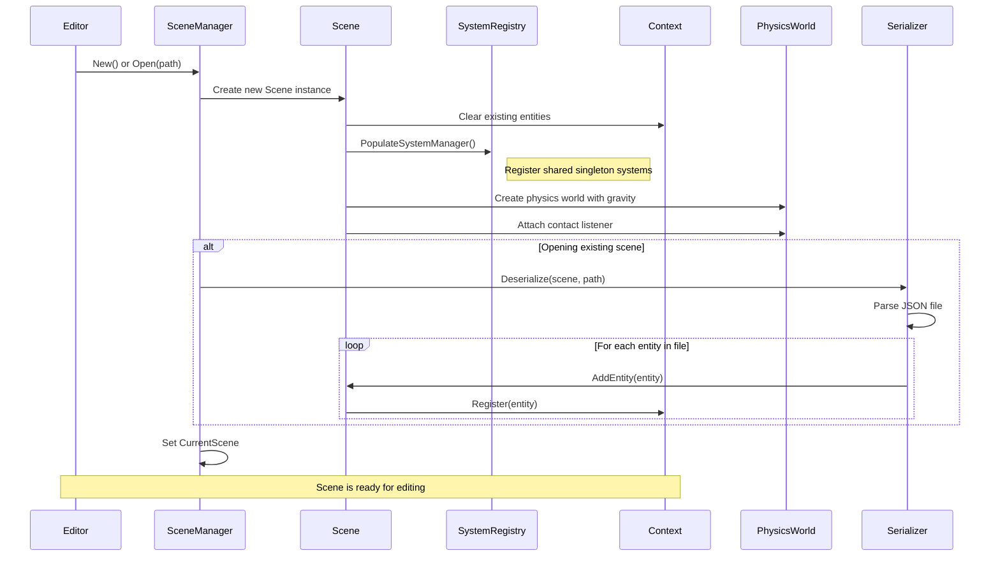
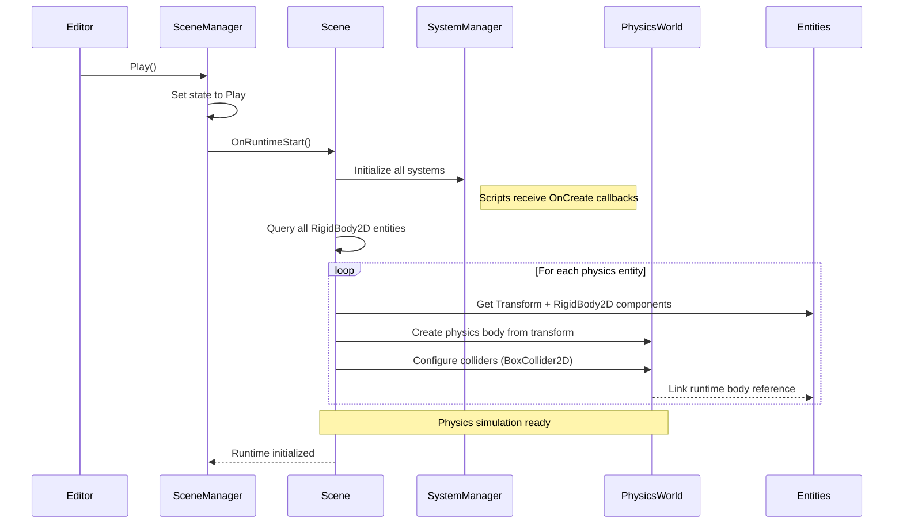
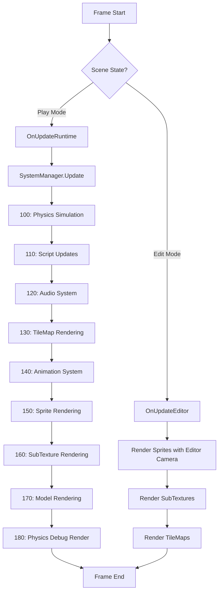
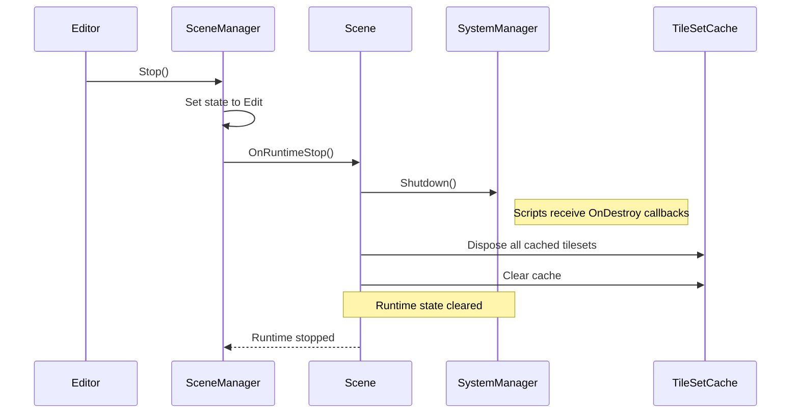
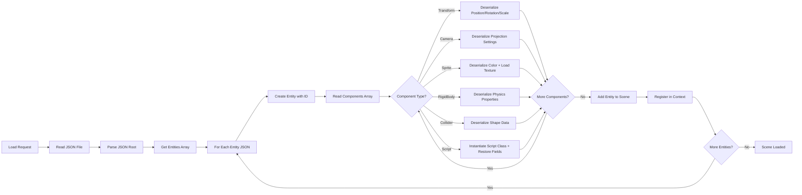
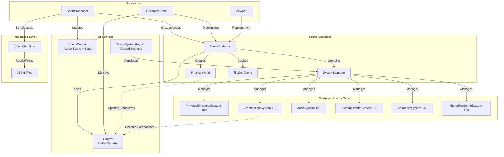
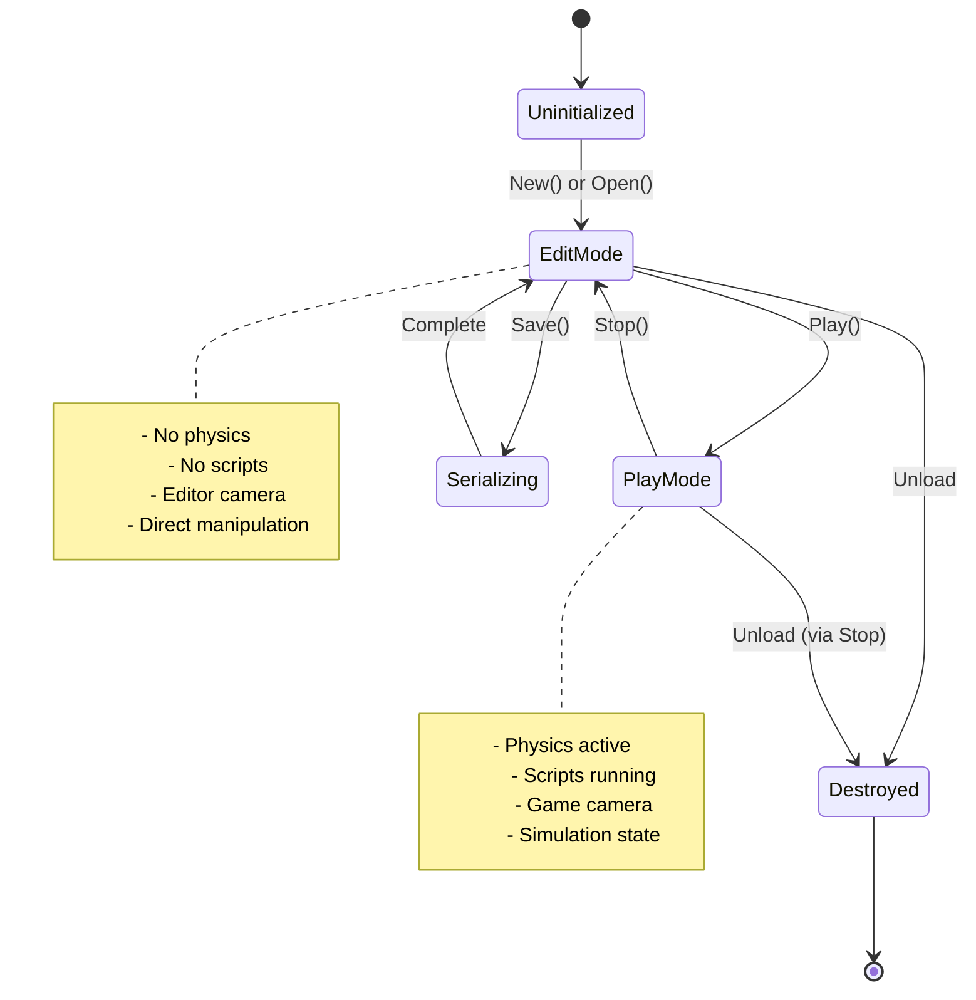

# Scene Management

## Overview

**Purpose**: The Scene Management module is the organizational backbone of the game engine, responsible for structuring game worlds as collections of entities and managing their entire lifecycle from creation through gameplay to serialization.

**Scope**: This module handles:
- Entity creation, registration, and destruction
- Scene state transitions (Edit mode vs. Play mode)
- Integration between the editor workflow and runtime execution
- Scene persistence through serialization and deserialization
- Physics world initialization and cleanup
- Viewport management and camera synchronization

**Key Concepts**:
- **Entity-Component Architecture**: Scenes are collections of entities (game objects) that contain components (data and behavior)
- **State-Based Execution**: Scenes operate in distinct modes (Edit/Play) with different update behaviors
- **Dependency Injection**: Entity context and scene context are injected via DI (IContext, ISceneContext), providing unified access to all entities
- **Lifecycle Separation**: Clear boundaries between editor-time operations and runtime gameplay
- **System Registry**: Shared singleton systems (rendering, audio, animation) are managed via ISceneSystemRegistry while per-scene systems (physics) are created per scene

## Core Concepts

### Scene as a Container
A scene represents a complete game world or level. It's not just a data structure but an active coordinator that:
- Manages all entities within that world
- Orchestrates physics simulation during gameplay
- Coordinates rendering by identifying cameras and renderable entities
- Handles the transition between design-time and play-time states

### Dual-Mode Operation
Scenes operate in two fundamental modes:

**Edit Mode**: The scene is in a design state where:
- Developers can freely manipulate entities
- Physics simulation is inactive
- Changes are immediate and reversible
- The editor camera controls the view

**Play Mode**: The scene is in active gameplay where:
- Physics simulation runs continuously
- Scripts execute their gameplay logic
- Entity transforms are driven by simulation
- The primary game camera controls the view

### Entity Lifecycle Management
Entities within a scene follow a controlled lifecycle:
1. **Creation**: Entities are spawned with unique identifiers
2. **Registration**: Added to the global entity context for querying
3. **Component Attachment**: Functionality is added through components
4. **Active Use**: Entities participate in updates and rendering
5. **Destruction**: Entities are removed from the scene cleanly

## Architecture Flow

### Scene Initialization



**Flow Description**:
1. The editor requests either a new blank scene or loading an existing scene from disk
2. A fresh scene instance is created, which automatically clears the injected entity context (IContext)
3. The SystemRegistry populates the SystemManager with shared singleton systems (rendering, audio, animation)
4. A physics world is created immediately with default gravity (-9.8 Y) and contact listener attached
5. Per-scene systems like PhysicsSimulationSystem are registered with the scene's physics world
6. If loading from disk, the serializer parses the JSON scene file
7. Each entity and its components are reconstructed from JSON data
8. Entities are registered with the context, making them queryable by systems
9. The scene becomes the "current" active scene accessible via ISceneContext

### Play Mode Transition



**Flow Description**:
1. User triggers play mode from the editor
2. Scene state transitions from Edit to Play via ISceneContext
3. SystemManager initializes all systems (scripts receive OnCreate callbacks)
4. The scene queries all entities with rigid body components
5. For each physics-enabled entity:
   - Transform data (position, rotation) is extracted
   - A corresponding physics body is created in the pre-existing physics world
   - Collider shapes (BoxCollider2D) are generated with proper scaling
   - The runtime physics body reference is stored in the component
   - Entity reference is stored in the body for collision callbacks
6. The physics simulation is now active and ready to step forward

### Runtime Update Loop



**Flow Description**:

**Edit Mode Path**:
- Uses the editor-controlled orthographic camera
- Renders sprites, subtextures, and tilemaps (with tileset caching)
- No physics or script execution occurs

**Play Mode Path** (systems execute in priority order):
1. **Physics Simulation (100)**: Steps the Box2D physics world and syncs transforms
2. **Script Updates (110)**: All script components receive OnUpdate callbacks with delta time
3. **Audio System (120)**: Updates audio sources and listener positions
4. **TileMap Rendering (130)**: Renders tilemap layers in Z-index order
5. **Animation System (140)**: Updates sprite animations and texture coordinates
6. **Sprite Rendering (150)**: Renders SpriteRendererComponent entities
7. **SubTexture Rendering (160)**: Renders SubTextureRendererComponent entities
8. **Model Rendering (170)**: Renders 3D models (currently disabled)
9. **Physics Debug Render (180)**: Optional collider outline visualization

### Stop Play Mode



**Flow Description**:
1. Editor triggers stop (returning to Edit mode)
2. Scene state transitions back to Edit via ISceneContext
3. SystemManager shuts down all systems (scripts receive OnDestroy callbacks)
4. Editor tileset cache is cleared and textures disposed
5. The scene returns to a clean edit state, ready for modifications

**Note**: Physics bodies remain in the physics world but are not stepped. The physics world persists for the scene's lifetime and is only destroyed when the scene is disposed.

### Scene Serialization

```mermaid
flowchart LR
    A[Save Request] --> B[Create JSON Root]
    B --> C[Iterate All Entities]
    C --> D[For Each Entity]

    D --> E[Serialize ID & Name]
    E --> F{Has Transform?}
    F -->|Yes| G[Serialize Transform]
    F -->|No| H{Has Camera?}
    G --> H

    H -->|Yes| I[Serialize Camera]
    H -->|No| J{Has Sprite?}
    I --> J

    J -->|Yes| K[Serialize Sprite & Texture Path]
    J -->|No| L{Has Physics?}
    K --> L

    L -->|Yes| M[Serialize RigidBody + Collider]
    L -->|No| N{Has Script?}
    M --> N

    N -->|Yes| O[Serialize Script Type & Fields]
    N -->|No| P[Add to JSON Array]
    O --> P

    P --> Q{More Entities?}
    Q -->|Yes| D
    Q -->|No| R[Write JSON to File]
```



**Flow Description**:
1. Save is triggered with a target file path
2. A JSON structure is created with scene metadata
3. The serializer iterates through all entities in the scene
4. For each entity:
   - Basic identity (ID, name) is written
   - Each component type is checked in sequence
   - Component data is converted to JSON representation
   - Special handling for textures (storing file paths)
   - Script fields are introspected and serialized
5. The complete JSON is formatted with indentation
6. The file is written to disk in the scenes directory

### Scene Deserialization



**Flow Description**:
1. An existing scene file path is provided
2. The JSON file is read and parsed into a document structure
3. The entities array is extracted from the root
4. For each entity in the JSON:
   - An entity object is created with the stored ID and name
   - The components array is processed
   - Each component type is matched to its deserializer
   - Transform data (vectors) is reconstructed
   - Texture paths are loaded into actual texture resources
   - Script types are looked up and instantiated
   - Script field values are restored via reflection
   - The fully reconstructed entity is added to the scene via `AddEntity()`
   - The Scene tracks the maximum entity ID to ensure new entities get higher IDs
   - Entity is registered in the global context for querying
5. The scene is now populated and ready for use

**ID Continuity**: When entities are loaded from a saved scene, the `AddEntity()` method tracks the highest entity ID encountered. This ensures that any new entities created after loading will receive IDs greater than all existing entities, preventing ID collisions and maintaining uniqueness.

## Lifecycle & Timing

### Initialization Phase

**When**: Scene is created or loaded from disk

**Operations**:
- Clear the injected entity context (IContext) to ensure no stale data
- SystemRegistry populates SystemManager with shared singleton systems
- Create physics world with gravity (-9.8 Y) and attach contact listener
- Register per-scene PhysicsSimulationSystem with the physics world
- If loading from file, deserialize all entities and components
- Register entities with the context for system queries
- Prepare viewport dimensions for camera initialization
- Set up component event listeners (e.g., camera viewport updates)

**Editor State**: Scene is in Edit mode, ready for manipulation

### Edit Mode Execution

**When**: Continuously while scene is open in editor

**Frame Operations**:
- Render sprites using editor camera (user-controlled orthographic camera)
- Render subtextures with calculated or pre-computed UV coordinates
- Render tilemaps with cached tilesets (to avoid per-frame texture loading)
- No physics simulation
- No script execution
- Entity modifications take effect immediately

**Timing**: Runs at editor framerate (typically 60 FPS)

### Runtime Start Phase

**When**: User presses Play button in editor

**Operations**:
1. SystemManager initializes all systems (scripts receive OnCreate callbacks)
2. Query all entities with RigidBody2DComponent
3. For each physics entity:
   - Extract transform position and rotation
   - Create Box2D body with appropriate type (Static/Dynamic/Kinematic)
   - Store entity reference in body via SetUserData
   - Configure BoxCollider2D shapes with scaling
   - Link runtime body reference back to component

**Duration**: Single-frame operation, synchronous

**Note**: Physics world already exists from scene construction; this phase only creates the runtime bodies

### Runtime Execution Phase

**When**: Every frame while in Play mode

**Frame Operations** (SystemManager.Update executes systems in priority order):
1. **Physics Simulation (100)**: Step Box2D world, sync transforms from physics bodies
2. **Script Update (110)**: Execute all script OnUpdate callbacks with delta time
3. **Audio System (120)**: Update audio source positions and listener
4. **TileMap Rendering (130)**: Render tilemap layers in Z-index order
5. **Animation System (140)**: Update sprite animations, compute texture coordinates
6. **Sprite Rendering (150)**: Render SpriteRendererComponent entities
7. **SubTexture Rendering (160)**: Render SubTextureRendererComponent entities
8. **Model Rendering (170)**: Render 3D models (currently disabled)
9. **Physics Debug Render (180)**: Optional collider visualization

**Timing**: Systems run every frame; physics uses internal fixed timestep

### Runtime Stop Phase

**When**: User presses Stop button in editor

**Operations** (in order):
1. SystemManager.Shutdown() is called (scripts receive OnDestroy callbacks)
2. Editor tileset cache is cleared and disposed
3. Scene state returns to Edit mode

**Important**:
- Entities and their component data persist
- Physics world persists but is not stepped (bodies remain until scene disposal)
- Runtime body references in RigidBody2DComponent remain set

### Shutdown/Cleanup

**When**: Scene is unloaded or application exits (Scene.Dispose() called)

**Operations**:
- Unsubscribe from all entity OnComponentAdded events to prevent memory leaks
- Dispose SystemManager (disposes per-scene systems like PhysicsSimulationSystem)
- Shared singleton systems are NOT disposed (they persist across scenes)
- Clear and dispose editor tileset cache
- Clear entity context (IContext.Clear())

**State**: Clean slate for next scene load

## Data Flow Architecture



## State Machine



## Key Integration Points

### Entity Context Integration
- **Purpose**: Provides a centralized registry of all entities across the engine
- **Pattern**: Dependency injected via IContext interface (no static singleton)
- **Scene's Role**: Receives IContext via constructor, registers entities on creation, clears context on initialization
- **Querying**: Systems use the injected context to find entities with specific component combinations
- **Scene Context**: ISceneContext tracks the active scene and current state (Edit/Play)

### Physics World Integration
- **Purpose**: Simulates realistic physics behavior for game entities
- **Lifecycle**: Created in Scene constructor with gravity (-9.8 Y), persists until scene disposal
- **Runtime Bodies**: Physics bodies are created in OnRuntimeStart from entity transforms
- **Data Flow**: Transform data flows TO physics on start, FROM physics during runtime updates
- **Entity Linking**: Physics bodies store entity references for collision callbacks via SetUserData
- **Contact Listener**: SceneContactListener handles collision events between physics bodies

### Rendering Integration
- **Purpose**: Visualize scene contents on screen
- **Camera-Driven**: Scene identifies the primary camera each frame (GetPrimaryCameraEntity)
- **Graphics Interface**: Uses IGraphics2D for batched 2D rendering (sprites, subtextures, tilemaps)
- **Multi-Pass**: Separate 3D and 2D rendering passes in sequence (3D currently disabled)
- **State-Aware**: Different rendering paths for Edit vs Play mode
- **TileMap Support**: Editor mode caches tileset textures to avoid per-frame disk loading

### Serialization Integration
- **Purpose**: Persist scene data to disk for saving and loading
- **Format**: Human-readable JSON with typed component data
- **Resource Handling**: Stores asset paths (textures) not binary data
- **Script Preservation**: Serializes script types and exposed field values

### System Registry Integration
- **Purpose**: Manages registration of ECS systems with the scene's SystemManager
- **Shared Systems**: ISceneSystemRegistry provides singleton systems (rendering, audio, animation) that persist across scenes
- **Per-Scene Systems**: PhysicsSimulationSystem is created per-scene because each scene has its own physics world
- **Priority Order**: Systems execute in priority order defined in SystemPriorities class
- **Lifecycle**: Shared systems are marked `isShared: true` to prevent disposal when scenes change

### Editor Integration
- **Scene Manager**: Orchestrates scene lifecycle operations (New, Open, Save, Play, Stop)
- **Hierarchy Panel**: Displays and allows manipulation of scene entities
- **Viewport**: Renders scene content with appropriate camera based on mode
- **State Coordination**: Ensures editor UI reflects current scene state via ISceneContext

## Mental Model for Developers

Think of a scene as a **theatrical stage**:

- **The Stage Itself** (Scene): Provides the space and rules for action
- **Actors** (Entities): The game objects that populate the world
- **Costumes & Props** (Components): What makes each actor unique and functional
- **Rehearsal vs Performance** (Edit vs Play): Design time vs runtime behavior
- **Director** (Scene Manager): Controls when to rehearse, perform, or reset
- **Script** (Scene File): The written record that recreates the same performance

### Developer Workflow

1. **Creating Content**: Add entities to scene, attach components, position objects
2. **Testing Gameplay**: Enter Play mode to see physics and scripts in action
3. **Iterating**: Stop, modify, replay - the cycle repeats
4. **Saving Work**: Serialize scene to preserve your creation
5. **Loading Later**: Deserialize to restore exact scene state

### Common Patterns

**Query Pattern**: Need entities with specific components? Use injected context queries:
```csharp
// In a system with IContext injected via constructor
var group = _context.GetGroup([typeof(TransformComponent), typeof(SpriteRendererComponent)]);

// Or use the strongly-typed View method
var view = _context.View<CameraComponent>();
foreach (var (entity, component) in view) { ... }
```

**Lifecycle Pattern**: Need initialization or cleanup? Use SystemManager callbacks (OnCreate/OnDestroy for scripts)

**State Pattern**: Different behavior in Edit vs Play? Check ISceneContext.State in your systems

**Persistence Pattern**: Need data to survive saves? Ensure components implement Clone() and have JSON serialization support

**Duplicate Pattern**: Need to clone an entity? Use scene.DuplicateEntity(entity) which clones all components via reflection
