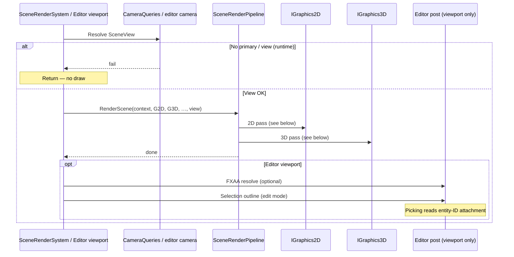

# Scene Rendering Pipeline

How a frame is drawn: pass order, why each stage exists, and the contracts between the scene coordinator, graphics layers, and shaders. Lighting and shadow algorithms live in sibling docs; this one owns frame topology and shared draw rules.

**Status of decisions below:** good-enough-for-now unless noted. Each decision lists options considered and trade-offs so maintainers know what was rejected and why a change would hurt.

---

## Design Decisions

### Forward 3D color path

The 3D color pass shades meshes in one forward pass (lights evaluated in the fragment shader). Deep lighting model choices (Cook-Torrance, light counts, no IBL) are documented in [Lighting](lighting.md). Here the pipeline-level choice is only: **shade at draw time in the color pass**, not a separate G-buffer lighting stage.

| Option | Pros | Cons |
|--------|------|------|
| **Forward (chosen)** | Simple pass graph; matches current mesh/instance path; easy to reason about with few lights | Scales poorly with many lights × many objects; overdraw pays full shading |
| Deferred | Many lights cheaper; decouples geometry from lighting | Extra targets/bandwidth; harder with MSAA/transparency; more code for a small light budget |
| Forward+ / clustered | Middle ground for many lights | Complexity without a near-term need |

### Single scene coordinator

`SceneRenderPipeline` owns the drawable pass for a given `SceneView`: 2D batch, light upload, shadow passes, opaque 3D. ECS systems (`SceneRenderSystem`, editor viewport) call into it rather than each owning a slice of the GPU frame.

| Option | Pros | Cons |
|--------|------|------|
| **One coordinator (chosen)** | Pass order is obvious; shared culling/lights; one place to time the frame | Large static class; temptation to dump unrelated draws here |
| Per-pass ECS systems | Fits “systems do work” narrative | Ordering bugs; duplicated light/view setup; harder to keep shadow→color consistent |
| Immediate calls from gameplay | Flexible | No shared contracts; editor/runtime diverge fast |

### 2D batch, then 3D sequence

Within one `RenderScene` call, sprites/subtextures run to completion (`BeginScene` → draw → `EndScene`), then the 3D sequence runs. This is convenience, not a hard compositing rule: 2D currently has no depth interaction with 3D.

| Option | Pros | Cons |
|--------|------|------|
| **2D then 3D (chosen)** | Simple; 2D HUD/sprites stay readable; matches “sprites then world” mental model | Cannot interleave depth-sorted 2D/3D; world cannot occlude sprites correctly |
| Interleaved / depth-tested 2D | Correct 2.5D | Needs shared depth policy and sort keys |
| 3D then 2D only | UI always on top | Same as today for UI; worse if sprites are world-space |

### Depth policy: 2D flush off, 3D on

The 2D quad flush disables depth test for the indexed draw; 3D color/shadow draws enable depth. Lines in the 2D path re-enable depth when drawn. Convenience aligned with “sprites as overlay / unlayered batch.”

| Option | Pros | Cons |
|--------|------|------|
| **2D no depth, 3D depth (chosen)** | Predictable sprite stacking by draw order; no z-fighting with the mesh pass | World-space sprites ignore mesh depth |
| Depth-test 2D | Sprites can occlude/be occluded | Requires careful z and sort; batching harder |
| Always off | Simplest | 3D self-occlusion breaks |

### Shadow passes before color `BeginScene`

Directional (and optional point) shadow maps are rendered, then `IGraphics3D.BeginScene` uploads view, lights, and shadow bindings for the color pass. Frame-topology decision; map fitting, PCF, and cache behavior are in [Shadows](shadows.md).

| Option | Pros | Cons |
|--------|------|------|
| **Shadows then color (chosen)** | Color shader can sample finished maps; one color pass | Extra geometry passes; must keep caster set consistent |
| Shadows after color | — | Color cannot sample that frame’s maps without a second color pass |
| Combined / deferred shadows | Fewer conceptual stages | Does not match the current forward color shader |

### Shared opaque draw for shadow and color

Opaque cubes/meshes go through the same collection/cull helpers for directional shadow, point-shadow faces, and color. Shadow passes draw depth-only; color draws shaded instances.

| Option | Pros | Cons |
|--------|------|------|
| **Shared opaque path (chosen)** | One visibility story; less drift between “what casts” and “what shades” | Shadow-specific skips (caster distance, light-inside volume) must be parameterized carefully |
| Separate caster lists | Can specialize casters | Two sources of truth; missing shadows or extra draws |
| GPU-driven cull | Scales larger scenes | Far beyond current scene sizes |

### `IRendererAPI` boundary — no GL in engine core

Engine rendering code talks to `IRendererAPI` (and graphics facades). OpenGL entry points stay in the platform backend. Non-negotiable for maintainability and alternate backends.

| Option | Pros | Cons |
|--------|------|------|
| **API boundary (chosen)** | Testable fakes; backend swap; core stays readable | Indirection; some GL features need API surface growth |
| Direct GL in core | Fewer layers | Core tied to OpenGL; editor/runtime coupling to Silk.NET |
| Multiple backends in core via `#if` | — | Conditional mess; same coupling |

### Editor overlays outside game shading

Runtime and editor both call `SceneRenderPipeline.RenderScene` with a `SceneView` into a target framebuffer. The editor then applies **selection outline** and optional **FXAA** on that result, and uses an **entity-ID color attachment** for picking. Those passes are editor-owned: they must not change game materials, lights, or shadow contracts.

Why this split: game look stays identical in the standalone player; editor tools can evolve (outline style, AA toggle, picking format) without forking the color shader or shadow passes; runtime never pays for outline/FXAA shader permutations.

| Option | Pros | Cons |
|--------|------|------|
| **Post/picking outside pipeline (chosen)** | Clear runtime/editor boundary; one game shading path | Editor must composite carefully (resolve FXAA vs raw FB) |
| Bake outline/FXAA into `SceneRenderPipeline` | One call site | Runtime ships unused paths; game shaders grow editor uniforms |
| Separate editor renderer | Full isolation | Duplicated scene draw; drift from game view |

### One `SceneView` for 2D and 3D

Callers build a single `SceneView` (view-projection, view position, shadow flags) and pass it into both graphics layers for that frame.

| Option | Pros | Cons |
|--------|------|------|
| **Shared view (chosen)** | Camera math once; 2D/3D stay aligned | Cannot easily use different cameras per layer in one `RenderScene` |
| Separate 2D/3D views | Ortho UI + perspective world in one call | Two setups; easy to desync |
| Graphics layers own camera | — | Hides camera from systems; harder for editor/game to share |

### Primary camera gate

If primary-camera lookup fails, scene render systems return without drawing. One active view per frame for the default scene pass.

| Option | Pros | Cons |
|--------|------|------|
| **Require primary (chosen)** | No accidental draw with identity/junk VP; matches “one game camera” | Multi-camera (split screen, probes) needs explicit extra calls |
| Soft default camera | Always draws something | Hides misconfigured scenes |
| Draw all cameras every frame | Multi-view built-in | Cost and compositing undefined today |

### Physics debug as sibling system

Collider debug draw is `PhysicsDebugRenderSystem` (priority 151), after scene render (150). It uses the same primary `SceneView` and the 2D line path. It is not inside `SceneRenderPipeline`.

| Option | Pros | Cons |
|--------|------|------|
| **Sibling system (chosen)** | Optional debug stays out of the game pass graph; priority makes order obvious | Must remember debug depends on the same camera lookup |
| Inside `SceneRenderPipeline` | One entry | Pipeline grows debug concerns; harder to disable cleanly |
| Completely separate camera | — | Debug misaligned with game view |

### Instancing for identical mesh/material

In the color pass, `SceneRenderPipeline` batches opaque submeshes that share mesh, tint, and PBR factors and submits them with `DrawMeshInstances` when count ≥ 2.

| Option | Pros | Cons |
|--------|------|------|
| **CPU batch + instanced draw (chosen)** | Fewer draws for repeated props; small code change on top of single draws | Batch keys must stay correct; multi-material meshes split |
| One draw per entity always | Simplest | Draw-call heavy scenes |
| Full GPU batching / indirect | Best scale | Large investment |

### Visibility: hierarchy, frustum, zones

Before an opaque draw (and when collecting shadow casters), the pipeline applies three filters:

1. **`EffectiveVisible`** — hierarchy show/hide; invisible subtrees never draw.
2. **Frustum cull** — AABB vs the active view frustum (or light VP in shadow passes); optional directional **shadow-caster distance** cut from the view position.
3. **Visibility zones** — if the camera is inside one or more `VisibilityZoneComponent` AABBs, only `ModelRendererComponent`s that reference an active zone draw; others are zone-culled. When the camera is outside all zones, zone filtering is off.

This is a cheap CPU portal-style partition: authors mark interior volumes and tag meshes with a zone entity id so large exteriors can stay loaded but not draw while the camera is “inside.” It is not a full portal engine (no clipped rendering, no automatic zone graph).

| Option | Pros | Cons |
|--------|------|------|
| **Hierarchy + frustum + optional zones (chosen)** | Low cost; author-controlled interiors; shared with shadow passes | Zone setup is manual; wrong ids → missing draws; not a substitute for LODs |
| Frustum only | Less authoring | Large interiors always draw when in frustum |
| Full portals / PVS | Correct indoor engines | Heavy to build and maintain |
| GPU occlusion queries | Handles dynamic occluders | Latency and sync complexity |

### Render-thread GPU ownership

OpenGL contexts are used from a single render thread. Texture/mesh **GPU upload** and draw submission stay on that thread. There is no async buffer orphaning / multi-threaded GL in this architecture. Model import may do CPU work, but the first GPU upload for a path still happens when the render path loads the mesh.

| Option | Pros | Cons |
|--------|------|------|
| **Single GL thread (chosen)** | Matches OpenGL’s common constraints; no cross-thread context bugs | Hitch risk on first load; cannot fill buffers from worker threads without a sync strategy |
| Explicit upload queue + sync | Smoother streaming | Needs staging, fences, and lifetime rules |
| Vulkan/multi-queue | True async | Different graphics API project |

### `ShaderId` selects programs per pass

Hot paths request programs by `ShaderId` (e.g. texture/line for 2D, cube/model for color, depth / point-depth for shadows). Editor-only ids (FXAA, selection outline) are not used by `SceneRenderPipeline`.

| Option | Pros | Cons |
|--------|------|------|
| **Enum `ShaderId` (chosen)** | Stable contracts; factory cache keys; no stringly paths in the pass loop | New pass ⇒ new id + assets |
| Path strings at draw time | Flexible | Typos, weaker caching, harder audits |
| Uber-shader permutations | Fewer programs | Combinatorial explosion |

---

## Frame Overview / Pass Ordering

### Who calls whom

| Caller | When | What |
|--------|------|------|
| `SceneRenderSystem` (priority 150) | Runtime / play tick | `CameraQueries.TryGetPrimaryView` → `SceneRenderPipeline.RenderScene` |
| Editor viewport | Each editor frame | Build editor `SceneView` → bind scene framebuffer → `RenderScene` → optional FXAA → selection outline → ImGui image; picking reads entity-ID attachment |
| `PhysicsDebugRenderSystem` (priority 151) | After scene render | Same primary view; 2D lines for colliders when debug is on — **not** inside `RenderScene` |



Canonical order inside `RenderScene`:

1. **2D** — `BeginScene` → sprites → subtextures → `EndScene` (flush)
2. **3D lights** — ambient / directional / point data uploaded to `IGraphics3D` ([Lighting](lighting.md))
3. **Directional shadow** (if sun color non-zero and fit succeeds) — depth pass, then bind map ([Shadows](shadows.md))
4. **Point shadows** (if `SceneView.PointShadows` and lights cast) — cubemap faces or cache reuse ([Shadows](shadows.md))
5. **3D color** — `BeginScene` → opaque cubes/meshes (instanced when possible) → `EndScene`

There is no separate transparency pass. Fully transparent sprite tints are skipped; 2D otherwise draws in submission order without depth.

### 2D pass

```mermaid
sequenceDiagram
    participant SRP as SceneRenderPipeline
    participant G2D as IGraphics2D
    participant GPU as IRendererAPI

    SRP->>G2D: BeginScene(view)
    Note over G2D: u_ViewProjection; start batch
    loop SpriteRenderer + Transform
        SRP->>G2D: DrawQuad (skip EffectiveVisible / alpha 0)
    end
    loop SubTextureRenderer + Transform
        SRP->>G2D: DrawQuad (atlas UVs)
    end
    SRP->>G2D: EndScene
    G2D->>GPU: Flush quads (depth test off), then lines if any
```

### 3D pass

```mermaid
sequenceDiagram
    participant SRP as SceneRenderPipeline
    participant G3D as IGraphics3D

    SRP->>G3D: SetAmbientLight / SetDirectionalLight / SetPointLights
    alt Directional color non-zero and shadow fit OK
        SRP->>G3D: BeginShadowPass → DrawOpaque3D → EndShadowPass
        SRP->>G3D: SetDirectionalShadow
    else Fit failed (defensive)
        Note over SRP: Log once; color pass without dir shadows
    end
    opt view.PointShadows and CastsShadow lights
        loop Each dirty/near point light × 6 faces (or cache hit)
            SRP->>G3D: BeginPointShadowFace → DrawOpaque3D → EndPointShadowFace
        end
    end
    SRP->>G3D: BeginScene(view)
    SRP->>G3D: DrawOpaque3D (color / instanced)
    SRP->>G3D: EndScene
```

Logical passes vs GPU submissions: one “2D pass” may flush multiple times (batch full / texture slots). One “point shadow light” is up to six face draws unless the [point-shadow cache](shadows.md) skips redraw. Stats split color vs directional vs point shadow draw calls for that reason.

`SceneView` is consumed for 2D view-projection, directional shadow fit / caster distance, point-shadow distance and enable flag, and color-pass view-projection plus view position (see [Cameras / SceneView](#cameras--sceneview)).

### Early-outs and defensive skips

These are deliberate guards so a bad frame degrades instead of submitting nonsense GPU state:

| Condition | Behavior |
|-----------|----------|
| Primary camera / view missing (runtime system) | No `RenderScene` call |
| Directional shadow frustum fit fails | Skip dir shadow pass; color still runs; one warning |
| Point shadow cubemap/face setup fails | That light draws without its shadow; warning |
| `SceneView.PointShadows == false` | Skip point shadow work; mark cache stale |
| Directional light color zero | No directional shadow pass |
| Point light `Range <= 0` or over max count | Not uploaded / not shadowed |
| `EffectiveVisible` false / frustum or zone cull | Entity skipped in opaque (and caster) collection |

Prefer fixing scene/camera setup over “always draw with a default view” — silent defaults hide configuration bugs.

---

## Why Each Pass Exists

**Problem → why this pass.** Algorithms stay in [Lighting](lighting.md) and [Shadows](shadows.md). Editor FXAA, selection outline, and entity-ID picking are under [Editor-Only Paths](#editor-only-paths).

**2D batch (sprites, then subtextures).** Games need cheap textured quads and debug lines without paying for mesh lighting, shadow maps, or depth complexity. A dedicated batch pass with its own flush owns that workload and finishes before any 3D state is bound.

**Light upload.** Shadow and color shaders both need the same ambient, directional, and point data. Resolving lights once on the CPU and pushing them into `IGraphics3D` before those passes avoids divergent light sets mid-frame. Details: [Lighting](lighting.md).

**Directional shadow.** The color pass needs a sun-space depth map so fragments can test occlusion. That map must exist before shaded draws, so the pipeline runs a depth-only opaque pass from the fitted light VP when the sun contributes color. Details: [Shadows](shadows.md).

**Point shadows.** Local lights that cast need a depth cubemap (or a reused cached one) so the color shader can attenuate by occlusion per lamp. Faces run after the directional map and before color so sampler slots are ready. Details: [Shadows](shadows.md).

**Why shadows before color.** The forward color shader samples shadow maps in the same draw that evaluates lighting. Drawing color first would require a second shaded pass or deferred shadowing; keeping maps first preserves a single opaque color pass. See also the design decision in [Design Decisions](#shadow-passes-before-color-beginscene).

**Why not shade and shadow in one pass.** Combining caster depth and lit shading would couple light-space transforms to the camera color shader, block shadow caching, and prevent depth-only optimizations (no color attachments, simpler programs). Separate passes keep `Depth` / `PointDepth` vs `Cube` / `Model` contracts clear.

**Why 2D `EndScene` before any 3D.** The 2D layer owns batch buffers and a depth-off quad flush. Ending the 2D scene forces that flush while 2D programs and state are current, so 3D can rebind depth, shadow targets, and mesh programs without an implicit half-flushed sprite batch.

**3D color (opaque).** Visible world geometry must appear shaded with lights and shadow samples under the camera `SceneView`. This is the only pass that writes the game color (and entity-ID) attachments for meshes/cubes.

**Physics debug (sibling, priority 151).** Collider outlines are optional diagnostics. Running them after scene render with the same primary view keeps debug aligned without pulling lines into `SceneRenderPipeline` or tinting game materials.

---

## Shader Contracts

Programs are selected by `ShaderId` and cached by the shader factory. This section is the **role map** only. Uniform names, sampler **unit numbers**, and shadow compare details live in [Lighting](lighting.md) and [Shadows](shadows.md). Lighting evaluation is direct Cook-Torrance in the color fragment shaders — see those docs for method names and external tutorials, not equations here.

### ShaderId → pass → role

| ShaderId | Pass | Role |
|----------|------|------|
| `Texture` | 2D quads | Batched textured/tinted sprites; writes color + entity id |
| `Line` | 2D lines (after quad flush) | Solid-color debug/physics lines; writes color + entity id |
| `Cube` | 3D color (unit cube) | Forward-lit cube; optional albedo; samples dir/point shadows |
| `Model` | 3D color (imported mesh) | Forward-lit PBR mesh (single or instanced); samples dir/point shadows |
| `Depth` | Directional shadow | Depth-only casters into the 2D sun shadow map |
| `PointDepth` | Point shadow faces | Depth-only casters into one cubemap face per call |
| `Fxaa` | Editor post | Resolve viewport color through FXAA — not used by `SceneRenderPipeline` |
| `SelectionOutline` | Editor post | Composite selection edge from color + entity-id textures — editor only |

Instancing does **not** add a `ShaderId`: color mesh instances reuse `Model` with an instance buffer (`DrawMeshInstances`).

### 2D MRT

`Texture` and `Line` write **color** to attachment 0 and **entity id** to attachment 1 when the bound framebuffer has that layout (editor viewport / picking). Runtime window backbuffers may not use the integer attachment; the shader contract still emits the second output when present.

### Color vs depth programs

`Cube` / `Model` own camera view-projection, lights, and shadow sampling for the shaded frame. `Depth` / `PointDepth` own light-space (or face) transforms only — no lighting uniforms. Do not expect to “turn on shadows” inside the depth programs; they *produce* maps the color programs *consume*.

### Sampler slot contract (pointer)

Material maps and shadow maps use **fixed sampler units** bound by `Graphics3D` / 2D batching. The numeric layout and uniform names are part of the [Lighting](lighting.md) and [Shadows](shadows.md) contracts. Maintainers: never bind a cubemap on a unit expected to be `sampler2D` (or the reverse) without clearing the other target — OpenGL will invalid-operation on some drivers.

### Background reading (not engine-specific)

- [LearnOpenGL — PBR theory](https://learnopengl.com/PBR/Theory) — Cook-Torrance / GGX framing used by the color shaders  
- [LearnOpenGL — Shadow mapping](https://learnopengl.com/Advanced-Lighting/Shadows/Shadow-Mapping) — directional depth map + sample compare  
- [LearnOpenGL — Point shadows](https://learnopengl.com/Advanced-Lighting/Shadows/Point-Shadows) — depth cubemaps  

Engine-specific bias, PCF width, and slot indices: [Shadows](shadows.md). Light count and falloff: [Lighting](lighting.md).

### Out of scope here

Editor post **behavior** (when FXAA/outline run, picking reads) is under [Editor-Only Paths](#editor-only-paths). The rows above only reserve the `ShaderId`s so game vs editor programs stay distinct.

---

## 2D Batching

CPU-side batching of textured quads (and optional lines) so many sprites share one upload and draw. Programs: `ShaderId.Texture` / `Line` — see [Shader Contracts](#shader-contracts). Per-frame 2D counters live under [Rendering Statistics](#rendering-statistics).

### Batch limits

| Constant | Value | Purpose |
|----------|-------|---------|
| `DefaultMaxQuads` | 10,000 | Quads per batch before a forced flush |
| `MaxVertices` | 40,000 | 10K quads × 4 vertices |
| `MaxIndices` | 60,000 | 10K quads × 6 indices |
| `MaxTextureSlots` | 16 | Samplers per batch (OpenGL minimum guaranteed texture units) |
| `DefaultLineWidth` | 1.0 | Debug/physics line width |

Why cap here: a single ring buffer and fixed sampler array keep flush code branch-free and portable. Hitting index or texture-slot limits starts a **new batch** (flush + reset) instead of growing GPU buffers mid-frame. Sixteen texture slots match the portable GL minimum so the same batching rules work across targets without querying higher unit counts.

### Lifecycle

```mermaid
sequenceDiagram
    participant System as SceneRenderPipeline
    participant G2D as IGraphics2D
    participant Batch as CPU batch buffer
    participant GPU as IRendererAPI

    System->>G2D: BeginScene(view)
    G2D->>G2D: Set u_ViewProjection
    G2D->>Batch: Start batch — reset counters

    loop Each sprite / subtexture
        System->>G2D: DrawQuad(...)
        G2D->>Batch: Allocate texture slot
        G2D->>Batch: Write 4 vertices (+ entity id)

        alt Indices ≥ max or textures ≥ 16
            G2D->>GPU: Flush — upload + draw
            G2D->>Batch: Start batch
        end
    end

    System->>G2D: EndScene
    G2D->>GPU: Flush remaining quads; then lines if any
```

### Draw quad (hot path)

1. If the batch cannot fit another quad (index budget), flush and start a new batch.
2. Resolve texture slot: O(1) cache by texture id within the batch; if the texture is new and all 16 slots are used, flush and start a new batch. **Slot 0 is reserved for the white texture** (untinted / missing path solid quads).
3. Transform the four corners by the entity world matrix; write color, UVs, tiling, tex index, and entity id into the ring buffer.
4. Add six indices (two triangles).

### Flush

1. Bind the quad program and VAO; upload only the used vertex range.
2. Bind each active batch texture to its sampler slot; set the `u_Textures` array.
3. Disable depth test, indexed draw, restore depth test.
4. If line vertices exist: bind the line program, upload, draw lines (depth test on).
5. Update 2D stats for the submission.

### Texture slot cache

Within one batch, texture id → slot is cached so repeated sprites do not re-scan slots. The cache clears on every batch start (including after a mid-scene flush).

### Entity id

Quad and line vertices carry `EntityId` for the integer MRT attachment used by editor picking — see [Shader Contracts](#shader-contracts) and [Editor-Only Paths](#editor-only-paths).

---

## 3D Mesh Path

Forward opaque path: set lights → shadow passes → color draws. Shading and shadow sampling: [Lighting](lighting.md), [Shadows](shadows.md). Programs: `Cube` / `Model` / `Depth` / `PointDepth` — [Shader Contracts](#shader-contracts).

### Cubes vs models

| Draw | When | Path |
|------|------|------|
| Unit cube | `ModelRendererComponent` with empty `ModelPath` | `DrawCube` (optional albedo texture) |
| Imported mesh | `ModelPath` set | Indexed submeshes via `DrawMesh` / `DrawMeshInstances` |

With a path and **no** `MeshIndex`, the pipeline submits every submesh at the entity world matrix. `MeshIndex` draws one submesh (typical when a model graph is unpacked onto child entities). `SuppressDraw` skips the catch-all multi-submesh draw so children can own pieces.

### Instancing

Opaque submeshes that share the same mesh, tint, and PBR factors are grouped and submitted with `DrawMeshInstances` when count ≥ 2; otherwise a single-instance draw. Same `Model` program — no extra `ShaderId`.

### Visibility

Opaque color and shadow-caster collection share the filters described under [Design Decisions](#visibility-hierarchy-frustum-zones): `EffectiveVisible`, frustum (or light VP) cull, optional directional caster-distance cut, optional visibility zones. Shadow and color stay consistent by construction ([shared opaque path](#shared-opaque-draw-for-shadow-and-color)).

### Model import (short)

`IModelFactory.Create(path)` path-caches successes and failures. Prefer an up-to-date `{path}.mesh` runtime sidecar when present; otherwise Assimp (`.glb` / `.gltf` / `.fbx`) with triangulate, normals, tangents, flip UVs. Node transforms are **not** baked into vertices — draws use the **entity** world matrix. Materials pull base color, metallic-roughness, occlusion, normals (embedded GLB / sidecars as applicable). Collision-style Unreal mesh name prefixes (`UCX_`, etc.) are skipped. Skinning / animation clips are not implemented.

Assimp (or runtime-mesh) post-process aims at a GPU-ready triangle mesh with tangent space for normal maps; the color shader then samples those maps when present.

First GPU upload for a path runs on the **render thread** when the draw path loads it — see [Render-thread GPU ownership](#render-thread-gpu-ownership).

### PBR factors

Metallic / roughness / AO resolution (component override vs mesh defaults) is documented in [Lighting](lighting.md).

---

## Texture Management

`ITextureFactory` loads and caches GPU textures for sprites and materials. Path loads key on **normalized path + colorspace** (`sRgb` flag) so the same file can exist as sRGB (albedo) and linear (data maps) without colliding. On miss: decode, upload on the render thread, store in the path cache. `ClearCache` disposes cached entries.

**Singletons** (always available, not cleared as ordinary path entries): **white** (untextured / solid quads — also 2D batch slot 0), **black** (missing specular-style fallbacks), **flat normal** (missing normal maps).

Albedo / base-color paths typically request **sRGB**; metallic-roughness, occlusion, and normals use **linear** so sampling matches the color shader’s expectations.

Per-batch 2D texture→slot assignment is not part of the factory cache — see [Texture slot cache](#texture-slot-cache) under 2D Batching.

---

## Shader Management

GLSL sources live under `Engine/assets/shaders/OpenGL/` and are resolved at runtime from `AppContext.BaseDirectory/assets/shaders/OpenGL/`. Graphics layers load programs with `IShaderFactory.Create(ShaderId)`. The factory **strongly caches** by vert+frag path pair and **owns Dispose**; there is no public `ClearCache`.

Role of each id: [Shader Contracts](#shader-contracts). Editor-only programs (`Fxaa`, `SelectionOutline`) are also listed there and under [Editor-Only Paths](#editor-only-paths).

---

## Cameras / SceneView

[To be written]

---

## Framebuffers

[To be written]

---

## Editor-Only Paths

[To be written]

---

## Rendering Statistics

[To be written]

---

## Related Docs

- [Lighting](lighting.md)
- [Shadows](shadows.md)
- [Cameras and Rendering](../guide/concepts/cameras-and-rendering.md)
