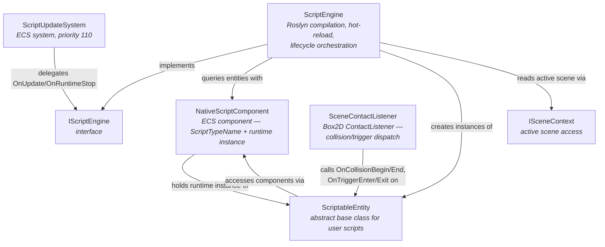
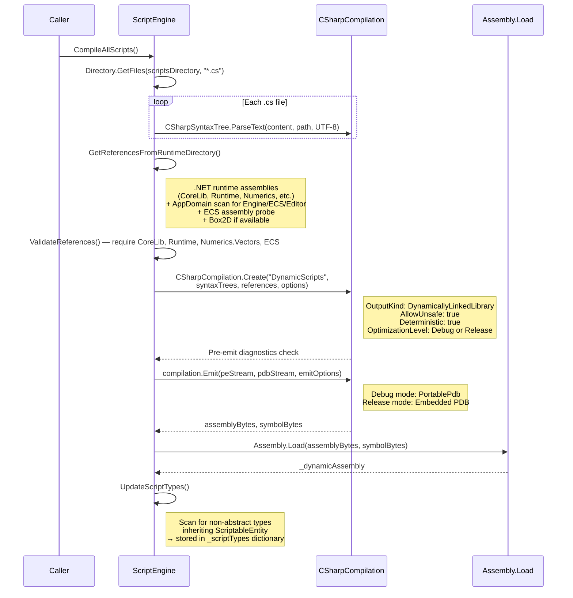
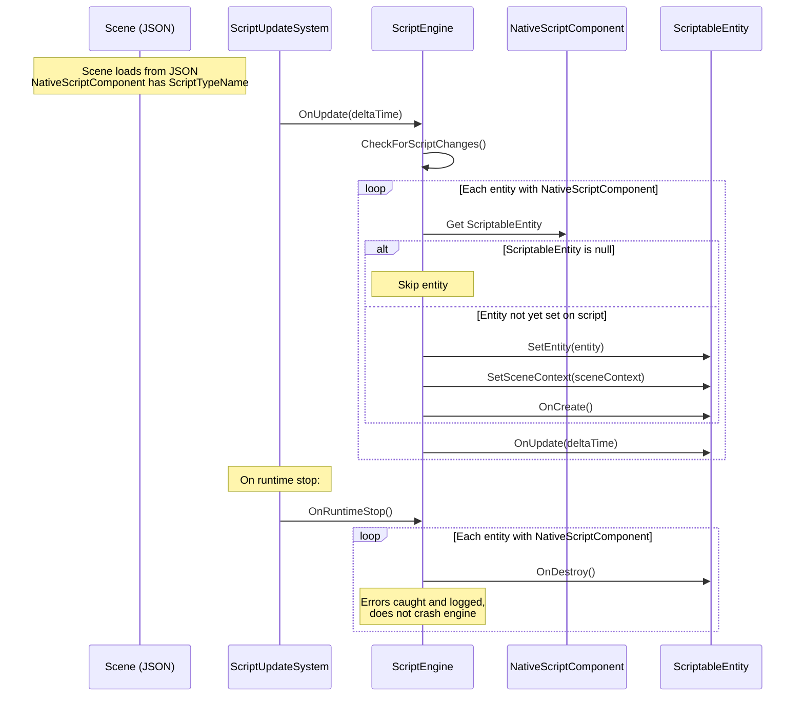

# Scripting Lifecycle

The engine supports hot-reloadable C# scripting via Roslyn runtime compilation. Scripts inherit from `ScriptableEntity` and are compiled in-memory into a `DynamicScripts` assembly. The scripting subsystem handles compilation, type registration, per-frame lifecycle updates, input/physics event dispatch, and field serialization for the editor inspector.

## Component Diagram



## ScriptableEntity Base Class

**File:** `Engine/Scene/ScriptableEntity.cs`

Abstract base class that all user scripts inherit from. Provides lifecycle hooks, input/physics callbacks, component/entity access, transform utilities, and reflection-based field exposure for the editor.

### Lifecycle Methods

| Method | When Called |
|---|---|
| `OnCreate()` | First frame after entity is set and scene context is bound |
| `OnUpdate(TimeSpan)` | Every frame while the scene is playing |
| `OnDestroy()` | When runtime stops (with per-script exception handling) |

### Input Callbacks

| Method | Trigger |
|---|---|
| `OnKeyPressed(KeyCodes)` | `KeyPressedEvent` routed through `ScriptEngine.ProcessEvent()` |
| `OnKeyReleased(KeyCodes)` | `KeyReleasedEvent` |
| `OnMouseButtonPressed(int)` | `MouseButtonPressedEvent` |

### Physics Callbacks

| Method | Trigger |
|---|---|
| `OnCollisionBegin(Entity)` | Box2D rigid body contact begins (non-sensor) |
| `OnCollisionEnd(Entity)` | Box2D rigid body contact ends (non-sensor) |
| `OnTriggerEnter(Entity)` | Box2D sensor contact begins |
| `OnTriggerExit(Entity)` | Box2D sensor contact ends |

### Component Access

All methods are `protected` and require `Entity` to be set (throws `InvalidOperationException` otherwise):

- `GetComponent<T>()`, `HasComponent<T>()`, `AddComponent<T>()`, `RemoveComponent<T>()` -- delegates to `Entity`

### Entity Access

- `FindEntity(string name)` -- iterates `ActiveScene.Entities` by name
- `CreateEntity(string name)` -- delegates to `ActiveScene.CreateEntity()`
- `DestroyEntity(Entity)` -- delegates to `ActiveScene.DestroyEntity()`

### Transform Utilities

`GetPosition()` / `SetPosition(Vector3)`, `GetRotation()` / `SetRotation(Vector3)`, `GetScale()` / `SetScale(Vector3)` -- read/write `TransformComponent`. Setters call `AddComponent()` to persist the updated struct.

`GetForward()`, `GetRight()`, `GetUp()` -- computed from rotation using trigonometric decomposition.

### Reflection / Field Exposure

- `GetExposedFields()` -- yields `(Name, Type, Value)` tuples for all public instance fields and read/write properties of supported types
- `GetFieldValue(string)` / `SetFieldValue(string, object)` -- named access with `ConvertToSupportedType()` handling `JsonArray` to Vector conversion
- Thread-safe caching via `ConcurrentDictionary<Type, FieldInfo[]>` and `ConcurrentDictionary<Type, PropertyInfo[]>`

**Supported field types:** `int`, `float`, `double`, `bool`, `string`, `Vector2`, `Vector3`, `Vector4`

## Compilation Pipeline

**File:** `Engine/Scripting/ScriptEngine.cs`



### Reference Resolution Details

1. **Runtime assemblies** from `typeof(object).Assembly.Location` directory: `System.Private.CoreLib`, `System.Runtime`, `System.Collections`, `System.Linq`, `System.Numerics.Vectors`, `netstandard`, `mscorlib`, `System.Collections.Concurrent`
2. **Engine assemblies** from `AppDomain.CurrentDomain.GetAssemblies()`: any assembly whose name starts with `Engine`, `ECS`, or `Editor` (falls back to probing output directories for in-memory assemblies)
3. **ECS assembly** via dedicated `FindECSAssembly()` with multi-path probing
4. **Box2D** (`Box2D.NetStandard.dll`) if found in working directory

## Hot-Reload Mechanism

- File modification timestamps tracked in `_scriptLastModified` dictionary (keyed by script name)
- `CheckForScriptChanges()` runs at the start of every `OnUpdate()` call
- Compares `File.GetLastWriteTime()` against cached timestamp for each known script
- On any change detected: calls `CompileAllScripts()` which recompiles **all** scripts (not incremental)
- `ForceRecompile()` available for manual trigger -- recompiles all scripts, then iterates entities with `NativeScriptComponent` to create new instances via `CreateScriptInstance()`, re-binds entity/scene context, and calls `OnCreate()`

## Script Lifecycle Flow



## Event Processing

**Input events:** `ScriptEngine.ProcessEvent(Event)` iterates all entities with `NativeScriptComponent` and dispatches:

| Event Type | Script Callback |
|---|---|
| `KeyPressedEvent` | `OnKeyPressed((KeyCodes)keyCode)` |
| `KeyReleasedEvent` | `OnKeyReleased((KeyCodes)keyCode)` |
| `MouseButtonPressedEvent` | `OnMouseButtonPressed(button)` |

**Physics callbacks:** `SceneContactListener` (extends Box2D `ContactListener`) handles `BeginContact` and `EndContact`. It reads the `Entity` stored in each body's `UserData`, checks `IsSensor()` on both fixtures to distinguish trigger vs rigid collision, then calls the appropriate callback on both entities' `ScriptableEntity` instances.

All callbacks are wrapped in try-catch. Errors are logged via Serilog and do not crash the engine.

## Serialization

**File:** `Engine/Scene/Serializer/ComponentDeserializer.cs`

**Persisted state:**
- `NativeScriptComponent.ScriptTypeName` (string) -- the class name used to look up the script type
- `NativeScriptComponent.ScriptableEntity` is `[JsonIgnore]` -- runtime only, never serialized

**Exposed field serialization:**
```json
{
  "Name": "NativeScriptComponent",
  "ScriptTypeName": "PlayerController",
  "Fields": {
    "MoveSpeed": 5.0,
    "JumpForce": 10.0,
    "GroundCheck": [0.0, -1.0, 0.0]
  }
}
```

**Deserialization flow:**
1. `ComponentDeserializer.DeserializeNativeScriptComponent()` creates a new `NativeScriptComponent`
2. Reads `ScriptTypeName` from JSON
3. Calls `scriptEngine.CreateScriptInstance(scriptTypeName)` to instantiate the script via `Activator.CreateInstance()`
4. Iterates the `Fields` JSON object and calls `SetFieldValue()` on the script instance for each entry
5. If instantiation fails, the component retains `ScriptTypeName` for re-serialization (logged as warning)

## ECS Integration

| Aspect | Detail |
|---|---|
| System | `ScriptUpdateSystem` -- priority **110** (defined in `SystemPriorities`) |
| Pattern | Thin delegate -- all logic lives in `ScriptEngine`, the system just forwards `OnUpdate()` and `OnShutdown()` |
| DI registration | `IScriptEngine` registered as **Singleton** in `EngineIoCContainer` (survives scene changes) |
| Constructor | `ScriptUpdateSystem(IScriptEngine scriptEngine)` -- primary constructor injection |

## Debugging Support

| Method | Purpose |
|---|---|
| `EnableHybridDebugging(bool)` | Toggles Portable PDB generation; recompiles all scripts when enabled |
| `SaveDebugSymbols(string outputPath)` | Exports `.pdb` and `.dll` files for external debugger attachment |
| `PrintDebugInfo()` | Logs debug mode status, scripts directory path, loaded type count and names, assembly location |

Debug mode is enabled by default (`_debugMode = true`). In debug mode, `EmitOptions` uses `DebugInformationFormat.PortablePdb` with `includePrivateMembers: true`. In release mode, PDB information is embedded directly in the assembly.
