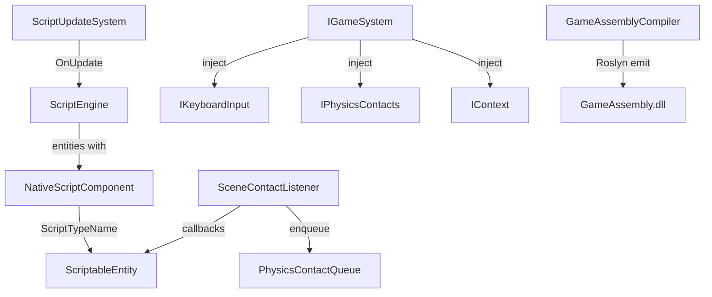

# Scripting Lifecycle

Hot-reloadable C# scripts compile into a `GameAssembly` DLL. The engine supports three tiers — see [Scripting Tiers](../guide/scripting/scripting-tiers.md).

| Tier | Types | Integration |
|------|-------|-------------|
| Data | `IGameComponent`, `[SerializableComponent]` | Scene JSON via `ComponentSerializerRegistry` |
| Glue | `ScriptableEntity`, `NativeScriptComponent` | `ScriptEngine` lifecycle + event fan-out |
| Logic | `IGameSystem`, `[Register]` | DryIoc + `SceneManager.RegisterGameSystems()` |

## Component Diagram

```mermaid
graph TD
    GameAssemblyCompiler["GameAssemblyCompiler"]
    ScriptEngine["ScriptEngine"]
    ScriptableEntity["ScriptableEntity"]
    NativeScriptComponent["NativeScriptComponent"]
    ScriptUpdateSystem["ScriptUpdateSystem"]
    SceneContactListener["SceneContactListener"]
    IGameSystem["IGameSystem"]
    IKeyboardInput["IKeyboardInput"]
    IPhysicsContacts["IPhysicsContacts"]

    GameAssemblyCompiler -->|Roslyn emit| GameAssembly["GameAssembly.dll"]
    ScriptUpdateSystem -->|OnUpdate| ScriptEngine
    ScriptEngine -->|entities with| NativeScriptComponent
    NativeScriptComponent -->|ScriptTypeName| ScriptableEntity
    SceneContactListener -->|callbacks| ScriptableEntity
    SceneContactListener -->|enqueue| PhysicsContactQueue
    IGameSystem -->|inject| IKeyboardInput
    IGameSystem -->|inject| IPhysicsContacts
    IGameSystem -->|inject| IContext
```

## ScriptableEntity (glue tier)

**File:** `Scripting/ScriptableEntity.cs`

Lifecycle: `OnCreate`, `OnUpdate`, `OnDestroy`. Input and physics via virtual overrides. Component access via `GetComponent<T>()` etc. on the host entity.

Runtime instances are tracked in `ScriptRuntimeStore` (keyed by entity id). Only `ScriptTypeName` is persisted on `NativeScriptComponent` — script fields are not serialized; use `IGameComponent` for data.

## Game systems (logic tier)

**Files:** `ECS/Systems/IGameSystem.cs`, `Scripting/RegisterAttribute.cs`

Systems are discovered from `GameAssembly` via `[Register(typeof(IGameSystem))]` and resolved through DryIoc when play starts.

Injected services available to game systems:

| Service | Purpose |
|---------|---------|
| `IContext` | Active scene entity registry and queries |
| `IKeyboardInput` | `IsKeyDown` / `WasKeyPressed` (poll in `OnUpdate`) |
| `IPhysicsContacts` | `DrainContacts()` — collision/trigger events for the frame |
| `IAudio` | Play sounds |

`KeyboardInputState` is updated from input events in play mode; `AdvanceFrame()` clears edge-triggered keys after each frame.

## Compilation

**Files:** `Engine/Scripting/GameAssemblyCompiler.cs`, `ScriptCompilationReferences.cs`

All `.cs` files under `assets/scripts/` compile to `GameAssembly.dll` via Roslyn. Editor play uses versioned DLLs under `.engine/`; published runtime loads `GameAssembly.dll` from the app directory.

## Hot reload

File timestamps are checked each frame (unless suppressed during editor play). Any change triggers full recompile and assembly reload.

## Serialization

`NativeScriptComponent` persists `ScriptTypeName` only. Custom game components use `[SerializableComponent]` and JSON via `RegisterFromAssembly`.

## ECS integration

`ScriptUpdateSystem` (priority 110) delegates to `IScriptEngine.OnUpdate`. Game systems register at play time with priorities defined on each `IGameSystem` implementation.
