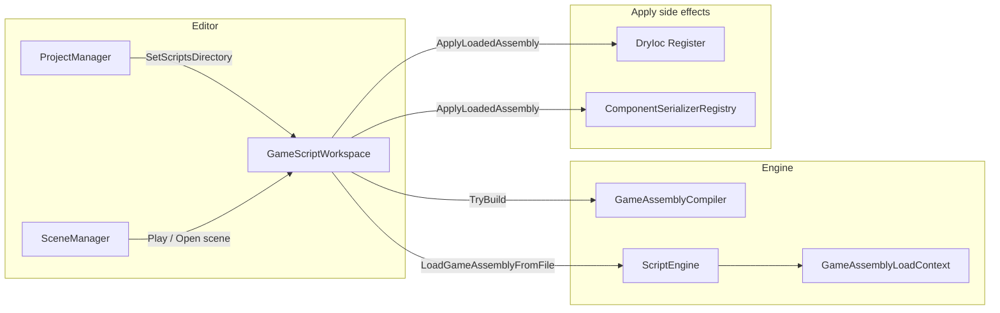
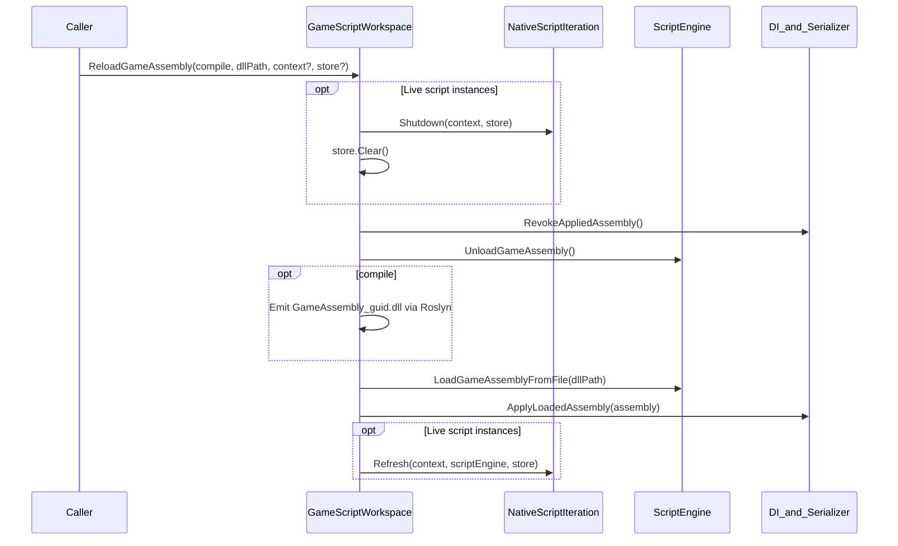

# Scripting Lifecycle

Game logic lives in C# source files under `assets/scripts/`. The engine compiles them at authoring time into a **GameAssembly** DLL, loads that DLL into a collectible `AssemblyLoadContext`, and wires types into the editor (DI, serializers) and runtime (script instances, game systems).

Three scripting tiers — see [Scripting Tiers](../guide/scripting/scripting-tiers.md):

| Tier | Types | Integration |
|------|-------|-------------|
| Data | `IGameComponent`, `[SerializableComponent]` | Scene JSON via `ComponentSerializerRegistry` |
| Glue | `ScriptableEntity`, `NativeScriptComponent` | `ScriptUpdateSystem` + `IScriptEngine` instance factory |
| Logic | `IGameSystem`, `[Register]` | DryIoc registration; resolved when play starts |

---

## Responsibilities

Compilation and editor orchestration stay in the **Editor**. The **Engine** runtime only loads, indexes, and creates instances.

| Component | Project | Role |
|-----------|---------|------|
| `GameAssemblyCompiler` | Engine | Roslyn: parse `.cs` files, resolve references, emit PE (+ optional PDB) |
| `IGameAssemblyBuilder` / `GameAssemblyBuilder` | Engine | Thin wrapper around `GameAssemblyCompiler.TryCompile` |
| `ScriptCompilationReferences` | Engine | Metadata references for Roslyn (project SDK first, AppDomain fallback) |
| `GameAssemblyLoadContext` | Engine | Collectible `AssemblyLoadContext`; loads one DLL path |
| `IScriptEngine` / `ScriptEngine` | Engine | Load/unload ALC, type index, `CreateScriptInstance`, event dispatch |
| `GameScriptWorkspace` | Editor | **Single orchestrator**: compile → revoke → unload → load → apply → refresh |
| `GameAssemblyContainerRegistration` | Engine | Discover `[Register]` types; register/unregister in DryIoc |

```mermaid
graph LR
    subgraph editor [Editor]
        WS[GameScriptWorkspace]
        PM[ProjectManager]
        SM[SceneManager]
    end
    subgraph engine [Engine]
        Compiler[GameAssemblyCompiler]
        SE[ScriptEngine]
        ALC[GameAssemblyLoadContext]
    end
    subgraph apply [Apply side effects]
        DI[DryIoc Register]
        Ser[ComponentSerializerRegistry]
    end

    PM -->|SetScriptsDirectory| WS
    SM -->|Play / Open scene| WS
    WS -->|TryBuild| Compiler
    WS -->|LoadGameAssemblyFromFile| SE
    SE --> ALC
    WS -->|ApplyLoadedAssembly| DI
    WS -->|ApplyLoadedAssembly| Ser
```

---

## Game assembly on disk

| Context | Output path | Notes |
|---------|-------------|--------|
| Editor (edit mode) | `{project}/.engine/GameAssembly_{guid}.dll` | New GUID file on each compile; avoids overwriting a DLL still held by a previous ALC |
| Editor (play mode) | `{project}/.engine/GameAssembly_{guid}.dll` | Fresh build per **Play**; loaded without recompile in workspace |
| Publish | `{publishDir}/GameAssembly.dll` | Release build, no PDB; shipped with runtime |
| Standalone runtime | `GameAssembly.dll` next to executable | Pre-built at publish; **no** Roslyn in player |

`GameScriptWorkspace.ResolveEditorDllPath(projectRoot)` returns `{project}/.engine/GameAssembly.dll` — used only as the **directory anchor** (`_outputDllPath`); actual emits use `GameAssemblyCompiler.GetNextEditorBuildPath(engineDir)`.

Script sources: `assets/scripts/**/*.cs` (excludes `bin`, `obj`, `.vs`, generated assembly info).

References for compilation: DLLs in `assets/scripts/.engine/sdk/` (copied per project by `GameProjectScriptBootstrapper`), plus core BCL and engine assemblies via `ScriptCompilationReferences`.

---

## Unified reload pipeline

All editor paths that change the loaded game assembly go through `GameScriptWorkspace.ReloadGameAssembly`:

```mermaid
sequenceDiagram
    participant Caller
    participant WS as GameScriptWorkspace
    participant NSI as NativeScriptIteration
    participant SE as ScriptEngine
    participant Reg as DI_and_Serializer

    Caller->>WS: ReloadGameAssembly(compile, dllPath, context?, store?)
    opt Live script instances
        WS->>NSI: Shutdown(context, store)
        WS->>WS: store.Clear()
    end
    WS->>Reg: RevokeAppliedAssembly()
    WS->>SE: UnloadGameAssembly()
    opt compile
        WS->>WS: Emit GameAssembly_guid.dll via Roslyn
    end
    WS->>SE: LoadGameAssemblyFromFile(dllPath)
    WS->>Reg: ApplyLoadedAssembly(assembly)
    opt Live script instances
        WS->>NSI: Refresh(context, scriptEngine, store)
    end
```

**Order matters.** Script instances and play-mode `IGameSystem` objects must be torn down (scene dispose / `Shutdown`) **before** the ALC is unloaded. Unloading while live instances still reference types from the collectible assembly causes undefined behavior and can corrupt the debugger (`CORDBG_E_TARGET_INCONSISTENT`).

### Apply (`ApplyLoadedAssembly`)

When a new assembly is loaded:

1. `GameAssemblyContainerRegistration.TryRegisterContainer` — types with `[Register(typeof(IGameSystem))]` (and other services) registered in DryIoc; prior registrations from the same assembly name are replaced.
2. `ComponentSerializerRegistry.RegisterFromAssembly` — types with `[SerializableComponent]` get JSON serializers; prior assembly entry is unregistered first.

Tracks `_appliedAssembly` for symmetric revoke.

### Revoke (`RevokeAppliedAssembly` / `RevokeAndUnload`)

Reverse of apply:

1. `ComponentSerializerRegistry.UnregisterAssembly`
2. `GameAssemblyContainerRegistration.UnregisterRegistrationsFromGameAssembly`
3. `ScriptEngine.UnloadGameAssembly` — unloads collectible ALC, clears type index

Called on **project close** and at the start of every reload.

---

## When compilation happens

| Trigger | Who | Compile? | Load? |
|---------|-----|----------|-------|
| Open / create project | `ProjectManager.InitializeScripts` → `SetScriptsDirectory` | Yes | Yes |
| Create / edit / delete script (content browser, inspector) | `GameScriptWorkspace` CRUD | Yes | Yes |
| Open scene (edit mode) | `SceneManager.Open` → `EnsureScriptsCompiledAndApplied` | Only if no valid assembly for current project | Yes |
| **Play** | `SceneManager.Play` | Yes (new GUID DLL) | Yes (`LoadGameAssemblyFromFile`, no second compile) |
| **Stop** | `SceneManager.Stop` → `Open(saved scene)` | After scene dispose, if needed | Yes |
| Force recompile (remove script component) | `ForceRecompile` | Yes | Yes + `Refresh` script instances |
| Publish | `GamePublisher` | Yes (release, no PDB) | N/A (copied to output) |
| Standalone runtime startup | `Runtime/Program.RegisterGameAssembly` | **No** | Yes (pre-built DLL) |

There is **no** per-frame hot-reload in the runtime `ScriptEngine`. Recompile happens only from editor/workspace actions or publish.

---

## Editor scenarios

### Project open

1. `ProjectManager.TryOpenProject` / `TryCreateNewProject` → `CloseProject` (if switching).
2. `ProjectClosing`: if playing → `Stop`; else dispose scene → `RevokeAndUnload`.
3. `InitializeScripts` → `SetScriptsDirectory` → full reload pipeline (compile + load + apply).

### Scene open (edit mode)

1. `SceneManager.Open` — disposes previous scene, creates new scene.
2. `EnsureScriptsCompiledAndApplied` — if loaded DLL is already from this project's `.engine` folder, only `ApplyLoadedAssembly`; otherwise full compile reload.
3. Deserialize scene JSON.

### Play

1. Serialize scene snapshot to temp file.
2. Compile scripts to `{project}/.engine/GameAssembly_{guid}.dll` (debug + PDB).
3. `LoadGameAssemblyFromFile` — revoke, unload, load play DLL, apply DI/serializers.
4. Destroy all entities and reload from snapshot (clean script/system state).
5. `RuntimeSceneStarter.Start` — register `IGameSystem` instances from DryIoc into scene `SystemManager`, enter play state.

### Stop

1. `OnRuntimeStop` — shutdown scene systems (including script `OnDestroy`).
2. `Open(EditorScenePath)` — **dispose scene first**, then `EnsureScriptsCompiledAndApplied` (fresh edit-mode assembly if needed), deserialize saved scene.

Scene dispose must happen **before** assembly reload so play-mode `IGameSystem` and `ScriptableEntity` instances are gone.

### Project switch (e.g. proj1 → play → stop → proj2 → proj1)

1. Closing project: `RevokeAndUnload` after scene teardown.
2. Opening another project: `SetScriptsDirectory` compiles into **that** project's `.engine/` with a new GUID file.
3. Never overwrite a DLL path that may still be referenced by an unloaded-but-not-collected ALC — hence versioned emits.

---

## Runtime and publish

**Publish** (`GamePublisher`): Roslyn compile to `GameAssembly.dll` in the publish folder (`emitPdb: false`, release optimization). Scripts under `assets/scripts/` may be copied in Debug configuration only.

**Standalone player** (`Runtime/Program`):

1. Load `GameAssembly.dll` from `AppContext.BaseDirectory` via `ScriptEngine` (collectible ALC).
2. `TryRegisterContainer` + `RegisterFromAssembly`.
3. No compilation, no `GameScriptWorkspace`.

---

## ScriptEngine (runtime surface)

`IScriptEngine` is intentionally small:

- `LoadGameAssemblyFromFile(string dllPath)`
- `UnloadGameAssembly()`
- `GetScriptType` / `CreateScriptInstance`
- `GetLoadedGameAssembly()`
- `ProcessEvent` — forwards to `NativeScriptIteration` for `ScriptableEntity` input

`GameAssemblyLoadContext` is collectible (`isCollectible: true`); `Load()` returns `null` so dependencies resolve from the default context. Each load uses a new ALC instance.

---

## ScriptableEntity (glue tier)

**File:** `Scripting/ScriptableEntity.cs`

Lifecycle: `OnCreate`, `OnUpdate`, `OnDestroy`. Input and physics via virtual overrides.

Runtime instances live in per-scene `ScriptRuntimeStore` (keyed by entity id). Only `ScriptTypeName` is persisted on `NativeScriptComponent` — use `IGameComponent` for serialized data.

`ScriptUpdateSystem` (priority 110) calls `NativeScriptIteration.Update`; creation goes through `IScriptEngine.CreateScriptInstance`.

---

## Game systems (logic tier)

**Files:** `ECS/Systems/IGameSystem.cs`, `Scripting/RegisterAttribute.cs`

Discovered from loaded `GameAssembly` via `[Register(typeof(IGameSystem))]`. On play, `resolveGameSystems()` resolves from DryIoc and `RuntimeSceneStarter` registers them on the active scene's `SystemManager`.

Injected services include `IContext`, `IKeyboardInput`, `IPhysicsContacts`, `IAudio`.

---

## Serialization

`NativeScriptComponent` persists `ScriptTypeName` only. Custom game components use `[SerializableComponent]` and JSON via `RegisterFromAssembly` when the assembly is applied.

---

## Related docs

- [Scripting Tiers](../guide/scripting/scripting-tiers.md) — when to use components vs scripts vs systems
- [Getting Started](../guide/scripting/getting-started.md) — first script
- [Dependency Injection](dependency-injection.md) — DryIoc registration for game assemblies
- [Serialization](serialization.md) — scene JSON and custom components
