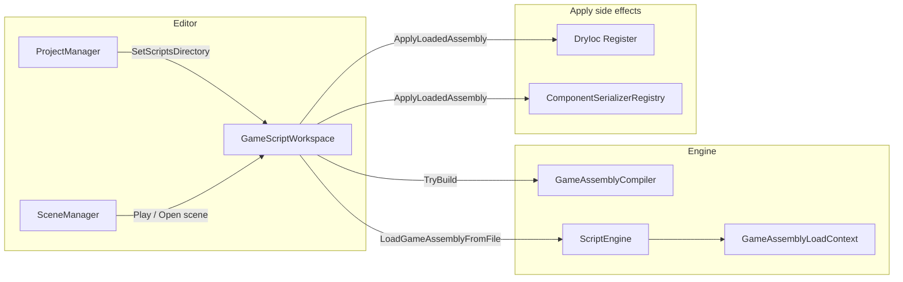
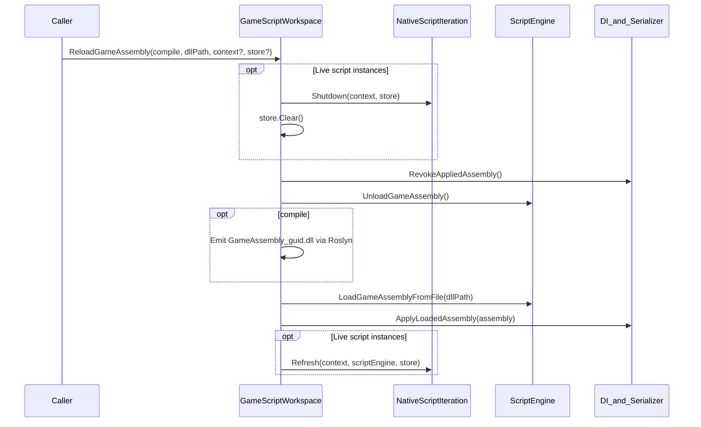

# Scripting Lifecycle

Game logic lives in C# source files under `assets/scripts/`. The engine compiles them at authoring time into a **GameAssembly** DLL, loads that DLL into a collectible `AssemblyLoadContext`, and wires types into the editor (DI, serializers) and runtime (script instances, game systems).

Three scripting tiers — see [Scripting Tiers](../guide/scripting/scripting-tiers.md):

| Tier | Types | Integration |
|------|-------|-------------|
| Data | `IGameComponent`, `[SerializableComponent]` | Scene JSON via `ComponentSerializerRegistry` |
| Glue | `ScriptableEntity`, `NativeScriptComponent` | `ScriptUpdateSystem` + `IScriptEngine` instance factory |
| Logic | `IGameSystem`, `[Register]` | DryIoc registration; resolved when play starts |

---

## Responsibilities

Compilation and editor orchestration stay in the **Editor**. The **Engine** runtime only loads, indexes, and creates instances.

| Component | Project | Role |
|-----------|---------|------|
| `GameAssemblyCompiler` | Engine | Roslyn: parse `.cs` files, resolve references, emit PE (+ optional PDB) |
| `ScriptCompilationReferences` | Engine | Metadata references for Roslyn (`assets/scripts/.engine/sdk/` first, then AppDomain) |
| `GameAssemblyLoadContext` | Engine | Collectible `AssemblyLoadContext`; loads one DLL path |
| `IScriptEngine` / `ScriptEngine` | Engine | Load/unload ALC, type index, `CreateScriptInstance`, event dispatch |
| `GameAssemblyContainerRegistration` | Engine | Discover `[Register]` types; register/unregister in DryIoc |
| `GameComponentDiscovery` | Engine | Regex scan of script sources for `IGameComponent` class names (editor tooling) |
| `ScriptableEntityTemplates` / `GameSystemTemplates` / `GameComponentTemplates` | Engine | Scaffold new script, system, and component `.cs` files in the editor |
| `AssemblyLoadTypes` | Engine | Safe `assembly.GetTypes()` when reflection load throws `ReflectionTypeLoadException` |
| `GameScriptWorkspace` | Editor (`Editor/Features/Scripting/GameScriptWorkspace.cs`) | **Single orchestrator**: compile → revoke → unload → load → apply → refresh |

```mermaid
graph LR
    subgraph editor [Editor]
        WS[GameScriptWorkspace]
        PM[ProjectManager]
        SM[SceneManager]
    end
    subgraph engine [Engine]
        Compiler[GameAssemblyCompiler]
        SE[ScriptEngine]
        ALC[GameAssemblyLoadContext]
    end
    subgraph apply [Apply side effects]
        DI[DryIoc Register]
        Ser[ComponentSerializerRegistry]
    end

    PM -->|SetScriptsDirectory| WS
    SM -->|Play / Open scene| WS
    WS -->|TryBuild| Compiler
    WS -->|LoadGameAssemblyFromFile| SE
    SE --> ALC
    WS -->|ApplyLoadedAssembly| DI
    WS -->|ApplyLoadedAssembly| Ser
```

---

## Game assembly on disk

| Context | Output path | Notes |
|---------|-------------|--------|
| Editor (edit mode) | `{project}/.engine/GameAssembly_{guid}.dll` | New GUID file on each compile; avoids overwriting a DLL still held by a previous ALC |
| Editor (play mode) | `{project}/.engine/GameAssembly_{guid}.dll` | Fresh build per **Play**; loaded without recompile in workspace |
| Publish | `{publishDir}/GameAssembly.dll` | Release build, no PDB; shipped with runtime |
| Standalone runtime | `GameAssembly.dll` next to executable | Pre-built at publish; **no** Roslyn in player |

`GameScriptWorkspace.ResolveEditorDllPath(projectRoot)` returns `{project}/.engine/GameAssembly.dll` — used only as the **directory anchor** (`_outputDllPath`); actual emits use `GameAssemblyCompiler.GetNextEditorBuildPath(engineDir)`.

Script sources: `assets/scripts/**/*.cs` (excludes `bin`, `obj`, `.vs`, generated assembly info).

References for compilation: DLLs in `assets/scripts/.engine/sdk/` (copied per project by `GameProjectScriptBootstrapper`), plus core BCL and engine assemblies via `ScriptCompilationReferences`.

**File:** `Engine/Scripting/ScriptCompilationReferences.cs`

| Reference source | Assemblies |
|------------------|------------|
| BCL runtime dir | `System.Private.CoreLib`, `System.Runtime`, `System.Collections`, `System.Linq`, `System.Numerics`, `System.Numerics.Vectors`, and other essentials |
| `assets/scripts/.engine/sdk/*.dll` | Project-copied SDK (when present) |
| Loaded AppDomain | `Engine*`, `ECS*`, `Editor*` (when loaded), plus support assemblies below |
| Support assemblies (by name) | `ECS`, `Audio`, `Scripting`, `SceneComponents`, `Input`, `Math` |
| Physics | `Box2D.NetStandard.dll` (next to engine or cwd) |

`ValidateReferences` fails the compile if `System.Private.CoreLib`, `System.Runtime`, `System.Numerics.Vectors`, or `ECS` are missing.

**File:** `Engine/Scripting/GameAssemblyCompiler.cs`

- `AssemblyName` = `"GameAssembly"`.
- Injects a global-usings syntax tree (`System`, `System.Collections.Generic`, `System.Linq`, `System.Numerics`, etc.).
- If no `.cs` files qualify, emits an internal `EmptyGameAssemblyPlaceholder` so the DLL is still valid.
- `TryCompile(scriptsDirectory, outputDllPath, emitPdb, useDebugOptimization, out errors)` — PDB format is portable when `emitPdb` is true, embedded otherwise; `allowUnsafe: true`, deterministic emit.

---

## Unified reload pipeline

All editor paths that change the loaded game assembly go through `GameScriptWorkspace.ReloadGameAssembly`:

```mermaid
sequenceDiagram
    participant Caller
    participant WS as GameScriptWorkspace
    participant NSI as NativeScriptIteration
    participant SE as ScriptEngine
    participant Reg as DI_and_Serializer

    Caller->>WS: ReloadGameAssembly(compile, dllPath, context?, store?)
    opt Live script instances
        WS->>NSI: Shutdown(context, store)
        WS->>WS: store.Clear()
    end
    WS->>Reg: RevokeAppliedAssembly()
    WS->>SE: UnloadGameAssembly()
    opt compile
        WS->>WS: Emit GameAssembly_guid.dll via Roslyn
    end
    WS->>SE: LoadGameAssemblyFromFile(dllPath)
    WS->>Reg: ApplyLoadedAssembly(assembly)
    opt Live script instances
        WS->>NSI: Refresh(context, scriptEngine, store)
    end
```

**Order matters.** Script instances and play-mode `IGameSystem` objects must be torn down (scene dispose / `Shutdown`) **before** the ALC is unloaded. Unloading while live instances still reference types from the collectible assembly causes undefined behavior and can corrupt the debugger (`CORDBG_E_TARGET_INCONSISTENT`).

### Apply (`ApplyLoadedAssembly`)

When a new assembly is loaded:

1. `GameAssemblyContainerRegistration.TryRegisterContainer` — types with `[Register(typeof(TService), lifetime)]` registered in DryIoc (`GameIocLifetime`: `Singleton` default, `Transient`, `Scoped`); prior registrations from the same assembly name are replaced.
2. `ComponentSerializerRegistry.RegisterFromAssembly` — types with `[SerializableComponent]` get JSON serializers; prior assembly entry is unregistered first.

Tracks `_appliedAssembly` for symmetric revoke.

### Revoke (`RevokeAppliedAssembly` / `RevokeAndUnload`)

Reverse of apply:

1. `ComponentSerializerRegistry.UnregisterAssembly`
2. `GameAssemblyContainerRegistration.UnregisterRegistrationsFromGameAssembly`
3. `ScriptEngine.UnloadGameAssembly` — unloads collectible ALC, clears type index

Called on **project close** and at the start of every reload.

---

## When compilation happens

| Trigger | Who | Compile? | Load? |
|---------|-----|----------|-------|
| Open / create project | `ProjectManager.InitializeScripts` → `SetScriptsDirectory` | Yes | Yes |
| Create / edit / delete script (content browser, inspector) | `GameScriptWorkspace.CreateOrUpdateScriptAsync` / `DeleteScript` | Yes | Yes |
| Open scene (edit mode) | `SceneManager.Open` → `EnsureScriptsCompiledAndApplied` | Only if no valid assembly for current project | Yes |
| **Play** | `SceneManager.Play` | Yes (new GUID DLL) | Yes (`LoadGameAssemblyFromFile`, no second compile) |
| **Stop** | `SceneManager.Stop` → `Open(saved scene)` | After scene dispose, if needed | Yes |
| Force recompile (remove script component) | `ForceRecompile` | Yes | Yes + `Refresh` script instances |
| Publish | `GamePublisher` | Yes (release, no PDB) | N/A (copied to output) |
| Standalone runtime startup | `Runtime/Program.RegisterGameAssembly` | **No** | Yes (pre-built DLL) |

There is **no** per-frame hot-reload in the runtime `ScriptEngine`. Recompile happens only from editor/workspace actions or publish.

---

## Editor scenarios

### Project open

1. `ProjectManager.TryOpenProject` / `TryCreateNewProject` → `CloseProject` (if switching).
2. `EditorLifecycle` handles `ProjectClosing`: if playing → `Stop`; else dispose scene → `GameScriptWorkspace.RevokeAndUnload`.
3. `InitializeScripts` → `SetScriptsDirectory` → full reload pipeline (compile + load + apply).

### Scene open (edit mode)

1. `SceneManager.Open` — disposes previous scene, creates new scene.
2. `EnsureScriptsCompiledAndApplied` — if loaded DLL is already from this project's `.engine` folder, only `ApplyLoadedAssembly`; otherwise full compile reload.
3. Deserialize scene JSON.

### Play

1. Serialize scene snapshot to temp file.
2. Compile scripts to `{project}/.engine/GameAssembly_{guid}.dll` (debug + PDB).
3. `LoadGameAssemblyFromFile` — revoke, unload, load play DLL, apply DI/serializers.
4. Destroy all entities and reload from snapshot (clean script/system state).
5. `RuntimeSceneStarter.Start` — register `IGameSystem` instances from DryIoc into scene `SystemManager`, enter play state.

### Stop

1. `OnRuntimeStop` — shutdown scene systems (including script `OnDestroy`).
2. If `EditorScenePath` is set: `Open(EditorScenePath)` — **dispose scene first**, then `EnsureScriptsCompiledAndApplied` (fresh edit-mode assembly if needed), deserialize saved scene.
3. If no saved scene path: dispose scene, then `RestoreEditAssembly()` (recompile + reload edit-mode assembly).

Scene dispose must happen **before** assembly reload so play-mode `IGameSystem` and `ScriptableEntity` instances are gone.

### Project switch (e.g. proj1 → play → stop → proj2 → proj1)

1. Closing project: `RevokeAndUnload` after scene teardown.
2. Opening another project: `SetScriptsDirectory` compiles into **that** project's `.engine/` with a new GUID file.
3. Never overwrite a DLL path that may still be referenced by an unloaded-but-not-collected ALC — hence versioned emits.

---

## Runtime and publish

**Publish** (`GamePublisher`): Roslyn compile to `GameAssembly.dll` in the publish folder (`emitPdb: false`, release optimization). Scripts under `assets/scripts/` may be copied in Debug configuration only.

**Standalone player** (`Runtime/Program`):

1. Load `GameAssembly.dll` from `AppContext.BaseDirectory` via `ScriptEngine` (collectible ALC).
2. `TryRegisterContainer` + `RegisterFromAssembly`.
3. No compilation, no `GameScriptWorkspace`.

---

## ScriptEngine (runtime surface)

**File:** `Engine/Scripting/IScriptEngine.cs`, `Engine/Scripting/ScriptEngine.cs`

`IScriptEngine` is intentionally small:

| Method | Behavior |
|--------|----------|
| `LoadGameAssemblyFromFile(string dllPath)` | Unloads prior ALC, loads DLL via new `GameAssemblyLoadContext`, indexes concrete `ScriptableEntity` subclasses by type name |
| `UnloadGameAssembly()` | Clears type index and unloads collectible ALC |
| `GetScriptType(string scriptName)` | Lookup indexed script type |
| `CreateScriptInstance(string scriptName)` | `Activator.CreateInstance` with `(IComponentAccessor, IAudio, IAudioPlayback, IPhysicsQueries)` — queries from active scene or `NullPhysicsQueries`; returns `Result<ScriptableEntity>` |
| `GetLoadedGameAssembly()` | Current game assembly, or `null` |
| `ProcessEvent(Event, IContext, ScriptRuntimeStore)` | Forwards to `NativeScriptIteration.ProcessEvent` |

`GameAssemblyLoadContext` is collectible (`isCollectible: true`); `Load()` returns `null` so dependencies resolve from the default context. Each load uses a new ALC instance.

---

## ScriptableEntity (glue tier)

**File:** `Scripting/ScriptableEntity.cs` (game-author SDK project at repo root, referenced by compiled `GameAssembly`)

Constructor: `(IComponentAccessor, IAudio, IAudioPlayback, IPhysicsQueries)`. Lifecycle overrides: `OnCreate`, `OnUpdate`, `OnDestroy`; input via `OnKeyPressed` / mouse overrides; physics via `OnCollisionBegin` / `OnTriggerEnter` etc.

Runtime instances live in a **per-scene** `ScriptRuntimeStore` (`Engine/Scene/ScriptRuntimeStore.cs`, created in `SystemManagerFactory`). Only `ScriptTypeName` is persisted on `NativeScriptComponent` — use `IGameComponent` for serialized data.

**File:** `Engine/Scene/Systems/NativeScriptIteration.cs`, `Engine/Scene/Systems/ScriptUpdateSystem.cs`

| Step | Behavior |
|------|----------|
| Create | `IScriptEngine.CreateScriptInstance` on first `Update` for each `NativeScriptComponent` |
| Init | `SetEntity` + `OnCreate` on first frame the instance is updated |
| Update | `ScriptUpdateSystem` (priority 110, `SystemPriorities.ScriptUpdateSystem`) → `NativeScriptIteration.Update` |
| Input | `EditorInputHandler` / `Runtime/GameLayer` → `IScriptEngine.ProcessEvent` → `NativeScriptIteration.ProcessEvent` |
| Physics | `SceneContactListener` (`Engine/Scene/SceneContactListener.cs`) → collision/trigger overrides on stored instances |
| Reload | `NativeScriptIteration.Refresh` after assembly reload when `ForceRecompile` or reload passes `context` + `store` |
| Shutdown | `NativeScriptIteration.Shutdown` + `store.Clear()` from `ScriptUpdateSystem.OnShutdown` or reload pipeline |

---

## Game systems (logic tier)

**Files:** `ECS/Systems/IGameSystem.cs`, `Scripting/RegisterAttribute.cs`, `Scripting/GameIocLifetime.cs`, `Engine/Scene/RuntimeSceneStarter.cs`

Discovered from loaded `GameAssembly` via `[Register(typeof(IGameSystem))]` (or other service types). `GameAssemblyContainerRegistration` uses `AssemblyLoadTypes.From` for safe reflection. On play, `resolveGameSystems()` resolves from DryIoc and `RuntimeSceneStarter.Start` calls `scene.RegisterRuntimeSystem` for each `IGameSystem`, then `scene.OnRuntimeStart`.

Injected services include `IContext`, `IKeyboardInput`, `IPhysicsContacts`, `IAudio`.

---

## Serialization

`NativeScriptComponent` persists `ScriptTypeName` only. Custom game components use `[SerializableComponent]` and JSON via `RegisterFromAssembly` when the assembly is applied.

---

## Related docs

- [Scripting Tiers](../guide/scripting/scripting-tiers.md) — when to use components vs scripts vs systems
- [Getting Started](../guide/scripting/getting-started.md) — first script
- [Dependency Injection](dependency-injection.md) — DryIoc registration for game assemblies
- [Serialization](serialization.md) — scene JSON and custom components
