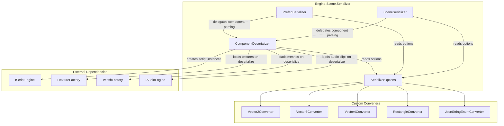
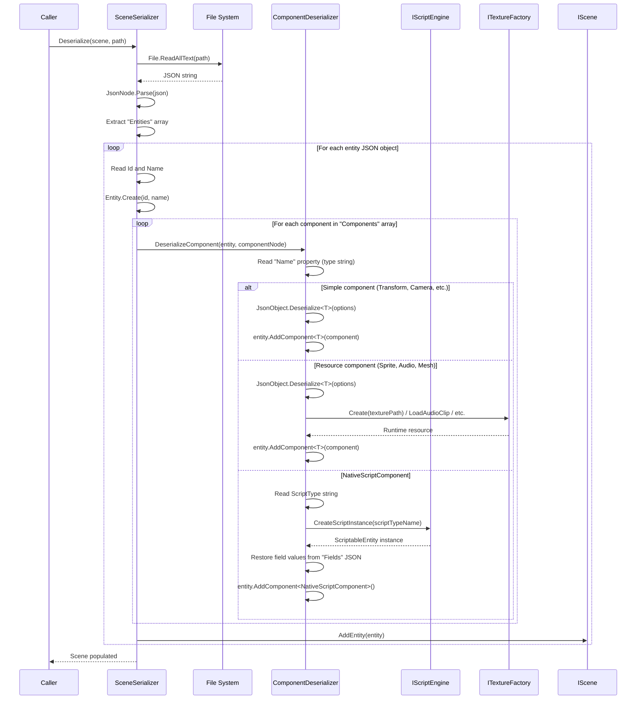

# Serialization

Scenes and prefabs are stored as JSON using System.Text.Json. A custom `ComponentDeserializer` handles polymorphic component dispatch via type-name switch. Custom `JsonConverter<T>` implementations handle `Vector2`, `Vector3`, `Vector4`, and `Rectangle` types. All serialization classes are DI singletons sharing a common `SerializerOptions` instance.

## Component Diagram



## Scene Serialization

**File:** `Engine/Scene/Serializer/SceneSerializer.cs`

Scene JSON structure:
```json
{
  "Scene": "MyScene",
  "Entities": [
    {
      "Id": 1,
      "Name": "Player",
      "Components": [
        { "Name": "TransformComponent", "Position": [0, 0, 0], ... },
        { "Name": "SpriteRendererComponent", "TexturePath": "assets/player.png", ... }
      ]
    }
  ]
}
```

- Scene name derived from file path via `Path.GetFileNameWithoutExtension(path)`
- Each entity serialized with `Id`, `Name`, and `Components` array
- Components serialized via `JsonSerializer.SerializeToNode()` with the component type name injected as `"Name"` property
- Serialization order is hardcoded: Transform, Camera, SpriteRenderer, SubTextureRenderer, RigidBody2D, BoxCollider2D, AudioListener, Mesh, ModelRenderer, Animation, AudioSource, NativeScript
- NativeScriptComponent handled separately via `ComponentDeserializer.SerializeNativeScriptComponent()`

## Component Serialization

Components are data-only classes serialized by System.Text.Json. Runtime-only fields are excluded:

| Component | Excluded Fields | Reason |
|-----------|----------------|--------|
| RigidBody2DComponent | `RuntimeBody` | Box2D body created at physics init |
| NativeScriptComponent | `ScriptableEntity` | Rebuilt via IScriptEngine on deserialize |
| AudioSourceComponent | `IsPlaying` | Playback state is transient |
| AnimationComponent | `IsPlaying` | Playback state is transient |
| CameraComponent | `AspectRatio` | Derived from viewport dimensions |

**NativeScriptComponent** is a special case. It does not use standard `JsonSerializer.Deserialize<T>()`. Instead it serializes:
- `ScriptType`: the script class name string
- `Fields`: a JSON object mapping exposed field names to their serialized values

On deserialization, `IScriptEngine.CreateScriptInstance()` instantiates the script, then field values are restored by matching against `GetExposedFields()`.

## ComponentDeserializer

**File:** `Engine/Scene/Serializer/ComponentDeserializer.cs`

Two deserialization modes:

| Mode | Method | Used By | Unknown Types |
|------|--------|---------|---------------|
| **Strict** | `DeserializeComponent()` | SceneSerializer | Throws `InvalidSceneJsonException` |
| **Lenient** | `DeserializeComponentLenient()` | PrefabSerializer | Silently skipped |

Both methods use an identical switch statement on the `"Name"` property string. Simple components (Transform, Camera, RigidBody2D, BoxCollider2D, AudioListener, Animation) use generic `AddComponent<T>()` which calls `JsonObject.Deserialize<T>()`. Complex components with runtime resource dependencies have dedicated methods:

- **SpriteRendererComponent / SubTextureRendererComponent**: Deserialize, then load `Texture` via `ITextureFactory.Create()` from `TexturePath`. Also handles legacy `Texture.Path` JSON format.
- **AudioSourceComponent**: Deserialize, then load `AudioClip` via `IAudioEngine.LoadAudioClip()` from `AudioClipPath`.
- **MeshComponent**: Deserialize, then load `Mesh` via `IMeshFactory.Create()` from `MeshPath`.
- **ModelRendererComponent**: Deserialize, then load `OverrideTexture` via `ITextureFactory.Create()` from `OverrideTexturePath`.
- **NativeScriptComponent**: Manual construction -- reads `ScriptType`, creates instance via `IScriptEngine`, restores field values.

## Custom JSON Converters

**File:** `Engine/Scene/Serializer/SerializerOptions.cs`

`SerializerOptions` is a DI singleton that constructs a `JsonSerializerOptions` with these converters:

| Converter | Format | Example |
|-----------|--------|---------|
| `Vector2Converter` | `[x, y]` | `[1.0, 2.0]` |
| `Vector3Converter` | `[x, y, z]` | `[0, 5.5, -1]` |
| `Vector4Converter` | `[x, y, z, w]` | `[1, 1, 1, 1]` |
| `RectangleConverter` | Rectangle bounds | `[0, 0, 64, 64]` |
| `JsonStringEnumConverter` | Enum as string | `"Dynamic"` |

Converters sanitize NaN/Infinity values to `0f` on write. The options are made read-only via `MakeReadOnly(populateMissingResolver: true)` after construction.

## Prefab Serialization

**File:** `Engine/Scene/Serializer/PrefabSerializer.cs`

Prefab JSON structure:
```json
{
  "Prefab": "PlayerPrefab",
  "Version": "1.0",
  "OriginalName": "Player",
  "Components": [
    { "Name": "TransformComponent", ... },
    { "Name": "SpriteRendererComponent", ... }
  ]
}
```

Three operations:
- **`SerializeToPrefab()`**: Serializes entity components to `{projectPath}/assets/prefabs/{name}.prefab`
- **`ApplyPrefabToEntity()`**: Clears all components from an existing entity, then deserializes prefab components onto it
- **`CreateEntityFromPrefab()`**: Creates a new `Entity` and deserializes prefab components onto it

Uses `DeserializeComponentLenient()` for forward/backward compatibility -- unknown component types from newer engine versions are silently skipped when loading older prefabs.

## Scene Deserialization Flow



## Key Files

| File | Purpose |
|------|---------|
| `Engine/Scene/Serializer/SceneSerializer.cs` | Scene save/load |
| `Engine/Scene/Serializer/PrefabSerializer.cs` | Prefab save/load/apply |
| `Engine/Scene/Serializer/ComponentDeserializer.cs` | Polymorphic component dispatch |
| `Engine/Scene/Serializer/SerializerOptions.cs` | Shared JSON options with converters |
| `Engine/Scene/Serializer/Vector2Converter.cs` | Vector2 as JSON array |
| `Engine/Scene/Serializer/Vector3Converter.cs` | Vector3 as JSON array |
| `Engine/Scene/Serializer/Vector4Converter.cs` | Vector4 as JSON array |
| `Engine/Scene/Serializer/RectangleConverter.cs` | Rectangle as JSON array |
| `Engine/Scene/Serializer/IPrefabSerializer.cs` | Public prefab interface |
| `Engine/Scene/Serializer/InvalidSceneJsonException.cs` | Custom exception type |
