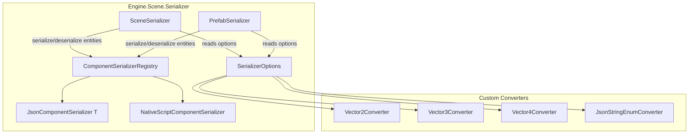
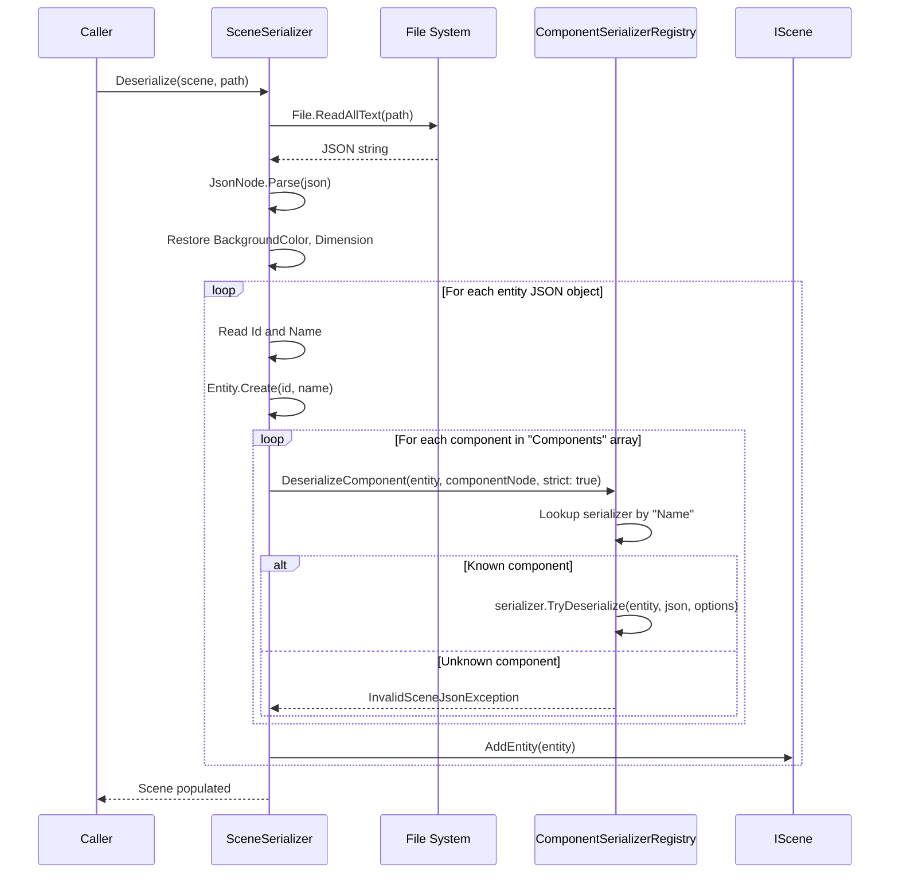

# Serialization

Scenes and prefabs are stored as JSON using System.Text.Json. A `ComponentSerializerRegistry` dispatches polymorphic component read/write through registered `IComponentSerializer` implementations. Custom `JsonConverter<T>` implementations handle `Vector2`, `Vector3`, and `Vector4`. All serialization classes are DI singletons sharing a common `SerializerOptions` instance.

## Component Diagram


```mermaid
graph TD
    subgraph "Engine.Scene.Serializer"
        SS[SceneSerializer]
        PS[PrefabSerializer]
        CSR[ComponentSerializerRegistry]
        SO[SerializerOptions]
        JCS[JsonComponentSerializer T]
        NSC[NativeScriptComponentSerializer]
    end

    subgraph "Custom Converters"
        V2[Vector2Converter]
        V3[Vector3Converter]
        V4[Vector4Converter]
        SEC[JsonStringEnumConverter]
    end

    SS -->|serialize/deserialize entities| CSR
    PS -->|serialize/deserialize entities| CSR
    SS -->|reads options| SO
    PS -->|reads options| SO
    CSR --> JCS
    CSR --> NSC
    SO --> V2
    SO --> V3
    SO --> V4
    SO --> SEC
```

## Scene Serialization

**File:** `Engine/Scene/Serializer/SceneSerializer.cs`

Scene JSON structure:

```json
{
  "Scene": "MyScene",
  "BackgroundColor": [0.1, 0.1, 0.1, 1.0],
  "Dimension": "TwoD",
  "Entities": [
    {
      "Id": 1,
      "Name": "Player",
      "Components": [
        { "Name": "TransformComponent", "Position": [0, 0, 0], "Rotation": [0, 0, 0], "Scale": [1, 1, 1] },
        { "Name": "SpriteRendererComponent", "TexturePath": "assets/player.png", "Color": [1, 1, 1, 1] }
      ]
    }
  ]
}
```

- Scene name derived from file path via `Path.GetFileNameWithoutExtension(path)`
- `BackgroundColor` (`Vector4`) and `Dimension` (`SceneDimension` enum) are scene-level properties
- Each entity serialized with `Id`, `Name`, and `Components` array
- Components serialized via `ComponentSerializerRegistry.SerializeEntity()` — iteration order follows `entity.GetAllComponents()`
- Each component JSON object includes a `"Name"` property (the registered component type name) plus serialized property values

## Component Serialization

Components are data-only classes serialized by System.Text.Json through `JsonComponentSerializer<T>`. Runtime-only fields are excluded with `[JsonIgnore]` on the component type:

| Component | Excluded Fields | Reason |
|-----------|----------------|--------|
| CameraComponent | `CameraViewTransform` | Computed view matrix, not persisted |
| BoxCollider2DComponent | `IsDirty` | Physics sync flag, not persisted |

Resource paths (`TexturePath`, `AudioClipPath`, `OverrideTexturePath`, etc.) are serialized as strings. GPU/audio resources are loaded later by their respective systems — not during JSON deserialization.

**NativeScriptComponent** uses a dedicated `NativeScriptComponentSerializer` instead of generic JSON deserialization. It persists only:

- `ScriptType`: the script class name string (`ScriptTypeName` property)

Script field values are not stored in scene/prefab JSON. Scripts are instantiated at runtime by the scripting system from the type name.

## ComponentSerializerRegistry

**File:** `Engine/Scene/Serializer/ComponentSerializerRegistry.cs`

Central registry mapping component type names to serializers. Built-in components are registered in `RegisterBuiltins()`:

| Component | Serializer |
|-----------|-----------|
| TransformComponent | `JsonComponentSerializer<T>` |
| CameraComponent | `JsonComponentSerializer<T>` |
| SpriteRendererComponent | `JsonComponentSerializer<T>` |
| SubTextureRendererComponent | `JsonComponentSerializer<T>` |
| RigidBody2DComponent | `JsonComponentSerializer<T>` |
| BoxCollider2DComponent | `JsonComponentSerializer<T>` |
| AudioListenerComponent | `JsonComponentSerializer<T>` |
| AudioSourceComponent | `JsonComponentSerializer<T>` |
| ModelRendererComponent | `JsonComponentSerializer<T>` |
| AmbientLightComponent | `JsonComponentSerializer<T>` |
| DirectionalLightComponent | `JsonComponentSerializer<T>` |
| NativeScriptComponent | `NativeScriptComponentSerializer` |

### Strict vs lenient deserialization

Both scene and prefab loading use `DeserializeComponent(entity, componentJson, options, strict)`:

| Mode | `strict` | Used By | Unknown Types |
|------|----------|---------|---------------|
| **Strict** | `true` | SceneSerializer | Throws `InvalidSceneJsonException` |
| **Lenient** | `false` | PrefabSerializer | Silently skipped |

Prefabs use lenient mode for forward/backward compatibility — unknown component types from newer engine versions are skipped when loading older prefabs.

### Serialize safety

If an entity has a component with no registered serializer, `SerializeEntity()` throws `InvalidOperationException` rather than silently dropping data.

### Extensibility

Game-defined components can opt into serialization with `[SerializableComponent]` (defined in `ECS/SerializableComponentAttribute.cs`). Optional `name` parameter overrides the JSON `"Name"` value.

```csharp
[SerializableComponent]
public class ScoreComponent : IGameComponent { ... }

[SerializableComponent("CustomName")]
public class MyComponent : IGameComponent { ... }
```

Registration happens at runtime when the game assembly loads:

- **Editor:** `GameScriptWorkspace` calls `RegisterFromAssembly(assembly)` after script hot-reload
- **Runtime:** `Runtime/Program.cs` calls `RegisterFromAssembly(assembly)` after game assembly load

`UnregisterAssembly(assembly)` removes serializers owned by that assembly without clobbering serializers registered from another assembly with the same component name.

Public registration API: `IComponentSerializerRegistry.Register<T>(string? componentName = null)`.

## Custom JSON Converters

**File:** `Engine/Scene/Serializer/SerializerOptions.cs`

`SerializerOptions` is a DI singleton that constructs a `JsonSerializerOptions` with these converters:

| Converter | Format | Example |
|-----------|--------|---------|
| `Vector2Converter` | `[x, y]` | `[1.0, 2.0]` |
| `Vector3Converter` | `[x, y, z]` | `[0, 5.5, -1]` |
| `Vector4Converter` | `[x, y, z, w]` | `[1, 1, 1, 1]` |
| `JsonStringEnumConverter` | Enum as string | `"TwoD"`, `"Dynamic"` |

Vector converters sanitize NaN/Infinity values to `0f` on write. The options are made read-only via `MakeReadOnly(populateMissingResolver: true)` after construction.

## Prefab Serialization

**File:** `Engine/Scene/Serializer/PrefabSerializer.cs`

Prefab JSON structure:

```json
{
  "Prefab": "PlayerPrefab",
  "Version": "1.0",
  "OriginalName": "Player",
  "Components": [
    { "Name": "TransformComponent", ... },
    { "Name": "SpriteRendererComponent", ... }
  ]
}
```

Three operations:

- **`SerializeToPrefab()`**: Serializes entity components to `{projectPath}/assets/prefabs/{name}.prefab`
- **`ApplyPrefabToEntity()`**: Clears all components from an existing entity, then deserializes prefab components onto it (lenient)
- **`CreateEntityFromPrefab()`**: Creates a new `Entity` and deserializes prefab components onto it (lenient)

## Scene Deserialization Flow


```mermaid
sequenceDiagram
    participant Caller
    participant SS as SceneSerializer
    participant FS as File System
    participant CSR as ComponentSerializerRegistry
    participant Scene as IScene

    Caller->>SS: Deserialize(scene, path)
    SS->>FS: File.ReadAllText(path)
    FS-->>SS: JSON string
    SS->>SS: JsonNode.Parse(json)
    SS->>SS: Restore BackgroundColor, Dimension

    loop For each entity JSON object
        SS->>SS: Read Id and Name
        SS->>SS: Entity.Create(id, name)

        loop For each component in "Components" array
            SS->>CSR: DeserializeComponent(entity, componentNode, strict: true)
            CSR->>CSR: Lookup serializer by "Name"
            alt Known component
                CSR->>CSR: serializer.TryDeserialize(entity, json, options)
            else Unknown component
                CSR-->>SS: InvalidSceneJsonException
            end
        end

        SS->>Scene: AddEntity(entity)
    end

    SS-->>Caller: Scene populated
```

## Key Files

| File | Purpose |
|------|---------|
| `Engine/Scene/Serializer/SceneSerializer.cs` | Scene save/load |
| `Engine/Scene/Serializer/PrefabSerializer.cs` | Prefab save/load/apply |
| `Engine/Scene/Serializer/ComponentSerializerRegistry.cs` | Polymorphic component dispatch and registration |
| `Engine/Scene/Serializer/ComponentSerializers.cs` | `IComponentSerializer`, `JsonComponentSerializer<T>`, `NativeScriptComponentSerializer` |
| `Engine/Scene/Serializer/IComponentSerializerRegistry.cs` | Public registration API |
| `Engine/Scene/Serializer/SerializerOptions.cs` | Shared JSON options with converters |
| `Engine/Scene/Serializer/Vector2Converter.cs` | Vector2 as JSON array |
| `Engine/Scene/Serializer/Vector3Converter.cs` | Vector3 as JSON array |
| `Engine/Scene/Serializer/Vector4Converter.cs` | Vector4 as JSON array |
| `Engine/Scene/Serializer/ISceneSerializer.cs` | Public scene serializer interface |
| `Engine/Scene/Serializer/IPrefabSerializer.cs` | Public prefab interface |
| `Engine/Scene/Serializer/InvalidSceneJsonException.cs` | Custom exception type |
| `ECS/SerializableComponentAttribute.cs` | Opt-in attribute for game component serialization |
