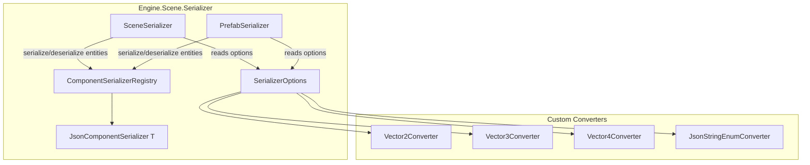
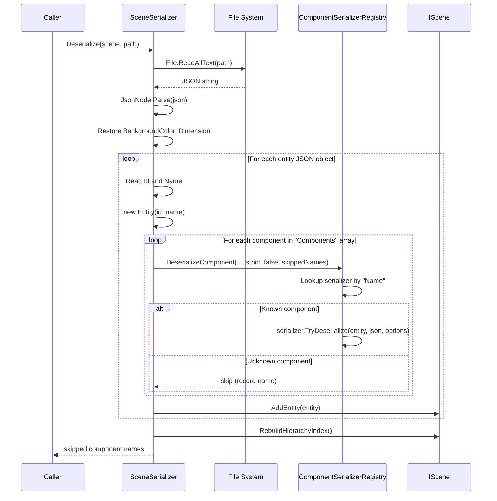

# Serialization

Scenes and prefabs are stored as JSON using System.Text.Json. A `ComponentSerializerRegistry` dispatches polymorphic component read/write through registered `IComponentSerializer` implementations. Custom `JsonConverter<T>` implementations handle `Vector2`, `Vector3`, and `Vector4`. Implementations are internal; public entry points are `ISceneSerializer`, `IPrefabSerializer`, and `IComponentSerializerRegistry`. All are DI singletons sharing one `SerializerOptions` instance.

## Component Diagram


```mermaid
graph TD
    subgraph "Engine.Scene.Serializer"
        SS[SceneSerializer]
        PS[PrefabSerializer]
        CSR[ComponentSerializerRegistry]
        SO[SerializerOptions]
        JCS[JsonComponentSerializer T]
    end

    subgraph "Custom Converters"
        V2[Vector2Converter]
        V3[Vector3Converter]
        V4[Vector4Converter]
        SEC[JsonStringEnumConverter]
    end

    SS -->|serialize/deserialize entities| CSR
    PS -->|serialize/deserialize entities| CSR
    SS -->|reads options| SO
    PS -->|reads options| SO
    CSR --> JCS
    SO --> V2
    SO --> V3
    SO --> V4
    SO --> SEC
```

## Scene Serialization

**File:** `Engine/Scene/Serializer/SceneSerializer.cs`

Scene JSON structure:

```json
{
  "Scene": "MyScene",
  "BackgroundColor": [0.1, 0.1, 0.1, 1.0],
  "Dimension": "TwoD",
  "Entities": [
    {
      "Id": 1,
      "Name": "Player",
      "Components": [
        { "Name": "TransformComponent", "Position": [0, 0, 0], "Rotation": [0, 0, 0], "Scale": [1, 1, 1] },
        { "Name": "SpriteRendererComponent", "TexturePath": "assets/player.png", "Color": [1, 1, 1, 1] }
      ]
    }
  ]
}
```

- On save, `"Scene"` is written from `IScene.Name` (metadata; `Deserialize` does not restore the name from JSON)
- `BackgroundColor` (`Vector4`) and `Dimension` (`SceneDimension` enum) are scene-level properties restored on load
- Each entity is serialized with `Id`, `Name`, and a `Components` array
- `Deserialize` appends entities to the provided `IScene` without clearing it — callers must use a fresh scene or remove existing entities first
- After all entities are added, `IScene.RebuildHierarchyIndex()` runs
- Components are serialized via `ComponentSerializerRegistry.SerializeEntity()` — iteration order follows `entity.GetAllComponents()`
- Each component JSON object includes a `"Name"` property (registered type name) plus property values
- Unknown component types are **skipped** (lenient); `Deserialize` returns the distinct skipped names
- `SerializeToString(IScene)` returns indented JSON without writing a file

## Component Serialization

Components are data-only classes serialized by System.Text.Json through `JsonComponentSerializer<T>`. Runtime-only fields on component types use `[JsonIgnore]` (e.g. computed view matrices, physics dirty flags) so they are not persisted.

Resource paths (`TexturePath`, `ModelPath`, `AudioClipPath`, etc.) are serialized as strings. GPU/audio resources are loaded later by their systems — not during JSON deserialization.

Built-in components **not** registered in `RegisterBuiltins()` (`TagComponent`, `IdComponent`) cannot be saved — `SerializeEntity()` throws if an entity has an unregistered component type (unless a hot-reload name fallback matches; see below).

## ComponentSerializerRegistry

**File:** `Engine/Scene/Serializer/ComponentSerializerRegistry.cs`

Central registry mapping component type names to serializers. Built-ins in `RegisterBuiltins()`:

| Component | Serializer |
|-----------|-----------|
| TransformComponent | `JsonComponentSerializer<T>` |
| ParentComponent | `JsonComponentSerializer<T>` |
| CameraComponent | `JsonComponentSerializer<T>` |
| SpriteRendererComponent | `JsonComponentSerializer<T>` |
| SubTextureRendererComponent | `JsonComponentSerializer<T>` |
| ModelRendererComponent | `JsonComponentSerializer<T>` |
| VisibilityZoneComponent | `JsonComponentSerializer<T>` |
| AmbientLightComponent | `JsonComponentSerializer<T>` |
| DirectionalLightComponent | `JsonComponentSerializer<T>` |
| PointLightComponent | `JsonComponentSerializer<T>` |
| RigidBody2DComponent | `JsonComponentSerializer<T>` |
| BoxCollider2DComponent | `JsonComponentSerializer<T>` |
| CircleCollider2DComponent | `JsonComponentSerializer<T>` |
| EdgeCollider2DComponent | `JsonComponentSerializer<T>` |
| AudioListenerComponent | `JsonComponentSerializer<T>` |
| AudioSourceComponent | `JsonComponentSerializer<T>` |

### Lenient deserialization

Scene and prefab loading both pass `strict: false` into `DeserializeComponent`:

| Caller | Unknown Types |
|--------|---------------|
| SceneSerializer | Skipped; names returned from `Deserialize` |
| PrefabSerializer | Skipped silently |

Optional `skippedNames` collection records unknown `"Name"` values when provided (scenes use this).

### Serialize safety

If an entity has a component with no registered serializer, `SerializeEntity()` throws `InvalidOperationException` rather than silently dropping data. After hot-reload, instances typed from a previous GameAssembly may miss the `_byType` entry; the registry then falls back to `[SerializableComponent]` name / type name and serializes via `JsonSerializer.SerializeToNode` against the live instance type.

### Extensibility

Game-defined components opt in with `[SerializableComponent]` (`ECS/SerializableComponentAttribute.cs`). Optional `name` overrides the JSON `"Name"` value.

```csharp
[SerializableComponent]
public class ScoreComponent : IGameComponent { ... }

[SerializableComponent("CustomName")]
public class MyComponent : IGameComponent { ... }
```

Registration when the game assembly loads:

- **Editor:** workspace calls `RegisterFromAssembly(assembly)` after script hot-reload
- **Runtime:** host calls `RegisterFromAssembly(assembly)` after game assembly load

`RegisterFromAssembly` calls `UnregisterAssembly` first so recompilation replaces serializers from that assembly. `UnregisterAssembly(assembly)` removes only serializers owned by that assembly.

Public registration API: `IComponentSerializerRegistry.Register<T>(string? componentName = null)`.

## Custom JSON Converters

**File:** `Engine/Scene/Serializer/SerializerOptions.cs`

`SerializerOptions` is a DI singleton that builds `JsonSerializerOptions` with:

| Converter | Format | Example |
|-----------|--------|---------|
| `Vector2Converter` | `[x, y]` | `[1.0, 2.0]` |
| `Vector3Converter` | `[x, y, z]` | `[0, 5.5, -1]` |
| `Vector4Converter` | `[x, y, z, w]` | `[1, 1, 1, 1]` |
| `JsonStringEnumConverter` | Enum as string | `"TwoD"`, `"Dynamic"` |

Vector converters sanitize NaN/Infinity to `0f` on write. Options are made read-only via `MakeReadOnly(populateMissingResolver: true)` after construction.

## Prefab Serialization

**File:** `Engine/Scene/Serializer/PrefabSerializer.cs`

### Prefab v2 (current save format)

Saves the full subtree from the selected entity. Parent ids are remapped to prefab-local indices (`PrefabIndex`).

```json
{
  "Prefab": "PlayerPrefab",
  "Version": "2.0",
  "RootPrefabIndex": 0,
  "Entities": [
    {
      "PrefabIndex": 0,
      "Name": "Player",
      "Components": [
        { "Name": "TransformComponent", "...": "..." },
        { "Name": "SpriteRendererComponent", "...": "..." }
      ]
    },
    {
      "PrefabIndex": 1,
      "Name": "Weapon",
      "Components": [
        { "Name": "ParentComponent", "ParentId": 0 },
        { "Name": "TransformComponent", "...": "..." }
      ]
    }
  ]
}
```

### Prefab v1 (load only)

Older single-entity files with top-level `Components` (and optional `OriginalName`) still load.

### Operations

- **`SerializeToPrefab()`**: Writes `{projectPath}/assets/prefabs/{name}.prefab` in **v2** format (always)
- **`ApplyPrefabToEntity()`**: v2 replaces the subtree under the target (keeps external parent); v1 replaces components on that entity only
- **`CreateEntityFromPrefab()`**: Instantiates v2 subtree or v1 single entity; returns the root

## Scene Deserialization Flow


```mermaid
sequenceDiagram
    participant Caller
    participant SS as SceneSerializer
    participant FS as File System
    participant CSR as ComponentSerializerRegistry
    participant Scene as IScene

    Caller->>SS: Deserialize(scene, path)
    SS->>FS: File.ReadAllText(path)
    FS-->>SS: JSON string
    SS->>SS: JsonNode.Parse(json)
    SS->>SS: Restore BackgroundColor, Dimension

    loop For each entity JSON object
        SS->>SS: Read Id and Name
        SS->>SS: new Entity(id, name)

        loop For each component in "Components" array
            SS->>CSR: DeserializeComponent(..., strict: false, skippedNames)
            CSR->>CSR: Lookup serializer by "Name"
            alt Known component
                CSR->>CSR: serializer.TryDeserialize(entity, json, options)
            else Unknown component
                CSR-->>SS: skip (record name)
            end
        end

        SS->>Scene: AddEntity(entity)
    end

    SS->>Scene: RebuildHierarchyIndex()
    SS-->>Caller: skipped component names
```

## Public API

| Interface | Implementation | Purpose |
|-----------|----------------|---------|
| `ISceneSerializer` | `SceneSerializer` | `Serialize` / `SerializeToString` / `Deserialize` (path or `JsonObject`) |
| `IPrefabSerializer` | `PrefabSerializer` | Prefab save, apply, and create-from-prefab |
| `IComponentSerializerRegistry` | `ComponentSerializerRegistry` | `Register<T>()`, `RegisterFromAssembly`, `UnregisterAssembly` |

`InvalidSceneJsonException` is the public exception type for invalid scene/prefab JSON and I/O failures during scene/prefab save/load.

## Key Files

| File | Purpose |
|------|---------|
| `Engine/Scene/Serializer/SceneSerializer.cs` | Scene save/load |
| `Engine/Scene/Serializer/PrefabSerializer.cs` | Prefab save/load/apply (v1 + v2) |
| `Engine/Scene/Serializer/ComponentSerializerRegistry.cs` | Polymorphic component dispatch and registration |
| `Engine/Scene/Serializer/ComponentSerializers.cs` | `IComponentSerializer`, `JsonComponentSerializer<T>` |
| `Engine/Scene/Serializer/IComponentSerializerRegistry.cs` | Public registration API |
| `Engine/Scene/Serializer/SerializerOptions.cs` | Shared JSON options with converters |
| `Engine/Scene/Serializer/Vector2Converter.cs` | Vector2 as JSON array |
| `Engine/Scene/Serializer/Vector3Converter.cs` | Vector3 as JSON array |
| `Engine/Scene/Serializer/Vector4Converter.cs` | Vector4 as JSON array |
| `Engine/Scene/Serializer/ISceneSerializer.cs` | Public scene serializer interface |
| `Engine/Scene/Serializer/IPrefabSerializer.cs` | Public prefab interface |
| `Engine/Scene/Serializer/InvalidSceneJsonException.cs` | Custom exception type |
| `ECS/SerializableComponentAttribute.cs` | Opt-in attribute for game component serialization |
