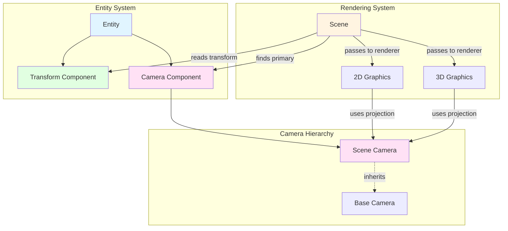
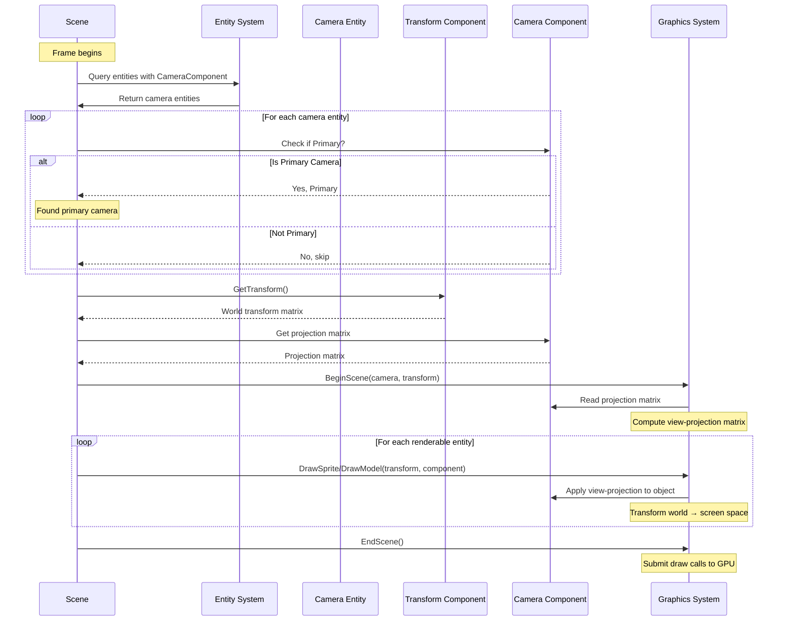
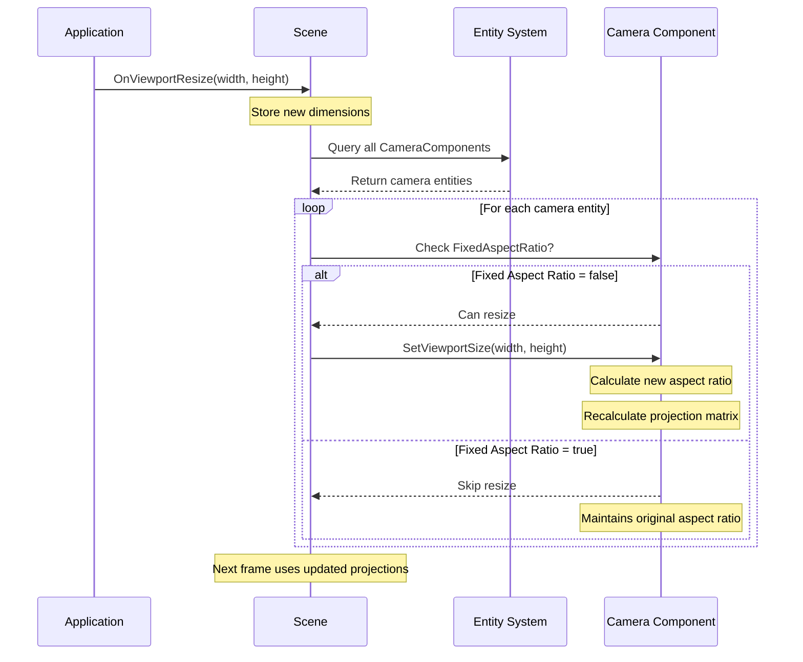
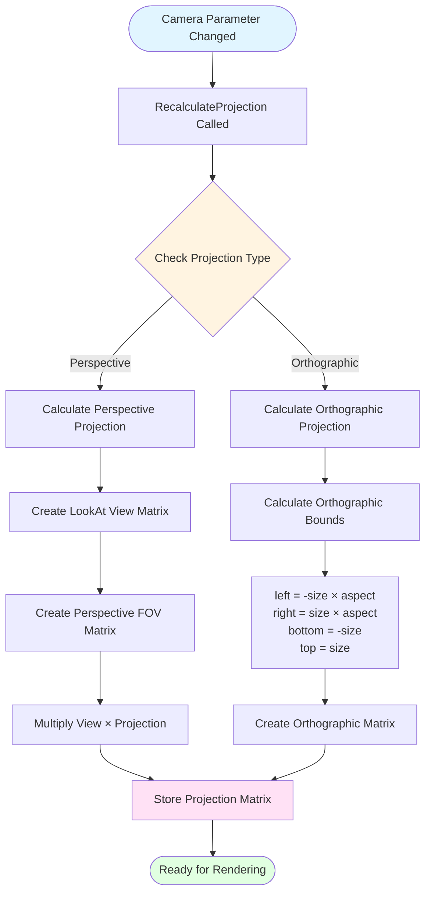
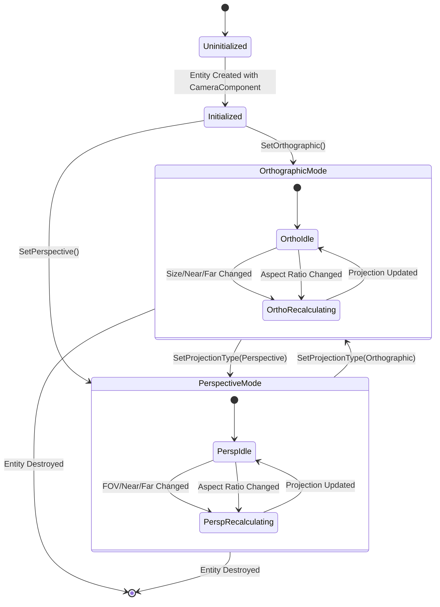

# Camera System

## Overview

### Purpose
The Camera System transforms the 3D game world into a 2D viewport representation by calculating view and projection matrices. It serves as the "eye" through which the scene is rendered, determining what portion of the world is visible and how objects are projected onto the screen.

### Scope
The Camera System handles:
- **Projection Management**: Supports both perspective (3D) and orthographic (2D) projection modes
- **View Calculation**: Computes transformation matrices that convert world-space coordinates to screen-space
- **Viewport Adaptation**: Responds to window/viewport resizing to maintain correct aspect ratios
- **Primary Camera Selection**: Identifies which camera should be used for rendering the scene
- **Component Integration**: Works with the entity-component system to attach cameras to game objects

### Key Concepts

**Projection Types**: The system supports two fundamental projection models:
- **Orthographic Projection**: Maintains parallel lines and consistent object sizes regardless of depth (ideal for 2D games, UI, and technical visualizations)
- **Perspective Projection**: Simulates human vision with foreshortening, where distant objects appear smaller (essential for 3D games)

**Primary Camera Pattern**: In a scene with multiple cameras, only one camera is designated as "primary" and actively used for rendering. This allows developers to set up multiple viewpoints while controlling which one is active.

**View-Projection Matrix**: The camera produces a combined transformation matrix that converts world coordinates into normalized device coordinates, representing the complete camera transformation pipeline.

**Component-Based Architecture**: Cameras exist as components attached to entities, allowing them to inherit position, rotation, and other transformations from the entity's transform component.

## Architecture Flow

### Initialization Flow

The camera system follows a multi-stage initialization process:

1. **Camera Entity Creation**: A game entity is created with both a transform component (for positioning) and a camera component
2. **Projection Configuration**: The camera component initializes with default projection settings based on the platform (orthographic near/far values differ between Windows and macOS)
3. **Viewport Registration**: When added to a scene, the camera registers the current viewport dimensions and calculates its initial aspect ratio
4. **Projection Matrix Calculation**: The camera computes its projection matrix based on the selected projection type and configured parameters

### Runtime Rendering Flow

During each frame, the camera system participates in the rendering pipeline:

1. **Primary Camera Discovery**: The scene queries all entities with camera components to find the one marked as "primary"
2. **Transform Retrieval**: The system reads the camera entity's transform component to determine the camera's world-space position and orientation
3. **View-Projection Matrix Composition**: The camera combines its projection matrix with the transform to create the complete view-projection matrix
4. **Renderer Initialization**: The rendering system begins its scene pass using the camera's matrices
5. **Object Rendering**: Each renderable object's world transform is multiplied by the camera's view-projection matrix to determine its screen position
6. **Scene Completion**: After all objects are submitted, the rendering system completes the frame

### Viewport Resize Flow

When the application window or viewport changes size:

1. **Resize Event**: The scene receives a viewport resize notification with new width and height
2. **Aspect Ratio Update**: All cameras (or only non-fixed-aspect-ratio cameras) receive the new dimensions
3. **Aspect Ratio Calculation**: Each camera calculates its new aspect ratio (width ÷ height)
4. **Projection Recalculation**: The changed aspect ratio triggers a projection matrix recalculation
5. **Next Frame Rendering**: Subsequent frames use the updated projection, preventing distortion

## Component Relationships

## Sequence Diagram: Frame Rendering with Camera

## Sequence Diagram: Viewport Resize

## Projection Calculation Flow

## Camera Configuration State Machine

## Lifecycle & Timing

### Initialization Phase

**Camera Creation**: Cameras are created as part of entity initialization, either during scene loading (deserialization) or programmatic entity creation. When a camera component is added to an entity:

1. The base camera is instantiated with an identity projection matrix
2. Platform-specific defaults are applied (near/far clip planes vary by OS)
3. If the scene already has valid viewport dimensions, they are immediately applied to the camera
4. The initial projection matrix is calculated

**Scene Registration**: When a new camera component is added to an entity in an active scene, the `OnComponentAdded` event fires. This ensures that the camera immediately receives current viewport dimensions rather than waiting for the next resize event.

### Frame Execution Phase

**Camera Selection** (Start of Frame): Before rendering begins, the scene identifies the primary camera by iterating through all entities with camera components and selecting the first one where `Primary = true`.

**Rendering Pass** (During Frame):
- **Editor Mode**: Uses a dedicated orthographic camera controlled by the editor viewport, independent of scene cameras
- **Runtime Mode**: Uses the primary camera from the scene, reading both its projection matrix and the transform from its parent entity

**Transform Application**: The camera entity's transform component (position, rotation, scale) is read and combined with the projection matrix to create the final view-projection matrix used by the renderer.

### Viewport Event Phase

**Resize Handling** (Asynchronous): When the application window or editor viewport resizes:

1. The scene stores the new dimensions
2. All cameras (except those with fixed aspect ratio) are notified
3. Each camera recalculates its projection matrix synchronously
4. The next frame automatically uses the updated projection

This ensures seamless adaptation to window changes without visible distortion.

### Shutdown Phase

**Camera Cleanup**: Cameras are cleaned up as part of entity destruction. Since cameras are components, they follow the entity lifecycle:

1. Entity destruction is requested
2. All components, including the camera component, are removed
3. The camera object is garbage collected
4. If the destroyed entity held the primary camera, the scene will have no active camera until another is designated

**Runtime Stop**: When transitioning from play mode to edit mode, camera components persist but runtime-specific state (like physics-controlled camera movement) is reset.

## Integration Points

### Scene Integration

The scene acts as the central coordinator for camera operations:

- **Discovery**: Queries the entity system to find all cameras
- **Selection**: Determines which camera is primary
- **Rendering**: Passes the active camera to graphics subsystems
- **Lifecycle Management**: Notifies cameras of viewport changes

### Renderer Integration

Both 2D and 3D graphics systems depend on cameras:

- **BeginScene**: Accepts a camera and transform to initialize the rendering pass
- **Projection Access**: Reads the projection matrix to set up GPU shader uniforms
- **Per-Object Transformation**: Multiplies each object's world matrix by the camera's view-projection matrix

### Editor Integration

The editor provides specialized camera handling:

- **Independent Viewport Camera**: The editor uses its own orthographic camera for the scene viewport, separate from runtime cameras
- **Camera Component Editor**: Provides UI controls for editing camera parameters (FOV, size, near/far clips, projection type)
- **Primary Camera Override**: In edit mode, the editor camera takes precedence over scene cameras

### Input Integration (Optional)

Cameras can respond to input through script components:

- **Camera Controllers**: Scriptable entities can read input events and modify the camera entity's transform
- **Movement Handling**: Input-driven camera movement updates the transform component, which is automatically picked up in the next rendering pass

## Design Rationale

### Why Separate Base Camera and Scene Camera?

The two-tier camera hierarchy provides flexibility:

- **Base Camera**: Provides a minimal projection matrix abstraction used across the engine
- **Scene Camera**: Adds scene-specific functionality like projection type switching, viewport management, and editor integration

This separation allows the rendering system to work with simple projection matrices while scene-level code manages higher-level camera behavior.

### Why Component-Based Cameras?

Attaching cameras to entities provides several advantages:

- **Spatial Hierarchy**: Cameras inherit transformations from their parent entity
- **Scene Serialization**: Cameras save/load with scenes automatically
- **Scripting Support**: Camera movement can be implemented through standard script components
- **Multi-Camera Scenarios**: Different entities can have different cameras for split-screen or picture-in-picture effects

### Why Primary Camera Pattern?

Instead of requiring manual camera assignment, the primary flag provides:

- **Simplicity**: Scenes automatically use the first primary camera found
- **Flexibility**: Multiple cameras can exist in the scene for future features (minimap, rear-view, etc.)
- **Default Behavior**: New scenes work immediately with a single primary camera

### Why Recalculate on Every Parameter Change?

Immediate projection recalculation ensures:

- **Consistency**: The projection matrix is always synchronized with parameters
- **Simplicity**: No need to track "dirty" state or manually trigger updates
- **Correctness**: Impossible to render with stale projection data

The performance cost is negligible since camera parameters rarely change during runtime (typically only during initialization or viewport resize).

## Common Usage Patterns

### Setting Up a 2D Game Camera

For 2D games, orthographic projection maintains consistent object sizes:

1. Create an entity with transform and camera components
2. Set the camera to orthographic mode
3. Configure the orthographic size (controls how many world units are visible vertically)
4. Mark the camera as primary
5. The scene automatically uses this camera for rendering

### Setting Up a 3D Game Camera

For 3D games, perspective projection provides depth perception:

1. Create an entity with transform and camera components
2. Position the entity in the world (e.g., behind and above the player)
3. Set the camera to perspective mode
4. Configure the field of view (typically 45-90 degrees)
5. Attach a camera controller script to handle movement and rotation

### Runtime Camera Switching

To switch between multiple cameras during gameplay:

1. Set the current primary camera's `Primary` flag to false
2. Set the desired camera's `Primary` flag to true
3. The next frame automatically renders from the new camera's perspective

### Viewport-Independent UI Cameras

For UI that should maintain consistent dimensions:

1. Create a camera with `FixedAspectRatio = true`
2. Configure specific orthographic bounds for your UI coordinate system
3. This camera maintains its aspect ratio even when the window resizes

## Performance Considerations

**Matrix Calculation Cost**: Projection matrix recalculation involves trigonometric operations (especially for perspective projection) but occurs infrequently:
- Initialization: Once per camera
- Viewport Resize: Only when window dimensions change
- Parameter Adjustment: Only during configuration or gameplay-driven changes

**Primary Camera Lookup**: The scene queries all cameras each frame to find the primary one. In scenes with many cameras, consider:
- Caching the primary camera entity reference
- Using an event-driven system to notify the scene when the primary camera changes

**Transform Matrix Multiplication**: Each frame, the camera's projection matrix is combined with its entity's transform. This is a constant-cost operation regardless of scene complexity.

## Future Extension Points

The current architecture supports future enhancements:

- **Camera Stacking**: Render multiple cameras in sequence for layered effects
- **Post-Processing Pipelines**: Attach effect chains to individual cameras
- **Render Targets**: Direct camera output to textures instead of the screen
- **Split-Screen Rendering**: Use multiple primary cameras with viewport rectangles
- **Camera Transitions**: Interpolate between camera states for smooth transitions
- **Frustum Culling Integration**: Use camera frustum to optimize rendering
