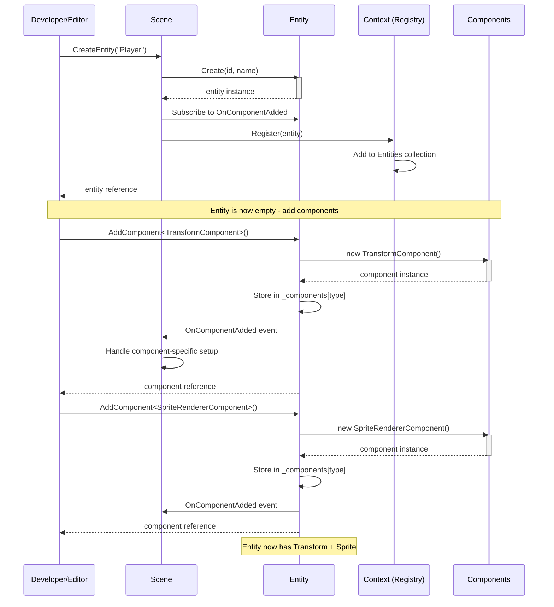
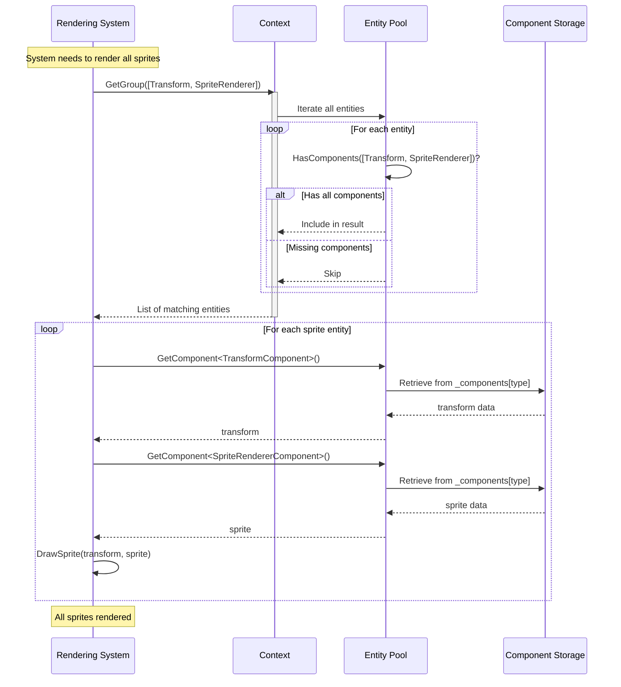
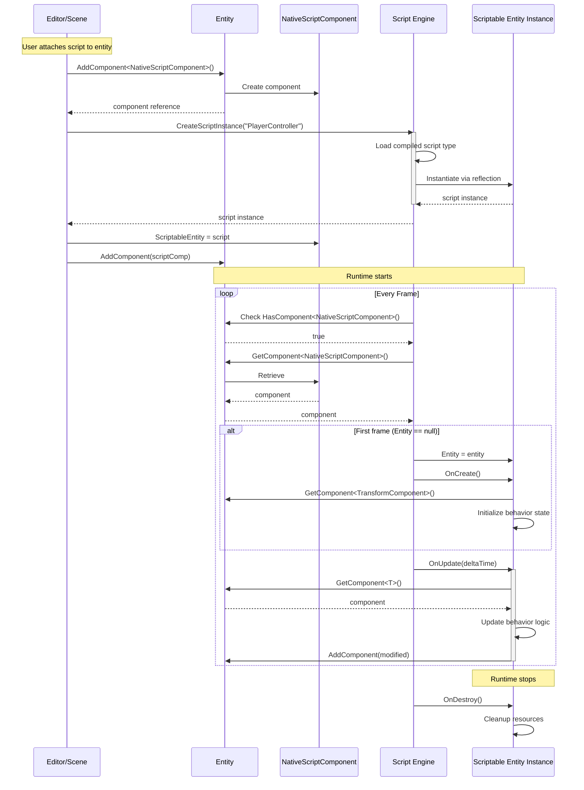
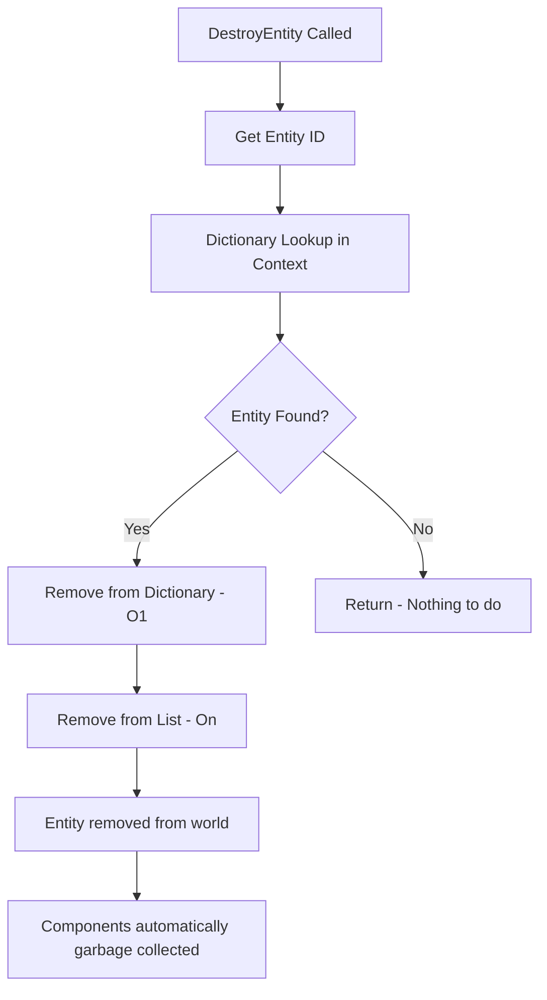

# ECS/GameObject Architecture

## Overview

The Entity Component System (ECS) is the foundational architectural pattern that powers how game objects are structured, composed, and managed in the engine. Rather than using traditional object-oriented inheritance hierarchies, this engine employs a composition-based approach where game objects (entities) are built by combining modular components.

### Purpose

The ECS architecture solves several critical problems in game development:

- **Flexible Composition**: Create varied game objects by mixing and matching components without inheritance complexity
- **Data-Oriented Processing**: Efficiently iterate over entities with specific component combinations
- **Decoupled Logic**: Separate data (components) from behavior (systems and scripts)
- **Dynamic Modification**: Add or remove capabilities from entities at runtime
- **Performance Optimization**: Enable cache-friendly data access patterns for rendering and physics

### Scope

This module handles:

- Entity lifecycle management (creation, destruction, duplication)
- Component storage and retrieval on entities
- System registration, initialization, and execution
- Entity querying by component composition (GetGroup, View<T>)
- Global entity registry and context management
- Script behavior attachment and execution
- Component-based data isolation
- Priority-based system orchestration

### Key Concepts

**Entity**: A lightweight container identified by an ID and name. Entities are pure data structures with no inherent behavior - they simply hold components.

**Component**: A data structure implementing the `IComponent` interface. Components represent specific aspects of an entity (position, appearance, physics, etc.) but contain no logic.

**System**: A logic processor implementing the `ISystem` interface that operates on entities with specific component combinations. Systems encapsulate game engine functionality (rendering, physics, audio) and execute in priority-based order each frame.

**Context**: A singleton registry that maintains all active entities and provides query capabilities to find entities by their component composition.

**Scriptable Entity**: The behavior layer - custom scripts that inherit from `ScriptableEntity` and receive lifecycle callbacks to implement game logic.

**View/Group Pattern**: Efficient querying mechanism to retrieve entities that possess specific component combinations, enabling system-level processing.

## Core Concepts

### Entity as a Container

Think of an entity as an empty vessel or a container that you fill with capabilities. The entity itself has:

- **Identity**: A unique ID and a human-readable name
- **Component Storage**: An internal dictionary mapping component types to instances
- **Events**: Notification hooks when components are added
- **Query Interface**: Methods to check, add, remove, and retrieve components

An entity without components is valid but does nothing - it's the components that give entities meaning and functionality.

#### Entity ID Generation

Entity IDs are generated using a sequential counter maintained by each Scene instance:

- **Sequential Generation**: IDs start at 1 and increment for each new entity created via `CreateEntity()`
- **Collision-Free**: Sequential generation eliminates the possibility of ID collisions
- **Deterministic**: Same entity creation order produces same IDs, aiding debugging and reproducibility
- **Serialization-Safe**: When loading entities from a saved scene, the Scene tracks the highest ID and continues from there
- **Scene-Local**: Each Scene instance maintains its own ID counter, starting fresh at 1 when created

This approach ensures that:
- Entity IDs remain small and debuggable (1, 2, 3...)
- No birthday paradox collision issues occur (previous random generation had 50% collision risk at ~118 entities)
- Entity references in saved scenes remain valid across sessions
- Debugging is simplified with predictable, sequential IDs

**Note**: Since the engine uses a single active scene architecture (via `CurrentScene.Instance`), ID uniqueness is guaranteed within the active scene context.

### Component as Pure Data

Components are simple data holders implementing the `IComponent` marker interface. They describe "what something is" rather than "what something does":

- **Transform Component**: Position, rotation, scale in 3D space
- **Sprite Renderer Component**: Visual appearance data (texture, color, tiling)
- **Rigid Body Component**: Physics simulation properties (body type, velocity)
- **Camera Component**: View projection settings (FOV, near/far planes)
- **Script Component**: Reference to behavioral logic attached to the entity

The engine provides built-in components for common game object aspects, and you can create custom components by implementing `IComponent`.

### Context as the World Registry

The Context singleton acts as the "world database" of entities:

- Maintains a thread-safe collection of all living entities
- Provides query methods to find entities with specific component patterns
- Enables systems to efficiently iterate over relevant entities
- Serves as the single source of truth for entity existence

When you create an entity in a scene, it's automatically registered with the Context, making it discoverable by all systems.

### Scriptable Entity as Behavior

While components store data, scripts provide behavior. The `ScriptableEntity` base class:

- Connects to an entity instance
- Receives lifecycle callbacks (OnCreate, OnUpdate, OnDestroy)
- Provides convenience methods to access and manipulate components
- Handles input events (keyboard, mouse) and physics events (collisions, triggers)
- Compiles dynamically at runtime for hot-reload support

Scripts are attached to entities via the `NativeScriptComponent`, creating a bridge between the pure data world (ECS) and the behavioral world (scripts).

### Query System: Views and Groups

The engine provides two patterns for querying entities:

**Group Query** (`GetGroup`): Returns all entities that possess a specific set of component types. Use this when you need to iterate over entities for batch processing (e.g., rendering all sprites, updating all physics bodies).

**View Query** (`View<T>`): Returns entity-component pairs for a specific component type, providing direct access to both the entity and the component. Use this when you need to process entities with a particular component and access its data.

These queries are performed on-demand by iterating the entity collection, making them flexible but requiring efficient component checking.

### System as Logic Processors

While components store data, systems provide the engine-level logic that processes that data. The `ISystem` interface defines a standardized lifecycle:

- **Priority**: Integer value determining execution order (lower = earlier). Enables precise control over update sequencing.
- **OnInit()**: Called once when the system is registered and initialized, used for setup and resource allocation.
- **OnUpdate(TimeSpan deltaTime)**: Called every frame to process entities and update game state based on elapsed time.
- **OnShutdown()**: Called when the system is being shut down, used for cleanup and resource disposal.

Systems query the Context for entities with specific component combinations, process their data, and update state. For example:

- **PhysicsSimulationSystem**: Queries entities with `RigidBody2DComponent` + `TransformComponent`, steps the Box2D physics world, and synchronizes transforms.
- **SpriteRenderingSystem**: Queries entities with `TransformComponent` + `SpriteRendererComponent` and submits draw calls to the renderer.
- **AudioSystem**: Queries entities with `AudioSourceComponent` + `TransformComponent` and updates OpenAL 3D audio positions.

The engine provides built-in systems for core functionality (rendering, physics, audio, scripts), and you can create custom systems by implementing `ISystem`.

### System Manager and Execution

The `SystemManager` orchestrates system registration, initialization, and execution:

- **Registration**: Systems are registered with optional "shared" flag. Shared systems (like rendering) are singleton instances reused across scenes. Per-scene systems (like physics) have scene-local lifetime.
- **Priority Sorting**: After registration, systems are sorted by priority to establish execution order.
- **Initialization**: All systems receive `OnInit()` in priority order when the scene starts.
- **Frame Update**: Every frame, systems receive `OnUpdate(deltaTime)` in priority order.
- **Shutdown**: Per-scene systems are shut down when the scene stops. Shared systems persist across scene changes.

This design separates concerns: each system handles one logical responsibility (rendering, physics, audio), making the codebase maintainable and extensible.

### System Execution Order

The engine uses priority values to control update order:

| Priority | System | Responsibility |
|----------|--------|----------------|
| 100 | PhysicsSimulationSystem | Box2D physics simulation with fixed timestep |
| 150 | ScriptUpdateSystem | User script `OnUpdate()` execution and hot-reload |
| 160 | AudioSystem | OpenAL audio playback and 3D spatial positioning |
| 200 | SpriteRenderingSystem | 2D sprite batch rendering |
| 205 | SubTextureRenderingSystem | Sprite atlas region rendering |
| 210 | ModelRenderingSystem | 3D mesh rendering with materials |
| 500 | PhysicsDebugRenderSystem | Collision shape debug visualization |

**Design Rationale**:
- **Physics first** (100): Simulates world state before scripts and rendering
- **Scripts second** (150): Allows game logic to respond to physics results
- **Audio third** (160): Updates spatial audio after script movement
- **Rendering last** (200-210): Draws final visual state
- **Debug overlay** (500): Renders on top of everything

This ordering ensures consistent, predictable behavior: physics affects scripts, scripts affect audio/rendering, but rendering doesn't affect physics.

### Built-in Engine Systems

The engine provides several core systems out of the box:

**PhysicsSimulationSystem** (Per-Scene, Priority: 100)
- Manages Box2D physics world with fixed timestep (1/60s)
- Accumulates frame time and steps physics multiple times if needed (up to 5 steps/frame)
- Prevents "spiral of death" by clamping accumulator
- Synchronizes Box2D body transforms back to `TransformComponent`
- Requires: `RigidBody2DComponent`, `BoxCollider2DComponent`, `TransformComponent`

**ScriptUpdateSystem** (Shared, Priority: 150)
- Delegates to `ScriptEngine.Instance.OnUpdate(deltaTime)`
- Executes user scripts' `OnUpdate()` methods
- Handles hot-reload detection and script recompilation
- Initializes scripts on first frame (sets Entity reference, calls `OnCreate()`)

**AudioSystem** (Shared, Priority: 160)
- Creates OpenAL audio sources for entities with `AudioSourceComponent`
- Updates listener position/orientation from entity with `AudioListenerComponent`
- Synchronizes 3D audio source positions with `TransformComponent`
- Manages volume, pitch, and spatial audio properties
- Provides play/pause/stop controls for audio playback

**SpriteRenderingSystem** (Shared, Priority: 200)
- Finds primary camera (entity with `CameraComponent.Primary = true`)
- Queries entities with `TransformComponent` + `SpriteRendererComponent`
- Begins scene rendering, draws each sprite with transform, ends scene (flushes batch)
- Delegates to `IGraphics2D` interface for rendering abstraction

**SubTextureRenderingSystem** (Shared, Priority: 205)
- Similar to SpriteRenderingSystem but creates `SubTexture2D` from atlas coordinates
- Operates on `SubTextureRendererComponent` + `TransformComponent`
- Enables sprite sheet rendering with flexible cell/size configuration

**ModelRenderingSystem** (Shared, Priority: 210)
- Finds primary camera for 3D view projection
- Queries entities with `TransformComponent` + `MeshComponent` + `ModelRendererComponent`
- Delegates to `IGraphics3D` interface for 3D rendering

**PhysicsDebugRenderSystem** (Shared, Priority: 500)
- Only active when `DebugSettings.Instance.ShowColliderBounds` is enabled
- Color-codes collision shapes by body type (Static=Green, Kinematic=Blue, Dynamic=Pink/Gray)
- Runs last to overlay debug visualization on top of rendered scene

### System Query Patterns

Systems use two primary patterns to query entities from the Context:

**GetGroup Pattern** - Component-based filtering:
```csharp
// Returns all entities having all specified component types
var cameraGroup = Context.Instance.GetGroup([typeof(TransformComponent), typeof(CameraComponent)]);
foreach (var entity in cameraGroup)
{
    var camera = entity.GetComponent<CameraComponent>();
    var transform = entity.GetComponent<TransformComponent>();
    // Process camera with transform data
}
```

**View<T> Pattern** - Efficient iterator with value tuples:
```csharp
// Returns (Entity, Component) tuples with minimal allocations
var view = Context.Instance.View<RigidBody2DComponent>();
foreach (var (entity, rigidBody) in view)
{
    var transform = entity.GetComponent<TransformComponent>();
    // Synchronize physics body position with transform
}
```

**Performance Characteristics**:
- Both patterns: O(n) linear scan of all entities with dictionary lookups
- GetGroup: Returns list of entities, requires subsequent GetComponent calls
- View<T>: Returns tuples with component already retrieved, avoiding repeated lookups
- No query result caching between frames (systems re-query each frame)
- Creates snapshot under lock for thread safety

**Usage Guidelines**:
- Use **GetGroup** when you need multiple component types and entity reference
- Use **View<T>** when you primarily need one component type (more efficient)
- Avoid querying inside nested loops (cache results at frame start if needed)

### System Lifetime Management

Systems have two lifetime modes controlled during registration:

**Per-Scene Systems** (`isShared: false`):
- Created for each scene instance
- `OnInit()` called when scene starts (e.g., play mode begins)
- `OnUpdate()` called every frame while scene is active
- `OnShutdown()` called when scene stops (e.g., play mode ends or scene unloads)
- Example: `PhysicsSimulationSystem` (owns physics world tied to scene)

**Shared Singleton Systems** (`isShared: true`):
- Created once and reused across multiple scenes
- `OnInit()` called on first registration
- `OnUpdate()` called every frame regardless of scene changes
- `OnShutdown()` called only when application exits (via `ShutdownAll()`)
- Example: `SpriteRenderingSystem` (stateless renderer used by all scenes)

**Shutdown Behavior**:
- `SystemManager.Shutdown()`: Shuts down per-scene systems only (preserves shared systems)
- `SystemManager.ShutdownAll()`: Shuts down all systems including shared (application exit)

This distinction optimizes resource management: rendering systems don't need recreation when switching scenes, but physics worlds must be scene-local.

### Creating Custom Systems

To add custom engine logic, implement the `ISystem` interface:

```csharp
public class ParticleSystem : ISystem
{
    public int Priority => 180; // After scripts, before rendering

    private ParticleEmitter _emitter;

    public void OnInit()
    {
        // Initialize particle emitter, allocate buffers
        _emitter = new ParticleEmitter(maxParticles: 1000);
    }

    public void OnUpdate(TimeSpan deltaTime)
    {
        // Query entities with particle components
        var view = Context.Instance.View<ParticleEmitterComponent>();

        foreach (var (entity, emitter) in view)
        {
            var transform = entity.GetComponent<TransformComponent>();

            // Update particle positions, handle spawning/death
            _emitter.Update(emitter, transform, deltaTime);
        }
    }

    public void OnShutdown()
    {
        // Cleanup resources, dispose buffers
        _emitter?.Dispose();
    }
}
```

**Best Practices**:
- Choose priority carefully to control execution order relative to other systems
- Use dependency injection for shared resources (e.g., renderer interface)
- Query entities once per frame, cache results if processing multiple times
- Minimize allocations in `OnUpdate()` (hot path called every frame)
- Use `View<T>` pattern when possible for better performance
- Dispose resources properly in `OnShutdown()`

Register custom systems via `SceneSystemRegistry` for singleton behavior or directly in scene initialization for per-scene systems.

## Architecture Flow

### Entity Creation Flow



**Key Steps:**

1. **Instantiation**: Scene creates an entity with a unique ID and name
2. **Registration**: Entity is added to the global Context registry
3. **Event Wiring**: Scene subscribes to component addition events for reactive setup
4. **Component Addition**: Components are created and stored in the entity's internal dictionary
5. **Notification**: OnComponentAdded events fire, allowing scene-level initialization

### Component Access and Querying



**Query Pattern:**

1. **Request**: System asks Context for entities with specific component types
2. **Iteration**: Context checks each entity against the component requirement
3. **Filtering**: Only entities possessing all required components are returned
4. **Processing**: System retrieves components and performs operations (render, physics update, etc.)

### Script Lifecycle Integration



**Lifecycle Stages:**

1. **Attachment**: Script component is added to entity with a reference to the script instance
2. **Compilation**: Script engine loads and compiles the script class dynamically
3. **Instantiation**: Script instance is created via reflection and stored in the component
4. **Initialization**: On first update, the script's `Entity` reference is set and `OnCreate()` is called
5. **Update Loop**: Every frame, `OnUpdate()` is called, allowing the script to read/modify components
6. **Destruction**: When runtime stops or entity is destroyed, `OnDestroy()` is called for cleanup

### Entity Destruction Flow



**Destruction Process:**

1. **Identification**: Entity to destroy is identified by ID
2. **Dictionary Removal**: O(1) dictionary lookup and removal by ID
3. **List Removal**: O(n) list removal to maintain iteration order
4. **Implicit Cleanup**: Components are automatically garbage collected as the entity reference is lost
5. **Script Cleanup**: If the entity had scripts, `OnDestroy()` is called during runtime stop

**Performance**: With the dictionary-based storage, entity deletion is significantly optimized:
- Previous approach: O(n) iteration + 2 allocations (List + ConcurrentBag)
- Current approach: O(1) dictionary lookup + O(n) list removal (no extra allocations)
- With 1000 entities: ~16ms → sub-millisecond deletion time
- Eliminates GC pressure from repeated allocations on every deletion

## Lifecycle & Timing

### Initialization Phase

**When**: Scene load or entity creation during edit time

1. **Scene Construction**: Scene object is created with a path
2. **Context Reset**: Entity collection is cleared to start fresh
3. **Entity Creation**: Entities are instantiated with IDs and names
4. **Component Addition**: Components are added to entities, building their capabilities
5. **Registration**: Entities are registered with the Context singleton
6. **Event Setup**: Component addition handlers are wired up

**Editor vs Runtime**: During editor time, entities exist in a "design" state - their data is visible and editable, but scripts and physics are not active.

### Runtime Start Phase

**When**: Play button is pressed in editor or game begins

1. **Physics World Creation**: A Box2D physics world is instantiated
2. **Physics Body Setup**: All entities with `RigidBody2DComponent` get physics bodies created
   - Transform position/rotation initializes body pose
   - Colliders define body shape
   - Physics properties (mass, friction) are applied
3. **Script Compilation**: Script engine ensures all scripts are compiled
4. **Script Reference Check**: Entities with `NativeScriptComponent` are cataloged (but not yet initialized)

**Key Point**: Scripts are not immediately initialized - they wait until the first update frame.

### Update Phase

**When**: Every frame during runtime

```mermaid
flowchart TD
    A[Frame Start] --> B[SystemManager.Update deltaTime]
    B --> C[PhysicsSimulationSystem.OnUpdate Priority: 100]
    C --> D[Accumulate frame time]
    D --> E[Step Box2D physics world fixed timestep]
    E --> F[Sync physics body positions to TransformComponent]

    F --> G[ScriptUpdateSystem.OnUpdate Priority: 150]
    G --> H[Check for script file changes]
    H --> I[Query entities with NativeScriptComponent]
    I --> J[For each script entity]
    J --> K{Script initialized?}
    K -->|No| L[Set Entity reference + OnCreate]
    K -->|Yes| M[Call script OnUpdate]
    L --> M
    M --> N{More scripts?}
    N -->|Yes| J
    N -->|No| O[AudioSystem.OnUpdate Priority: 160]

    O --> P[Update listener position/orientation]
    P --> Q[Sync 3D audio source positions]
    Q --> R[Update volume, pitch properties]

    R --> S[SpriteRenderingSystem.OnUpdate Priority: 200]
    S --> T[Find primary camera]
    T --> U[Query entities: Transform + SpriteRenderer]
    U --> V[BeginScene, draw sprites, EndScene]

    V --> W[SubTextureRenderingSystem.OnUpdate Priority: 205]
    W --> X[Query entities: Transform + SubTextureRenderer]
    X --> Y[Draw sprite atlas regions]

    Y --> Z[ModelRenderingSystem.OnUpdate Priority: 210]
    Z --> AA[Query entities: Transform + Mesh + ModelRenderer]
    AA --> AB[Draw 3D models]

    AB --> AC[PhysicsDebugRenderSystem.OnUpdate Priority: 500]
    AC --> AD{Debug enabled?}
    AD -->|Yes| AE[Draw collision shape outlines]
    AD -->|No| AF[Skip]
    AE --> AF
    AF --> AG[Frame End]
```



**System Execution Order**:

1. **PhysicsSimulationSystem** (Priority 100): Steps Box2D physics simulation with fixed timestep, synchronizes body transforms back to components
2. **ScriptUpdateSystem** (Priority 150): Checks for script hot-reload, executes all entity scripts' `OnUpdate()` methods
3. **AudioSystem** (Priority 160): Updates OpenAL listener position and 3D audio source positions from transforms
4. **SpriteRenderingSystem** (Priority 200): Finds primary camera, queries sprite entities, submits 2D draw calls
5. **SubTextureRenderingSystem** (Priority 205): Renders sprite atlas regions for entities with subtexture components
6. **ModelRenderingSystem** (Priority 210): Queries 3D model entities and submits mesh draw calls
7. **PhysicsDebugRenderSystem** (Priority 500): Optionally renders collision shape debug visualization as overlay

**Key Design Points**:

- **Priority-Based Execution**: Lower priority values execute first, ensuring physics updates before scripts, scripts before rendering
- **Per-Frame Queries**: Systems query entities every frame (no persistent cached results) for simplicity and flexibility
- **Deterministic Order**: System execution order is consistent and predictable, enabling reliable game logic
- **Separation of Concerns**: Each system handles one logical responsibility (physics, rendering, audio, scripts)
- **Thread-Safe Queries**: Context.Instance queries create snapshots under lock for safe concurrent access

### Runtime Stop Phase

**When**: Stop button is pressed in editor or game ends

1. **Script Destruction**: All `ScriptableEntity` instances receive `OnDestroy()` callback
2. **Physics Cleanup**:
   - Contact listener is removed from physics world
   - User data references are cleared from physics bodies
   - Runtime body references are nulled out in components
3. **Physics World Disposal**: The Box2D world is destroyed
4. **Entity Persistence**: Entities remain in the Context (they're not destroyed, only their runtime state is cleared)

**Editor Behavior**: After stopping, entities return to their edit-time state with their designed component data intact.

### Shutdown Phase

**When**: Scene is unloaded or application closes

1. **Context Clear**: The global entity collection is cleared
2. **Garbage Collection**: Entity and component memory is reclaimed automatically
3. **Script Assembly Unload**: Dynamic script assembly remains loaded until process exit (limitation of .NET Assembly loading)

## Entity Composition Patterns

### Common Entity Archetypes

**Empty Entity**: Just an ID and name - a placeholder for future components or a logical grouping node.

**Visual Entity**: `Transform` + `SpriteRenderer` or `SubTextureRenderer` - something visible in the world.

**3D Model Entity**: `Transform` + `Mesh` + `ModelRenderer` - a 3D object with geometry.

**Camera Entity**: `Transform` + `Camera` - defines the player's viewpoint.

**Physics Entity**: `Transform` + `RigidBody2D` + `BoxCollider2D` - an object that participates in physics simulation.

**Interactive Entity**: Any entity + `NativeScriptComponent` - an object with custom behavior.

**Complete Game Object**: `Transform` + `SpriteRenderer` + `RigidBody2D` + `BoxCollider2D` + `NativeScriptComponent` - a fully-featured interactive physics object (e.g., player character).

### Component Dependencies

Certain components implicitly depend on others:

- **Renderers require Transform**: Sprite/model renderers need position/rotation/scale to be drawn
- **Physics requires Transform**: Physics bodies need initial pose from transform
- **Colliders require RigidBody**: Box2D colliders attach to physics bodies, not entities directly
- **Scripts often need Transform**: Most behaviors manipulate or read entity position

The engine doesn't enforce these dependencies automatically - it's the developer's responsibility to add required components. Missing dependencies typically result in null references or no effect (e.g., a sprite without a transform won't be drawn because the query fails).

## Query Performance Characteristics

### How Queries Work

Queries iterate the entire entity collection and check component presence:

```
GetGroup([TransformComponent, SpriteRendererComponent]):
  results = []
  for each entity in Context.Entities:
    if entity.HasComponent<TransformComponent>() AND
       entity.HasComponent<SpriteRendererComponent>():
      results.add(entity)
  return results
```

Component checking is fast (dictionary lookup by type), but iterating all entities every frame has implications:

- **Linear Scan**: O(n) where n = total entity count
- **No Caching**: Query results are not stored between frames
- **Multi-Pass**: Different systems query independently, potentially checking the same entities multiple times

### Optimization Opportunities (Not Implemented)

For very large entity counts (tens of thousands), potential optimizations include:

- **Archetype Systems**: Group entities by component signature to avoid per-entity checks
- **Cached Queries**: Store query results and invalidate on entity/component changes
- **Sparse Sets**: Use data structures optimized for component iteration
- **Parallel Iteration**: Multi-thread entity processing for independent systems

The current architecture prioritizes simplicity and flexibility over maximum performance - it's "fast enough" for most 2D games and prototypes.

## Script System Integration

### How Scripts Bridge ECS and Behavior

Scripts are the primary way to add custom logic to entities. The architecture maintains a clear separation:

**Data Layer (ECS)**: Entities hold components with pure data (position, velocity, health).

**Behavior Layer (Scripts)**: Scripts read component data, apply game logic, and write updated data back to components.

This separation enables:

- **Inspector Editability**: Component data is serializable and editable in the editor
- **Behavior Reuse**: The same script class can be attached to multiple entities
- **Hot Reload**: Scripts can be recompiled without restarting the application
- **Debugging**: Data and behavior are separate concerns, easier to isolate issues

### Script Compilation and Loading

The script engine uses Roslyn (C# compiler as a service) to compile scripts at runtime:

1. **Source Scanning**: On startup and periodically, the engine scans the scripts directory for `.cs` files
2. **Change Detection**: File modification times are tracked to detect edits
3. **Compilation**: All scripts are compiled together into a single dynamic assembly
4. **Assembly Loading**: The assembly is loaded with debug symbols for breakpoint support
5. **Type Registration**: Script types inheriting from `ScriptableEntity` are cataloged by name
6. **Instantiation**: When a script component is created, the script type is instantiated via reflection

**Hot Reload**: When a script file changes, the engine recompiles and reloads the assembly. Existing script instances are replaced with new instances, and `OnCreate()` is called again.

### Script Execution Model

Scripts execute in the main game loop:

- **Single-Threaded**: All scripts run on the main thread sequentially
- **Frame-Based**: `OnUpdate(TimeSpan)` is called every frame with the delta time
- **Event-Driven**: Input and physics events are forwarded to scripts via callbacks
- **Stateful**: Scripts can maintain instance variables that persist across frames

Scripts are not coroutines or async tasks - they run to completion each frame. Long-running operations would block the game loop (don't do this!).

### Script Access Patterns

Scripts interact with the ECS through convenience methods:

**Component Access**:
- `GetComponent<T>()`: Retrieve a component from the script's entity
- `HasComponent<T>()`: Check if the script's entity has a component
- `AddComponent<T>()`: Add a new component to the script's entity
- `RemoveComponent<T>()`: Remove a component from the script's entity

**Entity Management**:
- `FindEntity(name)`: Search the scene for an entity by name
- `CreateEntity(name)`: Spawn a new entity in the scene
- `DestroyEntity(entity)`: Remove an entity from the scene

**Transform Shortcuts**:
- `GetPosition()`, `SetPosition(Vector3)`: Direct transform manipulation
- `GetRotation()`, `SetRotation(Vector3)`: Rotation access
- `GetForward()`, `GetRight()`, `GetUp()`: Directional vectors
- `LookAt(Vector3)`: Orient entity toward a target

These methods encapsulate the `Entity.GetComponent` pattern, making script code more readable.

## Threading and Concurrency

### Thread Safety Considerations

The ECS architecture uses a lock-based synchronization mechanism to ensure thread-safe access to the entity collection:

**Safe Operations** (protected by lock):
- Adding entities to the Context (via `Register`)
- Removing entities from the Context (via `Remove`)
- Clearing all entities (via `Clear`)
- Querying entities (creates snapshot under lock)
- Reading entity ID and name (immutable after creation)

**Unsafe Operations** (still require main thread):
- Adding/removing components (modifies entity's internal dictionary)
- Component access during iteration (if entity is modified concurrently)

**Current Model**: The engine is effectively single-threaded:
- All entity creation happens on the main thread (in scenes or scripts)
- All component modification happens on the main thread (in scripts or systems)
- All queries happen on the main thread (in update and render loops)

The lock-based approach provides thread safety for the entity registry while maintaining simplicity. The dual data structure (Dictionary + List) enables efficient operations while the lock ensures consistency.

### Implications for Developers

When writing scripts or systems:

- **No Locking Needed**: Single-threaded model means no mutex/lock concerns
- **No Race Conditions**: Component data is always consistent within a frame
- **Predictable Order**: Scripts and systems execute in deterministic order

If you add multi-threading in the future (e.g., parallel physics or rendering), you'll need to carefully manage entity/component access or introduce a command buffer pattern to defer modifications.

## Memory and Performance Characteristics

### Memory Layout

**Entity Storage**:
- Entities are reference types (classes) stored in dual data structures:
  - `Dictionary<int, Entity>` for O(1) lookup by ID
  - `List<Entity>` for efficient iteration
- Each entity contains a dictionary of component type to component instance
- Dictionary overhead: ~72 bytes + (entries * 32 bytes) on 64-bit systems
- Additional overhead from dual storage: minimal (just references)

**Component Storage**:
- Components can be classes or structs (classes by convention)
- Stored as object references in entity dictionaries
- No contiguous memory layout (pointer-chasing required)

**Total Memory**: Entity count * (base entity size + component count * component size + dual storage overhead)

Example: 1,000 entities with 4 components each ~= 1,000 * (72 + 4*32 + 16) = ~216 KB (plus component data)

### Performance Characteristics

**Query Performance**: O(n) linear scan of all entities, typically <1ms for 10,000 entities

**Component Access**: O(1) dictionary lookup by type, ~5-10ns per access

**Entity Creation**: O(1) constant time, ~100ns per entity (dictionary + list insertion)

**Entity Destruction**: O(1) dictionary lookup + O(n) list removal, sub-millisecond for typical entity counts
- Previous implementation: ~16ms for 1000 entities (O(n) iteration + allocations)
- Current implementation: <1ms for 1000 entities (O(1) lookup + O(n) list removal, no allocations)

**Script Execution**: Depends on script complexity, typically <100μs per script per frame

**Overall**: The architecture is CPU-bound by script logic and rendering, not by ECS overhead. Entity/component operations are negligible compared to physics, rendering, and game logic. The dictionary-based storage eliminates the previous bottleneck in entity destruction.

### Scalability

The architecture scales well for typical 2D games:

- **1-10K entities**: Excellent performance, no concerns
- **10K-100K entities**: Query overhead becomes measurable but manageable
- **100K+ entities**: Consider optimizations (archetypes, caching, spatial partitioning)

For 3D games with complex scenes, the rendering bottleneck typically dominates before ECS overhead matters.

## Integration with Other Systems

### Scene System Integration

The Scene owns entity lifecycle and system initialization:

**Entity Management**:
- `Scene.CreateEntity(name)`: Creates entity, registers with Context, returns reference
- `Scene.DestroyEntity(entity)`: Removes entity from Context
- `Scene.DuplicateEntity(entity)`: Clones entity with all components

**System Management**:
- `Scene` constructor receives `SystemManager` and `SceneSystemRegistry`
- On runtime start, systems are registered and `SystemManager.Initialize()` is called
- Each frame, `SystemManager.Update(deltaTime)` is called to execute all systems
- On runtime stop, `SystemManager.Shutdown()` is called to clean up per-scene systems

Scene is the factory for entities and the orchestrator for system execution - direct `new Entity()` is not used. This ensures proper registration, event wiring, and deterministic system ordering.

### Rendering Systems Integration

Multiple rendering systems handle different visual aspects:

**SpriteRenderingSystem** (Priority: 200):
- Queries: `GetGroup([TransformComponent, SpriteRendererComponent])`
- Process: Finds primary camera, begins scene, draws sprites in batch, ends scene
- Shared singleton: Reused across scenes for efficiency

**SubTextureRenderingSystem** (Priority: 205):
- Queries: `GetGroup([TransformComponent, SubTextureRendererComponent])`
- Process: Creates SubTexture2D from atlas coordinates, draws sprite sheet regions
- Enables sprite sheet animation and texture atlas optimization

**ModelRenderingSystem** (Priority: 210):
- Queries: `GetGroup([TransformComponent, MeshComponent, ModelRendererComponent])`
- Process: Finds primary camera, submits 3D mesh draw calls with materials
- Delegates to `IGraphics3D` interface for platform-agnostic rendering

**Camera Selection**:
- Rendering systems query for entities with `CameraComponent.Primary = true`
- Camera entity's transform defines view position/rotation
- If no primary camera found, rendering is skipped (no view matrix available)

**Design Benefit**: Rendering logic is centralized in systems, not scattered across components. Components are pure data, systems contain rendering logic.

### Physics System Integration

**PhysicsSimulationSystem** (Priority: 100) bridges Box2D with ECS:

**Initialization Phase** (OnInit):
- Creates Box2D physics world (`b2World`) with gravity
- Queries entities with `RigidBody2DComponent` + `BoxCollider2DComponent`
- For each entity, creates Box2D body (`b2Body`) using transform position/rotation
- Attaches collider shapes with friction, density, restitution properties
- Stores entity reference in body's user data for collision callbacks

**Simulation Phase** (OnUpdate):
- Uses fixed timestep accumulator (1/60s) for deterministic physics
- Steps Box2D world multiple times if frame time is large (up to 5 steps/frame)
- Box2D integrates forces, resolves collisions, updates body positions
- Triggers collision callbacks with entity references from user data

**Synchronization Phase** (After simulation):
- Queries entities with `RigidBody2DComponent`
- Copies Box2D body position/rotation back to `TransformComponent`
- Ensures visual transform matches physics body state

**Cleanup Phase** (OnShutdown):
- Disposes Box2D physics world and all bodies
- Clears runtime body references from components
- Per-scene lifetime: Each scene has its own isolated physics world

**Component Dependencies**: `RigidBody2DComponent` + `BoxCollider2DComponent` + `TransformComponent` required for physics simulation.

### Audio System Integration

**AudioSystem** (Priority: 160) manages OpenAL 3D audio:

**Initialization Phase** (OnInit):
- Queries entities with `AudioSourceComponent`
- Creates OpenAL audio sources with initial properties (volume, pitch, looping)
- Stores source handles in `AudioSourceComponent.RuntimeAudioSource`

**Update Phase** (OnUpdate):
- **Listener Update**: Finds entity with `AudioListenerComponent`, syncs OpenAL listener position/orientation from transform
- **Source Position Update**: Queries entities with `AudioSourceComponent` + `TransformComponent`, updates 3D audio positions
- **Property Sync**: Updates volume, pitch, and other audio properties from component data

**Audio Control Methods**:
- `Play(Entity)`: Starts playback for entity's audio source
- `Pause(Entity)`: Pauses playback
- `Stop(Entity)`: Stops playback and resets position

**Cleanup Phase** (OnShutdown):
- Disposes all OpenAL audio sources
- Clears runtime source references from components

**Design Benefit**: 3D spatial audio automatically follows entity transforms, no manual position updates required in scripts.

### Script System Integration

**ScriptUpdateSystem** (Priority: 150) executes user game logic:

**Initialization Phase** (OnInit):
- Delegates to `ScriptEngine.Instance` for script compilation
- Scripts are not yet initialized (deferred until first update)

**Update Phase** (OnUpdate):
- **Hot Reload Detection**: Checks script file modification times, recompiles if changed
- **Query Scripts**: Finds entities with `NativeScriptComponent`
- **Initialize New Scripts**: Sets `Entity` reference on script instance, calls `OnCreate()`
- **Execute Scripts**: Calls `OnUpdate(deltaTime)` on all scripts in scene
- **Forward Events**: Input and physics events are forwarded to script callbacks

**Relationship to ECS**:
- Scripts are behavior layer, components are data layer
- Scripts read/write component data via `GetComponent<T>()`, `AddComponent<T>()`, etc.
- Scripts can create/destroy entities and trigger audio/physics operations
- Script hot-reload preserves entity/component state while replacing script instances

**Design Benefit**: Clear separation between engine systems (rendering, physics) and game logic (scripts). Systems provide infrastructure, scripts provide gameplay.

### Editor System Integration

The editor displays and manipulates entities/components:

**Hierarchy Panel**:
- Lists all entities from `Context.Instance.Entities`
- Allows selection, deletion, and entity creation
- Shows entity names and IDs for debugging

**Inspector Panel**:
- Displays all components on selected entity
- Provides UI to edit component fields using reflection
- Allows adding/removing components dynamically

**Component Adding**:
- Dropdown populated via reflection to discover all `IComponent` types
- Click to add component creates instance and calls `Entity.AddComponent()`

**Entity Duplication**:
- Calls `Scene.DuplicateEntity()` to clone entities with all components
- Preserves component data, generates new entity ID

**System Visibility**:
- Editor does not directly interact with systems (systems are runtime-only)
- Editor modifies component data, systems process that data during play mode
- Play/stop buttons trigger `SystemManager.Initialize()` and `Shutdown()`

**Design Benefit**: Editor manipulates data (entities/components), systems handle logic. Clear separation enables edit-time preview without running game logic.

### Serialization System Integration

Scene serialization stores entity/component data to JSON:

**Save Flow**:
1. Iterate all entities in `Context.Instance`
2. For each entity, serialize ID, name, and component list
3. For each component, serialize type name and data fields (using reflection)
4. Write JSON to file with formatting

**Load Flow**:
1. Parse JSON file
2. For each entity JSON object, call `Scene.CreateEntity()` with ID and name
3. For each component JSON object, instantiate component by type name (reflection)
4. Deserialize component fields and call `Entity.AddComponent()`
5. Scene tracks highest entity ID to continue sequential generation

**System Considerations**:
- Systems are **not** serialized (they are code, not data)
- Systems are re-registered on scene load via `SceneSystemRegistry`
- Runtime system state (physics bodies, audio sources) is reconstructed in `OnInit()`
- Only component data is persisted, system state is ephemeral

**Design Benefit**: Serialization only handles data (entities/components), systems handle runtime state reconstruction. Clean separation enables save/load without coupling to system implementations.

## Design Decisions and Tradeoffs

### Why Dictionary-Based Component Storage?

**Pros**:
- Simple implementation - leverages built-in .NET collections
- Fast component lookup by type - O(1) dictionary access
- Dynamic component addition/removal - no fixed schema
- Easy to understand and debug

**Cons**:
- Not cache-friendly - components scattered in memory
- Dictionary overhead - extra memory per entity
- No compile-time safety - component presence checked at runtime
- No structural sharing - each entity has its own dictionary

**Tradeoff**: Favors simplicity and flexibility over maximum performance. Good enough for most games, scales to thousands of entities.

### Why Global Context Singleton?

**Pros**:
- Central registry - any system can query entities
- No dependency injection needed - simple global access
- Thread-safe collection - safe for concurrent entity creation
- Easy to serialize - one place to find all entities

**Cons**:
- Global state - harder to test in isolation
- No multi-world support - all entities in one Context
- Tight coupling - systems depend on Context directly
- No scoped entity collections - can't have multiple independent scenes

**Tradeoff**: Simplicity and convenience over architectural purity. For a single-scene game engine, a global registry is pragmatic.

### Why No Component Pooling?

**Pros** (of current approach):
- Simpler code - no pool management logic
- Garbage collector handles memory - automatic cleanup
- Flexible component sizes - no fixed pool allocations

**Cons** (of current approach):
- GC pressure - frequent component creation/destruction causes allocations
- No deterministic memory - GC pauses can cause frame spikes
- Slower creation - allocation is slower than pool retrieval

**Tradeoff**: Relies on modern GC efficiency. For games that don't create/destroy entities every frame, allocation cost is negligible. If profiling shows GC issues, pooling can be added later.

### Why Dictionary-Based Storage for Entities?

**Pros**:
- O(1) entity lookup and removal by ID - critical for destruction performance
- Dual structure (Dictionary + List) provides both fast lookups and efficient iteration
- No unnecessary allocations on deletion - only list removal overhead
- Thread-safe with simple lock mechanism
- Significantly improved performance: ~16ms → <1ms for 1000 entity deletions

**Cons**:
- Slight memory overhead - maintains two references per entity
- O(n) list removal still required (unavoidable for maintaining iteration order)
- Lock contention possible (though unlikely in single-threaded model)

**Tradeoff**: Small memory overhead for significant performance improvement. The previous approach (rebuild collection on destroy) was identified as a critical bottleneck, especially for games with frequent entity destruction (bullets, particles, enemies). The dictionary-based approach eliminates GC pressure from repeated allocations while maintaining simple, understandable code.

### Why Scripts as Components?

**Pros**:
- Unified architecture - scripts are just another component type
- Inspector integration - scripts appear in entity component list
- Serialization support - script attachment persists to disk
- Hot reload - script changes don't require entity recreation

**Cons**:
- Indirection overhead - script instance stored in component, which is stored in entity
- No script-specific optimizations - scripts treated like any other component
- Lifecycle complexity - script initialization is deferred until first update

**Tradeoff**: Consistency with component model over specialized script handling. Makes the architecture more uniform and easier to reason about.

### Why Priority-Based System Execution?

**Pros**:
- Simple implementation - integer sorting determines order
- Explicit control - developer specifies exact execution sequence
- Easy to reason about - clear which systems run before others
- No hidden dependencies - priority values are visible in code
- Flexible insertion - new systems can be added at any priority level

**Cons**:
- Manual management - developer must choose appropriate priorities
- No automatic dependency resolution - can't express "run after physics"
- Potential conflicts - two systems with same priority have undefined order
- No parallelization - systems run sequentially in priority order

**Tradeoff**: Simplicity and explicitness over automatic dependency graphs. For a small number of systems (7-10), manual priority management is straightforward. Larger engines might benefit from dependency-based scheduling.

### Why SystemManager Instead of Scene Handling Directly?

**Pros**:
- Separation of concerns - Scene handles entities, SystemManager handles systems
- Testability - Systems can be tested independently with mock SystemManager
- Reusability - SystemManager pattern can be used in non-scene contexts
- Lifecycle encapsulation - Init/Update/Shutdown logic centralized
- Shared system support - Enables singleton systems reused across scenes

**Cons**:
- Extra indirection - Scene delegates to SystemManager instead of direct calls
- Additional class - More code to understand and maintain
- Not truly decoupled - Systems still access Context singleton directly

**Tradeoff**: Clean API and lifecycle management over absolute minimalism. The SystemManager abstraction provides clear responsibilities and extensibility points.

### Why Systems Query Context Directly?

**Pros**:
- Simple implementation - no dependency injection for Context
- Consistent access - all systems use same `Context.Instance` pattern
- Easy to write - no constructor parameters needed for Context
- No boilerplate - systems don't need to store Context reference

**Cons**:
- Global state dependency - harder to test in isolation
- Tight coupling - systems depend on Context implementation
- No multi-world support - can't have multiple independent entity collections
- Hidden dependency - Context usage not visible in system constructor

**Tradeoff**: Convenience and simplicity over architectural purity. For a single-scene engine with global entity registry, direct Context access is pragmatic. Larger engines might inject Context to enable multiple worlds.

### Why No Cached Query Results?

**Pros** (of current approach):
- Simplicity - no cache invalidation logic needed
- Always up-to-date - queries reflect current entity state
- No stale data - component additions/removals immediately visible
- Easy to understand - query returns current snapshot every time

**Cons** (of current approach):
- Redundant work - same queries repeated every frame
- O(n) iteration - must check all entities each query
- No early-out - can't skip iteration if no entities match
- Allocation overhead - creates new lists on each query

**Tradeoff**: Correctness and simplicity over maximum performance. For typical entity counts (1-10K), query overhead is negligible compared to rendering and physics. If profiling shows query cost is significant, cached queries with invalidation can be added as optimization.

### Why Separate Systems for Rendering (Sprite vs SubTexture vs Model)?

**Pros**:
- Single responsibility - each system handles one rendering type
- Easy to extend - add new rendering types without modifying existing systems
- Independent priorities - can control order of sprite vs model rendering
- Clear component mapping - one system per renderer component type
- Simplified logic - no complex if/else branching in single system

**Cons**:
- Code duplication - similar camera finding and BeginScene/EndScene patterns
- Multiple systems - more classes to understand and register
- Repeated queries - each system queries entities independently
- No render order control - can't interleave sprite and model rendering

**Tradeoff**: Maintainability and extensibility over code consolidation. Separate systems are easier to understand and modify independently. Unified rendering system would be more complex with more responsibilities.

### Why Shared vs Per-Scene System Distinction?

**Pros**:
- Performance - rendering systems don't reconstruct on scene change
- Resource efficiency - audio/rendering resources persist across scenes
- Stateless systems - shared systems are naturally stateless
- Stateful systems - per-scene systems can own scene-local state (physics world)
- Flexible lifecycle - different systems have different lifetime needs

**Cons**:
- Complexity - developers must understand distinction
- Manual management - must choose shared vs per-scene for each system
- Potential bugs - marking system as shared when it should be per-scene causes issues
- Shutdown confusion - two shutdown methods (Shutdown vs ShutdownAll)

**Tradeoff**: Flexibility and performance over uniformity. The distinction enables optimal resource management: stateless systems are shared, stateful systems are per-scene. Alternative would be always per-scene (simpler but less efficient) or always shared (simpler but problematic for stateful systems).

---

## Summary

The ECS/GameObject architecture provides a flexible, composition-based system for building game objects:

- **Entities** are lightweight containers with identity and component storage
- **Components** store pure data describing entity aspects (position, appearance, physics properties)
- **Systems** process entities in bulk by querying for component patterns and executing logic each frame
- **Context** maintains the global entity registry and enables efficient entity queries
- **Scripts** add custom game behavior by reading/writing component data through lifecycle callbacks
- **SystemManager** orchestrates system registration, initialization, and priority-based execution

The architecture prioritizes:
- **Simplicity**: Easy to understand and extend with clear separation of concerns
- **Flexibility**: Dynamic entity composition without inheritance, extensible system architecture
- **Productivity**: Rapid prototyping with hot-reload scripts and data-driven components
- **Maintainability**: Single-responsibility systems, explicit execution order, stateless/stateful lifecycle management
- **Sufficiency**: Good performance for typical 2D/indie 3D games (1-10K entities)

**Key Design Principles**:

1. **Data-Behavior Separation**: Components hold data, systems hold logic, scripts hold gameplay
2. **Priority-Based Execution**: Systems run in explicit order (physics → scripts → audio → rendering)
3. **Lifecycle Management**: Clear Init/Update/Shutdown phases with shared vs per-scene distinction
4. **Query Patterns**: GetGroup and View<T> provide flexible entity access with O(n) iteration
5. **Composition Over Inheritance**: Entities gain capabilities by adding components, not subclassing

**Performance Profile**:

- Query performance: O(n) linear scan, ~1ms for 10K entities
- Component access: O(1) dictionary lookup, ~5-10ns per operation
- Entity creation/destruction: O(1) with dictionary-based storage
- System execution: Sequential, single-threaded, priority-ordered
- Memory layout: Reference-based (not cache-friendly), dictionary overhead per entity

**Use Cases**:

✅ **Ideal For**:
- 2D games (platformers, top-down, side-scrollers)
- Small to medium 3D games (indie projects, prototypes)
- Rapid prototyping and experimentation
- Educational purposes and learning game engine architecture
- Projects prioritizing development speed over maximum performance

❌ **Not Ideal For**:
- MMO-scale games with 100K+ entities
- Performance-critical simulations requiring data-oriented design
- Projects needing guaranteed cache-friendly memory layouts
- Real-time strategy games with massive unit counts

It's not the most performant ECS implementation (data-oriented archetypes with struct-based components would be faster), but it strikes a practical balance for a learning/prototyping game engine. The codebase is clean, the patterns are clear, and the performance is adequate for the target use cases. The systems architecture provides clear extension points for adding new engine features without modifying existing code.
