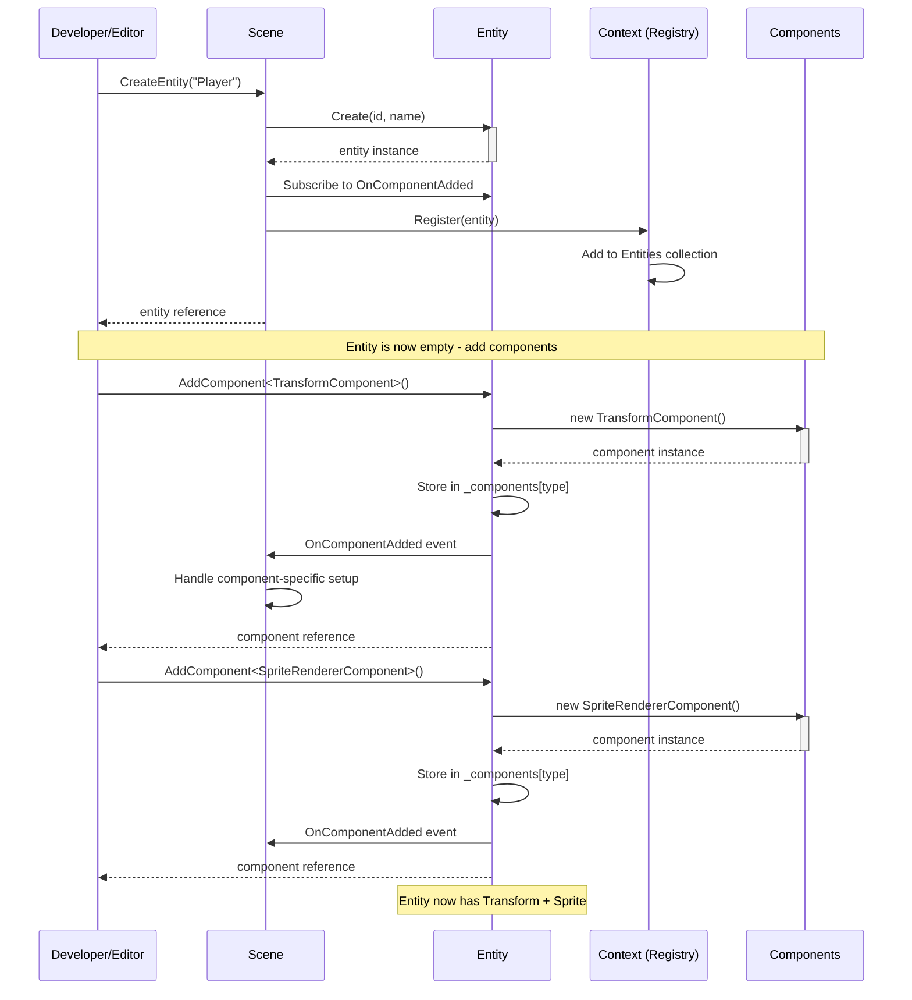
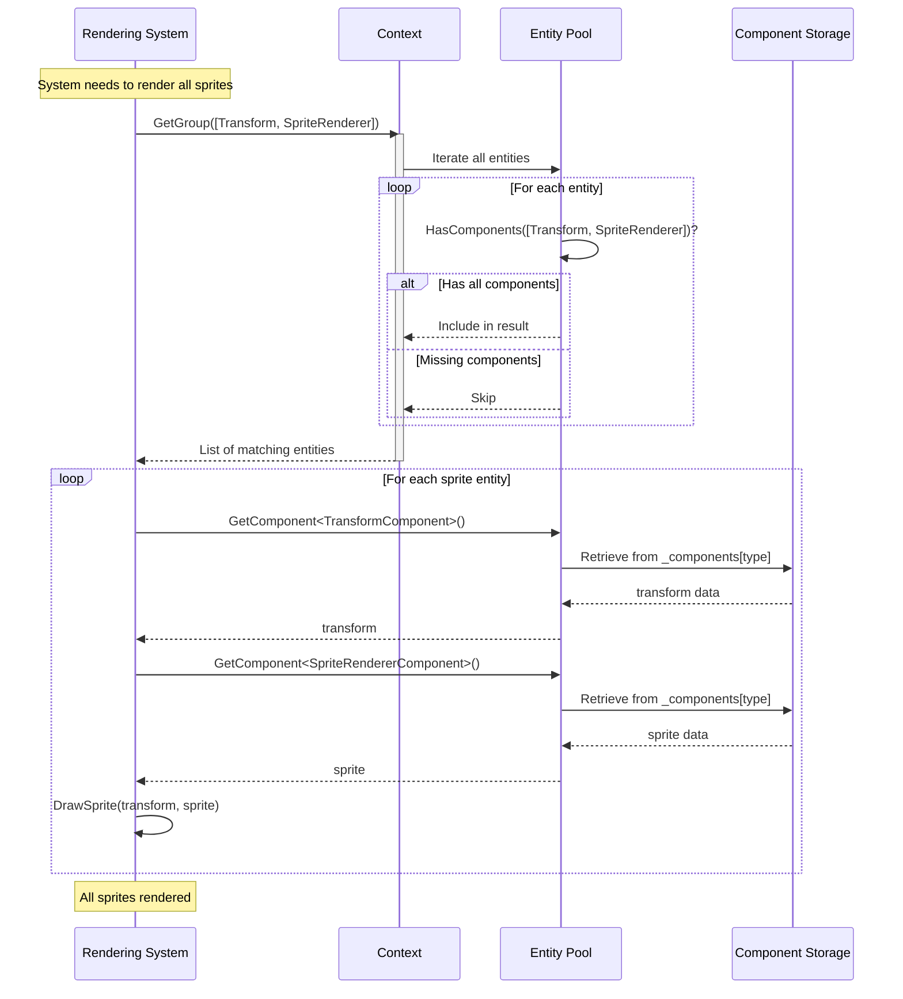
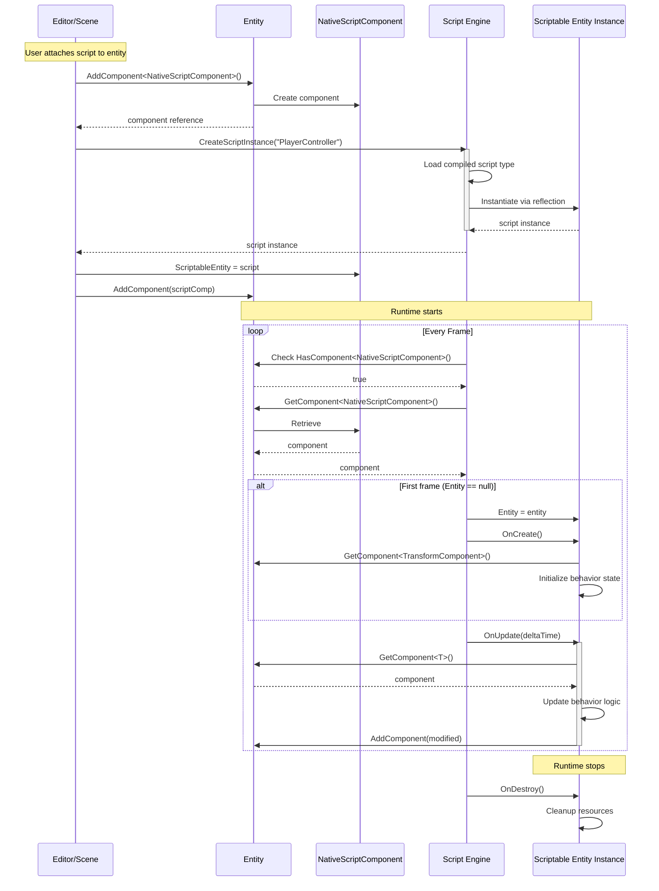
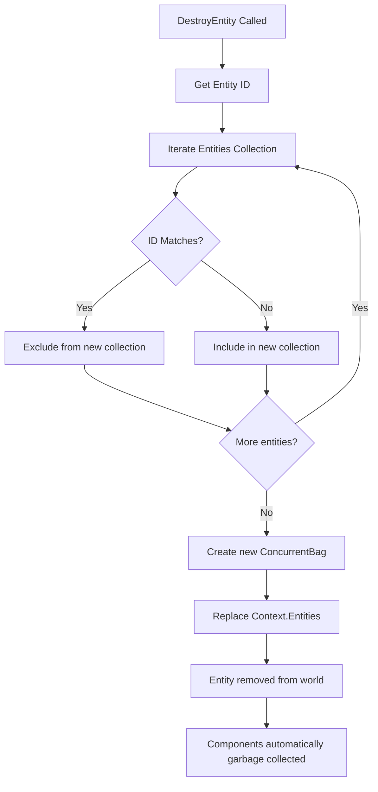
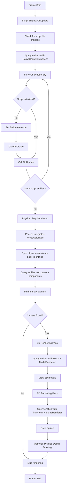

# ECS/GameObject Architecture

## Overview

The Entity Component System (ECS) is the foundational architectural pattern that powers how game objects are structured, composed, and managed in the engine. Rather than using traditional object-oriented inheritance hierarchies, this engine employs a composition-based approach where game objects (entities) are built by combining modular components.

### Purpose

The ECS architecture solves several critical problems in game development:

- **Flexible Composition**: Create varied game objects by mixing and matching components without inheritance complexity
- **Data-Oriented Processing**: Efficiently iterate over entities with specific component combinations
- **Decoupled Logic**: Separate data (components) from behavior (systems and scripts)
- **Dynamic Modification**: Add or remove capabilities from entities at runtime
- **Performance Optimization**: Enable cache-friendly data access patterns for rendering and physics

### Scope

This module handles:

- Entity lifecycle management (creation, destruction, duplication)
- Component storage and retrieval on entities
- Entity querying by component composition
- Global entity registry and context management
- Script behavior attachment and execution
- Component-based data isolation

### Key Concepts

**Entity**: A lightweight container identified by an ID and name. Entities are pure data structures with no inherent behavior - they simply hold components.

**Component**: A data structure implementing the `IComponent` interface. Components represent specific aspects of an entity (position, appearance, physics, etc.) but contain no logic.

**Context**: A singleton registry that maintains all active entities and provides query capabilities to find entities by their component composition.

**Scriptable Entity**: The behavior layer - custom scripts that inherit from `ScriptableEntity` and receive lifecycle callbacks to implement game logic.

**View/Group Pattern**: Efficient querying mechanism to retrieve entities that possess specific component combinations, enabling system-level processing.

## Core Concepts

### Entity as a Container

Think of an entity as an empty vessel or a container that you fill with capabilities. The entity itself has:

- **Identity**: A unique ID and a human-readable name
- **Component Storage**: An internal dictionary mapping component types to instances
- **Events**: Notification hooks when components are added
- **Query Interface**: Methods to check, add, remove, and retrieve components

An entity without components is valid but does nothing - it's the components that give entities meaning and functionality.

### Component as Pure Data

Components are simple data holders implementing the `IComponent` marker interface. They describe "what something is" rather than "what something does":

- **Transform Component**: Position, rotation, scale in 3D space
- **Sprite Renderer Component**: Visual appearance data (texture, color, tiling)
- **Rigid Body Component**: Physics simulation properties (body type, velocity)
- **Camera Component**: View projection settings (FOV, near/far planes)
- **Script Component**: Reference to behavioral logic attached to the entity

The engine provides built-in components for common game object aspects, and you can create custom components by implementing `IComponent`.

### Context as the World Registry

The Context singleton acts as the "world database" of entities:

- Maintains a thread-safe collection of all living entities
- Provides query methods to find entities with specific component patterns
- Enables systems to efficiently iterate over relevant entities
- Serves as the single source of truth for entity existence

When you create an entity in a scene, it's automatically registered with the Context, making it discoverable by all systems.

### Scriptable Entity as Behavior

While components store data, scripts provide behavior. The `ScriptableEntity` base class:

- Connects to an entity instance
- Receives lifecycle callbacks (OnCreate, OnUpdate, OnDestroy)
- Provides convenience methods to access and manipulate components
- Handles input events (keyboard, mouse) and physics events (collisions, triggers)
- Compiles dynamically at runtime for hot-reload support

Scripts are attached to entities via the `NativeScriptComponent`, creating a bridge between the pure data world (ECS) and the behavioral world (scripts).

### Query System: Views and Groups

The engine provides two patterns for querying entities:

**Group Query** (`GetGroup`): Returns all entities that possess a specific set of component types. Use this when you need to iterate over entities for batch processing (e.g., rendering all sprites, updating all physics bodies).

**View Query** (`View<T>`): Returns entity-component pairs for a specific component type, providing direct access to both the entity and the component. Use this when you need to process entities with a particular component and access its data.

These queries are performed on-demand by iterating the entity collection, making them flexible but requiring efficient component checking.

## Architecture Flow

### Entity Creation Flow



**Key Steps:**

1. **Instantiation**: Scene creates an entity with a unique ID and name
2. **Registration**: Entity is added to the global Context registry
3. **Event Wiring**: Scene subscribes to component addition events for reactive setup
4. **Component Addition**: Components are created and stored in the entity's internal dictionary
5. **Notification**: OnComponentAdded events fire, allowing scene-level initialization

### Component Access and Querying



**Query Pattern:**

1. **Request**: System asks Context for entities with specific component types
2. **Iteration**: Context checks each entity against the component requirement
3. **Filtering**: Only entities possessing all required components are returned
4. **Processing**: System retrieves components and performs operations (render, physics update, etc.)

### Script Lifecycle Integration



**Lifecycle Stages:**

1. **Attachment**: Script component is added to entity with a reference to the script instance
2. **Compilation**: Script engine loads and compiles the script class dynamically
3. **Instantiation**: Script instance is created via reflection and stored in the component
4. **Initialization**: On first update, the script's `Entity` reference is set and `OnCreate()` is called
5. **Update Loop**: Every frame, `OnUpdate()` is called, allowing the script to read/modify components
6. **Destruction**: When runtime stops or entity is destroyed, `OnDestroy()` is called for cleanup

### Entity Destruction Flow



**Destruction Process:**

1. **Identification**: Entity to destroy is identified by ID
2. **Collection Rebuild**: A new entity collection is built excluding the target entity
3. **Context Update**: The global entity registry is replaced with the filtered collection
4. **Implicit Cleanup**: Components are automatically garbage collected as the entity reference is lost
5. **Script Cleanup**: If the entity had scripts, `OnDestroy()` is called during runtime stop

Note: Currently, entity destruction rebuilds the entire collection - this is simple but not optimal for large entity counts.

## Lifecycle & Timing

### Initialization Phase

**When**: Scene load or entity creation during edit time

1. **Scene Construction**: Scene object is created with a path
2. **Context Reset**: Entity collection is cleared to start fresh
3. **Entity Creation**: Entities are instantiated with IDs and names
4. **Component Addition**: Components are added to entities, building their capabilities
5. **Registration**: Entities are registered with the Context singleton
6. **Event Setup**: Component addition handlers are wired up

**Editor vs Runtime**: During editor time, entities exist in a "design" state - their data is visible and editable, but scripts and physics are not active.

### Runtime Start Phase

**When**: Play button is pressed in editor or game begins

1. **Physics World Creation**: A Box2D physics world is instantiated
2. **Physics Body Setup**: All entities with `RigidBody2DComponent` get physics bodies created
   - Transform position/rotation initializes body pose
   - Colliders define body shape
   - Physics properties (mass, friction) are applied
3. **Script Compilation**: Script engine ensures all scripts are compiled
4. **Script Reference Check**: Entities with `NativeScriptComponent` are cataloged (but not yet initialized)

**Key Point**: Scripts are not immediately initialized - they wait until the first update frame.

### Update Phase

**When**: Every frame during runtime



**Update Order**:

1. **Script Hot Reload Check**: Script engine detects file changes and recompiles if needed
2. **Script Updates**: All entity scripts execute their `OnUpdate()` logic
3. **Physics Simulation**: Box2D steps forward in time (fixed timestep: 1/60s)
4. **Transform Synchronization**: Physics body positions are copied back to entity transform components
5. **Camera Selection**: Scene finds the entity with a primary camera component
6. **3D Rendering**: Models with mesh and renderer components are drawn
7. **2D Rendering**: Sprites with transform and sprite renderer components are drawn
8. **Debug Visualization**: Optionally, physics colliders are outlined

**Important**: Component queries happen every frame - there's no persistent "system" that caches entity lists. This keeps the architecture simple but requires efficient HasComponent checks.

### Runtime Stop Phase

**When**: Stop button is pressed in editor or game ends

1. **Script Destruction**: All `ScriptableEntity` instances receive `OnDestroy()` callback
2. **Physics Cleanup**:
   - Contact listener is removed from physics world
   - User data references are cleared from physics bodies
   - Runtime body references are nulled out in components
3. **Physics World Disposal**: The Box2D world is destroyed
4. **Entity Persistence**: Entities remain in the Context (they're not destroyed, only their runtime state is cleared)

**Editor Behavior**: After stopping, entities return to their edit-time state with their designed component data intact.

### Shutdown Phase

**When**: Scene is unloaded or application closes

1. **Context Clear**: The global entity collection is cleared
2. **Garbage Collection**: Entity and component memory is reclaimed automatically
3. **Script Assembly Unload**: Dynamic script assembly remains loaded until process exit (limitation of .NET Assembly loading)

## Entity Composition Patterns

### Common Entity Archetypes

**Empty Entity**: Just an ID and name - a placeholder for future components or a logical grouping node.

**Visual Entity**: `Transform` + `SpriteRenderer` or `SubTextureRenderer` - something visible in the world.

**3D Model Entity**: `Transform` + `Mesh` + `ModelRenderer` - a 3D object with geometry.

**Camera Entity**: `Transform` + `Camera` - defines the player's viewpoint.

**Physics Entity**: `Transform` + `RigidBody2D` + `BoxCollider2D` - an object that participates in physics simulation.

**Interactive Entity**: Any entity + `NativeScriptComponent` - an object with custom behavior.

**Complete Game Object**: `Transform` + `SpriteRenderer` + `RigidBody2D` + `BoxCollider2D` + `NativeScriptComponent` - a fully-featured interactive physics object (e.g., player character).

### Component Dependencies

Certain components implicitly depend on others:

- **Renderers require Transform**: Sprite/model renderers need position/rotation/scale to be drawn
- **Physics requires Transform**: Physics bodies need initial pose from transform
- **Colliders require RigidBody**: Box2D colliders attach to physics bodies, not entities directly
- **Scripts often need Transform**: Most behaviors manipulate or read entity position

The engine doesn't enforce these dependencies automatically - it's the developer's responsibility to add required components. Missing dependencies typically result in null references or no effect (e.g., a sprite without a transform won't be drawn because the query fails).

## Query Performance Characteristics

### How Queries Work

Queries iterate the entire entity collection and check component presence:

```
GetGroup([TransformComponent, SpriteRendererComponent]):
  results = []
  for each entity in Context.Entities:
    if entity.HasComponent<TransformComponent>() AND
       entity.HasComponent<SpriteRendererComponent>():
      results.add(entity)
  return results
```

Component checking is fast (dictionary lookup by type), but iterating all entities every frame has implications:

- **Linear Scan**: O(n) where n = total entity count
- **No Caching**: Query results are not stored between frames
- **Multi-Pass**: Different systems query independently, potentially checking the same entities multiple times

### When This is Efficient

- **Small to Medium Entity Counts**: Up to a few thousand entities, modern CPUs handle this easily
- **Simple Queries**: Checking component presence via dictionary lookup is very fast
- **Heterogeneous Worlds**: When entity types are varied and queries select small subsets

### Optimization Opportunities (Not Implemented)

For very large entity counts (tens of thousands), potential optimizations include:

- **Archetype Systems**: Group entities by component signature to avoid per-entity checks
- **Cached Queries**: Store query results and invalidate on entity/component changes
- **Sparse Sets**: Use data structures optimized for component iteration
- **Parallel Iteration**: Multi-thread entity processing for independent systems

The current architecture prioritizes simplicity and flexibility over maximum performance - it's "fast enough" for most 2D games and prototypes.

## Script System Integration

### How Scripts Bridge ECS and Behavior

Scripts are the primary way to add custom logic to entities. The architecture maintains a clear separation:

**Data Layer (ECS)**: Entities hold components with pure data (position, velocity, health).

**Behavior Layer (Scripts)**: Scripts read component data, apply game logic, and write updated data back to components.

This separation enables:

- **Inspector Editability**: Component data is serializable and editable in the editor
- **Behavior Reuse**: The same script class can be attached to multiple entities
- **Hot Reload**: Scripts can be recompiled without restarting the application
- **Debugging**: Data and behavior are separate concerns, easier to isolate issues

### Script Compilation and Loading

The script engine uses Roslyn (C# compiler as a service) to compile scripts at runtime:

1. **Source Scanning**: On startup and periodically, the engine scans the scripts directory for `.cs` files
2. **Change Detection**: File modification times are tracked to detect edits
3. **Compilation**: All scripts are compiled together into a single dynamic assembly
4. **Assembly Loading**: The assembly is loaded with debug symbols for breakpoint support
5. **Type Registration**: Script types inheriting from `ScriptableEntity` are cataloged by name
6. **Instantiation**: When a script component is created, the script type is instantiated via reflection

**Hot Reload**: When a script file changes, the engine recompiles and reloads the assembly. Existing script instances are replaced with new instances, and `OnCreate()` is called again.

### Script Execution Model

Scripts execute in the main game loop:

- **Single-Threaded**: All scripts run on the main thread sequentially
- **Frame-Based**: `OnUpdate(TimeSpan)` is called every frame with the delta time
- **Event-Driven**: Input and physics events are forwarded to scripts via callbacks
- **Stateful**: Scripts can maintain instance variables that persist across frames

Scripts are not coroutines or async tasks - they run to completion each frame. Long-running operations would block the game loop (don't do this!).

### Script Access Patterns

Scripts interact with the ECS through convenience methods:

**Component Access**:
- `GetComponent<T>()`: Retrieve a component from the script's entity
- `HasComponent<T>()`: Check if the script's entity has a component
- `AddComponent<T>()`: Add a new component to the script's entity
- `RemoveComponent<T>()`: Remove a component from the script's entity

**Entity Management**:
- `FindEntity(name)`: Search the scene for an entity by name
- `CreateEntity(name)`: Spawn a new entity in the scene
- `DestroyEntity(entity)`: Remove an entity from the scene

**Transform Shortcuts**:
- `GetPosition()`, `SetPosition(Vector3)`: Direct transform manipulation
- `GetRotation()`, `SetRotation(Vector3)`: Rotation access
- `GetForward()`, `GetRight()`, `GetUp()`: Directional vectors
- `LookAt(Vector3)`: Orient entity toward a target

These methods encapsulate the `Entity.GetComponent` pattern, making script code more readable.

## Threading and Concurrency

### Thread Safety Considerations

The ECS architecture uses `ConcurrentBag<Entity>` for the entity collection, which is thread-safe for adding entities. However:

**Safe Operations**:
- Adding entities to the Context (thread-safe)
- Reading entity ID and name (immutable after creation)

**Unsafe Operations**:
- Adding/removing components (modifies entity's internal dictionary)
- Destroying entities (rebuilds the entire collection)
- Querying entities (iterates collection that may be modified)

**Current Model**: The engine is effectively single-threaded:
- All entity creation happens on the main thread (in scenes or scripts)
- All component modification happens on the main thread (in scripts or systems)
- All queries happen on the main thread (in update and render loops)

The use of `ConcurrentBag` is somewhat conservative - it provides safety if future features spawn entities from worker threads, but currently, it's not necessary.

### Implications for Developers

When writing scripts or systems:

- **No Locking Needed**: Single-threaded model means no mutex/lock concerns
- **No Race Conditions**: Component data is always consistent within a frame
- **Predictable Order**: Scripts and systems execute in deterministic order

If you add multi-threading in the future (e.g., parallel physics or rendering), you'll need to carefully manage entity/component access or introduce a command buffer pattern to defer modifications.

## Memory and Performance Characteristics

### Memory Layout

**Entity Storage**:
- Entities are reference types (classes) stored in a `ConcurrentBag`
- Each entity contains a dictionary of component type to component instance
- Dictionary overhead: ~72 bytes + (entries * 32 bytes) on 64-bit systems

**Component Storage**:
- Components can be classes or structs (classes by convention)
- Stored as object references in entity dictionaries
- No contiguous memory layout (pointer-chasing required)

**Total Memory**: Entity count * (base entity size + component count * component size)

Example: 1,000 entities with 4 components each ~= 1,000 * (72 + 4*32) = ~200 KB (plus component data)

### Performance Characteristics

**Query Performance**: O(n) linear scan of all entities, typically <1ms for 10,000 entities

**Component Access**: O(1) dictionary lookup by type, ~5-10ns per access

**Entity Creation**: O(1) constant time, ~100ns per entity

**Entity Destruction**: O(n) rebuild entire collection, ~1μs per 1,000 entities

**Script Execution**: Depends on script complexity, typically <100μs per script per frame

**Overall**: The architecture is CPU-bound by script logic and rendering, not by ECS overhead. Entity/component operations are negligible compared to physics, rendering, and game logic.

### Scalability

The architecture scales well for typical 2D games:

- **1-10K entities**: Excellent performance, no concerns
- **10K-100K entities**: Query overhead becomes measurable but manageable
- **100K+ entities**: Consider optimizations (archetypes, caching, spatial partitioning)

For 3D games with complex scenes, the rendering bottleneck typically dominates before ECS overhead matters.

## Integration with Other Systems

### Scene System

The Scene owns entity creation and destruction:

- `Scene.CreateEntity(name)`: Creates entity, registers with Context, returns reference
- `Scene.DestroyEntity(entity)`: Removes entity from Context
- `Scene.DuplicateEntity(entity)`: Clones entity with all components

Scene is the factory for entities - direct `new Entity()` is not used. This ensures proper registration and event wiring.

### Rendering System

Renderers query entities with visual components:

**2D Rendering**:
- Query: `GetGroup([TransformComponent, SpriteRendererComponent])`
- Process: For each entity, extract transform matrix and sprite data, submit draw call

**3D Rendering**:
- Query: `GetGroup([TransformComponent, MeshComponent, ModelRendererComponent])`
- Process: For each entity, extract transform matrix and model data, submit draw call

Cameras are also entities - the scene finds the entity with a primary `CameraComponent` to use as the viewpoint.

### Physics System

Physics bodies are synchronized with entity components:

**Initialization**: On runtime start, entities with `RigidBody2DComponent` get Box2D bodies created using their transform position/rotation.

**Simulation**: Every frame, Box2D steps forward, updating body positions based on forces and collisions.

**Synchronization**: After physics step, body positions are copied back to entity `TransformComponent`.

**User Data**: Physics bodies store a reference to their entity, enabling collision callbacks to identify what hit what.

The physics system is tightly coupled to ECS - it requires specific component combinations (`RigidBody2D` + `BoxCollider2D` + `Transform`) to function.

### Editor System

The editor displays and manipulates entities/components:

**Hierarchy Panel**: Lists all entities in the Context with their names, allows selection and deletion.

**Inspector Panel**: Shows all components on the selected entity, provides UI to edit component fields.

**Component Adding**: Dropdown to add components to entities by type.

**Entity Duplication**: Editor calls `Scene.DuplicateEntity` to clone entities with components.

The editor uses reflection to discover component types and generate UI automatically - no hardcoded forms for each component type.

### Serialization System

Scene serialization stores entity/component data to JSON:

**Save Flow**:
1. Iterate all entities in Context
2. For each entity, serialize ID, name, and component list
3. For each component, serialize type name and data fields
4. Write JSON to file

**Load Flow**:
1. Parse JSON file
2. For each entity JSON object, create entity with ID and name
3. For each component JSON object, instantiate component by type name and deserialize fields
4. Add component to entity

The serialization system is component-type-aware - it knows how to serialize built-in components (Transform, SpriteRenderer, etc.) and can be extended for custom components.

## Design Decisions and Tradeoffs

### Why Dictionary-Based Component Storage?

**Pros**:
- Simple implementation - leverages built-in .NET collections
- Fast component lookup by type - O(1) dictionary access
- Dynamic component addition/removal - no fixed schema
- Easy to understand and debug

**Cons**:
- Not cache-friendly - components scattered in memory
- Dictionary overhead - extra memory per entity
- No compile-time safety - component presence checked at runtime
- No structural sharing - each entity has its own dictionary

**Tradeoff**: Favors simplicity and flexibility over maximum performance. Good enough for most games, scales to thousands of entities.

### Why Global Context Singleton?

**Pros**:
- Central registry - any system can query entities
- No dependency injection needed - simple global access
- Thread-safe collection - safe for concurrent entity creation
- Easy to serialize - one place to find all entities

**Cons**:
- Global state - harder to test in isolation
- No multi-world support - all entities in one Context
- Tight coupling - systems depend on Context directly
- No scoped entity collections - can't have multiple independent scenes

**Tradeoff**: Simplicity and convenience over architectural purity. For a single-scene game engine, a global registry is pragmatic.

### Why No Component Pooling?

**Pros** (of current approach):
- Simpler code - no pool management logic
- Garbage collector handles memory - automatic cleanup
- Flexible component sizes - no fixed pool allocations

**Cons** (of current approach):
- GC pressure - frequent component creation/destruction causes allocations
- No deterministic memory - GC pauses can cause frame spikes
- Slower creation - allocation is slower than pool retrieval

**Tradeoff**: Relies on modern GC efficiency. For games that don't create/destroy entities every frame, allocation cost is negligible. If profiling shows GC issues, pooling can be added later.

### Why Rebuild Collection on Destroy?

**Pros**:
- Simple implementation - no tombstoning or compaction logic
- No stale references - destroyed entities immediately disappear
- Thread-safe - `ConcurrentBag` creation is safe

**Cons**:
- O(n) destruction cost - slow for large entity counts
- Temporary allocation spike - new bag created each time
- No batch destruction - must destroy entities one by one

**Tradeoff**: Prioritizes correctness and simplicity. Entity destruction is typically infrequent (not every frame), so the cost is acceptable. For games with many short-lived entities, a different approach (mark-and-sweep, free list) would be better.

### Why Scripts as Components?

**Pros**:
- Unified architecture - scripts are just another component type
- Inspector integration - scripts appear in entity component list
- Serialization support - script attachment persists to disk
- Hot reload - script changes don't require entity recreation

**Cons**:
- Indirection overhead - script instance stored in component, which is stored in entity
- No script-specific optimizations - scripts treated like any other component
- Lifecycle complexity - script initialization is deferred until first update

**Tradeoff**: Consistency with component model over specialized script handling. Makes the architecture more uniform and easier to reason about.

---

## Summary

The ECS/GameObject architecture provides a flexible, composition-based system for building game objects:

- **Entities** are lightweight containers with identity
- **Components** store pure data describing entity aspects
- **Context** maintains the global entity registry and enables queries
- **Scripts** add behavior by reading/writing component data
- **Systems** process entities in bulk by querying for component patterns

The architecture prioritizes:
- **Simplicity**: Easy to understand and extend
- **Flexibility**: Dynamic entity composition without inheritance
- **Productivity**: Rapid prototyping with hot-reload scripts
- **Sufficiency**: Good performance for typical 2D/indie 3D games

It's not the most performant ECS implementation (data-oriented archetypes would be faster), but it strikes a practical balance for a learning/prototyping game engine. The codebase is clean, the patterns are clear, and the performance is adequate for the target use cases.
