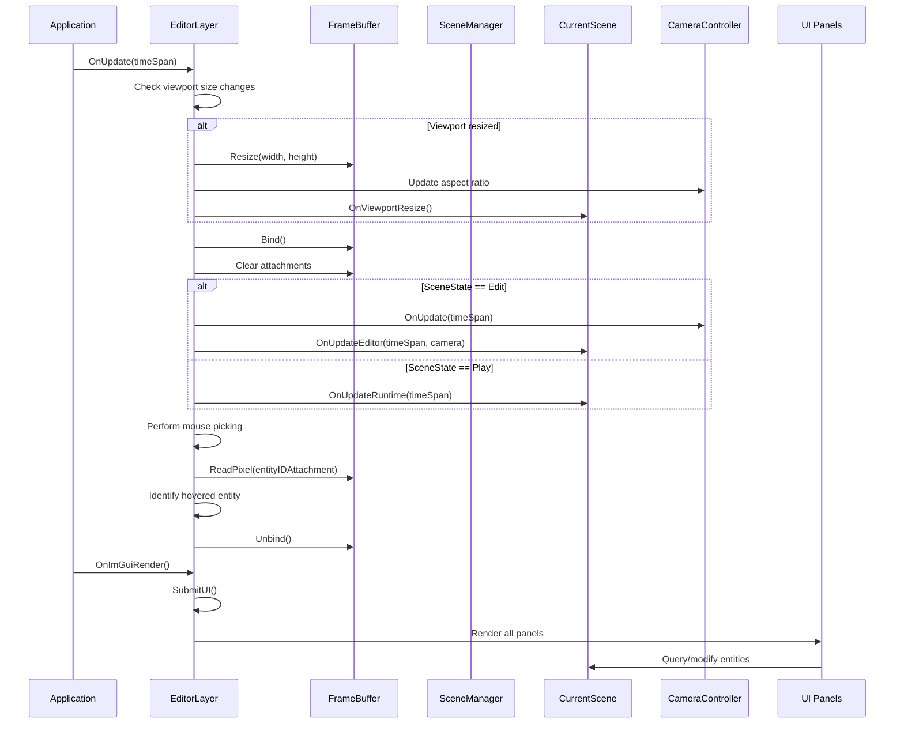
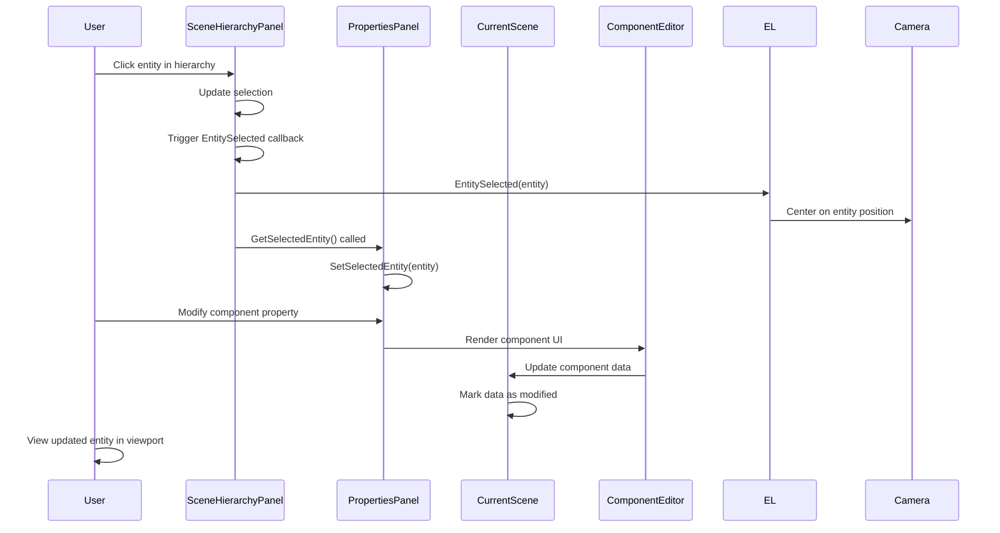
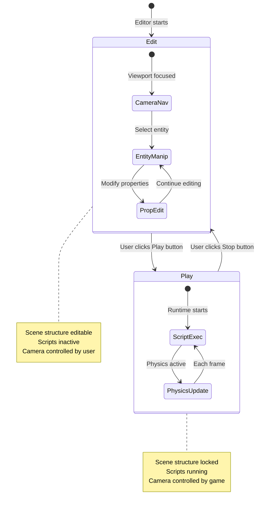
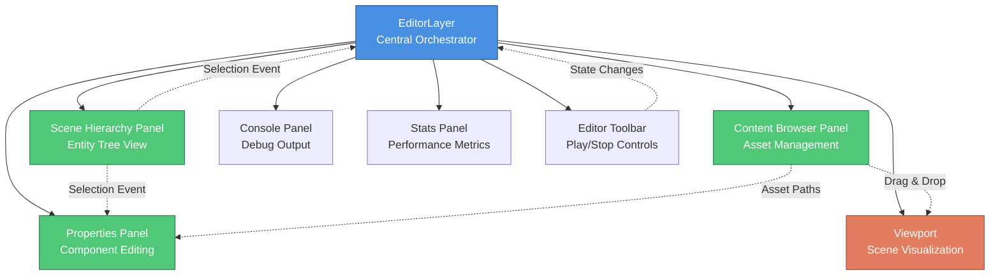
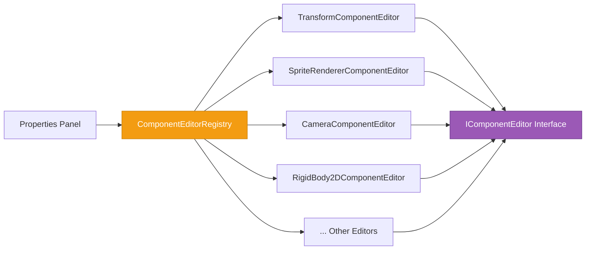
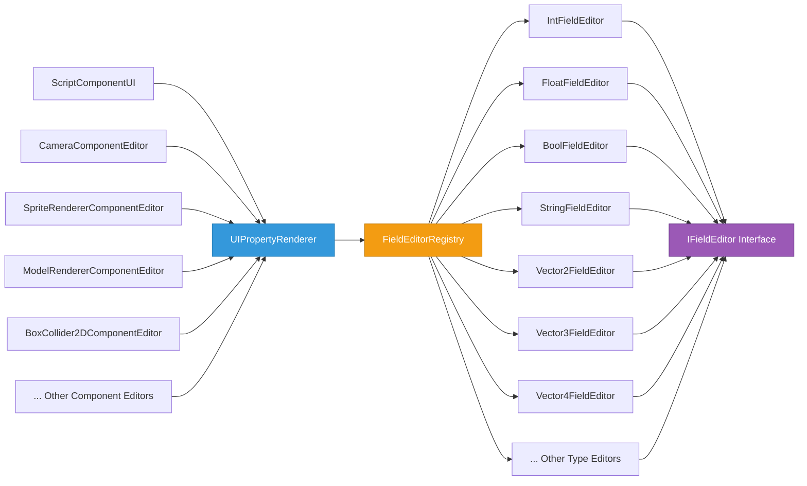
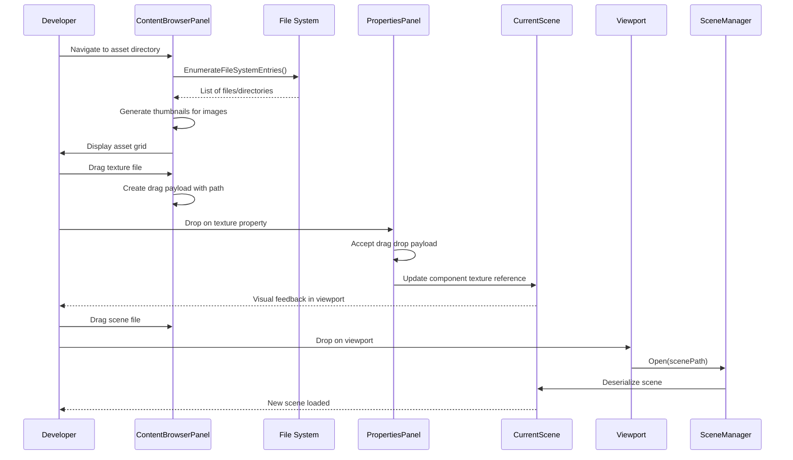

# Editor Module

## Overview

### Purpose
The Editor module provides a comprehensive development environment for creating and manipulating game scenes within the engine. It bridges the gap between the raw engine capabilities and the developer's creative workflow, offering visual tools for scene composition, entity manipulation, asset management, and runtime testing.

### Scope
The Editor is responsible for:
- **Visual scene composition** - Providing a graphical interface for building game worlds
- **Entity management** - Creating, selecting, modifying, and deleting game entities
- **Asset workflow** - Browsing, organizing, and integrating game assets (textures, models, scenes, prefabs)
- **Property editing** - Exposing and modifying component data through specialized UI editors
- **Runtime simulation** - Toggling between edit mode and play mode to test game behavior
- **Project organization** - Managing project structure, directories, and workspace settings
- **Developer feedback** - Displaying performance metrics, console output, and debugging information

### Key Concepts

**Layer Architecture**: The editor follows a layer-based architecture where `EditorLayer` acts as the primary orchestrator, managing the viewport, frame buffer, camera, and coordinating between various UI panels.

**Panel System**: The editor is composed of independent panels (Scene Hierarchy, Properties, Content Browser, Console, etc.) that communicate through a centralized selection model and event callbacks.

**Dual-Mode Operation**: The editor operates in two distinct states:
- **Edit Mode**: Developer can manipulate the scene structure, modify entities, and navigate freely
- **Play Mode**: The scene runs with active scripts and physics, simulating the actual game experience

**Frame Buffer Viewport**: Scene rendering occurs to an off-screen frame buffer which is then displayed as a texture within the ImGui viewport panel, allowing the editor UI to surround the game view.

**Component-Based Editing**: Each component type has a dedicated editor that knows how to render and modify that component's properties, registered through a centralized registry system.

## Architecture Flow

### Initialization Sequence

1. **Application Bootstrap** (Program.cs)
   - Dependency injection container is configured with all services
   - Window system and ImGui layer are initialized
   - Script engine is prepared with debug support in debug builds
   - Editor instance is created and the EditorLayer is pushed onto the layer stack

2. **Layer Attachment** (EditorLayer.OnAttach)
   - 2D camera controller is created for viewport navigation
   - Frame buffer is allocated with color, entity ID, and depth attachments
   - 3D graphics system is initialized
   - Empty scene is created as the starting point
   - All UI panels are instantiated and configured
   - Panel interconnections are established (e.g., hierarchy panel's entity selection callback)
   - Script directory is configured based on project settings

3. **Panel Setup**
   - Each panel initializes its own state and resources
   - Icon textures are loaded for visual feedback
   - Component editor registry is populated with all available component editors

### Frame Update Loop



### User Interaction Flow



### Scene State Transitions



## Panel Architecture

The editor is composed of several specialized panels that work together:



### Panel Responsibilities

**Scene Hierarchy Panel**
- Displays all entities in the current scene as a tree structure
- Handles entity selection and deselection
- Provides context menu for entity operations (delete, duplicate)
- Supports drag-and-drop for prefab instantiation

**Properties Panel**
- Shows all components attached to the currently selected entity
- Renders entity name editor
- Displays component-specific editors for each component type
- Provides "Add Component" selector for attaching new components
- Offers "Save as Prefab" functionality for reusable entity templates

**Content Browser Panel**
- Navigates the project's asset directory structure
- Displays thumbnails for images and icons for other file types
- Supports drag-and-drop of assets into the viewport or property fields
- Provides visual feedback for different asset types (textures, prefabs, models, scenes)
- Caches image thumbnails for performance

**Console Panel**
- Captures and displays debug output from the engine and scripts
- Redirects standard output to provide centralized logging
- Helps developers track runtime behavior and debug issues

**Stats Panel**
- Shows performance metrics (frame time, FPS)
- Displays renderer statistics (draw calls, vertices, triangles)
- Shows hovered entity information
- Provides camera position and rotation data

**Editor Toolbar**
- Central play/stop button for toggling between edit and play mode
- Visual feedback showing current scene state
- Positioned centrally for easy access

**Viewport**
- Renders the scene to a frame buffer texture
- Supports drag-and-drop for scene files from content browser
- Handles mouse picking for entity selection
- Provides visual representation of the game world during development

## Component Editor System

The editor uses a registry-based system for rendering component-specific UI:



Each component editor:
- Knows how to render UI controls for its specific component type
- Handles property modifications and validation
- Provides specialized controls (color pickers, texture drop targets, vector editors)
- Can show/hide fields based on component state

### Field Editor System

The editor uses a centralized field editor registry for rendering typed properties across all component editors:



**Architecture**:
- `IFieldEditor` interface defines `Draw(label, value, out newValue)` method
- `FieldEditorRegistry` maintains a dictionary mapping `Type` to `IFieldEditor`
- Each concrete editor (e.g., `IntFieldEditor`) handles one specific type
- `UIPropertyRenderer.DrawPropertyField()` provides a unified interface for all component editors
- Strategy pattern allows extensible type support without modifying existing code

**Usage in Component Editors**:
```csharp
// Old pattern (3 lines per field)
float density = component.Density;
UIPropertyRenderer.DrawPropertyRow("Density", () => ImGui.DragFloat("##Density", ref density));
if (component.Density != density)
    component.Density = density;

// New pattern using field editors (1 line per field)
UIPropertyRenderer.DrawPropertyField("Density", component.Density,
    newValue => component.Density = (float)newValue);
```

**Component Editors Using Field Editors** (19 total fields):
- `CameraComponentEditor` - Primary, FOV, Near, Far, Size, Fixed Aspect Ratio (7 fields)
- `SpriteRendererComponentEditor` - Color, Tiling Factor (2 fields)
- `ModelRendererComponentEditor` - Color, Cast Shadows, Receive Shadows (3 fields)
- `BoxCollider2DComponentEditor` - Offset, Size, Density, Friction, Restitution (5 fields)
- `SubTextureRendererComponentEditor` - Sub texture coords (1 field)
- `RigidBody2DComponentEditor` - Fixed Rotation (1 field)
- `ScriptComponentUI` - All exposed script fields (dynamic)

**ScriptComponentUI Method Breakdown**:
- `DrawScriptComponent()` - Entry point, delegates to focused helpers (14 lines)
- `DrawAttachedScript()` - Coordinates script rendering (7 lines)
- `DrawScriptHeader()` - Displays script name and context menu (14 lines)
- `DrawScriptFields()` - Iterates through exposed fields (14 lines)
- `DrawScriptField()` - Renders individual field with proper layout (12 lines)
- `TryDrawFieldEditor()` - Delegates to appropriate type editor (12 lines)
- `DrawNoScriptMessage()` - Shows error when no script attached (4 lines)
- `DrawScriptActions()` - Renders Add/Create script buttons (14 lines)

**Benefits**:
- Single Responsibility: Each method has one clear purpose
- Open/Closed Principle: Add new types without modifying existing code
- Testability: Each editor can be unit tested independently
- Maintainability: Small, focused methods (average 12 lines)
- Code Reduction: ~38 lines of boilerplate eliminated across component editors
- Extensibility: Register new field types by implementing `IFieldEditor`

**Adding Custom Field Types**:
```csharp
// 1. Create new field editor
public class QuaternionFieldEditor : IFieldEditor
{
    public bool Draw(string label, object value, out object newValue)
    {
        var quat = (Quaternion)value;
        // Render ImGui controls for quaternion
        // ...
        newValue = quat;
        return changed;
    }
}

// 2. Register in FieldEditorRegistry
private static readonly Dictionary<Type, IFieldEditor> _editors = new()
{
    // ... existing editors
    { typeof(Quaternion), new QuaternionFieldEditor() }
};
```

## Asset Management

The editor provides a complete asset workflow:



## Lifecycle & Timing

### Initialization Phase

**When**: Application startup, before first frame
**Steps**:
1. Dependency container configuration
2. Window and graphics context creation
3. Editor layer attachment
4. Frame buffer allocation
5. Panel instantiation
6. Default scene creation
7. Script engine initialization

### Runtime Phase

**Each Frame**:
1. **Early Update** (EditorLayer.OnUpdate)
   - Performance metrics update
   - Viewport resize handling
   - Frame buffer binding
   - Scene update (edit mode: editor camera / play mode: runtime scripts)
   - Mouse picking for entity hovering
   - Frame buffer unbinding

2. **ImGui Render** (EditorLayer.OnImGuiRender)
   - Dockspace setup
   - Menu bar rendering
   - All panel rendering
   - Viewport texture display
   - Toolbar rendering
   - Project UI popups

### Event Handling

**Input Events**: Processed through dedicated handlers
- **Edit Mode**: Camera controller receives events for viewport navigation
- **Play Mode**: Script engine receives events for game logic
- **Keyboard Shortcuts**: Dedicated handler checks for Ctrl+N (new), Ctrl+S (save), Ctrl+D (duplicate), Ctrl+F (focus)

**Window Events**: Forwarded to camera controller for resize and other window-related updates

### Shutdown Phase

**When**: Application exit
**Steps**:
1. Console panel disposal (releases console redirect)
2. Layer detachment
3. Resource cleanup
4. Window destruction

## Project Management

The editor uses a project-based workflow to organize assets:

```mermaid
graph TD
    PM[ProjectManager]

    PM --> Create[Create New Project]
    PM --> Open[Open Existing Project]

    Create --> DirStruct[Create Directory Structure]
    DirStruct --> Assets[/assets]
    DirStruct --> Scenes[/assets/scenes]
    DirStruct --> Textures[/assets/textures]
    DirStruct --> Scripts[/assets/scripts]
    DirStruct --> Prefabs[/assets/prefabs]

    Open --> Validate[Validate Project Directory]
    Validate --> Configure[Configure Asset Paths]
    Configure --> ScriptDir[Set Script Engine Directory]
    Configure --> AssetRoot[Set Assets Manager Root]

    style PM fill:#3498db,stroke:#2073a8,color:#fff
    style Create fill:#2ecc71,stroke:#1f8a4a,color:#fff
    style Open fill:#e74c3c,stroke:#a73428,color:#fff
```

**Project Structure**:
- Projects are directory-based with a standard layout
- `/assets` contains all game resources
- Subdirectories organize assets by type
- Script engine automatically watches the scripts directory
- Content browser roots at the project's assets directory

**Project Operations**:
- **New Project**: Creates directory structure and sets as active project
- **Open Project**: Validates directory, configures paths, updates asset browser
- **Validation**: Checks for required directories, falls back gracefully for legacy projects

## Keyboard Shortcuts

The editor provides productivity shortcuts for common operations:

| Shortcut | Action | Condition |
|----------|--------|-----------|
| **Ctrl+N** | New Scene | Any time |
| **Ctrl+S** | Save Scene | Any time |
| **Ctrl+D** | Duplicate Selected Entity | Edit mode only |
| **Ctrl+F** | Focus Camera on Selected Entity | Edit mode only |

## State Management

The editor maintains several key pieces of state:

**Scene State**:
- Current scene instance (global singleton)
- Scene file path for save/load operations
- Edit/Play mode flag

**Selection State**:
- Currently selected entity (shared across hierarchy and properties panels)
- Hovered entity (from mouse picking)

**Viewport State**:
- Viewport size and bounds
- Viewport focus state (for input capture)
- Frame buffer and render texture

**Camera State**:
- Camera position, rotation, zoom level
- Aspect ratio synchronized with viewport
- Edit mode camera vs. runtime game camera

**Project State**:
- Current project directory
- Asset paths (scenes, scripts, textures, prefabs)
- Script engine configuration

## Developer Mental Model

When working with the editor, developers should understand:

1. **The Editor is a Layer**: EditorLayer is just another layer in the engine's layer stack, receiving update and render callbacks like any game layer. This makes it compositional and modular.

2. **Panels are Independent**: Each panel manages its own state and rendering. They communicate through callbacks and shared context (selected entity, current scene) rather than direct coupling.

3. **Edit vs. Play Mode**: These are fundamentally different execution paths:
   - Edit mode: Editor controls the camera, scene is static, structure is mutable
   - Play mode: Scripts control behavior, scene is live, structure is locked

4. **Frame Buffer Intermediary**: The viewport doesn't directly render to the window. Instead, it renders to a frame buffer texture which is then displayed in ImGui. This allows multiple viewports, post-processing, and UI overlay.

5. **Component Editors are Extensible**: Adding a new component type requires creating a corresponding component editor and registering it. The system automatically handles rendering and property editing.

6. **Selection Drives UI**: The selected entity is the central concept that drives what the Properties panel displays. Changing selection updates the entire editing context.

7. **Asset Paths are Relative**: Assets are referenced by paths relative to the project's assets directory, making projects portable across machines.

8. **Serialization is Transparent**: Scene save/load operations use the serialization system to convert scene graphs to/from disk. The editor handles file paths and user interaction while the serializer handles data conversion.

## Key Design Patterns

**Observer Pattern**: Panels observe selection changes through callbacks (e.g., `EntitySelected` event)

**Strategy Pattern**: Component editors implement a common interface but provide component-specific behavior

**Singleton Pattern**: Current scene is globally accessible (though this is a pragmatic choice for game engines)

**Dependency Injection**: Core services (window, ImGui layer, serializers, project manager) are injected through the DI container

**Frame Buffer Object Pattern**: Render-to-texture approach decouples scene rendering from final display

## Extension Points

The editor is designed to be extended:

- **New Component Types**: Create a component editor implementing `IComponentEditor` and register it
- **New Panels**: Create a panel class with `OnImGuiRender()` and add it to EditorLayer
- **New Asset Types**: Extend ContentBrowserPanel to recognize and handle new file extensions
- **Custom Shortcuts**: Add keyboard handlers in EditorLayer's input event processing
- **New Scene States**: Extend SceneState enum and add handling in update loop (e.g., pause mode)

## Performance Considerations

**Frame Buffer Resizing**: Resizing the viewport triggers frame buffer reallocation, which is expensive. The editor checks if size actually changed before resizing.

**Texture Caching**: Content browser caches image textures to avoid reloading on every frame.

**Selective Rendering**: Panels only render when visible (ImGui handles culling).

**Mouse Picking Optimization**: Entity ID is read from a dedicated frame buffer attachment only when mouse is within viewport bounds.

**Script Compilation**: Scripts are compiled once and reused until modified. Debug builds include symbol generation for debugging.

## Best Practices

When working with the editor:

- **Always work in Edit mode** when modifying scene structure
- **Test in Play mode** to verify runtime behavior
- **Save frequently** using Ctrl+S to avoid losing work
- **Use prefabs** for reusable entity templates
- **Organize assets** in appropriate subdirectories
- **Focus camera** (Ctrl+F) to quickly navigate to selected entities
- **Check console** for runtime errors and debug output
- **Monitor stats** to identify performance issues early
