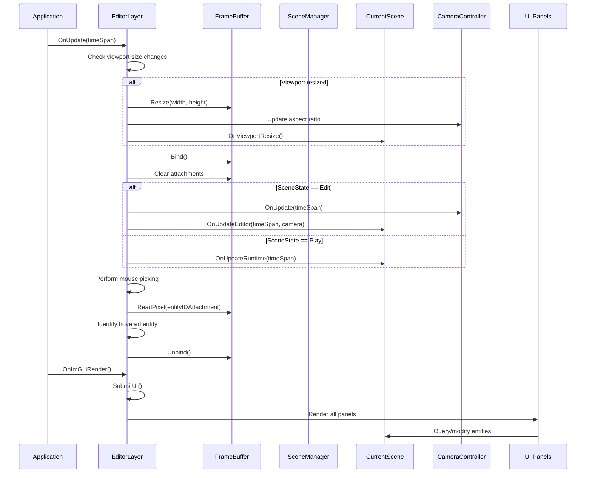
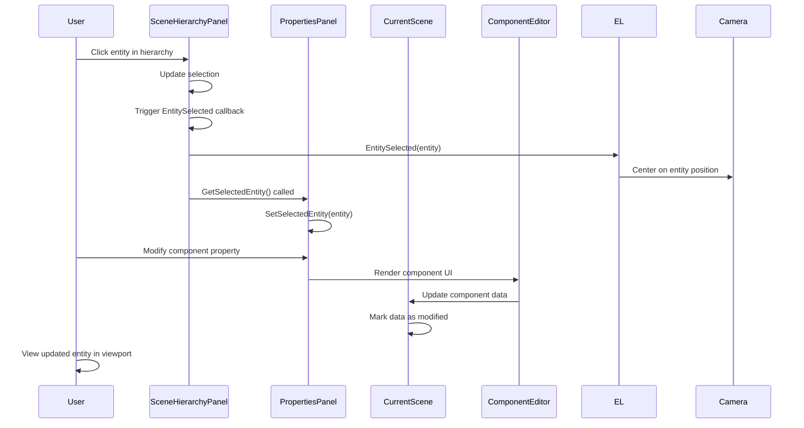
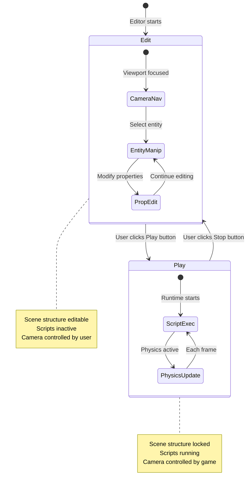
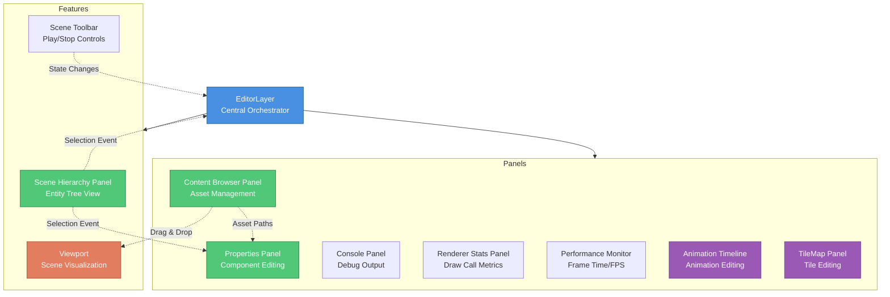
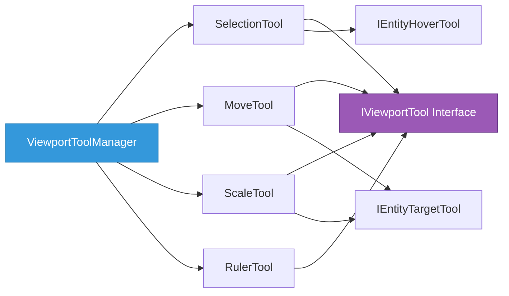
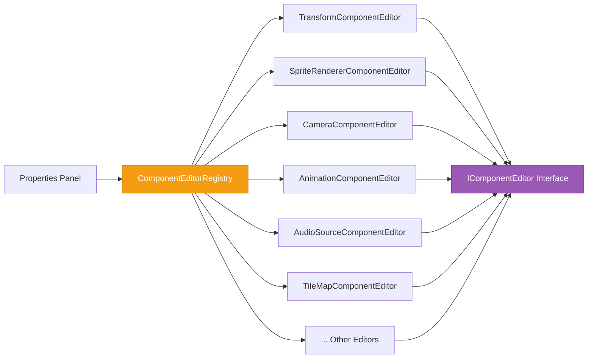
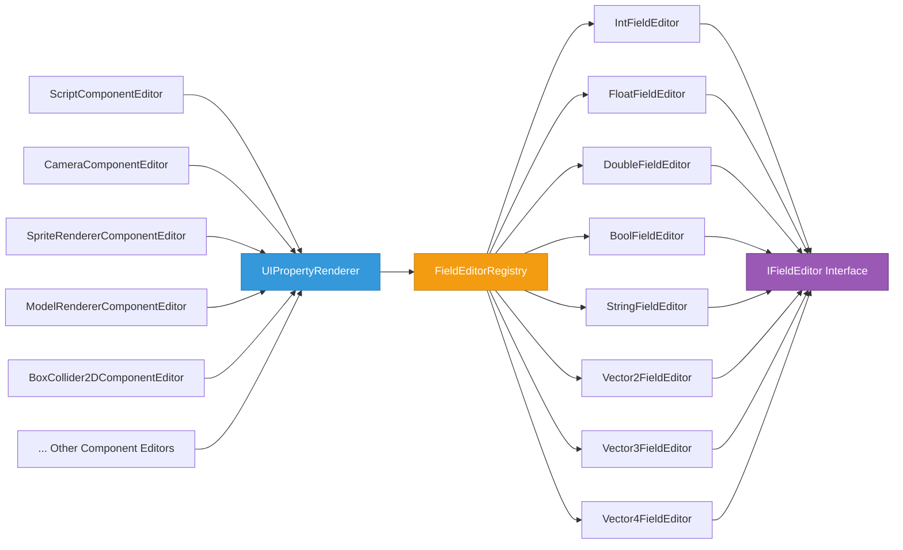
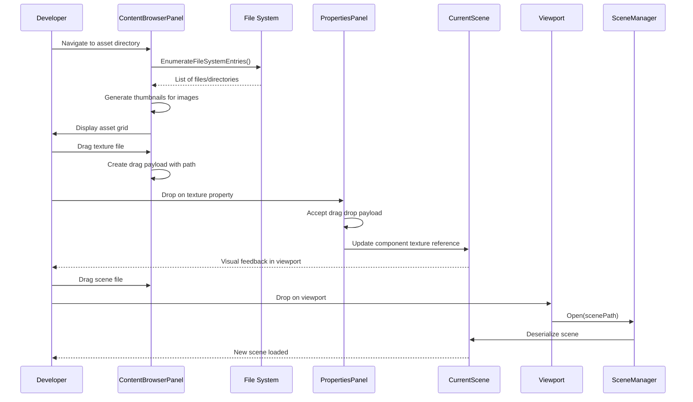
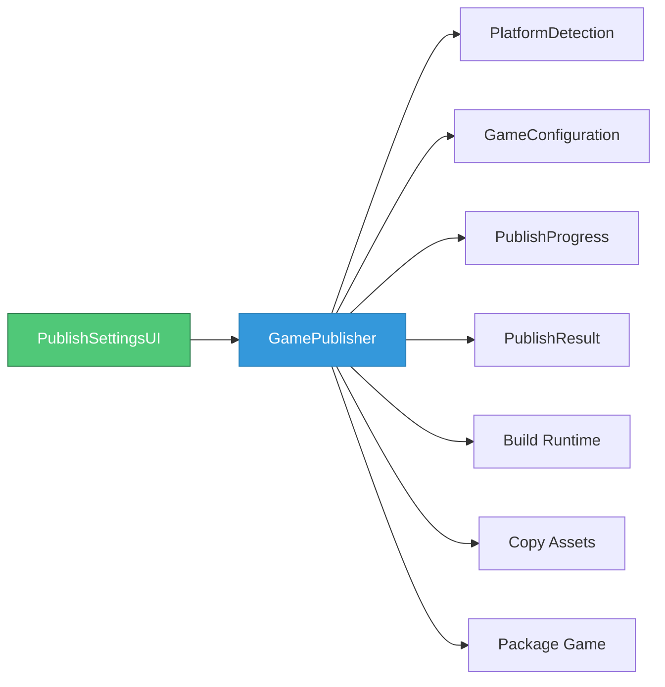

# Editor Module

## Overview

The Editor module provides a visual development environment for creating and manipulating game scenes. It offers tools for scene composition, entity manipulation, asset management, and runtime testing.

### Core Responsibilities

- **Visual scene composition** - Graphical interface for building game worlds
- **Entity management** - Creating, selecting, modifying, and deleting game entities
- **Asset workflow** - Browsing, organizing, and integrating game assets
- **Property editing** - Exposing and modifying component data through specialized UI editors
- **Runtime simulation** - Toggling between edit mode and play mode to test game behavior
- **Project organization** - Managing project structure and workspace settings
- **Developer feedback** - Performance metrics, console output, and debugging information

### Key Concepts

- **Layer Architecture**: EditorLayer acts as the primary orchestrator, managing the viewport, frame buffer, camera, and coordinating between UI panels
- **Panel System**: Independent panels communicate through a centralized selection model and event callbacks
- **Dual-Mode Operation**: Edit mode (scene manipulation) vs Play mode (runtime simulation with scripts and physics)
- **Frame Buffer Viewport**: Scene renders to an off-screen frame buffer displayed as a texture within ImGui
- **Component-Based Editing**: Each component type has a dedicated editor registered through a centralized registry

## Architecture Flow

### Initialization Sequence

1. **Application Bootstrap**: DI container configuration, window/ImGui initialization, script engine preparation
2. **Layer Attachment**: Camera controller creation, frame buffer allocation, scene creation, panel instantiation
3. **Panel Setup**: Panel state initialization, icon loading, component editor registry population

### Frame Update Loop



### User Interaction Flow



### Scene State Transitions



## Panel Architecture

The editor is composed of several specialized panels that work together:



### Panel Directory Structure

Panels are organized into two locations based on their complexity:

**Features/** - Multi-component features with related functionality:
- `Features/Scene/` - SceneHierarchyPanel, SceneManager, SceneToolbar, SceneSettingsPopup
- `Features/Viewport/` - ViewportRuler, ViewportToolManager, ViewportCoordinateConverter
- `Features/Project/` - ProjectManager, NewProjectPopup, RecentProjectsPanel
- `Features/Settings/` - EditorPreferences, EditorSettingsUI

**Panels/** - Standalone utility panels:
- ConsolePanel, PropertiesPanel, ContentBrowserPanel
- RendererStatsPanel, PerformanceMonitorPanel
- AnimationTimelinePanel, TileMapPanel

### Panel Responsibilities

**Scene Hierarchy Panel** (Features/Scene/)
- Displays all entities in the current scene as a tree structure
- Handles entity selection and deselection
- Provides context menu for entity operations (delete, duplicate)
- Supports drag-and-drop for prefab instantiation

**Properties Panel** (Panels/)
- Shows all components attached to the currently selected entity
- Renders entity name editor
- Displays component-specific editors for each component type
- Provides "Add Component" selector for attaching new components
- Offers "Save as Prefab" functionality for reusable entity templates

**Content Browser Panel** (Panels/)
- Navigates the project's asset directory structure
- Displays thumbnails for images and icons for other file types
- Supports drag-and-drop of assets into the viewport or property fields
- Provides visual feedback for different asset types (textures, prefabs, models, scenes)
- Caches image thumbnails for performance

**Console Panel** (Panels/)
- Captures and displays debug output from the engine and scripts
- Uses Serilog sink (ConsolePanelSink) for centralized logging
- Helps developers track runtime behavior and debug issues

**Renderer Stats Panel** (Panels/)
- Displays renderer statistics (draw calls, vertices, triangles)
- Shows batching efficiency metrics
- Provides GPU resource information

**Performance Monitor Panel** (Panels/)
- Shows performance metrics (frame time, FPS)
- Shows hovered entity information
- Provides camera position and rotation data

**Animation Timeline Panel** (Panels/)
- Visual timeline for animation editing
- Keyframe manipulation and preview
- Integration with AnimationComponent editing

**TileMap Panel** (Panels/)
- Tile palette selection and painting
- Layer management for tile maps
- Brush tools for tile placement

**Scene Toolbar** (Features/Scene/)
- Central play/stop button for toggling between edit and play mode
- Visual feedback showing current scene state
- Scene settings access
- Positioned centrally for easy access

**Viewport** (EditorLayer)
- Renders the scene to a frame buffer texture
- Supports drag-and-drop for scene files from content browser
- Handles mouse picking for entity selection
- Provides visual representation of the game world during development
- Integrates viewport tools (selection, move, scale, ruler)

## Viewport Tools

The editor provides a comprehensive set of viewport tools for entity manipulation:



### Tool Types

**SelectionTool**
- Click-to-select entity in viewport
- Implements `IEntityHoverTool` for hover detection
- Updates hierarchy panel selection

**MoveTool**
- Drag to translate selected entity
- Axis constraints (X, Y)
- Snapping support
- Implements `IEntityTargetTool`

**ScaleTool**
- Drag to scale selected entity
- Uniform and non-uniform scaling
- Implements `IEntityTargetTool`

**RulerTool**
- Measure distances in world units
- Visual guides and grid snapping
- Coordinate display

### Supporting Infrastructure

**ViewportToolManager** (Features/Viewport/)
- Manages active tool selection
- Handles tool switching
- Coordinates tool input events

**ViewportRuler** (Features/Viewport/)
- Draws measurement rulers on viewport edges
- Shows coordinate ticks and labels
- Supports zoom-aware scaling

**ViewportCoordinateConverter** (Features/Viewport/)
- Converts between screen and world coordinates
- Handles viewport offset calculations
- Supports mouse picking

## Component Editor System

The editor uses a registry-based system for rendering component-specific UI:



### Available Component Editors

| Editor | Component | Features |
|--------|-----------|----------|
| `TransformComponentEditor` | TransformComponent | Position, rotation, scale with VectorPanel |
| `SpriteRendererComponentEditor` | Sprite2DComponent | Texture drop target, color picker, tiling |
| `SubTextureRendererComponentEditor` | SubTextureRendererComponent | Sub-texture coordinates, atlas support |
| `CameraComponentEditor` | CameraComponent | Projection type, FOV, clipping planes |
| `RigidBody2DComponentEditor` | RigidBody2DComponent | Body type selector, fixed rotation |
| `BoxCollider2DComponentEditor` | BoxCollider2DComponent | Offset, size, physics material |
| `AnimationComponentEditor` | AnimationComponent | Animation clips, playback controls |
| `AudioSourceComponentEditor` | AudioSourceComponent | Audio clip drop target, volume, pitch |
| `AudioListenerComponentEditor` | AudioListenerComponent | Listener configuration |
| `MeshComponentEditor` | MeshComponent | Mesh drop target, material settings |
| `ModelRendererComponentEditor` | ModelRendererComponent | Model path, material overrides |
| `TileMapComponentEditor` | TileMapComponent | Tileset configuration, layer settings |
| `ScriptComponentEditor` | ScriptComponent | Script selection, exposed fields |
| `EntityNameEditor` | (Entity) | Entity name input field |

Each component editor:
- Knows how to render UI controls for its specific component type
- Handles property modifications and validation
- Provides specialized controls (color pickers, texture drop targets, vector editors)
- Can show/hide fields based on component state

### Field Editor System

The editor uses a centralized field editor registry for rendering typed properties across all component editors:



**Architecture**:
- `IFieldEditor` interface defines the contract for type-specific field rendering
- `FieldEditorRegistry` maps types to their corresponding field editors
- `UIPropertyRenderer.DrawPropertyField()` provides a unified interface for all component editors
- Strategy pattern allows extensible type support without modifying existing code

**Extensibility**: New field types can be added by implementing `IFieldEditor` and registering in `FieldEditorRegistry`.

## Editor UI Infrastructure

The editor provides a comprehensive UI infrastructure in `Editor/UI/` for consistent, reusable UI components.

### Drawers (UI/Drawers/)

Reusable UI drawing utilities that encapsulate common ImGui patterns:

| Drawer | Purpose |
|--------|---------|
| `ButtonDrawer` | Styled buttons (Primary, Secondary, Danger, Icon) with consistent sizing |
| `ModalDrawer` | Modal dialogs, confirmation popups, input modals |
| `TableDrawer` | Data tables with sorting, selection, and custom columns |
| `TreeDrawer` | Hierarchical tree views with expand/collapse |
| `TextDrawer` | Styled text labels, headers, formatted output |
| `LayoutDrawer` | Layout helpers (columns, spacing, separators) |
| `DragDropDrawer` | Drag-and-drop source/target handling |

### Elements (UI/Elements/)

Higher-level UI components for specific use cases:

| Element | Purpose |
|---------|---------|
| `ComponentSelector` | Dropdown for selecting and adding components to entities |
| `EntityContextMenu` | Right-click context menu for entity operations |
| `TextureDropTarget` | Drag-and-drop target for texture paths |
| `AudioDropTarget` | Drag-and-drop target for audio clip paths |
| `MeshDropTarget` | Drag-and-drop target for mesh/model paths |
| `ModelTextureDropTarget` | Specialized texture target for 3D models |
| `PrefabDropTarget` | Drag-and-drop target for prefab instantiation |
| `PrefabManager` | Prefab save/load operations |
| `VectorPanel` | Axis-colored Vector2/Vector3/Vector4 input with X(red), Y(green), Z(blue) |
| `UIPropertyRenderer` | Property row layout with label/value columns |

### Constants (UI/Constants/)

**EditorUIConstants** provides centralized UI constants for consistency: button sizes, spacing, property label ratio, color schemes (Error, Warning, Success), and axis colors (X=red, Y=green, Z=blue).

Use Drawers instead of raw ImGui calls, Elements for specialized inputs, and UIPropertyRenderer for consistent property layouts.

## Asset Management

The editor provides a complete asset workflow:



## Lifecycle & Timing

### Phases

- **Initialization**: DI container configuration, window creation, editor layer attachment, frame buffer allocation, panel instantiation, scene creation, script engine initialization
- **Runtime**: Each frame runs early update (viewport resize, frame buffer bind, scene update, mouse picking) followed by ImGui render (dockspace, menu bar, panels, toolbar)
- **Shutdown**: Console panel disposal, layer detachment, resource cleanup, window destruction

### Event Handling

- **Edit Mode**: Camera controller receives input events for viewport navigation
- **Play Mode**: Script engine receives input events for game logic
- **Keyboard Shortcuts**: Dedicated handler for file operations (Ctrl+N/S), editing (Ctrl+D), and navigation (Ctrl+F)

## Project Management

The editor uses a project-based workflow to organize assets:

```mermaid
graph TD
    PM[ProjectManager]

    PM --> Create[Create New Project]
    PM --> Open[Open Existing Project]

    Create --> DirStruct[Create Directory Structure]
    DirStruct --> Assets[/assets]
    DirStruct --> Scenes[/assets/scenes]
    DirStruct --> Textures[/assets/textures]
    DirStruct --> Scripts[/assets/scripts]
    DirStruct --> Prefabs[/assets/prefabs]

    Open --> Validate[Validate Project Directory]
    Validate --> Configure[Configure Asset Paths]
    Configure --> ScriptDir[Set Script Engine Directory]
    Configure --> AssetRoot[Set Assets Manager Root]

    style PM fill:#3498db,stroke:#2073a8,color:#fff
    style Create fill:#2ecc71,stroke:#1f8a4a,color:#fff
    style Open fill:#e74c3c,stroke:#a73428,color:#fff
```

**Project Structure**:
- Projects are directory-based with a standard layout
- `/assets` contains all game resources
- Subdirectories organize assets by type
- Script engine automatically watches the scripts directory
- Content browser roots at the project's assets directory

**Project Operations**:
- **New Project**: Creates directory structure and sets as active project
- **Open Project**: Validates directory, configures paths, updates asset browser
- **Validation**: Checks for required directories, falls back gracefully for legacy projects

## Game Publishing

The editor includes a comprehensive game publishing system for building standalone executables:



### Publisher Components (Editor/Publisher/)

| Component | Purpose |
|-----------|---------|
| **GamePublisher** | Builds Runtime project, copies assets, handles cross-platform configurations |
| **PublishSettingsUI** | ImGui interface for publish configuration |
| **PlatformDetection** | OS detection and platform-specific path handling |
| **PublishSettings** | Scene path, output directory, platform, build configuration |
| **PublishProgress/Result** | Progress reporting and status handling |

### Publishing Workflow

1. Configure settings (scene, output directory, target platform)
2. Build Runtime project with specified configuration
3. Copy required assets (textures, audio, scenes)
4. Package for distribution

## Keyboard Shortcuts

The editor uses a configurable `ShortcutManager` system (in `Editor/Input/`) with categorized shortcuts.

| Category | Shortcut | Action |
|----------|----------|--------|
| **Tools** | Shift+Q/W/R/E | Select/Move/Scale/Ruler tool |
| **Tools** | Escape | Clear ruler measurement |
| **File** | Ctrl+N/S | New/Save scene |
| **Edit** | Ctrl+D | Duplicate entity |
| **Navigation** | Ctrl+R | Reset camera |

The system consists of `ShortcutManager` (registry with conflict detection), `KeyboardShortcut` (key combination definition), `KeyModifiers` (Ctrl/Shift/Alt), and `KeyboardShortcutsPanel` (UI for viewing shortcuts).

## State Management

The editor maintains several key pieces of state:

| State Type | Contents |
|------------|----------|
| **Scene** | Current scene instance, file path, edit/play mode flag |
| **Selection** | Currently selected entity (shared across panels), hovered entity |
| **Viewport** | Size, bounds, focus state, frame buffer |
| **Camera** | Position, rotation, zoom, aspect ratio |
| **Project** | Current directory, asset paths, script configuration |

## Developer Mental Model

Key concepts for working with the editor:

1. **EditorLayer is a layer** in the engine's layer stack, compositional and modular
2. **Panels are independent** - communicate through callbacks and shared context
3. **Edit vs Play modes** are fundamentally different execution paths
4. **Frame buffer intermediary** enables multiple viewports and UI overlay
5. **Component editors are extensible** via registry system
6. **Selection drives UI** - changes update the entire editing context
7. **Asset paths are relative** to project directory for portability
8. **Serialization is transparent** - editor handles UX, serializer handles data

## Key Design Patterns

- **Observer**: Panels observe selection changes through callbacks
- **Strategy**: Component editors implement common interface with specific behavior
- **Singleton**: Current scene globally accessible
- **Dependency Injection**: Core services injected through DI container
- **Frame Buffer Object**: Render-to-texture decouples scene rendering from display

## Extension Points

| Extension | Approach |
|-----------|----------|
| New Component Types | Implement `IComponentEditor`, register in `ComponentEditorRegistry` |
| New Field Types | Implement `IFieldEditor`, register in `FieldEditorRegistry` |
| New Panels | Create panel class, register in DI, add to EditorLayer |
| New Asset Types | Extend ContentBrowserPanel for new file extensions |
| Custom Shortcuts | Register via `ShortcutManager.RegisterShortcut()` |
| New Viewport Tools | Implement `IViewportTool`, register with `ViewportToolManager` |
| New Drop Targets | Create elements in `UI/Elements/` following existing patterns |

## Performance Considerations

- **Frame buffer resizing** is expensive - only resize when size actually changes
- **Texture caching** in content browser avoids reloading every frame
- **Selective rendering** - panels only render when visible
- **Mouse picking** reads entity ID only when mouse is within viewport bounds
- **Script compilation** happens once and caches until modified
