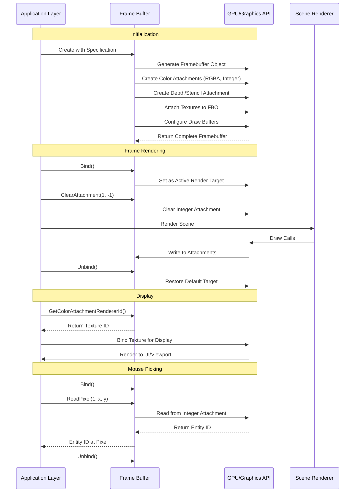
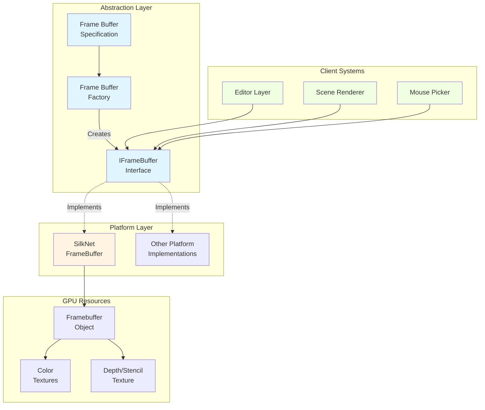
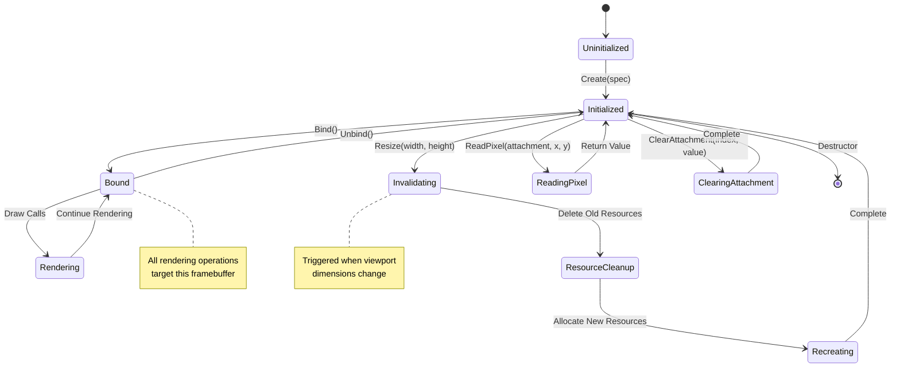

# Frame Buffers

## Overview

**Purpose**: Frame buffers provide off-screen rendering targets that allow the engine to render scenes to textures instead of directly to the screen. This enables advanced rendering techniques like post-processing effects, editor viewports, and custom rendering pipelines.

**Scope**: The frame buffer module handles:
- Creating off-screen render targets with custom attachment configurations
- Managing color and depth/stencil texture attachments
- Providing pixel-perfect mouse picking capabilities
- Supporting dynamic viewport resizing
- Enabling rendering to texture for editor integration

**Key Concepts**:
- **Attachments**: Frame buffers contain multiple texture attachments - color attachments for visual output and depth/stencil attachments for depth testing
- **Render-to-Texture**: Instead of rendering directly to the screen, content is rendered to texture buffers that can be read, displayed, or processed
- **Multiple Render Targets (MRT)**: A single frame buffer can have multiple color attachments, allowing shaders to output to multiple textures simultaneously
- **Invalidation**: When frame buffer properties change (like size), the underlying GPU resources must be recreated through an invalidation process

## Architecture Flow

### Frame Buffer Lifecycle

1. **Specification Phase**: Developer defines frame buffer requirements through a specification object, including dimensions, attachment types, and formats

2. **Creation Phase**: Factory creates platform-specific frame buffer implementation based on the active rendering API

3. **Initialization Phase**: Frame buffer allocates GPU resources:
   - Creates frame buffer object on GPU
   - Generates texture attachments for each specified attachment
   - Attaches textures to appropriate attachment points
   - Configures draw buffers for multi-target rendering
   - Validates frame buffer completeness

4. **Usage Phase**: During rendering:
   - Frame buffer is bound as active render target
   - All rendering commands draw to frame buffer's attachments
   - Frame buffer is unbound, restoring default render target
   - Frame buffer textures can be sampled or displayed

5. **Resize Phase**: When viewport dimensions change:
   - Frame buffer invalidates existing resources
   - Recreates all attachments with new dimensions
   - Maintains attachment configuration

6. **Cleanup Phase**: When frame buffer is destroyed, GPU resources (textures and frame buffer objects) are released

### Rendering Flow



## Core Workflow Stages

### 1. Specification & Creation

Frame buffer specifications define the structure before creation:
- **Dimensions**: Width and height in pixels (up to 8192x8192 maximum)
- **Attachments**: List of color and depth attachments with specific formats
- **Samples**: Multi-sampling level for anti-aliasing (currently supports single-sample)
- **SwapChain Target**: Whether this frame buffer renders to the swap chain

Common attachment configurations:
- **RGBA8**: Standard color output for visual rendering
- **RED_INTEGER**: Integer format for entity ID encoding (mouse picking)
- **DEPTH24STENCIL8**: Combined depth and stencil buffer for depth testing

### 2. Binding & Rendering

The bind/unbind pattern controls where rendering occurs:
- **Bind**: Sets frame buffer as active render target; all draw calls render to its attachments
- **Render**: Scene rendering systems draw geometry, sprites, and effects
- **Unbind**: Restores default frame buffer; subsequent draws go to screen

This pattern enables:
- Rendering scenes to textures for display in editor viewports
- Creating multiple views of the same scene with different cameras
- Capturing rendering output for post-processing

### 3. Attachment Access

Frame buffers expose their attachments for different purposes:
- **Color Attachment 0**: Primary visual output, typically displayed in viewport
- **Color Attachment 1**: Entity ID buffer for pixel-perfect mouse picking
- **Depth Attachment**: Depth information for 3D rendering and effects

### 4. Dynamic Resizing

When viewport size changes:
1. Detect size mismatch between viewport and frame buffer
2. Trigger invalidation with new dimensions
3. Delete old GPU resources
4. Recreate frame buffer with identical attachment configuration but new size
5. Resume rendering with updated dimensions

This ensures frame buffer resolution always matches the viewport, preventing stretching or quality loss.

### 5. Pixel Reading

Frame buffers enable CPU-side data readback:
- **Mouse Picking**: Reading integer attachment at cursor position retrieves entity ID
- **Position Mapping**: Viewport coordinates are transformed to frame buffer space (Y-axis flip)
- **Bounds Checking**: Ensures read coordinates are within valid frame buffer dimensions

## Architecture Patterns



## State Management



## Integration Points

### Editor Integration

The editor uses frame buffers to create an embedded viewport:
1. **Initialization**: Editor creates frame buffer with RGBA color, entity ID, and depth attachments
2. **Frame Update**: Editor binds frame buffer, renders scene, then unbinds
3. **Display**: Editor retrieves color attachment texture and displays it in ImGui viewport panel
4. **Interaction**: Mouse clicks in viewport read entity ID attachment for object selection
5. **Resizing**: When viewport panel is resized, frame buffer is resized to match

### Scene Rendering Integration

Scene rendering systems integrate with frame buffers:
- **Camera System**: Provides view-projection matrix for rendering to frame buffer
- **2D Renderer**: Draws sprites, quads, and primitives to active frame buffer
- **3D Renderer**: Renders models and 3D geometry to frame buffer
- **Entity ID Rendering**: Second pass writes entity IDs to integer attachment

### Multi-Target Rendering Strategy

Frame buffers coordinate multiple render targets:
1. **Attachment 0 (RGBA8)**: Visual output with color information
2. **Attachment 1 (RED_INTEGER)**: Entity ID encoded as integer value
3. **Depth/Stencil**: Depth testing and stencil operations

Shaders output to multiple attachments simultaneously:
- Fragment shader declares multiple output variables
- Each output writes to corresponding attachment
- Frame buffer configures draw buffers to route outputs correctly

## Lifecycle & Timing

### Initialization Sequence

**When**: During editor layer initialization, before first frame

**Process**:
1. Define frame buffer specification with desired attachments and initial size
2. Call factory to create platform-specific frame buffer
3. Factory queries active rendering API type
4. Instantiates appropriate implementation
5. Implementation allocates GPU resources
6. Frame buffer validates completeness and returns ready-to-use object

### Per-Frame Execution

**When**: Every frame during editor update loop

**Process**:
1. **Pre-Render**: Check if viewport size changed; resize frame buffer if needed
2. **Bind**: Activate frame buffer as render target
3. **Clear**: Clear color attachment and reset entity ID attachment to -1
4. **Render**: Scene systems draw to frame buffer
5. **Unbind**: Restore default frame buffer
6. **Display**: Retrieve texture and render to UI viewport
7. **Pick**: If mouse clicked, read entity ID from frame buffer

### Resize Flow

**When**: Viewport panel is resized by user

**Trigger**: Frame buffer detects size mismatch between its dimensions and viewport size

**Process**:
1. Invalidate: Mark current resources as invalid
2. Cleanup: Delete existing textures and frame buffer object
3. Recreate: Generate new frame buffer object with same attachment configuration
4. Allocate: Create new textures at updated dimensions
5. Attach: Bind textures to frame buffer attachment points
6. Validate: Verify frame buffer is complete
7. Resume: Continue rendering at new resolution

### Cleanup

**When**: Editor layer detaches or application shuts down

**Process**:
1. Frame buffer destructor called
2. Deletes all color attachment textures
3. Deletes depth/stencil texture
4. Deletes frame buffer object
5. Resources returned to GPU memory pool

## Performance Considerations

### Memory Usage

Frame buffers consume GPU memory proportional to:
- **Resolution**: Higher resolution requires more texture memory
- **Attachment Count**: Each attachment adds memory overhead
- **Pixel Format**: Higher precision formats (RGBA16F vs RGBA8) use more memory

Typical editor frame buffer at 1920x1080:
- RGBA8 color: ~8.3 MB
- R32I entity ID: ~8.3 MB
- DEPTH24STENCIL8: ~8.3 MB
- **Total**: ~25 MB per frame buffer

### Invalidation Cost

Frame buffer resizing is expensive:
- Deleting and recreating GPU resources
- Texture reallocation
- Memory fragmentation potential

**Mitigation**: Resize operations are triggered only when dimensions actually change, not every frame.

### Draw Call Impact

Frame buffer binding/unbinding has minimal overhead:
- Single GPU state change per bind/unbind
- Negligible compared to actual rendering work

**Best Practice**: Minimize frame buffer switches per frame; group rendering to same target together.

## Common Usage Patterns

### Editor Viewport Pattern

```
Specification:
  - Dimensions: Viewport panel size
  - Color Attachment 0: RGBA8 (visual output)
  - Color Attachment 1: RED_INTEGER (entity picking)
  - Depth Attachment: DEPTH24STENCIL8

Flow:
  1. Create frame buffer with specification
  2. Each frame: Bind → Clear → Render Scene → Unbind
  3. Display color attachment in UI
  4. On mouse click: Read entity ID from attachment 1
  5. On viewport resize: Invalidate and recreate
```

### Post-Processing Pattern

```
Specification:
  - Dimensions: Screen resolution
  - Color Attachment 0: RGBA8 (scene color)
  - Depth Attachment: DEPTH24STENCIL8

Flow:
  1. Bind frame buffer
  2. Render scene normally
  3. Unbind frame buffer
  4. Bind scene color as texture input
  5. Render fullscreen quad with post-process shader
  6. Output to screen or another frame buffer
```

### Shadow Mapping Pattern

```
Specification:
  - Dimensions: Shadow map resolution (e.g., 2048x2048)
  - Depth Attachment Only: DEPTH24STENCIL8
  - No Color Attachments (depth-only pass)

Flow:
  1. Bind shadow map frame buffer
  2. Render scene from light's perspective
  3. Unbind frame buffer
  4. Bind depth texture for sampling in main render pass
  5. Render scene with shadow mapping shader
```

## Error Handling

### Validation Checks

**Size Limits**: Maximum frame buffer size enforced (8192x8192)
- Prevents GPU memory exhaustion
- Resize requests beyond limit are ignored with warning

**Completeness Verification**: Frame buffer validates attachment configuration
- Ensures all required attachments are present
- Checks format compatibility
- Throws exception if configuration is invalid

**Bounds Checking**: Pixel read operations validate coordinates
- Ensures read position is within frame buffer dimensions
- Prevents out-of-bounds GPU memory access

### Common Issues

**Black Screen**: Frame buffer not properly bound before rendering
- **Solution**: Ensure Bind() is called before draw operations

**Stretched Image**: Frame buffer size doesn't match viewport dimensions
- **Solution**: Implement resize detection and invalidation logic

**Incomplete Framebuffer Error**: Attachment configuration incompatible
- **Solution**: Verify attachment formats are supported by GPU
- **Solution**: Ensure at least one color attachment or depth-only configuration

**Entity Picking Returns -1**: Entity ID not written to integer attachment
- **Solution**: Verify shader writes entity ID to correct output
- **Solution**: Ensure integer attachment is cleared to -1 before rendering

## Design Rationale

### Why Multiple Attachments?

Multiple render targets enable:
- **Deferred Rendering**: Output multiple scene properties (albedo, normals, position) in single pass
- **Editor Features**: Separate visual output from editor metadata (entity IDs)
- **Advanced Effects**: Store intermediate values for multi-pass rendering

### Why Invalidation Pattern?

GPU resources are immutable in size, requiring recreation:
- Cannot resize textures after allocation
- Must delete and recreate with new dimensions
- Invalidation encapsulates this complexity

### Why Factory Pattern?

Abstraction enables:
- **Platform Independence**: Same interface works with OpenGL, Vulkan, DirectX
- **Runtime API Selection**: Choose rendering API at runtime
- **Testing**: Mock frame buffers for unit tests
- **Future Extensions**: Add new platforms without changing client code

## Future Enhancements

### Potential Improvements

**Multi-Sampling Support**: Enable MSAA for anti-aliasing within frame buffers
- Requires resolving multi-sampled textures to regular textures

**Mipmap Generation**: Automatically generate mipmaps for frame buffer textures
- Useful for downsampling and texture LOD

**Cube Map Frame Buffers**: Support rendering to cube map faces
- Essential for environment mapping and reflections

**Layered Rendering**: Render to multiple layers or slices in single pass
- Beneficial for geometry shader-based techniques

**Read-Back Optimization**: Asynchronous pixel reading to avoid GPU stalls
- Use pixel buffer objects (PBOs) for non-blocking reads

**Format Flexibility**: Support HDR formats (RGBA16F, RGBA32F) for high dynamic range rendering
- Required for physically-based rendering pipelines
