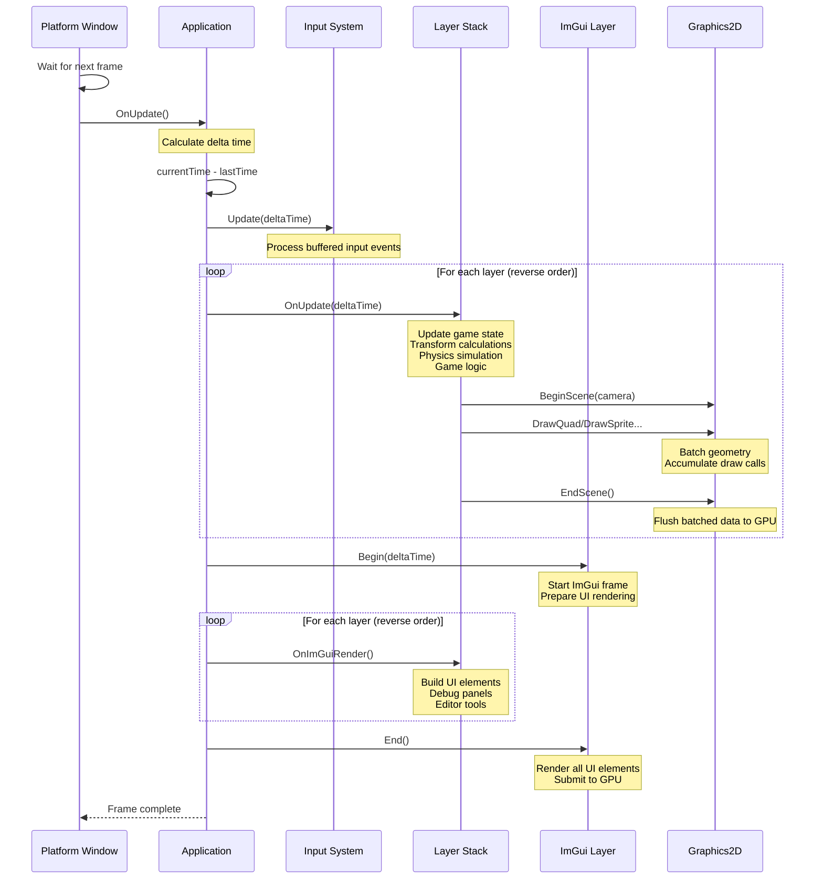
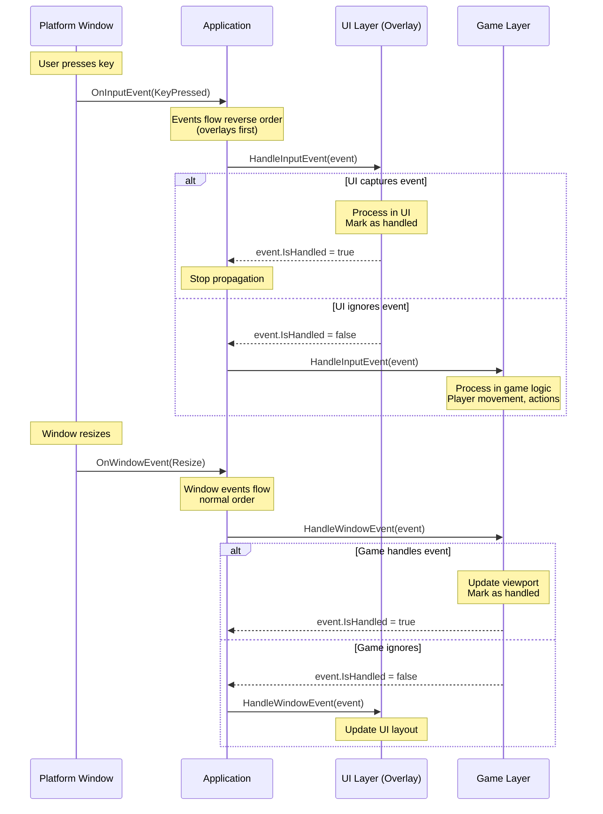
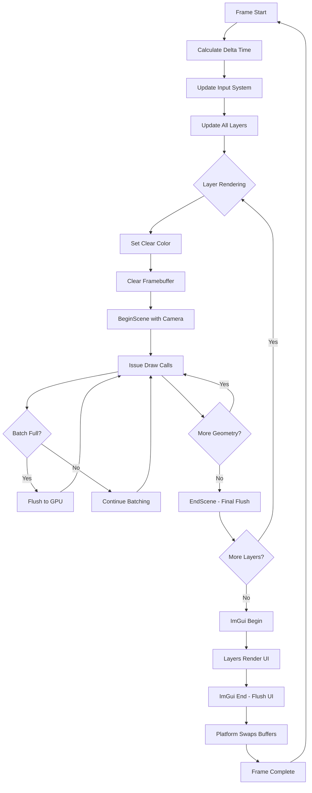
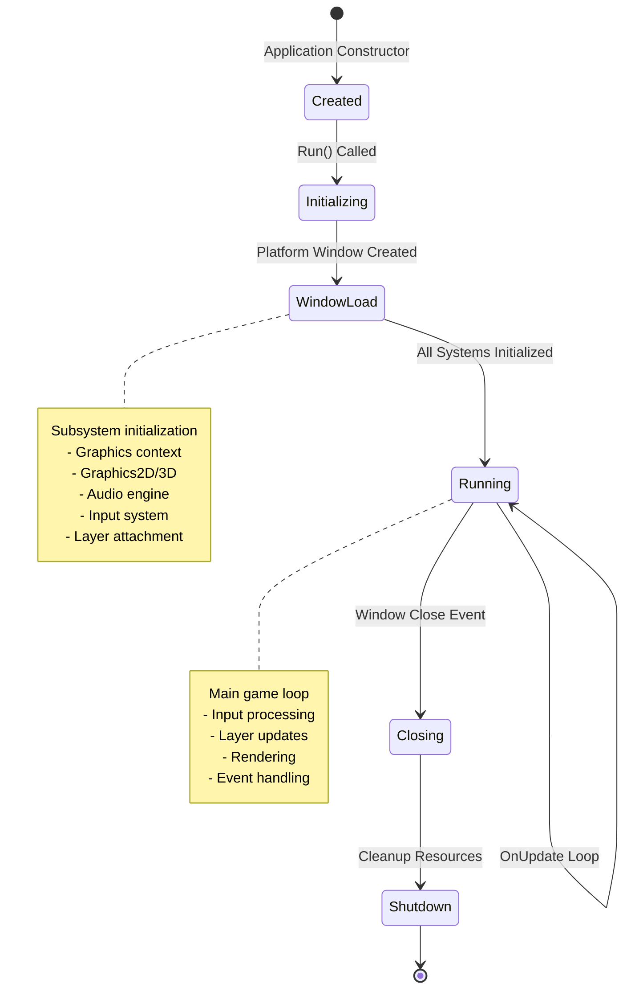

# Game Loop

## Overview

The Game Loop is the heartbeat of the engine, orchestrating the continuous cycle of input processing, state updates, and rendering that brings games to life. It transforms a static application into a dynamic, interactive experience by coordinating the execution of all engine subsystems in a precisely timed sequence.

**Purpose**: The Game Loop ensures that every frame of your game follows a predictable execution pattern—gathering user input, updating game state, and rendering the visual output—all while maintaining consistent timing and performance.

**Scope**: This module is responsible for:
- Managing the main execution flow from application startup to shutdown
- Coordinating subsystem initialization and lifecycle
- Distributing frame timing information to all game systems
- Orchestrating the layer stack execution order
- Bridging platform-specific windowing systems with engine-agnostic game logic

## Core Concepts

### The Three-Tier Architecture

The engine employs a three-tier architecture that separates concerns and maintains flexibility:

1. **Platform Layer** - The windowing system abstraction that handles OS-specific windowing and provides the raw update loop
2. **Application Layer** - The engine's core orchestrator that manages subsystems and distributes execution flow
3. **Layer Stack** - User-defined game logic and systems organized in a prioritized execution order

### Layer Stack Pattern

The layer stack is a collection of game logic modules that execute in a specific order each frame. Layers can be:

- **Regular Layers**: Execute first, typically contain game logic (inserted at the front of the stack)
- **Overlay Layers**: Execute last, typically contain UI or debug tools (appended to the back of the stack)

This pattern allows for clean separation of concerns and predictable execution order. For example, game logic updates before UI rendering, and UI can overlay on top of game content.

### Event-Driven Input Distribution

Rather than polling for input, the game loop uses an event-driven approach:
- Platform-specific events are converted to engine-agnostic event objects
- Events flow through the layer stack in reverse order (overlays first)
- Any layer can mark an event as "handled" to prevent further propagation
- This enables UI layers to capture input before it reaches game logic

### Delta Time

Each frame receives a time delta representing the elapsed time since the previous frame. This enables:
- Frame-rate independent motion and physics
- Smooth animations regardless of performance variations
- Accurate timing for game logic and input systems

## Architecture Flow

### Initialization Sequence

The engine follows a structured startup sequence:

1. **Application Creation**
   - Platform window is created with specified properties (resolution, title, etc.)
   - Window event handlers are registered for lifecycle events
   - The layer stack is initialized as empty
   - Engine sets running state to active

2. **Window Load Event**
   - Graphics context (OpenGL) is initialized
   - Graphics subsystems (2D, 3D) are initialized with GPU resources
   - Audio engine is initialized
   - Input system is created and configured
   - All registered layers receive initialization callbacks with input system reference

3. **Layer Attachment**
   - Each layer receives the input system for configuration
   - Layers load their required assets and resources
   - Layers initialize their internal state

### Main Loop Execution

Once initialized, each frame follows this precise sequence:

### Event Processing Flow

Events are processed separately from the main update loop and flow through the layer stack with specific propagation rules:

### Rendering Pipeline Integration

The game loop doesn't directly render—it orchestrates the rendering process:

### State Transitions

The application can transition through several states during its lifetime:

## Frame Execution Breakdown

### Update Phase

During the update phase, each layer receives the delta time and can:
- Update entity positions and states
- Process game logic and AI
- Handle physics simulation
- Update camera transforms
- Prepare rendering data

Layers execute in reverse stack order, meaning overlays update first, then game layers. This ensures UI state is current before game logic processes.

### Render Phase

The render phase follows a specific pattern:

1. **Scene Setup**: Camera matrices are uploaded to GPU
2. **Batch Initialization**: Rendering buffers are cleared and prepared
3. **Geometry Submission**: Layers call draw commands (DrawQuad, DrawSprite, etc.)
4. **Batch Management**: When limits are reached, batches automatically flush to GPU
5. **Scene Finalization**: Remaining batched data is flushed

The renderer uses a batching system to minimize GPU state changes and draw calls, significantly improving performance.

### ImGui Phase

After all game rendering completes, the UI rendering phase begins:

1. **ImGui Begin**: Prepares the immediate-mode UI system for a new frame
2. **Layer UI Rendering**: Each layer can construct UI elements (panels, widgets, debug info)
3. **ImGui End**: Converts UI commands to geometry and renders to the screen

UI always renders on top of game content due to execution order.

## Lifecycle & Timing

### Initialization Phase

**When**: Application startup, before the main loop begins

**Sequence**:
1. Platform window creation
2. Event handler registration
3. Layer stack construction
4. Window load triggers graphics initialization
5. Layer attachment callbacks invoked

**Duration**: Synchronous, blocking until complete

### Execution Phase

**When**: Continuously from initialization until shutdown request

**Frame Timing**:
- Driven by platform window's update callback
- Delta time calculated each frame: `currentTime - lastTime`
- No fixed timestep by default (variable frame rate)
- Timing distributed to all subsystems for frame-independent logic

**Execution Order Each Frame**:
1. Delta time calculation
2. Input system update
3. Layer updates (reverse order)
4. ImGui preparation
5. Layer ImGui rendering (reverse order)
6. ImGui finalization

### Event Processing

**When**: Asynchronously as events occur, interleaved with frame updates

**Characteristics**:
- Event-driven, not polled
- Immediate propagation through layer stack
- Can be consumed (marked as handled) by any layer
- Input events flow reverse order (UI first)
- Window events flow normal order (game first)

### Shutdown Phase

**When**: Triggered by window close event or application termination

**Sequence**:
1. Window close event received
2. Running flag set to false
3. Event propagates through layers
4. Graphics context cleanup
5. Platform window destruction

**Duration**: Synchronous, blocking during cleanup

## Performance Considerations

### Frame Timing Strategy

The engine uses variable delta time rather than a fixed timestep:

**Advantages**:
- Simpler implementation
- No temporal aliasing or spiral of death
- Automatically adapts to system performance

**Considerations**:
- Game logic must use delta time for frame-independent behavior
- Physics simulation may need substeps for stability
- Very large delta times (stutters) may need clamping

### Layer Execution Order

Layer stack order significantly impacts performance:

- **UI/Overlays Last**: Ensures they can consume input events before game logic
- **Game Logic First**: Primary gameplay systems have priority
- **Rendering During Update**: Each layer controls its own rendering within its update call

This design allows layers to optimize their execution and rendering based on their specific needs.

### Rendering Batch Optimization

The game loop works with the batching renderer to minimize GPU overhead:

- Geometry is accumulated in CPU-side buffers during the update phase
- Batches automatically flush when limits are reached (vertices, indices, or texture slots)
- Final flush occurs at EndScene
- Multiple batches per frame are handled transparently

This batching strategy can render thousands of sprites in a single draw call, dramatically improving performance.

## Integration with Other Modules

### Camera System
The camera provides view-projection matrices to the renderer at the start of each scene. The game loop ensures cameras update before rendering begins.

### Input System
The input system receives the delta time first each frame, allowing it to process buffered events and update state before layers receive their update callbacks.

### Renderer
The renderer is stateless from the game loop's perspective—each frame starts fresh with BeginScene and ends with EndScene. The loop doesn't manage rendering state, only orchestrates the sequence of calls.

### Scene Management
Scenes are managed through layers. The active scene is typically a layer in the stack, receiving update and render callbacks like any other layer.

### Audio Engine
Audio is initialized during window load but runs independently. Layers can trigger audio events during their update phase.

## Common Patterns

### Adding Custom Game Logic

Create a custom layer that implements the layer interface:
1. Implement initialization logic in OnAttach
2. Update game state in OnUpdate using delta time
3. Issue render commands during OnUpdate
4. Build UI in OnImGuiRender if needed
5. Handle events in HandleInputEvent and HandleWindowEvent

### Managing Multiple Scenes

Use the layer stack to manage scene transitions:
- Push new layer for new scene
- Remove layer to return to previous scene
- Multiple layers can be active simultaneously (e.g., game + pause menu)

### Input Handling Priority

Overlay layers receive input first:
- Add UI layers as overlays (PushOverlay)
- Mark events as handled to prevent propagation
- Game layers receive unconsumed events

### Debugging and Profiling

The frame structure enables easy profiling:
- Delta time tracking reveals frame timing issues
- Layer-by-layer execution allows granular performance measurement
- Renderer statistics (draw calls, quad count) available each frame
- ImGui provides real-time debugging UI

## Summary

The Game Loop is the orchestration engine that brings all subsystems together in a coherent, predictable execution flow. By separating platform concerns, managing execution order through the layer stack, and providing consistent timing information, it creates a foundation upon which complex, interactive games can be built.

The event-driven architecture, combined with the layered execution model, provides flexibility while maintaining performance. Each frame follows an identical path through the system, making the engine's behavior predictable and debuggable.

Understanding the game loop's execution flow, timing model, and layer orchestration is fundamental to working effectively with the engine—it's the rhythm to which all other systems dance.
