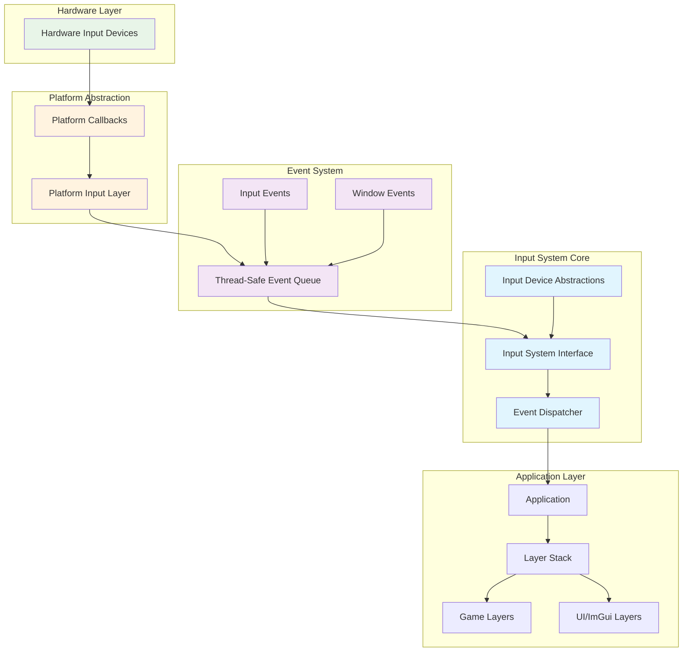
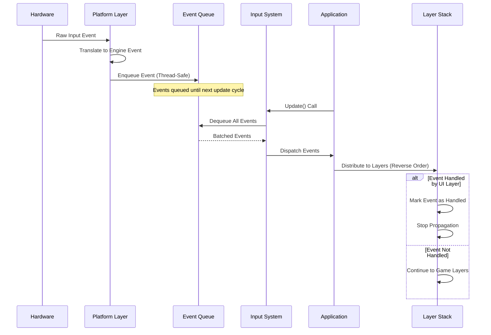
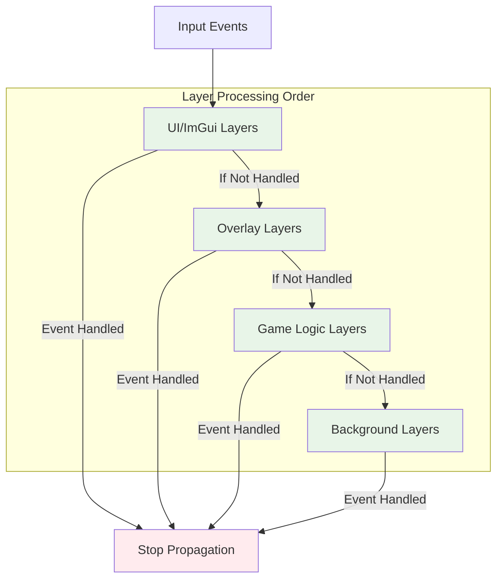

# Input System Architecture

## Overview

The Input System is a core component of the game engine that provides platform-independent input handling through a layered architecture. It supports keyboard and mouse input with a robust event-driven system that ensures thread-safe operation and proper event distribution throughout the application layers.

## Architecture Overview

The Input System follows a layered architecture design that separates concerns and provides platform independence through well-defined interfaces and abstractions.

## Core Components

### Input System Interface

The central coordinator that manages all input operations and provides the primary interface between the platform layer and the application. It handles periodic updates, event distribution, and resource management while maintaining platform independence.

**Key Responsibilities:**
- Manages the input context from the underlying platform
- Provides periodic updates to process queued input events
- Exposes events for input notifications
- Handles resource cleanup and lifecycle management

## Event Flow Architecture

The event processing follows a clear pipeline that ensures thread safety and proper event distribution:

### Event Processing Principles

1. **Hardware Input Capture**: Raw input events are captured by the platform layer
2. **Event Translation**: Platform events are converted to engine-specific event objects
3. **Thread-Safe Queuing**: Events are queued using thread-safe mechanisms for processing
4. **Processing**: All queued events are processed during the application update cycle
5. **Layer Distribution**: Events are distributed to application layers in priority order
6. **Event Handling**: Layers can mark events as handled to prevent further propagation

## Application Integration

### Layer System Architecture

The layer system provides a structured approach to event handling with clear priority ordering:

**Event Handling Pattern:**
1. Events are processed in reverse layer order (overlay layers first)
2. UI/ImGui layers typically have highest priority
3. Game layers receive events after UI layers
4. Events can be marked as handled to stop propagation
5. This ensures UI interactions take precedence over game input

## Thread Safety and Performance

### Architectural Design for Performance

The Input System is designed with performance and thread safety as primary concerns:

**Thread Safety Measures:**
- Concurrent queuing mechanisms for thread-safe event handling
- Immutable event structures prevent accidental modification
- Proper disposal patterns ensure resource cleanup

**Performance Optimizations:**
- Minimal memory allocations through efficient event structures
- Lock-free queuing operations where possible
- Batch processing of events reduces per-frame overhead
- Early termination of event propagation when handled

## Extensibility and Future Considerations

### Architectural Extensibility

The current architecture provides several extension points for future enhancements:

1. **Input Device Expansion**: The interface-based design allows for additional input devices
2. **Platform Support**: New platforms can implement the platform abstraction layer
3. **Event Type Extensions**: The hierarchical event system supports new event types
4. **Processing Pipeline Customization**: The layered approach allows for custom processing stages

### Potential Enhancements

- **Controller Support**: Game controller integration through the existing interface patterns
- **Touch Input**: Mobile platform support with touch-specific event types
- **Input Mapping Systems**: Higher-level input mapping built on the current foundation
- **Custom Input Devices**: Support for specialized input hardware

---

*This documentation outlines the high-level architecture of the Input System, focusing on design principles, component relationships, and extensibility patterns rather than implementation details.*