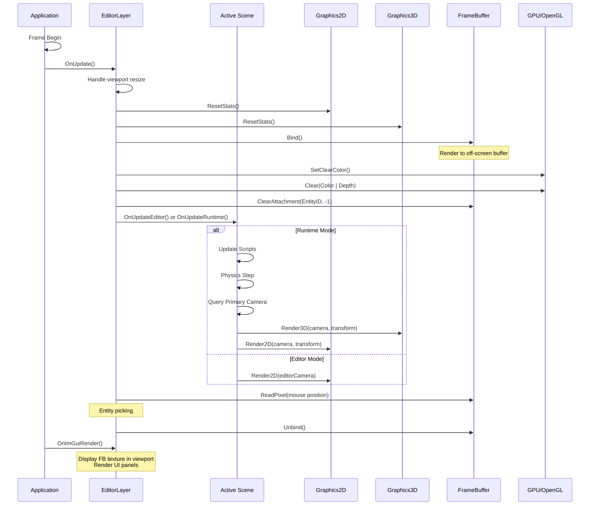
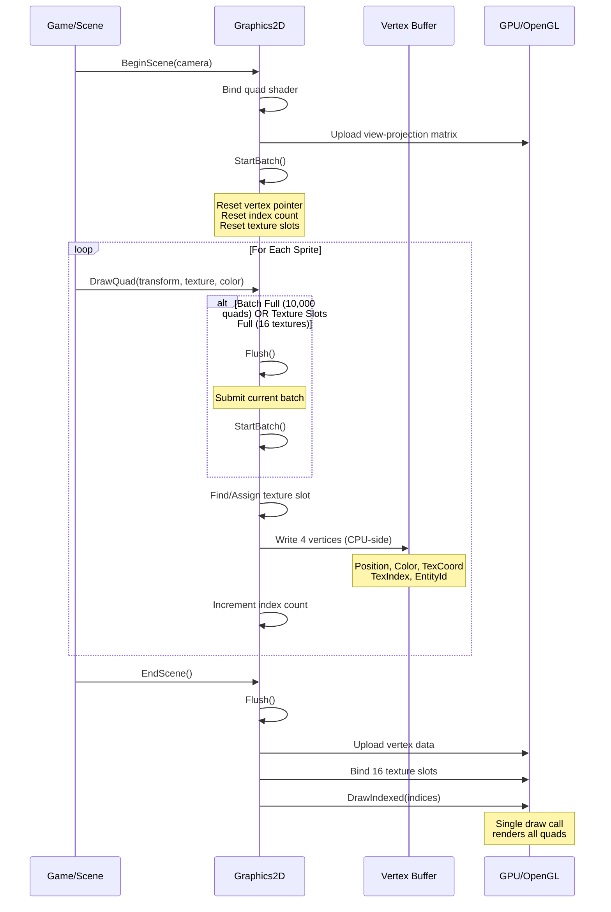
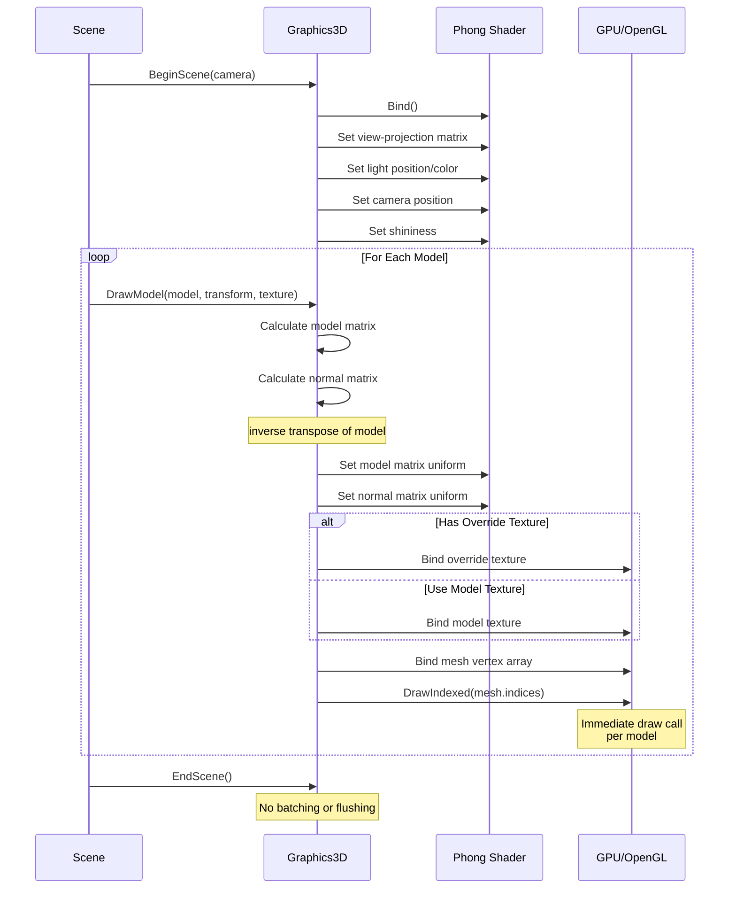
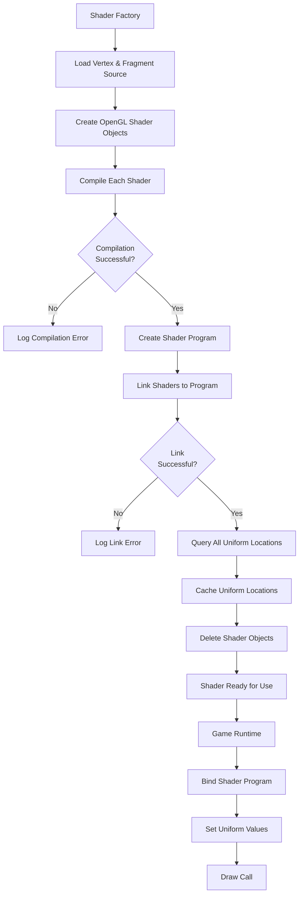
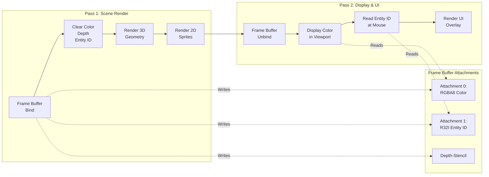
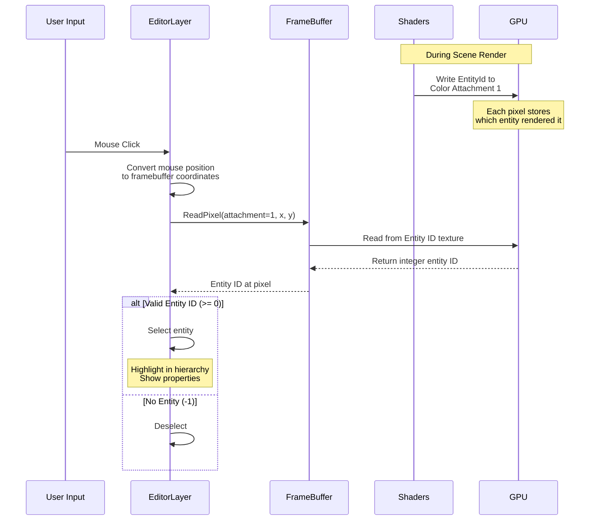
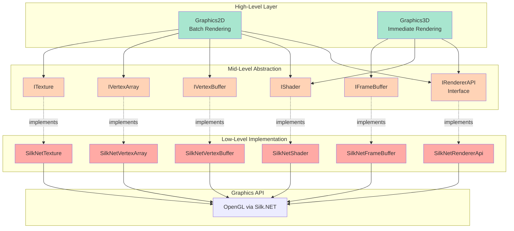

# Rendering Pipeline

## Overview

### Purpose

The rendering pipeline transforms your game's logical scene representation into pixels on screen. It handles everything from processing 3D geometry and 2D sprites to managing textures, shaders, and frame buffers. The pipeline's job is to efficiently translate your game world into visual output while maintaining high performance and extensibility.

### Scope

The rendering pipeline encompasses:
- **Scene traversal and submission** - Iterating through entities and gathering drawable data
- **Batch optimization** - Grouping similar draw operations to minimize GPU overhead
- **Shader management** - Compiling and configuring graphics programs
- **State management** - Coordinating OpenGL state across render operations
- **Multi-pass rendering** - Supporting off-screen rendering for effects like UI compositing and object picking
- **Camera integration** - Transforming world geometry to screen space

### Key Concepts

**Layered Architecture**: The pipeline operates on three distinct levels:
- **High-level API** (Graphics2D/Graphics3D) - Convenient, domain-specific interfaces for game code
- **Mid-level abstraction** (IRendererAPI) - Platform-agnostic rendering operations
- **Low-level implementation** (SilkNet/OpenGL) - Actual graphics API calls

**Immediate vs. Batched Rendering**: The engine uses two rendering strategies:
- **2D graphics** employ batched immediate mode, accumulating quads in CPU memory and flushing them in batches to minimize draw calls
- **3D graphics** use pure immediate mode, where each model results in a dedicated draw call

**Frame Buffer Flexibility**: All scene rendering happens to off-screen frame buffers first, enabling editor viewports, post-processing effects, and GPU-based object picking without additional CPU overhead.

**Entity-Driven Rendering**: Rather than managing explicit draw lists, the pipeline queries the active scene for entities with visual components and renders them automatically.

---

## Core Concepts

### Render Targets

Frame buffers serve as rendering destinations separate from the screen. The engine renders scenes to a multi-attachment frame buffer containing:
- **Color attachment** - The final rendered image
- **Entity ID attachment** - A special buffer storing which entity is at each pixel
- **Depth attachment** - Depth values for 3D occlusion

This architecture enables the editor to display the game view in a resizable panel while simultaneously supporting GPU-based mouse picking.

### Batch Rendering System

2D rendering accumulates multiple quads into a single vertex buffer before submitting them to the GPU. Each batch can contain:
- Up to 10,000 quads (40,000 vertices) - configurable via `RenderingConstants.DefaultMaxQuads`
- Up to 16 unique textures - limited by `RenderingConstants.MaxTextureSlots`
- Mixed colored and textured quads

When a batch fills up or encounters too many unique textures, the renderer flushes the current batch and starts a new one. This dramatically reduces draw calls compared to rendering each sprite individually.

### Multi-Texture Rendering

Rather than switching textures between draw calls, the renderer binds up to 16 textures simultaneously and includes a texture index with each vertex. The fragment shader uses this index to sample from the correct texture. A special white texture occupies slot 0 for untextured, colored quads.

### Lighting Model

3D rendering implements Phong lighting with three components:
- **Ambient** - Base illumination level
- **Diffuse** - Directional light based on surface normal
- **Specular** - Shiny highlights based on view angle

The lighting calculations happen per-pixel in the fragment shader, providing smooth, realistic illumination across model surfaces.

### Platform Abstraction

The rendering pipeline abstracts graphics API details behind factory-created interfaces. Game code interacts with `IShader`, `IVertexBuffer`, and `IRendererAPI` without knowing the underlying implementation. This design allows swapping OpenGL for DirectX or Vulkan by implementing new platform layers without touching high-level code.

---

## Architecture Flow

### Application Initialization

When the engine starts, it initializes the rendering subsystems:

1. **Window Creation** - Creates an OpenGL context via the platform layer
2. **Renderer API Setup** - Initializes the platform-specific renderer (SilkNet/OpenGL)
3. **Graphics Systems Init** - Prepares Graphics2D and Graphics3D singletons:
   - Allocates vertex buffers for batching
   - Creates and compiles shaders
   - Sets up vertex array objects
   - Binds default textures (white 1x1 texture for colored quads)
4. **Layer Stack Creation** - Sets up the editor and game layers that will perform rendering

### Frame Render Loop

Each frame follows this sequence:

```
Frame Begin
├── Input Processing - Handle user input events
├── Layer Updates - Execute game logic and rendering for each layer
│   ├── Editor Layer Rendering
│   │   ├── Resize handling (if viewport changed)
│   │   ├── Statistics reset
│   │   ├── Frame buffer binding
│   │   ├── Buffer clearing
│   │   ├── Scene rendering (3D then 2D)
│   │   ├── Entity picking (read frame buffer pixel)
│   │   └── Frame buffer unbinding
│   └── Additional Layers...
├── ImGui Begin - Start UI frame
├── Layer UI Rendering - Draw UI panels and overlays
└── ImGui End - Finish and submit UI
```

### Scene Rendering Flow

When a scene renders, it follows different paths based on mode:

**Runtime Mode** (Playing the game):
1. **Script Updates** - Execute game logic scripts
2. **Physics Simulation** - Step the physics world and sync transforms
3. **Camera Query** - Find the entity with the primary camera component
4. **3D Rendering Pass** - Render all mesh components
5. **2D Rendering Pass** - Render all sprite components
6. **Debug Drawing** - Optionally render physics debug shapes

**Editor Mode** (Editing the scene):
1. **Camera Setup** - Use the editor's controllable camera
2. **2D Rendering Pass** - Render all sprites
3. **Selection Rendering** - Highlight selected entities

### Graphics2D Render Cycle

The 2D rendering system operates in three phases:

**1. Scene Begin**
- Bind the quad shader
- Upload camera view-projection matrix to shader
- Reset batch state (vertex pointer, index count, texture slot counter)
- Prepare for accumulating draw data

**2. Draw Accumulation**
For each sprite or quad:
- Check if adding this quad would exceed batch limits
- If so, flush the current batch and start fresh
- Check if this quad's texture is already bound
- If not, assign it a new texture slot (or flush if all 16 slots are used)
- Calculate quad's world-space vertices from transform
- Write 4 vertices to the vertex buffer with position, color, texture coords, and texture index
- Increment index count and statistics

**3. Scene End**
- Flush any remaining quads in the current batch
- Upload vertex data to GPU
- Bind all used textures to their respective slots
- Issue a single `DrawIndexed` call to render all quads at once

### Graphics3D Render Cycle

The 3D rendering system uses a simpler immediate approach:

**1. Scene Begin**
- Bind the Phong shader
- Upload camera view-projection matrix
- Set lighting parameters (light position, color, shininess)
- Store camera position for specular calculations

**2. Draw Immediate**
For each model:
- Calculate model matrix from entity transform
- Calculate normal matrix (inverse transpose of model matrix)
- Upload matrices to shader
- Bind model's texture (or use default)
- Bind model's vertex array
- Issue `DrawIndexed` call immediately

**3. Scene End**
- Statistics are updated but no batching occurs

### Shader Compilation Flow

Shaders go through these stages during initialization:

1. **Source Loading** - Read vertex and fragment shader files from disk
2. **Shader Creation** - Create OpenGL shader objects
3. **Compilation** - Compile source code to GPU instructions
4. **Error Checking** - Query compilation status and log any errors
5. **Program Linking** - Link vertex and fragment shaders into a program
6. **Uniform Discovery** - Query all uniform locations and cache them
7. **Cleanup** - Delete individual shader objects (program retains them)

Once compiled, shaders remain resident in GPU memory. Setting uniforms involves:
1. Bind the shader program
2. Look up the uniform's cached location
3. Upload the value via OpenGL's uniform functions

### Frame Buffer Rendering Flow

Off-screen rendering enables advanced features:

1. **Bind Frame Buffer** - Subsequent rendering goes to off-screen textures
2. **Clear Attachments** - Reset color, depth, and entity ID buffers
3. **Render Scene** - Execute normal rendering pipeline
4. **Unbind Frame Buffer** - Return to screen rendering
5. **Use Frame Buffer Textures** - Display the color attachment in the editor viewport
6. **Read Special Attachments** - Query entity ID for mouse picking

This process creates a rendered image that can be:
- Displayed in an editor viewport
- Used as a texture for post-processing
- Read back to CPU for picking or screenshots

### State Transitions

OpenGL requires careful state management:

**Initialization State**:
- Enable alpha blending (for transparency)
- Enable depth testing (for 3D occlusion)
- Set blend function to standard alpha blending
- Set depth function to less-or-equal

**Per-Frame State Changes**:
- Bind/unbind frame buffers
- Bind/unbind shaders
- Bind/unbind vertex arrays
- Bind textures to multiple slots
- Set various shader uniforms

The engine follows OpenGL's binding model: objects must be bound before use, and the most recently bound object of each type is the active one.

---

## Mermaid Diagrams

### High-Level Frame Rendering Sequence



### Graphics2D Batch Rendering Flow



### Graphics3D Immediate Rendering Flow



### Shader Compilation and Usage Flow



### Frame Buffer Multi-Pass Architecture



### Entity Picking System Flow



### Platform Abstraction Architecture



---

## Lifecycle & Timing

### Initialization Phase

**When**: Application startup, before the main loop begins

**Sequence**:
1. **Window Creation** (Application constructor)
   - Creates platform window with OpenGL context
   - Sets up input callback handlers

2. **Renderer API Initialization** (RendererApiFactory)
   - Detects platform and creates appropriate renderer implementation
   - Enables OpenGL features (blending, depth testing)
   - Sets default state (blend functions, depth function)

3. **Graphics System Initialization** (Graphics2D/3D Init)
   - **Graphics2D**:
     - Allocates vertex buffers (quads and lines)
     - Creates vertex array objects with layout
     - Compiles texture shader and line shader
     - Creates white texture for colored quads
     - Generates index buffer with reusable quad indices
   - **Graphics3D**:
     - Compiles Phong lighting shader
     - Sets up default lighting parameters

4. **Layer Initialization**
   - Editor layer creates frame buffer with multiple attachments
   - Sets up orthographic camera controller
   - Loads scene and initializes panels

### Frame Execution Phase

**When**: Every frame, 60+ times per second

**Timing**: Each component executes in strict order

**Frame Structure**:
```
Frame Start (0ms)
├── Input Events (~0-1ms)
│   └── Process mouse, keyboard, window events
│
├── Layer Updates (~1-15ms)
│   ├── EditorLayer.OnUpdate()
│   │   ├── Viewport resize handling (~0ms unless resizing)
│   │   ├── Statistics reset (~0ms)
│   │   ├── Frame buffer operations (~0-1ms)
│   │   ├── Scene rendering (~5-10ms)
│   │   └── Entity picking (~0ms)
│   └── Other layers...
│
├── ImGui Frame (~2-5ms)
│   ├── Begin frame
│   ├── Layer UI rendering
│   │   └── Content browser, properties, viewport display
│   └── End frame and submit
│
└── Buffer Swap (~0-1ms)
    └── Present back buffer to screen

Total: ~8-22ms (45-120 FPS)
```

### Scene Rendering Timing

**Within Layer Update**: The scene render phase breaks down as:

1. **Frame Buffer Binding** (~0ms)
   - Lightweight OpenGL state change

2. **Clear Operations** (~0-1ms)
   - Clear 3 attachments (color, entity ID, depth)

3. **3D Rendering** (~2-8ms depending on scene complexity)
   - For each model:
     - Matrix calculations (~0.001ms)
     - Shader uniform uploads (~0.01ms)
     - Draw call submission (~0.1-1ms)
   - Scales linearly with model count

4. **2D Rendering** (~1-5ms depending on sprite count)
   - BeginScene setup (~0ms)
   - Sprite accumulation (~0.001ms per sprite)
   - Batch flush (~0.5-2ms per batch)
   - Multiple batches if many sprites or textures

5. **Frame Buffer Unbind** (~0ms)

### Batch Flush Timing

Each Graphics2D batch flush involves:
- **Vertex Upload** (~0.2-0.5ms): Transfer vertices to GPU (up to 40,000 vertices per batch)
- **Texture Binding** (~0.1-0.3ms): Bind up to 16 textures
- **Draw Call** (~0.2-1ms): Execute indexed draw command

Fewer flushes = better performance. Ideal: 1 flush per frame.

### Shader Compilation Timing

**When**: First time a shader is requested (usually during initialization)

**Duration**: 10-100ms depending on complexity

**Sequence**:
1. File I/O (~5-20ms): Load source from disk
2. Compilation (~5-50ms): GPU driver compiles to machine code
3. Linking (~2-20ms): Combine vertex and fragment shaders
4. Uniform Query (~1-5ms): Cache all uniform locations

Shaders compile once and persist for the application lifetime. No runtime recompilation occurs in the current architecture.

### Frame Buffer Operations

**Resize Timing**: When viewport changes (user drags window)
- Delete existing textures (~1ms)
- Create new textures at new size (~2-5ms)
- Reattach to frame buffer (~1ms)
- Total: ~4-7ms (causes single frame spike)

**Bind/Unbind**: Negligible (~0.001ms each)

**Pixel Readback** (Entity Picking): ~0.1-0.5ms
- Stalls pipeline waiting for GPU
- Occurs only when mouse moves in editor

### Shutdown Phase

**When**: Application exit

**Sequence**:
1. **Layer Cleanup** (dispose pattern)
   - Delete frame buffers
   - Release scene resources

2. **Graphics System Cleanup**
   - Delete vertex buffers
   - Delete vertex arrays
   - Delete shaders
   - Delete textures

3. **Renderer Shutdown**
   - Release OpenGL context

4. **Window Destruction**
   - Close platform window

### Performance Considerations

**Critical Timing**:
- Target frame time: 16.67ms (60 FPS)
- Scene rendering budget: 8-12ms
- UI rendering budget: 2-5ms
- Everything else: 2-4ms

**Bottleneck Indicators**:
- High draw call count (>1000): 3D unbatched rendering or excessive 2D batches
- Frame buffer resizes: Allocation spikes visible in profiler
- Excessive texture switches: Not fitting in 16 texture slots
- GPU stalls: Reading frame buffer every frame for picking

**Optimization Opportunities**:
- Increase batch size beyond 10,000 quads (via `RenderingConstants.DefaultMaxQuads`)
- Implement 3D instanced rendering
- Cache entity picking results between frames
- Implement frustum culling to skip off-screen entities

---

## Conclusion

The rendering pipeline represents the engine's visual output system, transforming game logic into rendered frames. Its layered architecture separates high-level convenience from low-level performance, while the dual rendering strategies (batched 2D, immediate 3D) balance simplicity with efficiency. The frame buffer system enables advanced features like editor viewports and GPU picking, demonstrating how modern rendering techniques can simplify traditionally complex operations.

Understanding this pipeline is essential for:
- Adding visual effects and post-processing
- Optimizing rendering performance
- Extending the engine to new platforms
- Debugging visual artifacts
- Implementing advanced rendering features like shadows or deferred rendering

The architecture prioritizes clarity and maintainability over maximum performance, making it an excellent foundation for learning game engine development while remaining practical for small-to-medium scale games.
