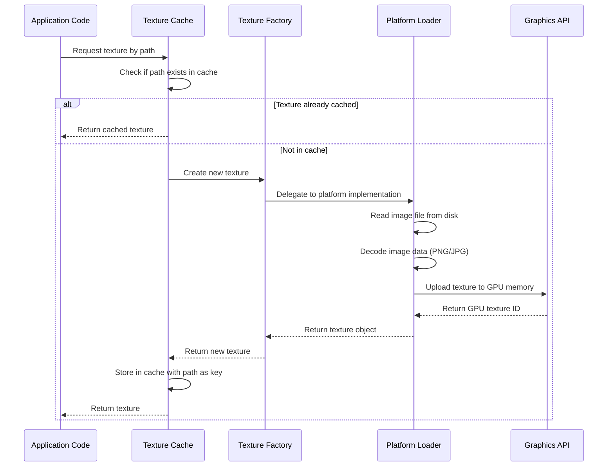
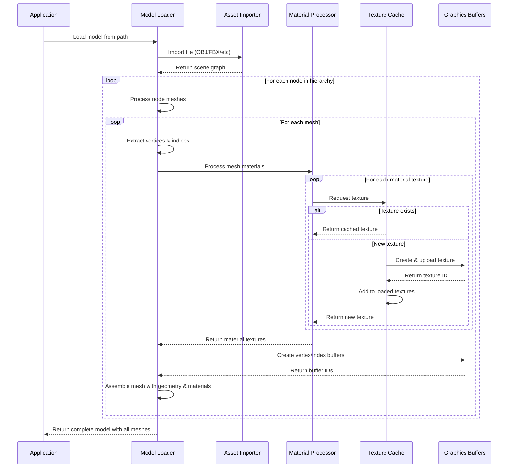
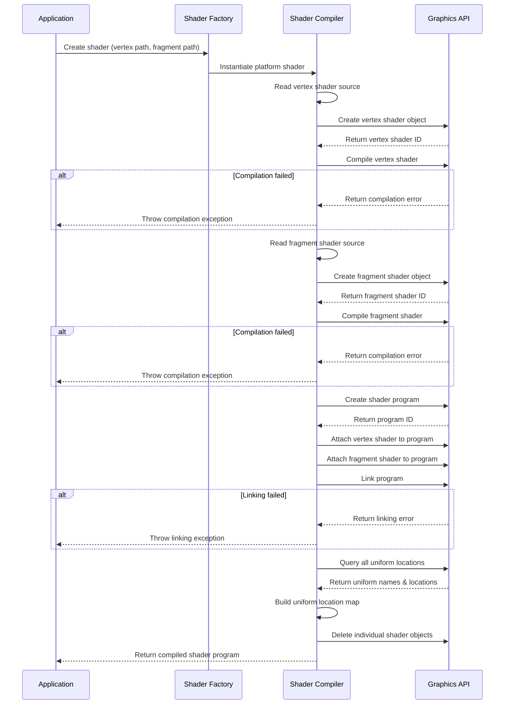
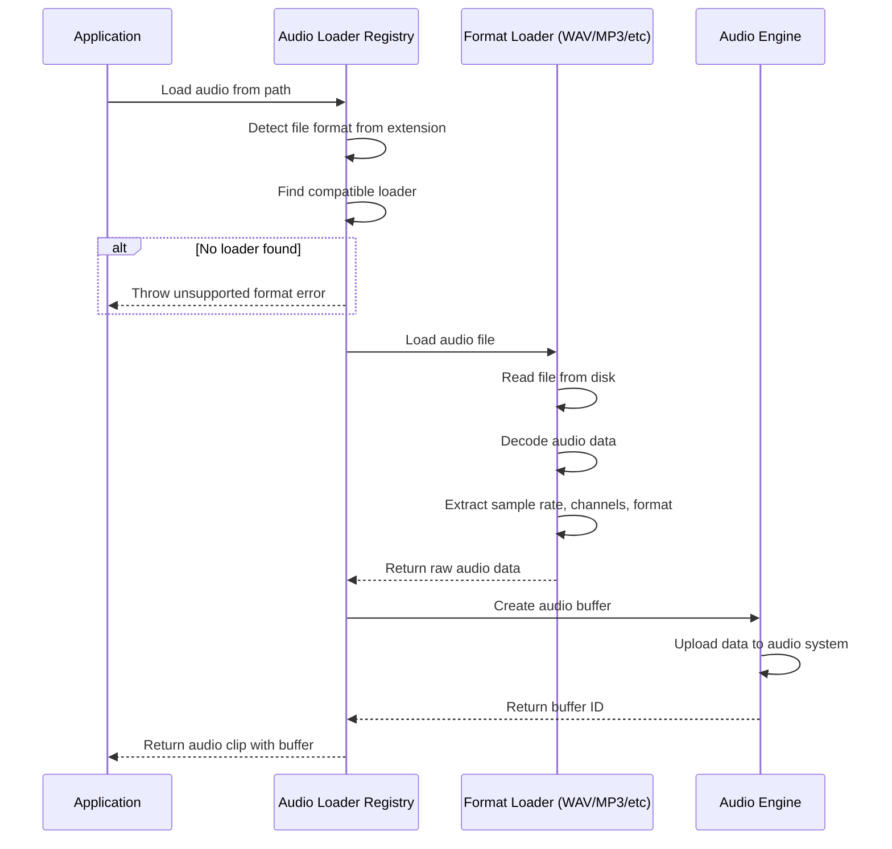
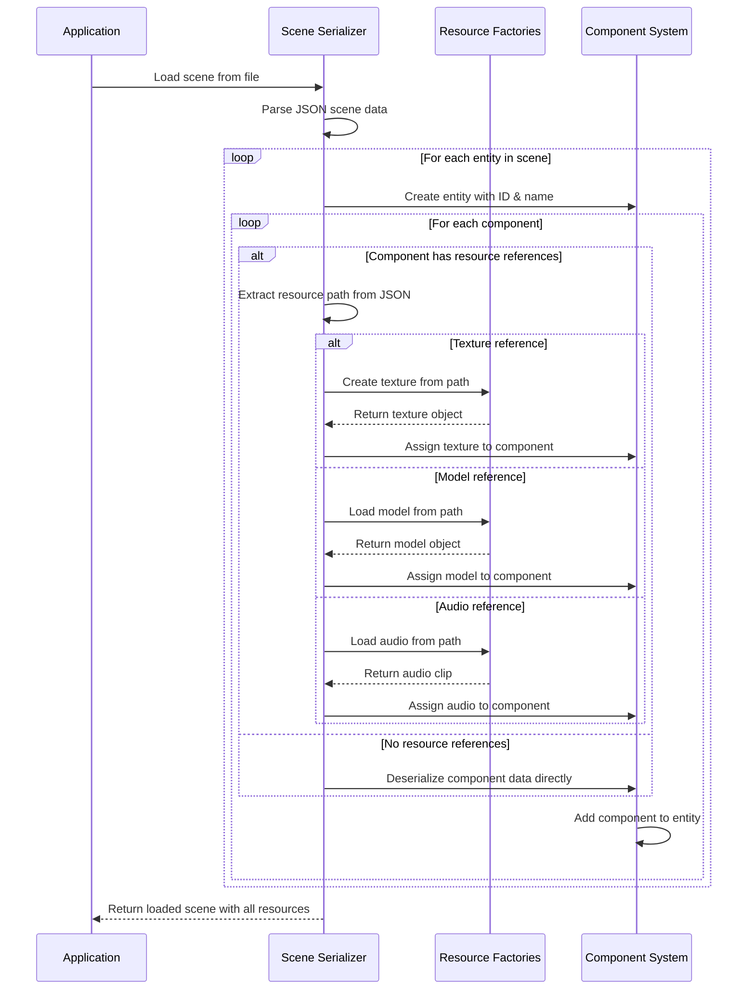

# Resource Management

## Overview

**Purpose**: The Resource Management module is responsible for loading, caching, and lifecycle management of all game assets including textures, shaders, 3D models, audio clips, and scenes. It ensures efficient memory usage, prevents duplicate resource loading, and provides a unified interface for asset access across the engine.

**Scope**: This module handles:
- Asset loading from disk (images, 3D models, audio files, shader source code)
- Resource caching and deduplication
- Platform-specific resource creation through factory patterns
- Memory lifecycle management and cleanup
- Asset path resolution and discovery

**Key Concepts**:
- **Factory Pattern**: Platform-agnostic resource creation that delegates to specific implementations
- **Lazy Loading**: Resources are loaded on-demand when first requested
- **Reference Caching**: Identical assets are loaded once and reused across multiple references
- **Loader Registry**: Extensible system for supporting different file formats
- **Serialization Integration**: Resources are referenced by path in saved scenes and recreated on load

## Core Concepts

### Resource Types

The engine manages several categories of resources:

1. **Textures** - 2D images used for sprites, UI, and material textures
2. **Shaders** - GPU programs for rendering (vertex and fragment shaders)
3. **Models** - 3D geometry with associated meshes and materials
4. **Audio Clips** - Sound effects and music files
5. **Scenes** - Serialized game worlds containing entities and components

Each resource type has:
- A platform-independent interface defining common operations
- Factory methods for creation that delegate to platform-specific implementations
- Lifecycle methods for initialization, binding, and cleanup

### Factory Pattern Architecture

The engine uses factory classes to abstract platform-specific resource creation:

```
Client Request → Factory → Platform Implementation
                    ↓
            API Type Detection
                    ↓
        (OpenGL, DirectX, Vulkan, etc.)
```

This allows the same game code to run on different rendering APIs without modification. The active API is determined at runtime through configuration.

### Caching Strategy

Resources employ different caching strategies based on their usage patterns:

- **Texture Caching**: Image files are cached by file path in dictionaries to prevent duplicate loads
- **Model Texture Deduplication**: When loading 3D models, material textures are checked against previously loaded textures
- **No Global Shader Cache**: Shaders are created per-request but are typically singleton instances
- **Scene Deserialization**: Resources are recreated from path references when scenes load

## Architecture Flow

### Texture Loading Flow

The texture loading process demonstrates the typical resource loading pattern:

1. **Request Initiation**: Application code requests a texture by file path
2. **Cache Check**: System checks if texture already exists in cache
3. **Factory Delegation**: If not cached, factory delegates to platform-specific loader
4. **File Loading**: Image data is read from disk and decoded
5. **GPU Upload**: Texture data is uploaded to graphics memory
6. **Cache Storage**: Texture reference is stored with its path as key
7. **Return Handle**: Caller receives texture object with GPU identifier



### 3D Model Loading Flow

Model loading is more complex due to hierarchical structure and multiple sub-resources:

1. **Model Import**: File is parsed using asset import library (Assimp)
2. **Node Traversal**: Scene graph is traversed to extract all meshes
3. **Mesh Processing**: Each mesh extracts vertices, indices, and material references
4. **Material Loading**: Textures referenced by materials are loaded with deduplication
5. **GPU Buffer Creation**: Vertex and index data are uploaded to GPU buffers
6. **Mesh Assembly**: Complete mesh objects are created with all sub-resources



### Shader Compilation Flow

Shaders undergo a compilation process before they can be used:

1. **Source Loading**: Vertex and fragment shader source code read from files
2. **Shader Compilation**: Each shader type is compiled independently
3. **Program Linking**: Compiled shaders are linked into a program
4. **Uniform Discovery**: All shader uniforms are detected and mapped
5. **Cleanup**: Individual shader objects are deleted, program retained



### Audio Loading Flow

Audio resources use a registry pattern for format-specific loaders:

1. **Format Detection**: File extension determines appropriate loader
2. **Loader Selection**: Registry returns compatible loader for format
3. **Audio Decoding**: File is decoded into raw audio data
4. **Buffer Creation**: Audio buffer is created in audio engine
5. **Clip Assembly**: Audio clip object wraps buffer with metadata



### Scene Deserialization Resource Flow

When loading a scene, resources must be recreated from serialized path references:

1. **Scene Loading**: JSON scene file is parsed
2. **Entity Creation**: Entities are instantiated with IDs and names
3. **Component Deserialization**: Each component is reconstructed
4. **Resource Resolution**: Component properties referencing assets are resolved
5. **Asset Recreation**: Resources are loaded using stored file paths
6. **Reference Assignment**: Loaded resources are assigned to component properties



## Lifecycle & Timing

### Initialization Phase

**Engine Startup**:
- Graphics system initializes before any resources are loaded
- Audio engine initializes during application load phase
- Loader registries are populated with supported format handlers
- Factory classes configure platform-specific implementations

**Timing**: Initialization occurs during `Application.HandleGameWindowOnLoad()` before any layers attach.

### Runtime Phase

**Resource Loading**:
- Resources are loaded **on-demand** when first requested
- No pre-loading or asset manifests by default
- Loading occurs synchronously on the main thread
- Cache lookups prevent duplicate loads within a session

**When Resources Load**:
- **Textures**: When scene deserializes or content browser displays preview
- **Models**: When entity with model component is added to scene
- **Shaders**: During graphics system initialization or when new material requires custom shader
- **Audio**: When sound component is added or audio playback is requested
- **Scenes**: When scene manager switches active scene

**Execution Timing**: Resource loading can occur at any point during the frame update cycle, typically during:
- Scene initialization/switching
- Entity instantiation
- Component addition
- Asset drag-and-drop from content browser

### Cleanup Phase

**Resource Disposal**:
- Platform-specific resources implement disposal patterns
- GPU resources (textures, buffers, shaders) must be explicitly deleted
- Disposal releases graphics memory and removes handles

**When Cleanup Occurs**:
- **Scene Switch**: Old scene's unique resources may be disposed
- **Entity Destruction**: When entity is removed, its component resources can be released
- **Application Shutdown**: All remaining resources are disposed
- **Explicit Disposal**: Models and meshes can be manually disposed when no longer needed

**Memory Management**:
- Textures loaded during scene deserialization persist until scene unloads
- Cached textures in content browser remain until editor session ends
- Model textures are reference-counted through cache deduplication
- No automatic garbage collection - disposal must be explicit

### Key Timing Considerations

**Synchronous Loading**: All resource loading is synchronous, which can cause frame hitches for large assets. Consider:
- Loading screens when switching scenes
- Asset preloading for known upcoming content
- Async loading implementation for production games

**Cache Lifetime**: Resources remain in cache for application lifetime unless explicitly cleared. Memory usage grows with asset diversity.

**Path Dependencies**: Serialized scenes store relative paths. Asset files must maintain their location relative to the assets directory, or references break.

## Resource Resolution & Path Management

### Asset Path Structure

The engine uses a centralized asset directory structure:
- **Assets Root**: Configurable base directory for all game assets
- **Relative Paths**: All resource references use paths relative to assets root
- **Path Resolution**: Asset manager maintains the root path and resolves full paths on request

### Content Browser Integration

The content browser provides visual asset management:
- Displays file system hierarchy starting from assets root
- Generates thumbnail previews by loading textures into cache
- Supports drag-and-drop assignment to component properties
- Maintains image cache to avoid reloading preview textures

## Extension Points

### Adding New Resource Types

To add support for new resource types:

1. **Define Interface**: Create interface describing resource operations (Bind, Unbind, etc.)
2. **Create Factory**: Implement factory class with API-specific delegation
3. **Platform Implementation**: Create platform-specific resource loader
4. **Serialization Support**: Add serialization/deserialization logic if needed in scene system

### Supporting New File Formats

To add new file format support:

1. **Audio Formats**: Implement `IAudioLoader` interface and register with `AudioLoaderRegistry`
2. **Model Formats**: Asset importer (Assimp) supports many formats automatically
3. **Image Formats**: Image decoder (StbImageSharp) supports common formats by default
4. **Custom Formats**: Create custom loader and integrate with appropriate factory

### Platform Abstraction

To add new rendering platform (e.g., DirectX, Vulkan):

1. Implement platform-specific classes for: Texture2D, Shader, VertexBuffer, IndexBuffer
2. Add new `ApiType` enum value for the platform
3. Update factory classes to include new platform in switch statements
4. Implement platform initialization in graphics context

## Best Practices

### Resource Loading
- Always use factories for resource creation to maintain platform independence
- Check cache before creating new resources when implementing custom loaders
- Store resource paths with assets for serialization support
- Handle loading failures gracefully with fallback resources

### Memory Management
- Dispose resources when no longer needed to prevent memory leaks
- Be mindful of cache growth in long-running sessions
- Consider weak references for infrequently used resources
- Implement reference counting for shared resources

### Performance
- Preload resources during loading screens or scene transitions
- Consider async loading for large assets in production
- Use texture atlases to reduce individual texture loads
- Batch resource loads when possible to minimize I/O overhead

### Asset Organization
- Maintain consistent directory structure in assets folder
- Use meaningful names for asset files that reflect their purpose
- Keep related assets together (e.g., model with its textures)
- Document custom asset path requirements for team members
