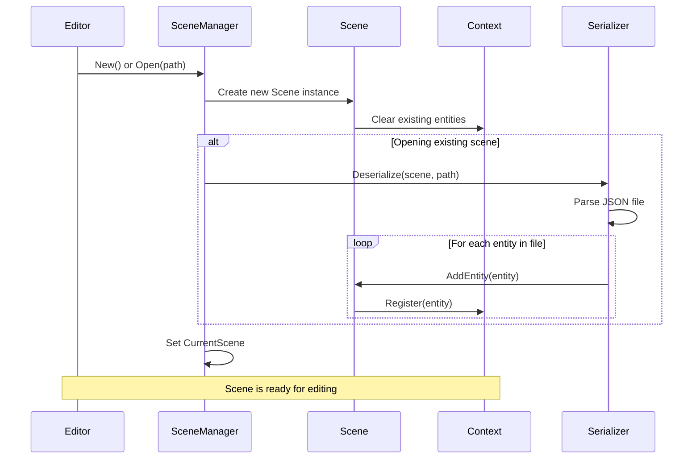
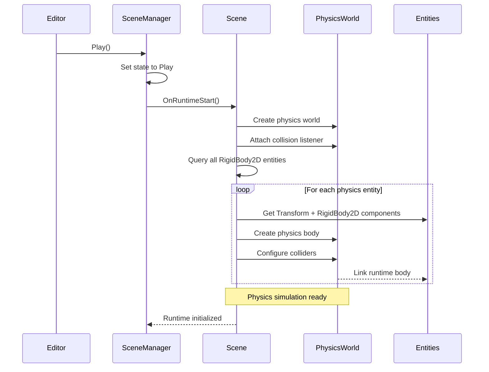
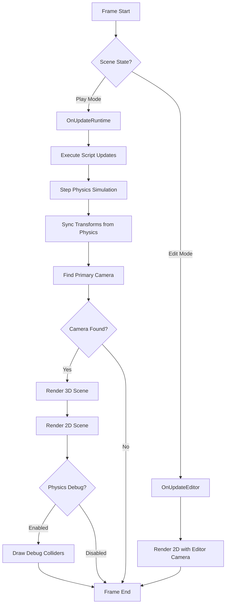
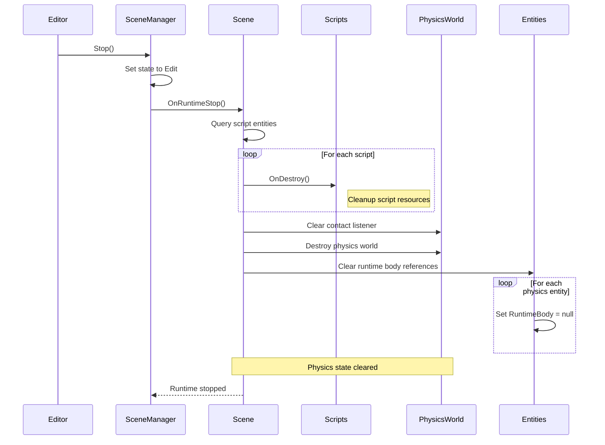
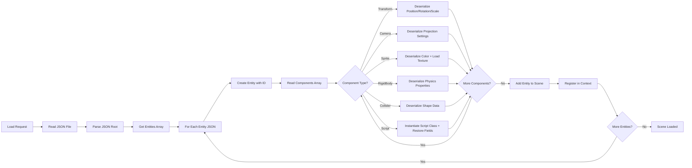
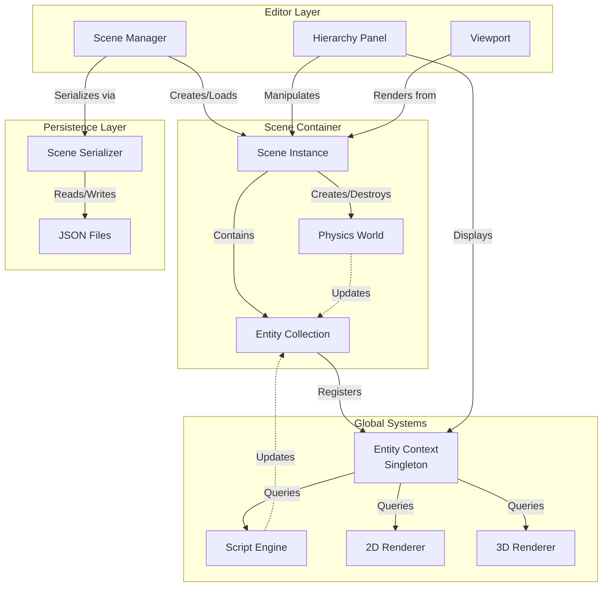
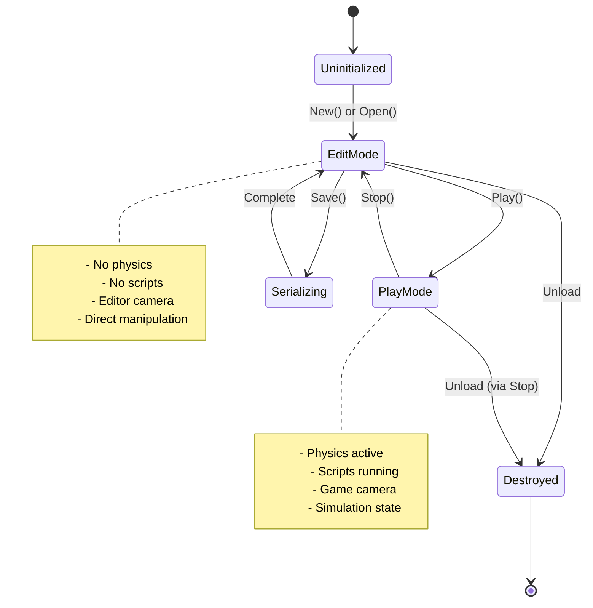

# Scene Management

## Overview

**Purpose**: The Scene Management module is the organizational backbone of the game engine, responsible for structuring game worlds as collections of entities and managing their entire lifecycle from creation through gameplay to serialization.

**Scope**: This module handles:
- Entity creation, registration, and destruction
- Scene state transitions (Edit mode vs. Play mode)
- Integration between the editor workflow and runtime execution
- Scene persistence through serialization and deserialization
- Physics world initialization and cleanup
- Viewport management and camera synchronization

**Key Concepts**:
- **Entity-Component Architecture**: Scenes are collections of entities (game objects) that contain components (data and behavior)
- **State-Based Execution**: Scenes operate in distinct modes (Edit/Play) with different update behaviors
- **Global Context**: A singleton pattern provides unified access to all entities across the engine
- **Lifecycle Separation**: Clear boundaries between editor-time operations and runtime gameplay

## Core Concepts

### Scene as a Container
A scene represents a complete game world or level. It's not just a data structure but an active coordinator that:
- Manages all entities within that world
- Orchestrates physics simulation during gameplay
- Coordinates rendering by identifying cameras and renderable entities
- Handles the transition between design-time and play-time states

### Dual-Mode Operation
Scenes operate in two fundamental modes:

**Edit Mode**: The scene is in a design state where:
- Developers can freely manipulate entities
- Physics simulation is inactive
- Changes are immediate and reversible
- The editor camera controls the view

**Play Mode**: The scene is in active gameplay where:
- Physics simulation runs continuously
- Scripts execute their gameplay logic
- Entity transforms are driven by simulation
- The primary game camera controls the view

### Entity Lifecycle Management
Entities within a scene follow a controlled lifecycle:
1. **Creation**: Entities are spawned with unique identifiers
2. **Registration**: Added to the global entity context for querying
3. **Component Attachment**: Functionality is added through components
4. **Active Use**: Entities participate in updates and rendering
5. **Destruction**: Entities are removed from the scene cleanly

## Architecture Flow

### Scene Initialization



**Flow Description**:
1. The editor requests either a new blank scene or loading an existing scene from disk
2. A fresh scene instance is created, which automatically clears the global entity context
3. If loading from disk, the serializer parses the JSON scene file
4. Each entity and its components are reconstructed from JSON data
5. Entities are registered with the global context, making them queryable by systems
6. The scene becomes the "current" active scene accessible throughout the engine

### Play Mode Transition



**Flow Description**:
1. User triggers play mode from the editor
2. Scene state transitions from Edit to Play
3. A new physics world is instantiated with gravity settings
4. The scene queries all entities with rigid body components
5. For each physics-enabled entity:
   - Transform data (position, rotation) is extracted
   - A corresponding physics body is created in the physics world
   - Collider shapes are generated and attached
   - The runtime physics body reference is stored in the component
6. The physics simulation is now active and ready to step forward

### Runtime Update Loop



**Flow Description**:

**Edit Mode Path**:
- Uses the editor-controlled orthographic camera
- Renders only visual representations (sprites, meshes)
- No physics or script execution occurs

**Play Mode Path**:
1. **Script Execution**: All script components receive update callbacks with delta time
2. **Physics Step**: The physics world advances by a fixed timestep (1/60th second)
3. **Transform Synchronization**: Entity positions and rotations are updated from physics simulation results
4. **Camera Resolution**: The scene identifies the primary camera entity
5. **3D Rendering**: If 3D models exist, they're rendered from the camera's perspective
6. **2D Rendering**: Sprite-based entities are rendered in screen space
7. **Debug Visualization**: Optional physics collider outlines are drawn for debugging

### Stop Play Mode



**Flow Description**:
1. Editor triggers stop (returning to Edit mode)
2. Scene state transitions back to Edit
3. All script components receive cleanup notifications (OnDestroy)
4. The physics contact listener is detached and cleared
5. All runtime physics body references are nullified
6. The entire physics world is destroyed
7. The scene returns to a clean edit state, ready for modifications

### Scene Serialization

```mermaid
flowchart LR
    A[Save Request] --> B[Create JSON Root]
    B --> C[Iterate All Entities]
    C --> D[For Each Entity]

    D --> E[Serialize ID & Name]
    E --> F{Has Transform?}
    F -->|Yes| G[Serialize Transform]
    F -->|No| H{Has Camera?}
    G --> H

    H -->|Yes| I[Serialize Camera]
    H -->|No| J{Has Sprite?}
    I --> J

    J -->|Yes| K[Serialize Sprite & Texture Path]
    J -->|No| L{Has Physics?}
    K --> L

    L -->|Yes| M[Serialize RigidBody + Collider]
    L -->|No| N{Has Script?}
    M --> N

    N -->|Yes| O[Serialize Script Type & Fields]
    N -->|No| P[Add to JSON Array]
    O --> P

    P --> Q{More Entities?}
    Q -->|Yes| D
    Q -->|No| R[Write JSON to File]
```



**Flow Description**:
1. Save is triggered with a target file path
2. A JSON structure is created with scene metadata
3. The serializer iterates through all entities in the scene
4. For each entity:
   - Basic identity (ID, name) is written
   - Each component type is checked in sequence
   - Component data is converted to JSON representation
   - Special handling for textures (storing file paths)
   - Script fields are introspected and serialized
5. The complete JSON is formatted with indentation
6. The file is written to disk in the scenes directory

### Scene Deserialization



**Flow Description**:
1. An existing scene file path is provided
2. The JSON file is read and parsed into a document structure
3. The entities array is extracted from the root
4. For each entity in the JSON:
   - An entity object is created with the stored ID and name
   - The components array is processed
   - Each component type is matched to its deserializer
   - Transform data (vectors) is reconstructed
   - Texture paths are loaded into actual texture resources
   - Script types are looked up and instantiated
   - Script field values are restored via reflection
   - The fully reconstructed entity is added to the scene
   - Entity is registered in the global context for querying
5. The scene is now populated and ready for use

## Lifecycle & Timing

### Initialization Phase

**When**: Scene is created or loaded from disk

**Operations**:
- Clear the global entity context to ensure no stale data
- If loading from file, deserialize all entities and components
- Register entities with the context for system queries
- Prepare viewport dimensions for camera initialization
- Set up component event listeners (e.g., camera viewport updates)

**Editor State**: Scene is in Edit mode, ready for manipulation

### Edit Mode Execution

**When**: Continuously while scene is open in editor

**Frame Operations**:
- Render scene using editor camera (user-controlled)
- No physics simulation
- No script execution
- Entity modifications take effect immediately

**Timing**: Runs at editor framerate (typically 60 FPS)

### Runtime Start Phase

**When**: User presses Play button in editor

**Operations**:
1. Create physics world with gravity configuration
2. Attach collision listener for physics events
3. Query all entities with rigid body components
4. Instantiate physics bodies for each entity
5. Configure collider shapes and physics properties
6. Link physics bodies back to entity components
7. Initialize all script components

**Duration**: Single-frame operation, synchronous

### Runtime Execution Phase

**When**: Every frame while in Play mode

**Frame Operations** (in order):
1. **Script Update** (~beginning of frame): Execute all script OnUpdate callbacks
2. **Physics Step** (~mid-frame): Advance physics simulation by fixed timestep
3. **Transform Sync** (~after physics): Copy positions/rotations from physics to entities
4. **Camera Resolution**: Find the primary camera entity
5. **Rendering** (~end of frame):
   - 3D model rendering
   - 2D sprite rendering
   - Optional physics debug visualization

**Timing**: Fixed timestep for physics (1/60s), variable for rendering

### Runtime Stop Phase

**When**: User presses Stop button in editor

**Operations** (in order):
1. Execute OnDestroy for all script components
2. Detach and clear physics contact listener
3. Null out all runtime physics body references
4. Destroy the physics world
5. Return to Edit mode state

**Important**: Entities and their component data persist (return to pre-play state)

### Shutdown/Cleanup

**When**: Scene is unloaded or application exits

**Operations**:
- If in Play mode, execute runtime stop first
- Clear all entity references from context
- Release any texture or resource handles
- Nullify the current scene reference

**State**: Clean slate for next scene load

## Data Flow Architecture



## State Machine



## Key Integration Points

### Entity Context Integration
- **Purpose**: Provides a centralized registry of all entities across the engine
- **Pattern**: Singleton accessed via static instance
- **Scene's Role**: Registers entities on creation, clears context on initialization
- **Querying**: Systems use the context to find entities with specific component combinations

### Physics World Integration
- **Purpose**: Simulates realistic physics behavior for game entities
- **Lifecycle**: Created during OnRuntimeStart, destroyed during OnRuntimeStop
- **Data Flow**: Transform data flows TO physics on start, FROM physics during updates
- **Entity Linking**: Physics bodies store entity references for collision callbacks

### Rendering Integration
- **Purpose**: Visualize scene contents on screen
- **Camera-Driven**: Scene identifies the primary camera each frame
- **Multi-Pass**: Separate 3D and 2D rendering passes in sequence
- **State-Aware**: Different rendering paths for Edit vs Play mode

### Serialization Integration
- **Purpose**: Persist scene data to disk for saving and loading
- **Format**: Human-readable JSON with typed component data
- **Resource Handling**: Stores asset paths (textures) not binary data
- **Script Preservation**: Serializes script types and exposed field values

### Editor Integration
- **Scene Manager**: Orchestrates scene lifecycle operations (New, Open, Save, Play, Stop)
- **Hierarchy Panel**: Displays and allows manipulation of scene entities
- **Viewport**: Renders scene content with appropriate camera based on mode
- **State Coordination**: Ensures editor UI reflects current scene state

## Mental Model for Developers

Think of a scene as a **theatrical stage**:

- **The Stage Itself** (Scene): Provides the space and rules for action
- **Actors** (Entities): The game objects that populate the world
- **Costumes & Props** (Components): What makes each actor unique and functional
- **Rehearsal vs Performance** (Edit vs Play): Design time vs runtime behavior
- **Director** (Scene Manager): Controls when to rehearse, perform, or reset
- **Script** (Scene File): The written record that recreates the same performance

### Developer Workflow

1. **Creating Content**: Add entities to scene, attach components, position objects
2. **Testing Gameplay**: Enter Play mode to see physics and scripts in action
3. **Iterating**: Stop, modify, replay - the cycle repeats
4. **Saving Work**: Serialize scene to preserve your creation
5. **Loading Later**: Deserialize to restore exact scene state

### Common Patterns

**Query Pattern**: Need entities with specific components? Use context queries:
```
var group = Context.Instance.GetGroup([typeof(Transform), typeof(Sprite)])
```

**Lifecycle Pattern**: Need initialization or cleanup? Use OnRuntimeStart/Stop

**State Pattern**: Different behavior in Edit vs Play? Check scene state in your systems

**Persistence Pattern**: Need data to survive saves? Ensure components are serializable
