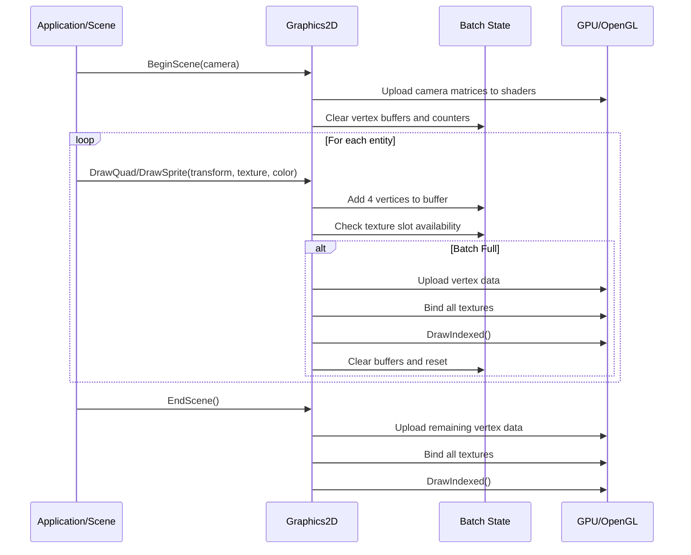
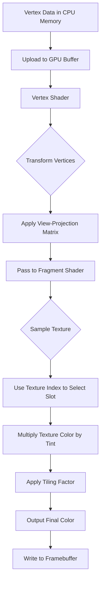
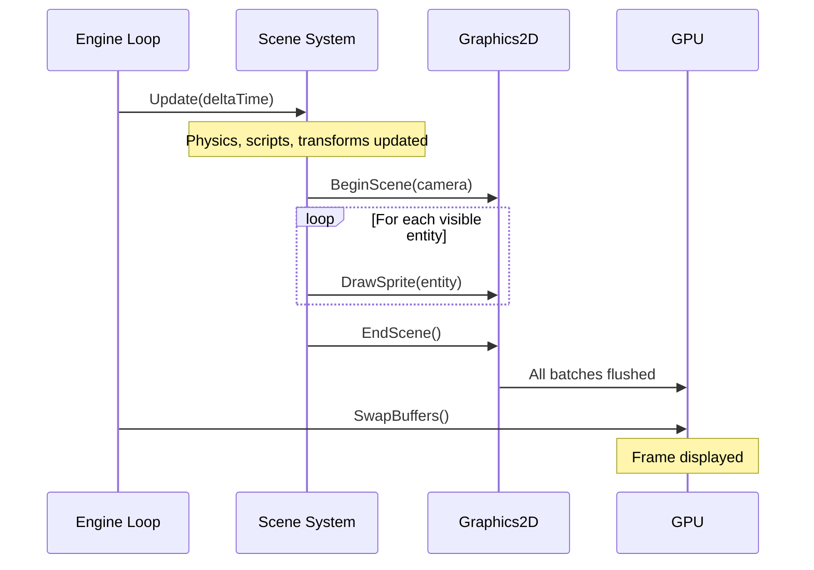
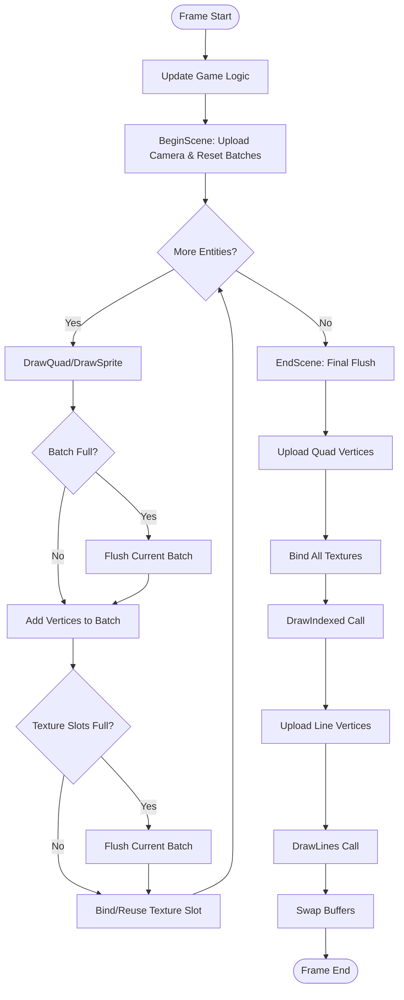
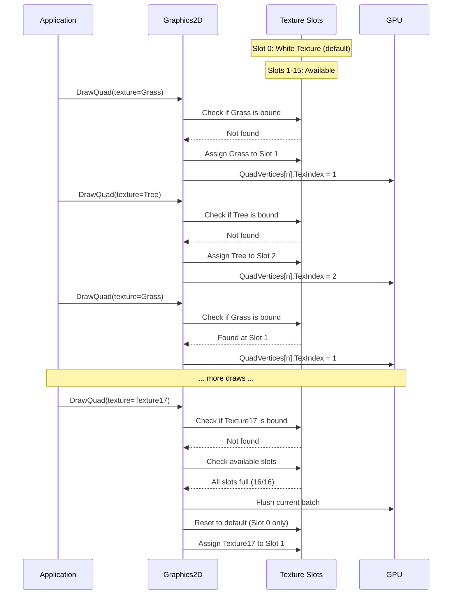
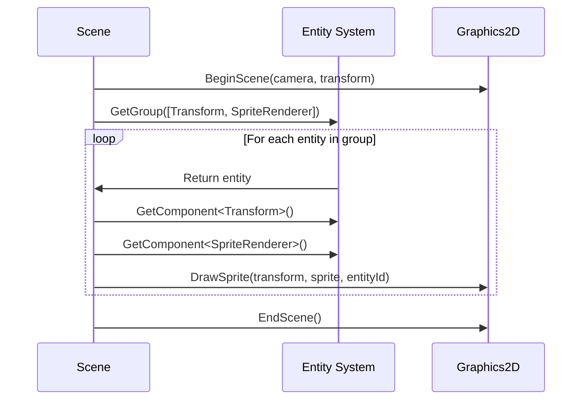

# OpenGL 2D Rendering Workflow

## Overview

The OpenGL 2D rendering system is the core visualization pipeline responsible for transforming game entities and sprites into pixels on screen. This module orchestrates the entire process from scene setup through geometry batching, texture management, shader execution, and final draw calls.

### Purpose
- Efficiently render 2D sprites, quads, and primitive shapes using OpenGL
- Minimize draw calls through intelligent batching of similar geometry
- Support multiple textures within a single batch using texture slots
- Provide a high-level abstraction over low-level OpenGL operations

### Scope
The rendering workflow manages:
- Batched quad and line rendering with dynamic vertex buffers
- Multi-texture support with automatic texture slot management
- Shader programs for vertex transformation and fragment coloring
- Camera-based view transformations
- Entity identification for editor picking

### Key Concepts

**Batch Rendering**: Instead of issuing one draw call per sprite, the system accumulates multiple quads into large vertex buffers and submits them in batches. This dramatically reduces CPU-GPU communication overhead.

**Texture Atlasing**: Up to 16 different textures can be bound simultaneously. The shader uses a texture index to sample from the correct texture slot, allowing diverse sprites to be rendered in a single draw call.

**Dynamic Vertex Buffers**: Vertex data is built on the CPU each frame and uploaded to GPU memory before drawing. This supports fully dynamic scenes where every sprite can move, change color, or swap textures.

**Immediate Mode API**: The rendering interface uses a "begin scene, draw primitives, end scene" pattern that feels immediate while actually performing deferred batching internally.

## Architecture Flow

### 1. Initialization Phase

When the graphics system starts up, it prepares all the resources needed for rendering:

1. **Vertex Array Objects (VAO)** are created to define how vertex data is laid out
2. **Vertex Buffers** are allocated on the GPU with capacity for maximum batch sizes
3. **Index Buffers** are pre-populated with triangle indices for quad tessellation
4. **Shaders** are compiled from source files and linked into programs
5. **Default Textures** (white 1x1 pixel) are created for solid color rendering
6. **Texture Slots** array is initialized to track which textures are currently bound

### 2. Frame Rendering Cycle

Each frame follows a strict sequence:

```
BeginScene → Draw Calls → EndScene
```

**BeginScene**:
- Accepts camera parameters (view and projection matrices)
- Uploads camera matrices to shader uniforms
- Clears all batch state (vertex counters, texture slots, etc.)
- Prepares for accumulating draw commands

**Draw Calls**:
- Application code calls drawing methods (DrawQuad, DrawSprite, DrawLine, etc.)
- Each draw call adds vertices to the current batch
- If batch limits are reached (max vertices or texture slots), a flush occurs automatically
- Texture management: New textures are assigned to available slots; duplicate textures reuse existing slots

**EndScene**:
- Triggers final flush to draw any remaining geometry
- All accumulated data is submitted to the GPU

### 3. Batching Logic

The system maintains two separate batches:

**Quad Batch** (for filled rectangles and sprites):
- Accumulates quad vertices with position, color, texture coordinates, texture index, tiling factor, and entity ID
- Each quad requires 4 vertices and 6 indices (two triangles)
- Maximum capacity: configured number of quads (e.g., 10,000 quads = 40,000 vertices)

**Line Batch** (for debug wireframes and primitive shapes):
- Accumulates line vertices with position, color, and entity ID
- Each line requires 2 vertices
- Uses GL_LINES primitive topology

When a batch is full (max indices or max texture slots reached), the system automatically:
1. Flushes current batch to GPU
2. Resets counters
3. Continues accumulating in a fresh batch

### 4. Data Flow Through the Pipeline



### 5. Shader Execution Pipeline



**Vertex Shader Responsibilities**:
- Transform vertex positions from world space to clip space using camera matrices
- Pass through vertex attributes (color, texture coordinates, texture index, etc.) to fragment shader

**Fragment Shader Responsibilities**:
- Sample the appropriate texture using the texture index
- Apply tiling by multiplying texture coordinates
- Blend texture color with tint color
- Output final pixel color and entity ID (for editor picking)

### 6. Texture Management

The system maintains an array of texture slots (typically 16):

**Slot 0**: Reserved for the default white texture (used for solid color quads)

**Slots 1-15**: Dynamically assigned to textures as they're encountered during batching

**Texture Binding Logic**:
1. When a quad is drawn with a texture, check if that texture is already bound
2. If found, reuse the existing slot index
3. If not found and slots are available, bind texture to next available slot
4. If all slots are full, flush the current batch and start fresh

This approach minimizes texture binding operations while supporting diverse content.

## Rendering Workflow Stages

### Stage 1: Initialization

During system startup, the renderer creates all necessary OpenGL resources:

**Buffer Creation**:
- Allocate vertex buffer with capacity for maximum vertices per batch
- Define buffer layout describing vertex structure (position, color, UV, etc.)
- Create index buffer with pre-computed triangle indices
- Configure vertex array object to link buffers to shader attributes

**Shader Compilation**:
- Load vertex and fragment shader source code from files
- Compile each shader and check for errors
- Link shaders into a complete program
- Extract uniform locations for later updates

**Resource Initialization**:
- Create 1x1 white texture for rendering solid colors
- Initialize texture slot array
- Set OpenGL state (enable blending, depth testing)

### Stage 2: Scene Setup (BeginScene)

Before rendering any geometry, the scene must be initialized with camera data:

1. Bind the quad shader program
2. Upload the camera's view-projection matrix to uniform variable
3. Repeat for line shader
4. Call StartBatch() to reset all accumulation state

**StartBatch Operations**:
- Clear vertex buffer arrays in CPU memory
- Reset vertex and index counters to zero
- Reset texture slot index (keeping white texture in slot 0)

### Stage 3: Geometry Submission

The application submits drawing commands for each visible entity:

**DrawQuad/DrawSprite**:
- Accept transformation matrix, texture reference, and rendering properties
- Check if adding this quad would exceed batch capacity
  - If yes, call NextBatch() to flush and reset
- Manage texture slots:
  - Search for texture in currently bound slots
  - If not found, assign to next available slot
  - If slots exhausted, flush batch
- Transform the four corner vertices using the provided matrix
- Populate vertex structure with all attributes
- Increment vertex counter by 4
- Increment index counter by 6

**DrawLine**:
- Similar process but simpler (only 2 vertices, no textures)
- Uses separate line batch and line shader

### Stage 4: Batch Flushing

Flushing transfers accumulated CPU data to the GPU and issues draw calls:

**Flush Quad Batch**:
1. Calculate total size of vertex data
2. Bind quad shader program
3. Bind quad vertex array object (activates buffer bindings)
4. Upload vertex data to GPU buffer using SetData()
5. Bind all active textures to their respective slots
6. Call DrawIndexed() with index count
7. Increment draw call statistics

**Flush Line Batch**:
1. Bind line shader and line vertex array
2. Upload line vertex data
3. Set line width (OpenGL state)
4. Call DrawLines() with vertex count

### Stage 5: Scene Completion (EndScene)

When all geometry has been submitted:
- Call Flush() to render any remaining batched data
- Both quad and line batches are flushed
- Frame rendering is complete

## Lifecycle & Timing

### Initialization
The Graphics2D system is initialized once at application startup:
- Typically called from the main engine initialization routine
- Must occur after OpenGL context creation
- Creates all buffers, shaders, and resources
- Sets OpenGL rendering state (blending, depth testing)

### Per-Frame Execution
Each frame follows this sequence:

1. **Scene Update** (Physics, scripts, animations update entity transforms)
2. **Render Start** - BeginScene() called with active camera
3. **Scene Traversal** - Loop through all visible entities calling draw methods
4. **Render End** - EndScene() flushes final geometry
5. **Swap Buffers** - Present rendered frame to screen

**Editor Mode**: Uses orthographic camera and renders in edit mode
**Runtime Mode**: Uses scene's primary camera and renders active scene

### Execution Timing Within Frame

The rendering occurs after all game logic and physics updates:



### Shutdown
When the application closes:
- OpenGL resources (buffers, textures, shaders) are automatically cleaned up
- Destructors handle GPU object deletion
- No explicit shutdown method required (resources are RAII-managed)

## Advanced Features

### Multi-Texture Batching

The system supports rendering up to 16 different textures in a single draw call:

**How It Works**:
- Fragment shader declares an array of 16 sampler2D uniforms
- Each vertex carries a texture index (0-15) indicating which sampler to use
- Switch statement in fragment shader samples the correct texture
- This eliminates the need for texture rebinding between different sprites

**Benefits**:
- Drastically reduces draw calls in textured scenes
- Enables true batch rendering with diverse sprites
- Maintains high performance even with many unique textures

**Limitations**:
- Hardware-dependent (but 16 slots is universally supported)
- When more than 16 unique textures are needed in a single batch, automatic flushing occurs

### Entity Identification

Each vertex includes an entity ID attribute:

**Purpose**: Allows the editor to determine which entity was clicked

**Implementation**:
- Fragment shader outputs entity ID to a secondary color attachment
- Editor reads this attachment on mouse click
- The pixel's entity ID reveals which object was selected

**Use Cases**:
- Object picking in the editor viewport
- Debug visualization and gizmo rendering

### Dynamic Batching Strategy

The system automatically balances batch size with flush frequency:

**Batch Size Limits**:
- Maximum vertices per batch (e.g., 40,000)
- Maximum indices per batch (e.g., 60,000)
- Maximum texture slots (16)

**Automatic Flushing**:
When any limit is reached, the current batch is submitted and a new one begins. This happens transparently to the application code.

**Performance Tuning**:
Increasing batch sizes reduces draw calls but increases memory usage and upload time. The current configuration is tuned for typical 2D game workloads.

### Solid Color Optimization

Quads without textures are efficiently rendered using the white texture:

**Technique**:
- Slot 0 always contains a 1x1 white pixel texture
- Untextured quads set texture index to 0
- Fragment shader samples white texture and multiplies by tint color
- Result is a solid color quad without special shader paths

**Benefits**:
- Unified rendering path for textured and untextured geometry
- No shader permutations or branching needed
- Allows mixing textured and colored quads in the same batch

## Rendering State Management

### OpenGL State Configuration

During initialization, specific OpenGL state is configured:

**Blending**: Enabled with source alpha and one-minus-source-alpha for transparency
**Depth Testing**: Enabled to ensure correct layering (Z-ordering)
**Line Width**: Set to 1.0 for debug line rendering

### Shader Binding

The system switches between two shader programs:

**Quad Shader**: Used for textured and colored rectangle rendering
**Line Shader**: Used for wireframe and debug primitive rendering

Binding occurs:
- At the start of each scene (BeginScene uploads camera matrices)
- During flush operations (to ensure correct shader is active)

### Buffer Binding

Vertex Array Objects encapsulate buffer binding state:

**Quad VAO**: Links quad vertex buffer and index buffer to shader attributes
**Line VAO**: Links line vertex buffer to shader attributes

Binding a VAO automatically configures all associated buffers, simplifying rendering code.

## Performance Characteristics

### Draw Call Reduction

**Without Batching**: 1 draw call per sprite (10,000 sprites = 10,000 calls)
**With Batching**: 1 draw call per batch (10,000 sprites might require only 1-10 calls)

Typical performance improvement: 100-1000x reduction in draw calls

### Memory Bandwidth

Each frame uploads:
- Vertex data (all vertices for all quads and lines)
- Minimal uniform updates (camera matrix)

**Optimization**: Only active vertices are uploaded (not the full buffer capacity)

### CPU-GPU Synchronization

The system uses dynamic buffers updated each frame:
- Vertex data is built on CPU
- Uploaded in bulk during flush
- GPU processes data asynchronously

**Trade-off**: Enables fully dynamic scenes at the cost of upload bandwidth

### Bottleneck Analysis

**Typical Bottlenecks**:
1. **Vertex Upload**: Transferring large amounts of vertex data to GPU
2. **Texture Binding**: Switching between textures (mitigated by multi-texture batching)
3. **Draw Calls**: Issuing many small draw commands (mitigated by batching)

**Optimization Strategies**:
- Increase batch sizes to reduce flush frequency
- Use texture atlases to reduce unique texture count
- Sort draw calls by texture to maximize batching efficiency

## Coordinate Systems and Transformations

### Coordinate Space Pipeline

Geometry flows through multiple coordinate spaces:

1. **Local Space**: Model-relative coordinates (quad corners at -0.5 to +0.5)
2. **World Space**: Scene position after transformation matrix applied
3. **View Space**: Camera-relative coordinates after view matrix
4. **Clip Space**: Perspective-divided coordinates after projection matrix
5. **Screen Space**: Pixel coordinates after viewport transformation

### Transformation Matrices

**Model Matrix**: Encodes entity's position, rotation, and scale
**View Matrix**: Encodes camera position and orientation (inverted)
**Projection Matrix**: Defines viewing volume (orthographic or perspective)

**Combined View-Projection Matrix**:
The vertex shader receives a pre-multiplied view-projection matrix:
```
viewProj = projection * view (or view * projection depending on platform)
clipPos = viewProj * vec4(worldPos, 1.0)
```

### Platform Differences

Matrix multiplication order differs between platforms:
- **Windows**: `projection * view * position`
- **macOS**: `position * view * projection`

The engine detects the platform and adjusts multiplication order accordingly.

## Diagram: Complete Frame Rendering Flow



## Diagram: Texture Slot Management



## Common Patterns and Best Practices

### Sorting for Optimal Batching

To maximize batch efficiency, sort draw calls by:
1. **Render Pass** (opaque before transparent)
2. **Shader** (group by shader program)
3. **Texture** (group by texture to maximize slot reuse)
4. **Depth** (front-to-back for opaque, back-to-front for transparent)

### Texture Atlas Usage

Instead of many small textures, combine them into larger atlases:
- Reduces unique texture count
- Improves batching (more sprites share the same texture)
- Use SubTexture2D to define regions within the atlas

### Minimizing State Changes

Each state change (shader, texture, buffer) has a cost:
- Batch together objects with similar state
- Avoid unnecessary rebinding
- Let the batching system handle optimization

### Debug Rendering

The line rendering system is ideal for debug visualization:
- Physics collision shapes
- Bounding boxes
- Path visualization
- Gizmos and selection highlights

Use a separate rendering pass or conditional logic to toggle debug rendering.

## Integration with Scene System

The rendering workflow integrates tightly with the scene and entity systems:

### Scene Rendering Loop

The scene iterates over entities and submits render commands:



### Component-Based Rendering

Entities with rendering components are automatically rendered:
- **TransformComponent**: Provides world position, rotation, scale
- **SpriteRendererComponent**: Provides texture, color, tiling factor
- **CameraComponent**: Marks the active camera for rendering

The scene system queries entities with these components and issues appropriate draw calls.

### Editor vs Runtime Rendering

**Editor Mode**:
- Uses editor camera (orthographic, user-controlled)
- Calls `OnUpdateEditor(deltaTime, camera)`
- May include debug overlays and gizmos

**Runtime Mode**:
- Uses scene's primary camera (defined in scene)
- Calls `OnUpdateRuntime(deltaTime)`
- Queries scene for the primary camera entity
- Extracts camera and transform components

Both modes ultimately call the same Graphics2D methods, ensuring consistent rendering.

## Summary

The OpenGL 2D rendering workflow is a sophisticated batching system that balances ease of use with high performance. By accumulating draw commands and intelligently managing textures, it achieves dramatic reductions in draw calls while maintaining a simple, immediate-mode-style API.

Key takeaways:
- **Batching is transparent**: Application code draws one quad at a time; batching happens automatically
- **Texture management is automatic**: The system tracks texture slots and flushes when necessary
- **Two separate batches**: Quads and lines are rendered independently with different shaders
- **Camera-driven**: All rendering is relative to the active camera's view-projection matrix
- **Deferred execution**: Draw calls accumulate data; actual GPU work happens during flush

This architecture provides the foundation for efficient 2D game rendering, supporting dynamic scenes with thousands of sprites while maintaining high frame rates.
