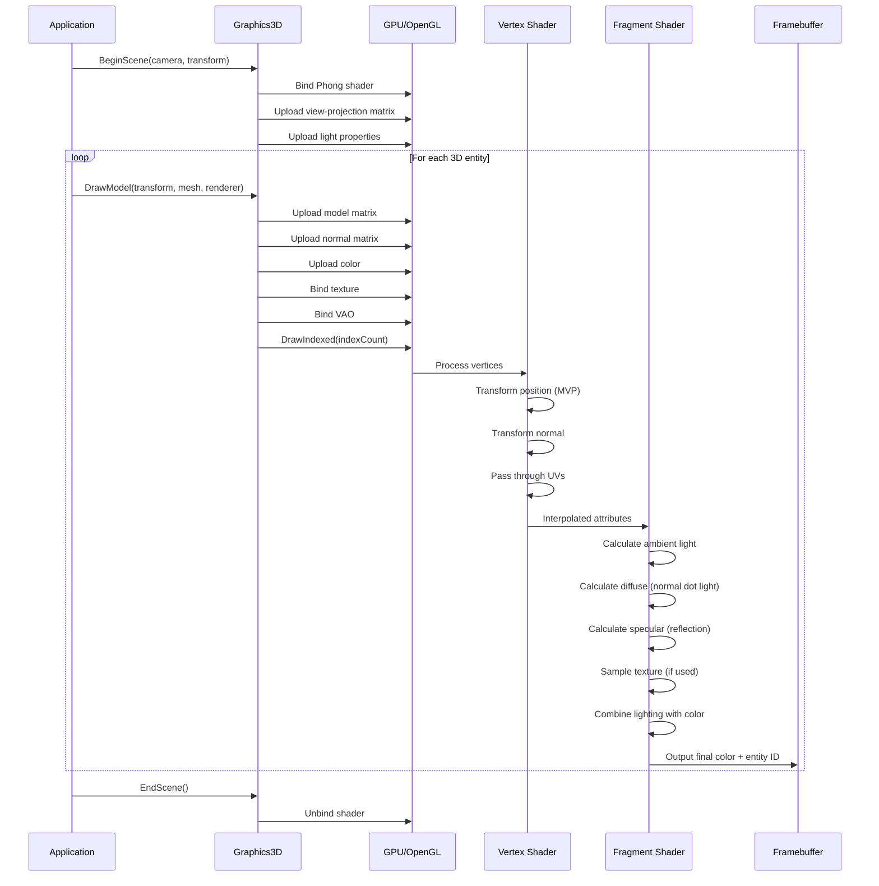
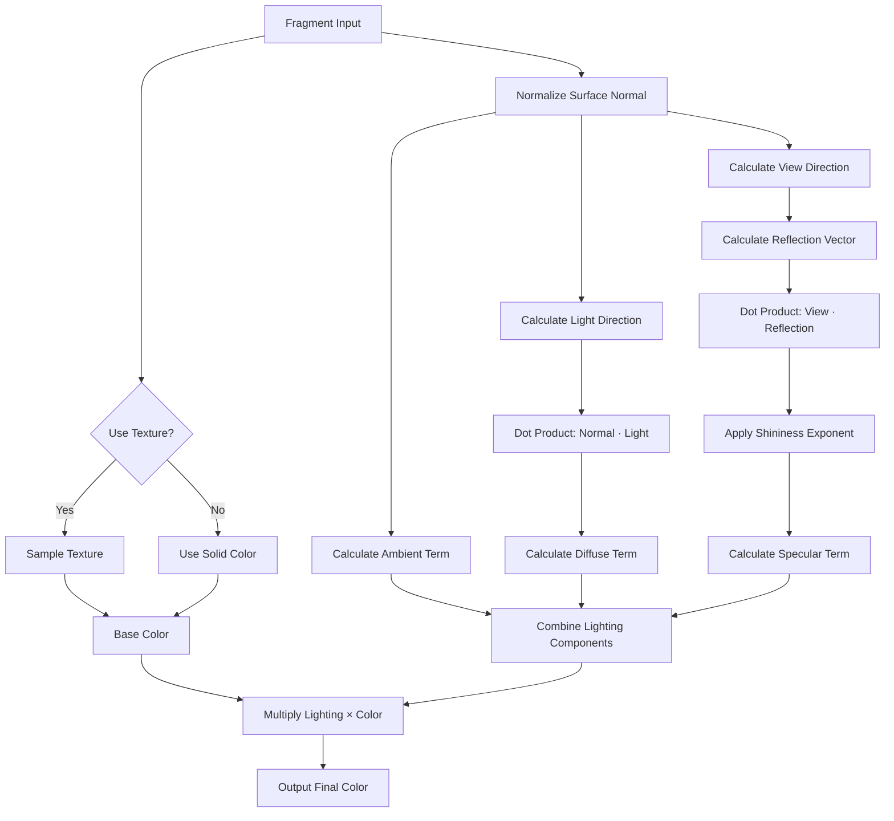
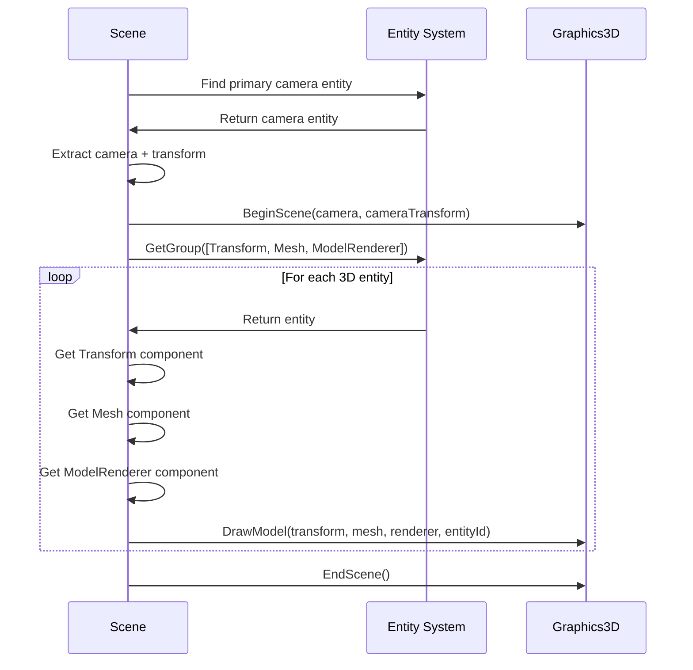
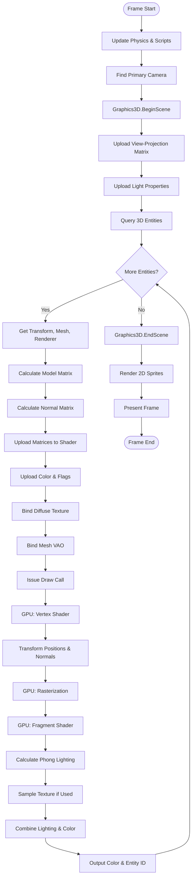

# OpenGL 3D Rendering Workflow

## Overview

The OpenGL 3D rendering system provides a complete pipeline for rendering three-dimensional models with realistic lighting using the Phong illumination model. This module handles everything from model loading through mesh processing, vertex transformation, lighting calculations, and final pixel rendering.

### Purpose
- Render 3D models imported from standard 3D file formats (OBJ, FBX, etc.)
- Apply realistic lighting using the Phong reflection model
- Support textured and colored 3D geometry
- Enable perspective and orthographic camera views
- Integrate with the Entity-Component System for scene-based rendering

### Scope
The 3D rendering workflow manages:
- Model loading and mesh extraction using Assimp
- Vertex buffer and index buffer management for 3D geometry
- Phong lighting shader with ambient, diffuse, and specular components
- Camera-based 3D transformations with view and projection matrices
- Texture mapping for 3D surfaces
- Normal transformation for correct lighting in non-uniform scales

### Key Concepts

**Mesh-Based Rendering**: Unlike 2D sprite batching, 3D rendering operates on individual meshes. Each mesh contains vertices with 3D positions, normals, and texture coordinates, organized into triangles via index buffers.

**Phong Lighting Model**: The system implements per-pixel Phong lighting, which combines three components:
- **Ambient**: Base illumination that exists everywhere
- **Diffuse**: Light that scatters based on surface angle to light source
- **Specular**: Shiny highlights based on view angle and reflection

**Model-View-Projection Pipeline**: Vertices flow through multiple transformation stages:
- **Model Matrix**: Positions and orients the mesh in world space
- **View Matrix**: Transforms from world space to camera space
- **Projection Matrix**: Applies perspective or orthographic projection

**Normal Transformation**: Normals require special handling (inverse transpose of model matrix) to maintain correct orientation under non-uniform scaling and shearing.

**Assimp Integration**: The system uses the Assimp library to parse 3D model files and extract mesh data, handling complex model hierarchies and multiple submeshes automatically.

## Architecture Flow

### 1. Model Loading Phase

When a 3D model is loaded, the system processes it through several stages:

**File Import**:
- Assimp library reads the model file (OBJ, FBX, GLTF, etc.)
- The file is parsed and triangulated (non-triangle polygons are converted)
- A scene graph structure is created containing all model data

**Hierarchy Traversal**:
- The root node of the scene graph is processed recursively
- Each node may contain multiple meshes and child nodes
- The tree is flattened into a list of meshes for the model

**Mesh Extraction**:
- For each mesh in the scene, vertex data is extracted:
  - **Position**: 3D coordinates in model space
  - **Normal**: Surface normal vectors for lighting
  - **Texture Coordinates**: UV coordinates for texture mapping
- Triangle indices are extracted from mesh faces
- Each face is guaranteed to be a triangle due to triangulation

**Material Processing**:
- Materials associated with each mesh are examined
- Texture paths are extracted for different texture types:
  - Diffuse maps (base color/albedo)
  - Specular maps (shininess)
  - Normal maps (surface detail)
  - Height maps (displacement)
- Textures are loaded and cached to avoid duplicates

**GPU Resource Creation**:
- Vertex buffers are allocated on GPU
- Vertex data is uploaded to GPU memory
- Index buffers are created with triangle indices
- Vertex Array Objects (VAOs) bind buffers to shader attributes
- Each mesh is initialized and ready for rendering

### 2. Scene Rendering Setup

Before rendering 3D geometry, the scene must be configured:

**Camera Configuration**:
- The active camera is identified (primary camera component)
- Camera transform (position, rotation) is extracted
- View matrix is computed (inverse of camera transform)
- Projection matrix is retrieved (perspective or orthographic)
- View-Projection matrix is pre-computed

**Shader Preparation**:
- Phong shader program is bound
- View-Projection matrix is uploaded to GPU
- Light properties are set:
  - Light position in world space
  - Light color (RGB)
  - View position (camera position for specular)
  - Material shininess (specular exponent)

**Begin Scene**:
- Graphics3D begins the scene with camera data
- All per-scene uniforms are set once
- The system is ready to accept mesh draw calls

### 3. Per-Mesh Rendering

Each 3D entity with mesh components is rendered individually:

**Entity Query**:
- The scene system queries all entities with:
  - TransformComponent (position, rotation, scale)
  - MeshComponent (3D geometry)
  - ModelRendererComponent (color, texture overrides, lighting flags)

**Per-Mesh Transformation**:
- Entity's transform component provides the model matrix
- Model matrix is uploaded to shader
- Normal matrix is computed (inverse transpose of model matrix)
- Normal matrix is uploaded for correct normal transformation

**Material Setup**:
- Base color from ModelRendererComponent is set
- If an override texture is specified, it replaces mesh's default texture
- Texture usage flag indicates whether to sample texture or use solid color
- The mesh's diffuse texture is bound to texture unit 0

**Geometry Binding**:
- Mesh's vertex array object is bound
- This automatically configures:
  - Vertex buffer binding
  - Index buffer binding
  - Vertex attribute layout (position, normal, UV, entity ID)

**Draw Call**:
- A single indexed draw call is issued
- Triangle count equals index count / 3
- GPU processes vertices through vertex shader
- Fragments are processed through fragment (pixel) shader
- Output is written to framebuffer

### 4. Shader Execution Pipeline



### 5. Vertex Shader Processing

The vertex shader transforms each vertex from model space to clip space:

**Position Transformation**:
- Input: Vertex position in model space
- Apply model matrix: `worldPos = model * position`
- Apply view-projection matrix: `clipPos = viewProj * worldPos`
- Output: Position in clip space for rasterization

**Normal Transformation**:
- Input: Normal vector in model space
- Apply normal matrix: `worldNormal = normalMatrix * normal`
- Normalize the result to ensure unit length
- Output: Normal in world space for lighting

**Attribute Pass-Through**:
- Texture coordinates are passed directly to fragment shader
- Entity ID is passed for editor picking
- World-space position is passed for lighting calculations

**Platform Handling**:
- Matrix multiplication order varies by platform
- macOS: `position * model * viewProj`
- Windows: `viewProj * model * position`
- The shader adapts automatically

### 6. Fragment Shader Lighting

The fragment shader implements per-pixel Phong lighting:

**Ambient Contribution**:
- A constant ambient term provides base illumination
- `ambient = ambientStrength * lightColor`
- Typically 10% of light color
- Ensures surfaces are visible even when not directly lit

**Diffuse Contribution**:
- Calculates how directly the surface faces the light
- `lightDir = normalize(lightPosition - fragmentPosition)`
- `diffuseIntensity = max(dot(normal, lightDir), 0.0)`
- `diffuse = diffuseIntensity * lightColor`
- Creates the characteristic matte shading of surfaces

**Specular Contribution**:
- Calculates reflection-based highlights
- `viewDir = normalize(cameraPosition - fragmentPosition)`
- `reflectDir = reflect(-lightDir, normal)`
- `specIntensity = pow(max(dot(viewDir, reflectDir), 0.0), shininess)`
- `specular = specularStrength * specIntensity * lightColor`
- Higher shininess values create tighter, shinier highlights

**Texture Sampling**:
- If texture is enabled, sample the diffuse texture
- `baseColor = texture(diffuseTexture, UV) * colorTint`
- Otherwise, use solid color: `baseColor = colorTint`

**Final Lighting**:
- Combine all lighting components
- `finalColor = (ambient + diffuse + specular) * baseColor`
- Output to color attachment 0
- Output entity ID to attachment 1 (for picking)



## Lifecycle & Timing

### Initialization

**System Startup**:
- Graphics3D instance is created as a singleton
- Phong shader is loaded and compiled
- Light properties are initialized with default values:
  - Light position: (0, 3, 3) in world space
  - Light color: White (1, 1, 1)
  - Shininess: 32.0

**Shader Compilation**:
- Vertex shader source is loaded from file
- Fragment shader source is loaded from file
- Both shaders are compiled to GPU code
- Shaders are linked into a complete program
- Uniform locations are cached for fast updates

### Per-Frame Execution

**Game Loop Integration**:
```mermaid
sequenceDiagram
    participant Loop as Game Loop
    participant Scene as Scene System
    participant Physics as Physics System
    participant Graphics3D as Graphics3D
    participant Graphics2D as Graphics2D

    Loop->>Scene: Update(deltaTime)
    Scene->>Physics: Step simulation
    Note over Scene: Entity transforms updated

    Scene->>Scene: Find primary camera
    Scene->>Graphics3D: BeginScene(camera, transform)

    Scene->>Scene: Query 3D entities
    loop For each 3D entity
        Scene->>Graphics3D: DrawModel(transform, mesh, renderer)
    end

    Scene->>Graphics3D: EndScene()

    Scene->>Graphics2D: BeginScene(camera, transform)
    Note over Graphics2D: 2D sprites rendered after 3D
    Scene->>Graphics2D: EndScene()
```

**Rendering Order**:
1. Physics and game logic update entity transforms
2. Primary camera is identified from scene entities
3. 3D rendering begins with camera setup
4. All 3D entities are rendered (meshes with lighting)
5. 3D rendering ends
6. 2D rendering begins (sprites, UI)
7. 2D rendering ends
8. Frame is presented to screen

**Depth Testing**:
- 3D geometry writes to depth buffer
- Ensures correct visibility (closer objects occlude farther ones)
- 2D rendering can optionally use depth or render on top

### Runtime vs Editor Mode

**Runtime Mode**:
- Uses the scene's designated primary camera
- Camera can be perspective or orthographic
- Full scene is rendered with all entities
- Performance statistics tracked
- Called from `Scene.OnUpdateRuntime()`

**Editor Mode**:
- Currently disabled for 3D rendering (optimization)
- Would use editor's viewport camera
- Supports entity selection via entity ID attachment
- Debug visualization and gizmos would overlay
- Called from `Scene.OnUpdateEditor()`

### Shutdown

**Resource Cleanup**:
- Mesh vertex buffers are disposed
- Index buffers are released
- Vertex array objects are destroyed
- Textures are unloaded
- Shader programs are deleted
- All GPU resources are automatically cleaned up via RAII

## Advanced Features

### Model Loading and Caching

**Assimp Integration**:
- Supports 40+ model formats (OBJ, FBX, GLTF, Collada, 3DS, etc.)
- Automatic triangulation converts quads and n-gons to triangles
- Handles scene hierarchies with parent-child node relationships
- Extracts material properties and texture references

**Mesh Factory Pattern**:
- MeshFactory provides centralized mesh creation
- Loaded models are cached by file path
- Duplicate load requests return cached instances
- Large mesh warnings help identify performance issues
- Primitive mesh generation (cube, sphere, plane)

**Texture Deduplication**:
- Model class tracks all loaded textures
- Duplicate texture paths reuse existing texture objects
- Reduces memory usage and GPU texture bindings
- Important for models with many meshes sharing textures

### Normal Matrix Computation

**Why Normals Need Special Treatment**:
- The model matrix can include non-uniform scaling (e.g., scale X by 2, Y by 1)
- Applying the model matrix directly to normals distorts them
- Non-perpendicular normals produce incorrect lighting

**Normal Matrix Formula**:
- `normalMatrix = transpose(inverse(modelMatrix))`
- Inverse handles scaling correctly
- Transpose handles matrix representation
- For uniform scaling, this simplifies to the model matrix itself

**Implementation**:
- Model matrix is inverted
- If inversion succeeds, result is transposed
- The 3x3 portion is used (translation doesn't affect normals)
- Shader normalizes the result after transformation

### Lighting Configuration

**Light Properties**:
- **Position**: World-space coordinates of the light source
- **Color**: RGB values controlling light color and intensity
- **Shininess**: Material property controlling specular highlight tightness

**Dynamic Light Updates**:
- Light properties can be changed at runtime
- Call `SetLightPosition()` to move the light
- Call `SetLightColor()` to change light color
- Call `SetShininess()` to adjust material properties
- Changes affect all meshes rendered after the update

**Single Light Model**:
- Current implementation supports one directional light
- Future expansion could add multiple lights
- Additional lights would require:
  - Light data arrays
  - Loop in fragment shader
  - Performance considerations

### Texture Override System

**Per-Entity Texture Control**:
- ModelRendererComponent supports texture override
- Default behavior: use mesh's embedded diffuse texture
- Override behavior: replace with custom texture

**Use Cases**:
- Character customization (same mesh, different skins)
- Damaged versions of objects
- Team colors in multiplayer
- Texture swapping for animations

**Implementation**:
- DrawModel temporarily swaps mesh's texture
- Renders with override texture
- Restores original texture after draw
- No permanent modification to mesh data

### Shadow Support (Planned)

**Component Flags**:
- `CastShadows`: Entity creates shadows
- `ReceiveShadows`: Entity has shadows projected onto it
- Currently defined but not implemented
- Future shadow mapping would use these flags

### Entity Identification

**Editor Picking**:
- Each vertex includes an entity ID attribute
- Fragment shader outputs entity ID to second attachment
- Editor can read pixel value to determine clicked entity
- Enables object selection in 3D viewport

**ID Attachment**:
- Framebuffer has two color attachments:
  - Attachment 0: Visual color (RGBA)
  - Attachment 1: Entity ID (integer)
- Mouse click reads from ID attachment
- Value directly corresponds to entity ID

## Mesh Data Structure

### Vertex Layout

Each vertex contains:
- **Position** (3 floats): X, Y, Z coordinates in model space
- **Normal** (3 floats): Surface normal vector for lighting
- **TexCoord** (2 floats): UV texture coordinates
- **EntityID** (1 int): Entity identifier for picking

**Total vertex size**: 36 bytes (8 floats + 1 int)

### Buffer Organization

**Vertex Buffer**:
- Dynamic array of vertex structures
- Allocated on GPU with size = vertexCount × vertexSize
- Updated when mesh is loaded (static data)
- Layout defines how shader attributes map to buffer data

**Index Buffer**:
- Array of unsigned integers (uint)
- Every three indices define one triangle
- Triangle count = indexCount / 3
- Allows vertex reuse (cube has 8 vertices, 24 corner references)

**Vertex Array Object (VAO)**:
- Encapsulates buffer bindings
- Links vertex buffer to shader attribute locations:
  - Location 0: Position (vec3)
  - Location 1: Normal (vec3)
  - Location 2: TexCoord (vec2)
  - Location 3: EntityID (int)
- Binding the VAO configures all vertex attributes at once

### Mesh Initialization

**Lazy Initialization**:
- Mesh can be constructed without GPU resources
- `Initialize()` creates GPU buffers on first use
- `GetVertexArray()` automatically initializes if needed
- Prevents unnecessary GPU allocation for unused meshes

**Initialization Steps**:
1. Create Vertex Array Object
2. Create Vertex Buffer with calculated size
3. Define buffer layout matching vertex structure
4. Add vertex buffer to VAO
5. Upload vertex data to GPU
6. Create Index Buffer with triangle indices
7. Set index buffer in VAO
8. Mark mesh as initialized

## Performance Characteristics

### No Batching

**Individual Draw Calls**:
- Unlike 2D rendering, 3D uses one draw call per mesh
- Each mesh may have hundreds to thousands of triangles
- Draw call overhead is amortized over many triangles
- GPU spends more time processing vertices than waiting for commands

**Why No Batching?**:
- Each mesh has unique model matrix (different position/rotation/scale)
- Combining meshes would require CPU transformation (slow)
- GPU is optimized for transforming vertices
- Modern GPUs handle many draw calls efficiently

### Typical Performance

**Draw Call Cost**:
- 100 3D entities = 100 draw calls
- Acceptable for most games with moderate entity counts
- CPU overhead minimal with modern OpenGL

**Vertex Processing**:
- GPU processes vertices in parallel
- Thousands of vertices per mesh is normal
- Bottleneck is typically fragment shader (pixel cost)

**Optimization Strategies**:
- Use level-of-detail (LOD) meshes for distant objects
- Frustum culling to skip off-screen objects
- Occlusion culling to skip hidden objects
- Mesh instancing for identical objects (future feature)

### Memory Bandwidth

**Per-Frame Upload**:
- Model matrices (16 floats per mesh)
- Normal matrices (9 floats per mesh)
- Per-mesh uniforms (color, flags)

**Static Data**:
- Vertex buffers remain on GPU
- Index buffers remain on GPU
- Textures remain in GPU memory
- No per-frame vertex uploads (unlike 2D batching)

### Comparison: 2D vs 3D Rendering

| Aspect | 2D Rendering | 3D Rendering |
|--------|--------------|--------------|
| Batching | Yes, extensive | No |
| Draw Calls | Few (1-10 per frame) | Many (1 per mesh) |
| Vertex Upload | Every frame (dynamic) | Once at load (static) |
| Transformation | CPU (batching) | GPU (per-vertex) |
| Lighting | None (pre-lit sprites) | Per-pixel Phong |
| Depth | Z-sorting or fixed layers | True 3D depth buffer |
| Typical Count | 1000s of sprites | 100s of meshes |

## Integration with Scene System

### Component Architecture

**MeshComponent**:
- Holds reference to Mesh object
- Default: Creates cube mesh
- Can be assigned custom mesh via `SetMesh()`
- Provides geometry for rendering

**ModelRendererComponent**:
- Color tint (default: white)
- Optional texture override
- Shadow casting flag (future)
- Shadow receiving flag (future)
- Provides material properties

**TransformComponent**:
- Position, rotation, scale
- Provides model matrix via `GetTransform()`
- Updated by physics, scripts, or editor

**CameraComponent**:
- Marks primary rendering camera
- Provides view and projection matrices
- Can be perspective or orthographic

### Scene Rendering Flow



### Entity Query Pattern

**Component Group Query**:
- Scene queries ECS for entities with specific components
- 3D rendering requires: Transform + Mesh + ModelRenderer
- Only entities with all three components are rendered
- Query is fast (component-based indexing)

**Render Order**:
- Currently: Order returned by ECS (arbitrary)
- Future: Could sort by depth, material, or distance
- Sorting can optimize GPU state changes
- Transparent objects require back-to-front sorting

## Camera System Integration

### Perspective Projection

**Purpose**: Realistic 3D rendering with depth perception
**Effect**: Farther objects appear smaller

**Parameters**:
- **Field of View (FOV)**: Angle of visible area (typically 45-90 degrees)
- **Aspect Ratio**: Width / height of viewport
- **Near Clip**: Closest visible distance (e.g., 0.01)
- **Far Clip**: Farthest visible distance (e.g., 1000)

**Projection Matrix**:
- `CreatePerspectiveFieldOfView(fov, aspect, near, far)`
- Creates a frustum (truncated pyramid) viewing volume
- Objects outside frustum are clipped

**View Matrix**:
- Created from camera transform inverse
- Transforms world space to camera space
- Camera position becomes origin
- Camera forward becomes -Z axis

### Orthographic Projection

**Purpose**: Technical drawings, 2D-style 3D, UI
**Effect**: No size change with distance (parallel projection)

**Parameters**:
- **Size**: Half-height of viewing area
- **Aspect Ratio**: Determines width (width = size × aspect)
- **Near/Far Clip**: Depth range

**Projection Matrix**:
- `CreateOrthographicOffCenter(left, right, bottom, top, near, far)`
- Creates a box viewing volume
- All objects same size regardless of depth

**Use Cases**:
- Top-down or side-view games
- CAD-style technical views
- 2D games with 3D elements

### Camera Component

**SceneCamera Class**:
- Supports both projection types
- Dynamically switches between perspective and orthographic
- Handles viewport resizing
- Recalculates projection when parameters change

**Primary Camera**:
- Scene searches for CameraComponent with `Primary` flag set
- Only one primary camera per scene
- Camera's transform defines view position and orientation
- Camera's projection matrix defines rendering volume

## Shader Architecture

### Vertex Shader Inputs

**Attributes** (per-vertex data):
- `layout(location = 0) in vec3 a_Position`
- `layout(location = 1) in vec3 a_Normal`
- `layout(location = 2) in vec2 a_TexCoord`
- `layout(location = 3) in int a_EntityID`

**Uniforms** (per-draw data):
- `uniform mat4 u_ViewProjection` - Combined camera matrices
- `uniform mat4 u_Model` - Entity transform
- `uniform mat4 u_NormalMatrix` - Normal transformation

### Vertex Shader Outputs

**Varyings** (interpolated to fragments):
- `out vec3 v_Position` - World-space position
- `out vec3 v_Normal` - World-space normal
- `out vec2 v_TexCoord` - Texture coordinates
- `flat out int v_EntityID` - Entity ID (no interpolation)

### Fragment Shader Inputs

**Varyings** (interpolated from vertices):
- `in vec3 v_Position` - Fragment world position
- `in vec3 v_Normal` - Fragment normal (interpolated)
- `in vec2 v_TexCoord` - Fragment texture coordinate
- `flat in int v_EntityID` - Entity ID

**Uniforms** (per-draw data):
- `uniform vec4 u_Color` - Base color tint
- `uniform vec3 u_LightPosition` - Light position in world space
- `uniform vec3 u_LightColor` - Light color and intensity
- `uniform vec3 u_ViewPosition` - Camera position for specular
- `uniform float u_Shininess` - Specular exponent
- `uniform sampler2D u_Texture` - Diffuse texture
- `uniform int u_UseTexture` - Whether to sample texture

### Fragment Shader Outputs

**Color Attachments**:
- `layout(location = 0) out vec4 o_Color` - Final pixel color
- `layout(location = 1) out int o_EntityID` - Entity identifier

## Diagram: Complete 3D Frame Rendering



## Common Patterns and Best Practices

### Model Loading

**File Organization**:
- Store models in organized asset directory
- Keep textures near model files
- Use relative paths for portability
- Maintain consistent naming conventions

**Model Preparation**:
- Export models with triangulated faces
- Ensure proper UV unwrapping
- Bake vertex normals for smooth shading
- Optimize vertex count for performance

**Runtime Loading**:
- Load models during initialization or level load
- Use MeshFactory for automatic caching
- Large models should be LOD-optimized
- Consider async loading for large assets

### Lighting Setup

**Light Positioning**:
- Place light above and in front of geometry
- Avoid lighting directly from behind camera
- Multiple lights require shader modifications
- Consider light color for mood and atmosphere

**Material Properties**:
- Shininess 1-10: Rough surfaces (wood, stone)
- Shininess 32: Standard surfaces (plastic)
- Shininess 128+: Shiny surfaces (metal, glass)
- Use texture overrides for material variation

### Performance Optimization

**Mesh Optimization**:
- Reduce polygon count for distant objects
- Use level-of-detail (LOD) meshes
- Share meshes between multiple entities
- Avoid very high-poly models for common objects

**Culling Strategies**:
- Implement frustum culling (skip off-screen objects)
- Consider occlusion culling (skip hidden objects)
- Sort by depth to enable early-Z rejection
- Batch objects by material (future enhancement)

**Texture Management**:
- Use texture atlases to reduce bindings
- Compress textures (DXT/BC formats)
- Mipmap textures for better filtering
- Unload unused textures

### Debugging 3D Rendering

**Common Issues**:

**Nothing renders**:
- Check camera position and orientation
- Verify near/far clip planes
- Ensure entities have all required components
- Check mesh initialization

**Incorrect colors**:
- Verify light position and color
- Check normal transformations
- Ensure textures are loading correctly
- Validate color tint values

**Normals appear wrong**:
- Check normal matrix calculation
- Verify model exports with correct normals
- Ensure no non-uniform scaling issues
- Test with flat-shaded geometry first

**Performance issues**:
- Check draw call count
- Verify mesh polygon counts
- Look for inefficient culling
- Profile GPU usage

## Future Enhancements

### Planned Features

**Multiple Lights**:
- Support point lights, spotlights, directional lights
- Light arrays in shaders
- Per-light attenuation
- Shadow mapping

**Shadow Mapping**:
- Directional shadows (sun)
- Point light shadows (omnidirectional)
- Shadow softness/PCF filtering
- Use CastShadows/ReceiveShadows flags

**Instanced Rendering**:
- Render many copies of same mesh efficiently
- Useful for foliage, particles, crowds
- Pass instance data via vertex attributes or buffers

**Deferred Rendering**:
- G-buffer for geometry properties
- Decouples geometry from lighting
- Enables many lights efficiently
- Better suited for complex scenes

**PBR Materials**:
- Physically-based rendering
- Metallic-roughness workflow
- Image-based lighting
- More realistic appearance

## Summary

The OpenGL 3D rendering workflow provides complete support for rendering lit 3D models in your game engine. By integrating Assimp for model loading, implementing Phong lighting for realistic illumination, and managing GPU resources efficiently, the system enables developers to create rich 3D scenes.

Key takeaways:
- **Mesh-based rendering**: Each 3D mesh is drawn individually with its own transformation
- **Phong lighting**: Per-pixel lighting with ambient, diffuse, and specular components
- **Model-View-Projection**: Standard 3D transformation pipeline with perspective/orthographic support
- **Assimp integration**: Supports dozens of model formats with automatic processing
- **Component-driven**: Integrates seamlessly with ECS for scene management
- **Editor support**: Entity ID attachment enables 3D picking in editor
- **Extensible**: Foundation for advanced features like shadows, PBR, and instancing

This architecture complements the 2D rendering system, allowing games to mix 2D sprites and 3D models in the same scenes while maintaining clean separation of concerns and high performance.
