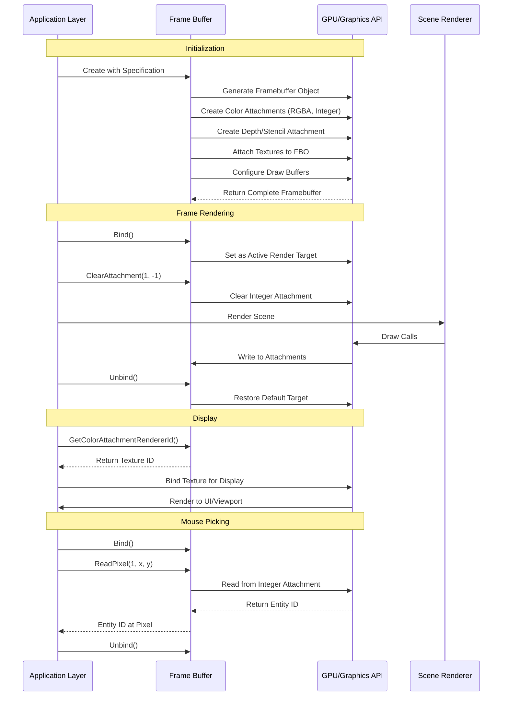
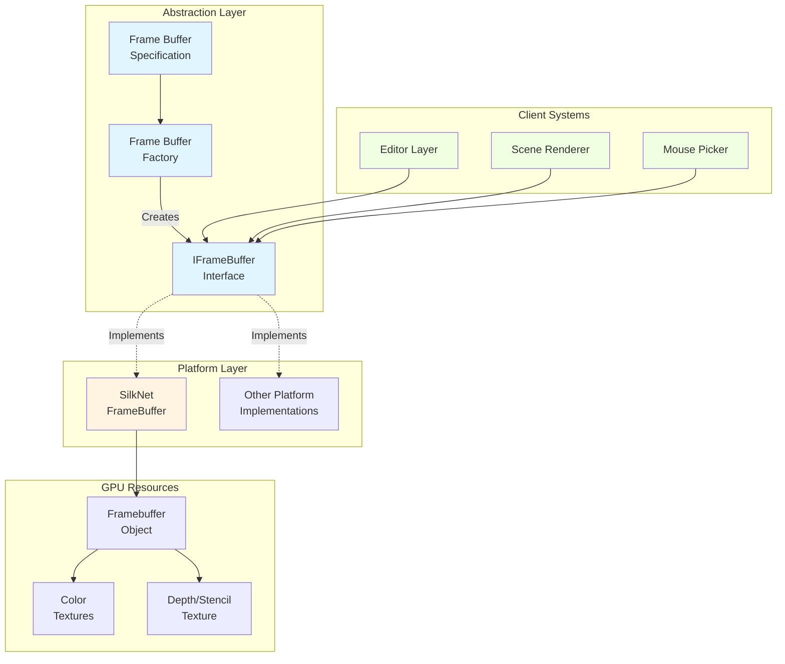
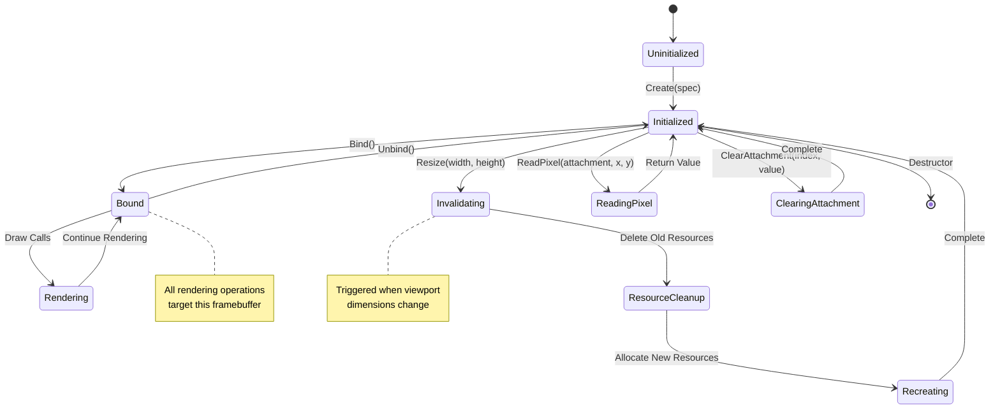

# Frame Buffers

## Overview

**Purpose**: Frame buffers provide off-screen rendering targets that allow the engine to render scenes to textures instead of directly to the screen. This enables advanced rendering techniques like post-processing effects, editor viewports, and custom rendering pipelines.

**Scope**: The frame buffer module handles:
- Creating off-screen render targets with custom attachment configurations
- Managing color and depth/stencil texture attachments
- Providing pixel-perfect mouse picking capabilities
- Supporting dynamic viewport resizing
- Enabling rendering to texture for editor integration

**Key Concepts**:
- **Attachments**: Frame buffers contain multiple texture attachments - color attachments for visual output and depth/stencil attachments for depth testing
- **Render-to-Texture**: Instead of rendering directly to the screen, content is rendered to texture buffers that can be read, displayed, or processed
- **Multiple Render Targets (MRT)**: A single frame buffer can have multiple color attachments, allowing shaders to output to multiple textures simultaneously
- **Invalidation**: When frame buffer properties change (like size), the underlying GPU resources must be recreated through an invalidation process

## Architecture Flow

### Frame Buffer Lifecycle

1. **Specification Phase**: Developer defines frame buffer requirements through a specification object, including dimensions, attachment types, and formats

2. **Creation Phase**: Factory creates platform-specific frame buffer implementation based on the active rendering API

3. **Initialization Phase**: Frame buffer allocates GPU resources - creates frame buffer object, generates texture attachments, attaches textures to appropriate points, configures draw buffers, and validates completeness

4. **Usage Phase**: During rendering, frame buffer is bound as active render target, receives all draw commands, then is unbound to restore the default target. Frame buffer textures can then be sampled or displayed.

5. **Resize Phase**: When viewport dimensions change, frame buffer invalidates existing resources and recreates all attachments with new dimensions while maintaining attachment configuration

6. **Cleanup Phase**: When frame buffer is destroyed, GPU resources (textures and frame buffer objects) are released

### Rendering Flow

## Core Workflow Stages

### 1. Specification & Creation

Frame buffer specifications define the structure before creation, including dimensions (up to 8192x8192), attachment types and formats, multi-sampling level, and whether it targets the swap chain.

Common attachment formats include RGBA8 for standard color output, RED_INTEGER for entity ID encoding (mouse picking), and DEPTH24STENCIL8 for combined depth and stencil buffers.

### 2. Binding & Rendering

The bind/unbind pattern controls where rendering occurs. Binding sets the frame buffer as active render target so all draw calls render to its attachments. Unbinding restores the default frame buffer so subsequent draws go to screen.

This pattern enables rendering scenes to textures for display in editor viewports, creating multiple views of the same scene with different cameras, and capturing rendering output for post-processing.

### 3. Attachment Access

Frame buffers expose their attachments for different purposes:
- **Color Attachment 0**: Primary visual output, typically displayed in viewport
- **Color Attachment 1**: Entity ID buffer for pixel-perfect mouse picking
- **Depth Attachment**: Depth information for 3D rendering and effects

### 4. Dynamic Resizing

When viewport size changes, the frame buffer detects the mismatch, triggers invalidation, deletes old GPU resources, and recreates with identical attachment configuration but new size. This ensures frame buffer resolution always matches the viewport.

### 5. Pixel Reading

Frame buffers enable CPU-side data readback for mouse picking (reading integer attachment at cursor position retrieves entity ID), with position mapping from viewport coordinates to frame buffer space and bounds checking to ensure valid read coordinates.

## Architecture Patterns

## State Management

## Integration Points

### Editor Integration

The editor uses frame buffers to create an embedded viewport. During initialization, it creates a frame buffer with RGBA color, entity ID, and depth attachments. Each frame, the editor binds the frame buffer, renders the scene, then unbinds. The color attachment texture is retrieved and displayed in the ImGui viewport panel. Mouse clicks in the viewport read the entity ID attachment for object selection, and viewport resizing triggers frame buffer resize to match.

### Scene Rendering Integration

Scene rendering systems integrate with frame buffers through the camera system (providing view-projection matrix), 2D renderer (drawing sprites, quads, and primitives), 3D renderer (rendering models and geometry), and entity ID rendering (writing entity IDs to integer attachment in a second pass).

### Multi-Target Rendering Strategy

Frame buffers coordinate multiple render targets: Attachment 0 (RGBA8) for visual output with color information, Attachment 1 (RED_INTEGER) for entity ID encoded as integer value, and Depth/Stencil for depth testing and stencil operations. Shaders output to multiple attachments simultaneously by declaring multiple output variables that route to corresponding attachments.

## Common Usage Patterns

### Editor Viewport Pattern

The editor creates a frame buffer with viewport panel dimensions containing RGBA8 for visual output, RED_INTEGER for entity picking, and DEPTH24STENCIL8 for depth. Each frame follows the bind-clear-render-unbind cycle, displays the color attachment in UI, reads entity ID on mouse click, and invalidates/recreates on viewport resize.

### Post-Processing Pattern

A frame buffer at screen resolution with RGBA8 color and depth attachments captures the scene render. After unbinding, the scene color attachment is bound as a texture input and a fullscreen quad renders with post-process shaders to the screen or another frame buffer.

### Shadow Mapping Pattern

A depth-only frame buffer at shadow map resolution (e.g., 2048x2048) with no color attachments captures the scene from the light's perspective. The depth texture is then sampled in the main render pass using shadow mapping shaders.

## Performance Considerations

### Memory Usage

Frame buffers consume GPU memory proportional to resolution, attachment count, and pixel format precision. A typical editor frame buffer at 1920x1080 with RGBA8 color, R32I entity ID, and DEPTH24STENCIL8 uses approximately 25 MB total.

### Invalidation Cost

Frame buffer resizing is expensive due to GPU resource deletion/recreation and potential memory fragmentation. Resize operations are triggered only when dimensions actually change, not every frame.

### Draw Call Impact

Frame buffer binding/unbinding has minimal overhead - just a single GPU state change per operation. Best practice is to minimize frame buffer switches per frame by grouping rendering to the same target together.

## Error Handling

### Validation Checks

- **Size Limits**: Maximum frame buffer size enforced (8192x8192) to prevent GPU memory exhaustion
- **Completeness Verification**: Validates attachment configuration, format compatibility, and throws exception if invalid
- **Bounds Checking**: Pixel read operations validate coordinates to prevent out-of-bounds GPU memory access

### Common Issues

- **Black Screen**: Frame buffer not properly bound before rendering - ensure Bind() is called before draw operations
- **Stretched Image**: Frame buffer size doesn't match viewport - implement resize detection and invalidation
- **Incomplete Framebuffer Error**: Incompatible attachment configuration - verify formats are GPU-supported
- **Entity Picking Returns -1**: Entity ID not written to integer attachment - verify shader writes and attachment clearing

## Design Rationale

### Why Multiple Attachments?

Multiple render targets enable deferred rendering (outputting multiple scene properties in single pass), editor features (separating visual output from editor metadata like entity IDs), and advanced effects (storing intermediate values for multi-pass rendering).

### Why Invalidation Pattern?

GPU resources are immutable in size and cannot be resized after allocation. The invalidation pattern encapsulates the complexity of deleting and recreating resources with new dimensions.

### Why Factory Pattern?

Abstraction enables platform independence (same interface for OpenGL, Vulkan, DirectX), runtime API selection, mock frame buffers for testing, and future platform extensions without changing client code.

## Future Enhancements

Potential improvements include multi-sampling support for anti-aliasing, automatic mipmap generation, cube map frame buffers for environment mapping, layered rendering for geometry shader techniques, asynchronous pixel reading via PBOs to avoid GPU stalls, and HDR format support (RGBA16F, RGBA32F) for physically-based rendering.
